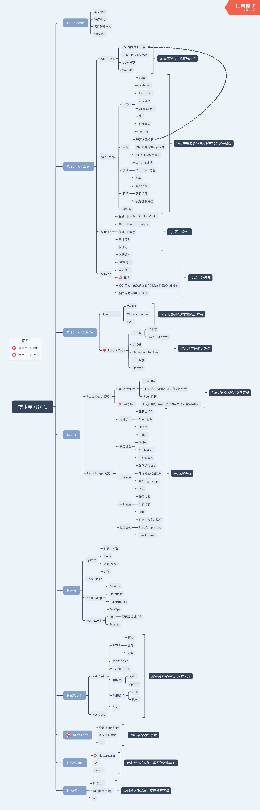

# 橡树上的博客 

## 技术学习纲领

## 文章列表

### WebFrontEnd

* [《你不知道的 JavaScript》](https://betamee.github.io/content/WebFrontEnd-%E4%BD%A0%E4%B8%8D%E7%9F%A5%E9%81%93%E7%9A%84JavaScript/)

* [Webpack 4 概述](https://betamee.github.io/content/WebFrontEnd-Webpack4%20%E6%A6%82%E8%BF%B0/)

* [Babel 社区概览](https://betamee.github.io/content/WebFrontEnd-Babel%20%E7%A4%BE%E5%8C%BA%E6%A6%82%E8%A7%88/)

* [JavaScript 模块化总结](https://betamee.github.io/content/WebFrontEnd-JavaScript%20%E6%A8%A1%E5%9D%97%E5%8C%96%E6%80%BB%E7%BB%93/)

### NetWork

* [HTTP 协议基础](https://betamee.github.io/content/NetWork-HTTP%20%E5%8D%8F%E8%AE%AE%E5%9F%BA%E7%A1%80/)

### SystemsLogs

* [Mac 环境安装](https://betamee.github.io/content/SystemLogs-Mac%20%E7%8E%AF%E5%A2%83%E5%AE%89%E8%A3%85/)
