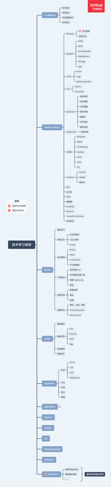

# 橡树上的博客

## 技术学习纲领

## 文章列表

### WebFrontEnd

* [《你不知道的 JavaScript》](https://betamee.github.io/content/WebFrontEnd-%E4%BD%A0%E4%B8%8D%E7%9F%A5%E9%81%93%E7%9A%84JavaScript/)

* [Webpack 4 概述](https://betamee.github.io/content/WebFrontEnd-Webpack4%20%E6%A6%82%E8%BF%B0/)

* [Babel 社区概览](https://betamee.github.io/content/WebFrontEnd-Babel%20%E7%A4%BE%E5%8C%BA%E6%A6%82%E8%A7%88/)

* [JavaScript 模块化总结](https://betamee.github.io/content/WebFrontEnd-JavaScript%20%E6%A8%A1%E5%9D%97%E5%8C%96%E6%80%BB%E7%BB%93/)

* [Commit 规范与 CHANGELOG 生成](https://betamee.github.io/content/WebFrontEnd-Commit%20%E8%A7%84%E8%8C%83%E4%B8%8E%20CHANGELOG%20%E7%94%9F%E6%88%90/)

* [语义版本知识](https://betamee.github.io/content/WebFrontEnd-%E8%AF%AD%E4%B9%89%E7%89%88%E6%9C%AC%E7%9F%A5%E8%AF%86/)

* 设计模式系列
  + [JavaScript 设计模式总结（一）](https://betamee.github.io/content/WebFrontEnd-JavaScript%20%E8%AE%BE%E8%AE%A1%E6%A8%A1%E5%BC%8F%E6%80%BB%E7%BB%93%EF%BC%88%E4%B8%80%EF%BC%89/)
  + [JavaScript 设计模式总结（二）](https://betamee.github.io/content/WebFrontEnd-JavaScript%20%E8%AE%BE%E8%AE%A1%E6%A8%A1%E5%BC%8F%E6%80%BB%E7%BB%93%EF%BC%88%E4%BA%8C%EF%BC%89/)
  + [JavaScript 设计模式总结（三）](https://betamee.github.io/content/WebFrontEnd-JavaScript%20%E8%AE%BE%E8%AE%A1%E6%A8%A1%E5%BC%8F%E6%80%BB%E7%BB%93%EF%BC%88%E4%B8%89%EF%BC%89/)
  + [JavaScript 设计模式总结（四）](https://betamee.github.io/content/WebFrontEnd-JavaScript%20%E8%AE%BE%E8%AE%A1%E6%A8%A1%E5%BC%8F%E6%80%BB%E7%BB%93%EF%BC%88%E5%9B%9B%EF%BC%89/)
  + [JavaScript 设计模式总结（五）](https://betamee.github.io/content/WebFrontEnd-JavaScript%20%E8%AE%BE%E8%AE%A1%E6%A8%A1%E5%BC%8F%E6%80%BB%E7%BB%93%EF%BC%88%E4%BA%94%EF%BC%89/)
  + [JavaScript 设计模式总结（六）](https://betamee.github.io/content/WebFrontEnd-JavaScript%20%E8%AE%BE%E8%AE%A1%E6%A8%A1%E5%BC%8F%E6%80%BB%E7%BB%93%EF%BC%88%E5%85%AD%EF%BC%89/)

* [尾调用和尾递归](https://betamee.github.io/content/WebFrontEnd-%E5%B0%BE%E8%B0%83%E7%94%A8%E5%92%8C%E5%B0%BE%E9%80%92%E5%BD%92/)

* [浏览器中 JavaScript 单线程运行机制](https://betamee.github.io/content/WebFrontEnd-%E6%B5%8F%E8%A7%88%E5%99%A8%E4%B8%AD%20JavaScript%20%E5%8D%95%E7%BA%BF%E7%A8%8B%E8%BF%90%E8%A1%8C%E6%9C%BA%E5%88%B6/)

### React

* [React 状态管理使用指南](https://betamee.github.io/content/React-React%20%E7%8A%B6%E6%80%81%E7%AE%A1%E7%90%86%E4%BD%BF%E7%94%A8%E6%8C%87%E5%8D%97/)

### Node

* [Node-使用readline开发一个简单的nodejs命令行工具](https://betamee.github.io/content/Node-%E4%BD%BF%E7%94%A8readline%E5%BC%80%E5%8F%91%E4%B8%80%E4%B8%AA%E7%AE%80%E5%8D%95%E7%9A%84nodejs%E5%91%BD%E4%BB%A4%E8%A1%8C%E5%B7%A5%E5%85%B7/)

* [Node 异步编程探究](https://betamee.github.io/content/Node-Node%20%E5%BC%82%E6%AD%A5%E7%BC%96%E7%A8%8B%E6%8E%A2%E7%A9%B6/)

* [Node 事件循环机制](https://betamee.github.io/content/Node-Node%20%E4%BA%8B%E4%BB%B6%E5%BE%AA%E7%8E%AF%E6%9C%BA%E5%88%B6/)

### NetWork

* [HTTP 协议基础](https://betamee.github.io/content/NetWork-HTTP%20%E5%8D%8F%E8%AE%AE%E5%9F%BA%E7%A1%80/)

### SystemLogs

* [Mac 环境安装](https://betamee.github.io/content/SystemLogs-Mac%20%E7%8E%AF%E5%A2%83%E5%AE%89%E8%A3%85/)

* [优质学习资源站点](https://betamee.github.io/content/SystemLog-%E4%BC%98%E8%B4%A8%E5%AD%A6%E4%B9%A0%E8%B5%84%E6%BA%90%E7%AB%99%E7%82%B9/)
