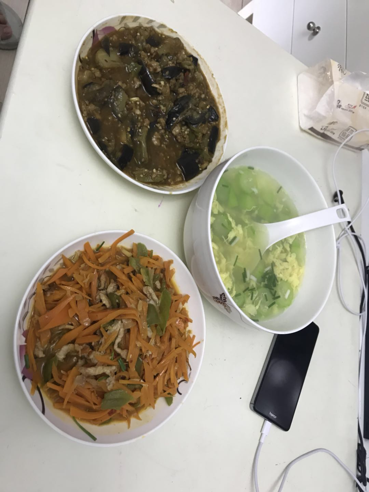
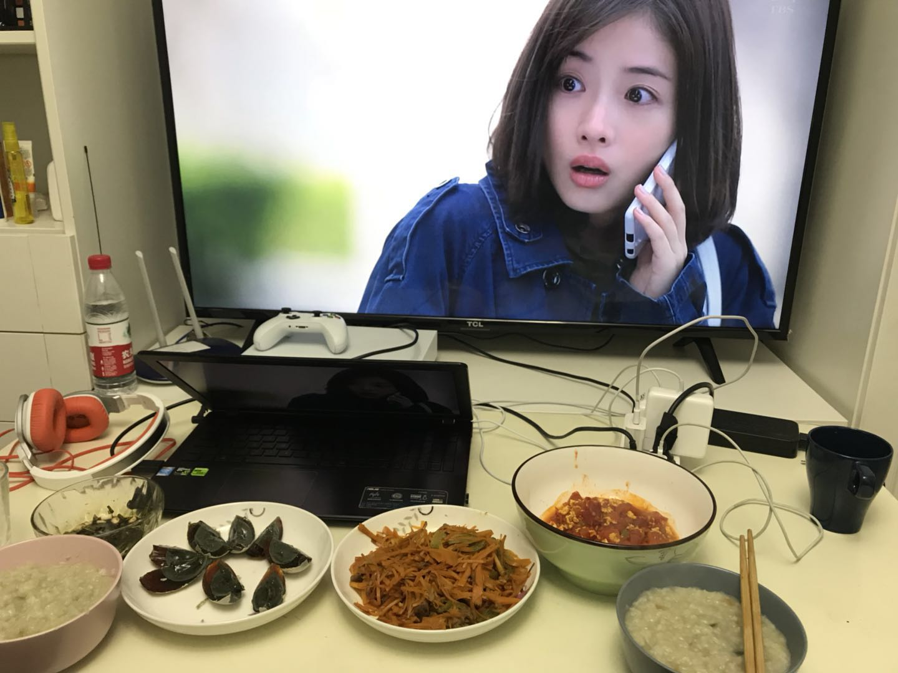

## 前言

自从上班了，对食堂的菜深恶痛绝，已经不是难吃可以形容了，饭难吃，菜也难吃，每次都是吃了两口就不想吃了。而公司B1层可以值得吃的又没有几家，**麦当劳**、**食其家**、**吉祥混沌**，或者**煎子生**，所以每周吃饭都是个技术活，平衡好每天的餐谱。虽然最喜欢吃麦当劳，但也不可多吃，怕吃腻。所以还是在家自己做饭吃是最好的。

## 午餐

午餐是两个菜+一个汤，菜是瑞哥做的，汤是我做的。毛豆丝瓜蛋花汤，有点失败，我的步骤是先煮透毛豆，再加上鸡蛋丝瓜块盐，吃的时候想起了好像没有加油，不过味道还行，能吃。下次问问我妈，步骤是不是对的，总觉得和记忆中的不大一样，哈哈哈。

## 晚餐

晚餐都是瑞哥做，中午剩下点肉，我做了个皮蛋瘦肉粥，味道不错，两个人一杯米嫌多了，水也应该多放点，那个高端电饭锅煮个粥竟然要两小时。。

我觉得皮蛋瘦肉粥好吃的关键在于肉的处理，我是先切成丝，再加生姜、大蒜、料酒泡几分钟，再用锅过一下水，这样煮进粥里，肉去提香腥，不过下次肉里还可以加点盐，粥有点淡。这个是之前给鹿鹿第一次做皮蛋瘦肉粥时想到的步骤，虽然那时没有电饭煲，直接在烧锅里煮饭，有点一言难尽。下次继续改进，希望有一天能做出麦当劳早餐皮蛋瘦肉粥那种口感。**大爱麦当劳~~~**

