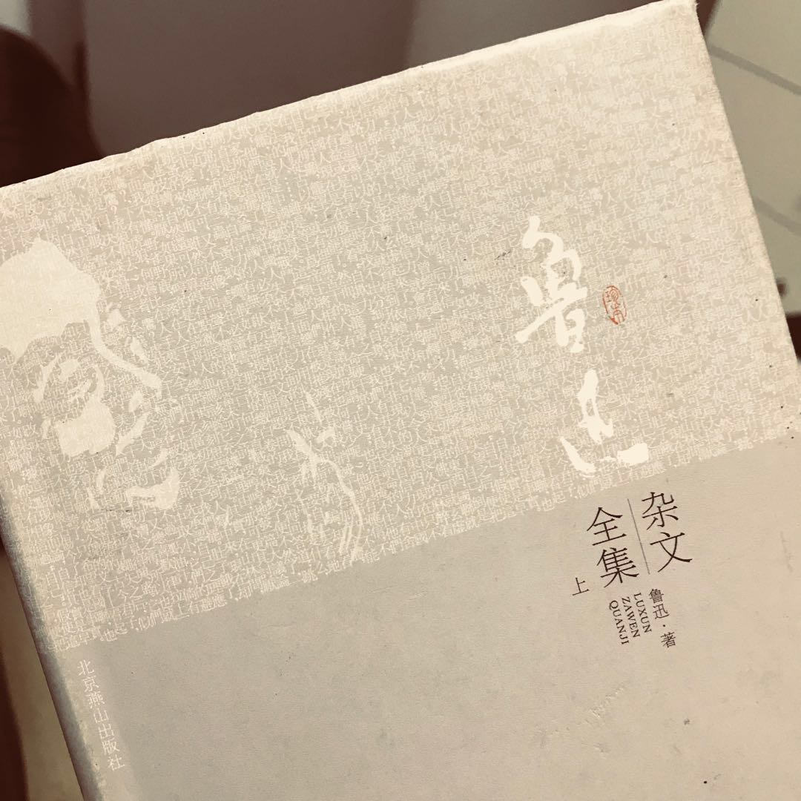

> 对，这都是我说的 -- 鲁迅

## 坟

### 我之节烈观

社会上多数古人模模糊糊下来的道理，是在无理可讲；能用历史和数目的力量，挤死不合意的人。这一类无主名无意识的杀人团里，古来不晓得死了多少人物；节烈的女子，也就死在这里。

节烈这是，现代既然失去了存在的生命和价值；节烈的女子，岂非白苦一番么？可以答他说：还有哀悼的价值。他们是可怜人；不幸上了历史和数目的无意识的圈套，做了无主名的牺牲。可以开一个追悼大会。

我们追悼了过去的人，还要发愿：要自己和别人，都纯洁聪明勇猛向上。要除去虚伪的脸谱。要除去世上害己害人的昏迷和强暴。

我们追悼了过去的人，还要发愿：要除去于人生毫无意义的苦痛。要除去制造并赏玩别人苦痛的昏迷和强暴。

我们还要发愿：要人类都受正当的幸福。

（一九一八年七月）
