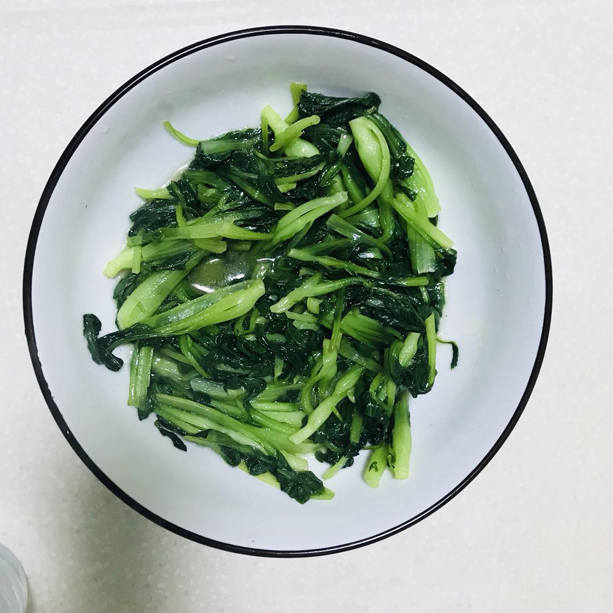
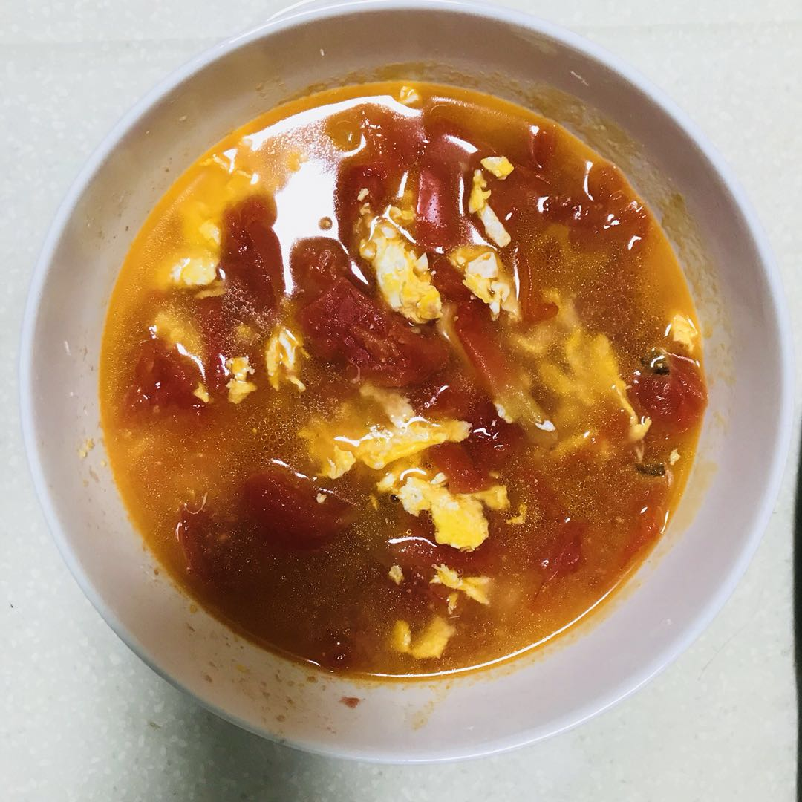

> 新的一周，新的绝望。  -- 某不知名人士曾总结过

本周带来新品，小炒青菜 + 鸡蛋番茄汤，都是来自记忆里妈妈做的菜。

### 炒青菜

这个菜呢，简单又好吃，起油、下菜、爆炒、放盐，就好了。步骤虽然简单，但是不失其味，油盐煎炒过后的青菜有着非常独特的味道，大概就是记忆中的风味。

是的，作为一个清淡的江苏人，我拒绝味精以及任何辣椒佐料。

### 番茄汤

啊哈，番茄蛋汤，又是一道简单又不失其味的家乡菜。油、盐、汤、鸡蛋、番茄，简单到我不知道该用什么样的语言描述它。小时候经常吃的，长大后也会念念不忘。

### 一点感想

在公司呆久了，平时上班真的对吃已经失去了欲望，只有周末在家，可能还有些动力做些自己想吃的。我所求的不过是多写蔬菜多些营养。周末的饭菜我吃得也是最多，一大盘菜+一大碗饭，吃得饱饱的，才有动力继续生活下去啊~~~

**健康指数+10086**

### 总结

菜名 | 所属 | 营养指数 | 推荐指数
---- | --- | --- | ---
爆炒青菜 | 启东菜 | 70 | 3星
番茄蛋汤 | 启东菜 | 80 | 3星

