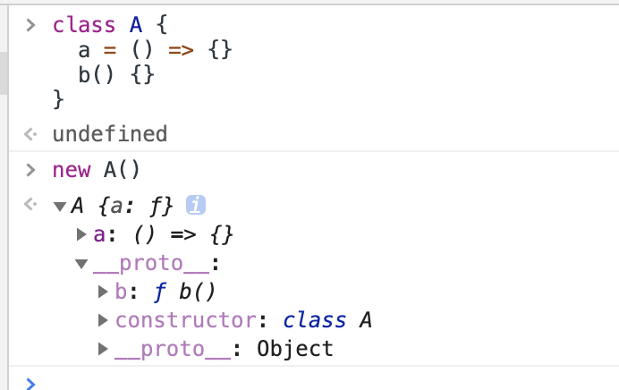
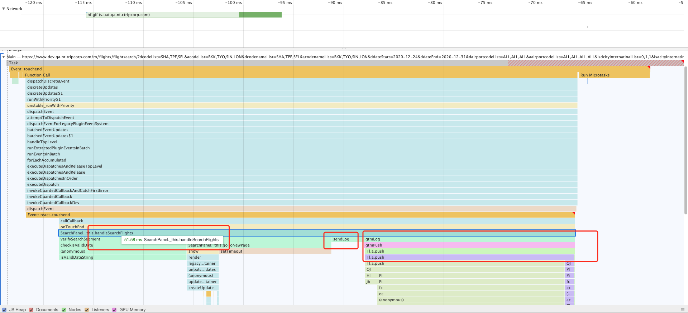
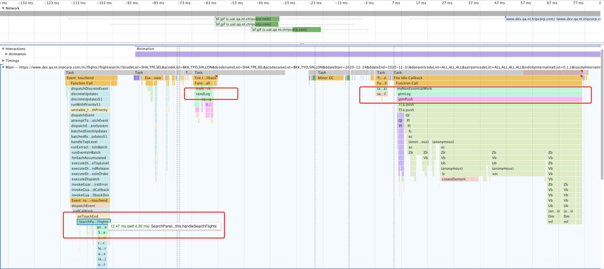

## 目录

<!-- toc -->

- [前言](#前言)
- [设计 API](#设计-API)
- [限制](#限制)
- [效果](#效果)
- [总结](#总结)
- [参考](#参考)

<!-- tocstop -->

## 前言

在学习 requestIdleCallback 这个 API 的时候，想到一个很棒的代码优化的解决方案。

背景是这样的，在我们自身的业务项目中，经常需要做些埋点工作：

```js
class Book extends React.Component {
  handleBook = () => {
     // 校验逻辑
     this.checkpay()
     // 埋点
     this.log()
  }
  checkpay = () => {
     // 很多业务逻辑
     ...
  }
  log = () => {
    // 很多计算逻辑
    ...
  }
  render() {
    return (...)
  }
}
```

这里就会有一些问题，对于应用来说，handleBook() 中的 checkpay() 是实际的主流程业务功能，而 log() 是额外的“附加功能”。随着业务的增长，我们可能会在 log() 中埋入一些自定义的用户行为数据，或者根据产品的需求，埋入用户带入的产品数据，这些七七八八的数据也是需要从整个应用 state 中取值、Mapping、乃至复杂计算，对于用户来说，这种额外的计算负担并为其所需，有时甚至会影响到页面交互的流畅。

我们知道，JavaScript 是单线程模型，如果一个函数计算量很大，它会阻塞主线程，造成运行的卡顿。而 requestIdleCallback 的本质是交给浏览器合理安排 JS 任务，也就说是可以将一些低优先级的函数放置在浏览器的 idle 期间执行，以达到平衡主线程的压力。

而另一方面，log() 埋点本身也没有啥特别的依赖，逻辑上十分简单，只需要数据 + 接口调用。

所以，我们大可以将这些 log() 埋点功能放在 requestIdleCallback 中，只在浏览器空闲的 idle 期间去执行这些任务，既不会影响主流程业务，又能妥善利用浏览器的空闲性能。

## 设计 API

单独的使用 requestIdleCallback 其实是不难的，难的是如何嵌入已有的业务流程中，提供最小化更新。React 项目中，一般都是定一个组件，然后加上各自的功能，所以我们可以使用 Decorator 装饰器模式来增强函数：

定义：

```ts
const isFunction = function(obj) {
    return Object.prototype.toString.call(obj) === '[object Function]'
}

interface IdleProps {
    timeout: number;
}

const IdleTasks = [];

function runIdleTask(task, opts: IdleProps) {
    function myNonEssentialWork(deadline) {
        // deadline.timeRemaining() 可以获取到当前帧剩余时间
        if (deadline.timeRemaining() > 0 || deadline.didTimeout) {
            const t = IdleTasks.shift();
            t && t();
        }
        if (IdleTasks.length > 0) {
            window.requestIdleCallback(myNonEssentialWork, { timeout: opts.timeout });
        }
    }

    if (window.requestIdleCallback) {
        // 新增 task
        IdleTasks.push(task);
        // 执行 idle 工作
        window.requestIdleCallback(myNonEssentialWork, { timeout: opts.timeout });
    } else { // 兼容不存在的 API
        task && task();
    }
}

function defineIdleTask(task?): any {
    // 适配函数组件中的普通函数
    if (isFunction(task)) {
        return function(...args) {
            try {
                runIdleTask(task.bind(this, ...args), { timeout: 500 });
            } catch (e) {
                console.error(e);
            }
        }
    }
    // 适配 class 类组件
    if (!task) {
        return function(
            target,
            propertyKey: string,
            descriptor: PropertyDescriptor
        ) {
            if (!isFunction(target[propertyKey])) {
                throw new Error(`${propertyKey}: Plz do not use arrow function for class decorator binding, use normal function instead.`);
            }
            const originTask = descriptor.value;
            descriptor.value = function(...args) {
                try {
                    // 这里的 this 是跟随原来类的，所以不能使用箭头函数，会造成 this 丢失
                    runIdleTask(originTask.bind(this, ...args), { timeout: 500 });
                } catch (e) {
                    console.error(e);
                }
            };
        };
    }
}


export default defineIdleTask;
```

使用：

类组件

```js
import defineIdleTask from 'shared/idleTask'

class Book extends React.Component {
  constructor(props) {
    // 手动绑定
    this.log = this.log.bind(this)
  }
  handleBook = () => {
     // 校验逻辑
     this.checkpay()
     // 埋点
     this.log()
  }
  checkpay = () => {
     // 很多业务逻辑
     ...
  }
  // 只需一小行代码，就能使用了！
  @defineIdleTask()
  log() {
    // 很多计算逻辑
    ...
  }
  render() {
    return (
      <div onClick={this.handleBook}>Book</div>
    )
  }
}
```

函数组件

```js
import defineIdleTask from 'shared/idleTask'

function Book() {
  function checkpay(){
    // 很多业务逻辑
    ...
  }
  function log() {
    // 很多计算逻辑
    ...
  }
  // 被 idle 的函数
  const idleLog = defineIdleTask(log);

  function handleBook(){
      // 校验逻辑
      checkpay()
      // 埋点
      idleLog.apply({a:'dfa'})
  }
  return (
    <div onClick={handleBook}>BookHook</div>
  );
}

export default Book;
```

## 限制

需要注意的一点，class 类中应用 Decorator 装饰器模式对于常规函数和箭头函数效果是不同的，具体原因可见[JavaScript Decorator 装饰器模式](https://betamee.github.io/content/webfrontend-42d4215b6a7a5cb09b22865ada6cc3dd)。

简单来说，就是概念上有一点问题，Decorator 装饰器模式是在类创建后，实例创建前应用的，而类中的常规方法是绑定在 prototype 上，但类中的属性方法是绑在实例上的，这就是造成了使用上的不确定。



更多原因可以搜索 Decorator + class properties 关键词了解背后详情，这说明了 Decorator 标准还不够成熟。

## 效果

通过以上方案的改造，我们可以对比一下优化前后的差异：

优化前：



优化后：



## 总结

可以看到，使用 requestIdleCallback 后，可以合理地将两个 log 函数分配到浏览器空余时间，而主流程代码 handleSearchFlights 耗时从 50+ms 直接跌到了 12+ms，优化幅度巨大。

## 参考

+ [理解 requestIdleCallback](https://betamee.github.io/content/webfrontend-af7e5693d19953109a987b234c81b641)
