## 目录

<!-- toc -->

- [前言](#前言)
- [问题的产生](#问题的产生)
- [理解 Web Metrics 各项指标](#理解-Web-Metrics-各项指标)
- [影响指标的因素](#影响指标的因素)
- [性能优化实践](#性能优化实践)
  * [提高资源的加载速度](#提高资源的加载速度)
  * [移除代码中无用的资源](#移除代码中无用的资源)
  * [合理打包，避免资源模块的重复引入](#合理打包，避免资源模块的重复引入)
  * [懒加载非必要模块，用户交互时再加载](#懒加载非必要模块，用户交互时再加载)
  * [只加载首屏可视区域的模块，非可视区域滚动后加载](#只加载首屏可视区域的模块，非可视区域滚动后加载)
  * [去除 gagtm 等第三方脚本的影响](#去除-gagtm-等第三方脚本的影响)
  * [优化 Long Task，分析代码是否有更优解法](#优化-Long-Task，分析代码是否有更优解法)
  * [客户端首屏渲染提供 Loading 框架](#客户端首屏渲染提供-Loading-框架)
  * [使用呼吸占位符](#使用呼吸占位符)
  * [压缩大图，提供 Webp 格式图片](#压缩大图，提供-Webp-格式图片)
  * [对页面性能进行长期监控](#对页面性能进行长期监控)
- [效果](#效果)
- [性能优化进阶方案](#性能优化进阶方案)
  * [服务端渲染](#服务端渲染)
  * [使用动态 polyfill](#使用动态-polyfill)
  * [提供 es module 版本部署](#提供-es-module-版本部署)
- [总结](#总结)
- [参考](#参考)

<!-- tocstop -->

## 前言

前端性能优化一直是一个非常综合又重要的话题，涉及到很多知识点，也跟业务场景息息相关。本文将复盘整理自三月份开始的性能优化工作，此次工作的目的是优化我们站点在 [Google Page Speed](https://developers.google.com/speed/pagespeed/insights/) 上的得分，最终提升 SEO 的排名。

## 问题的产生

在优化前，我们[站点](https://www/trip.com/m/flights)在 Google Page Speed 上得分 30 分往下，这个分数在千万个网络站点中基本上算是不合格的一批。分数越低，用户打开越慢，严重影响站点的用户体验。

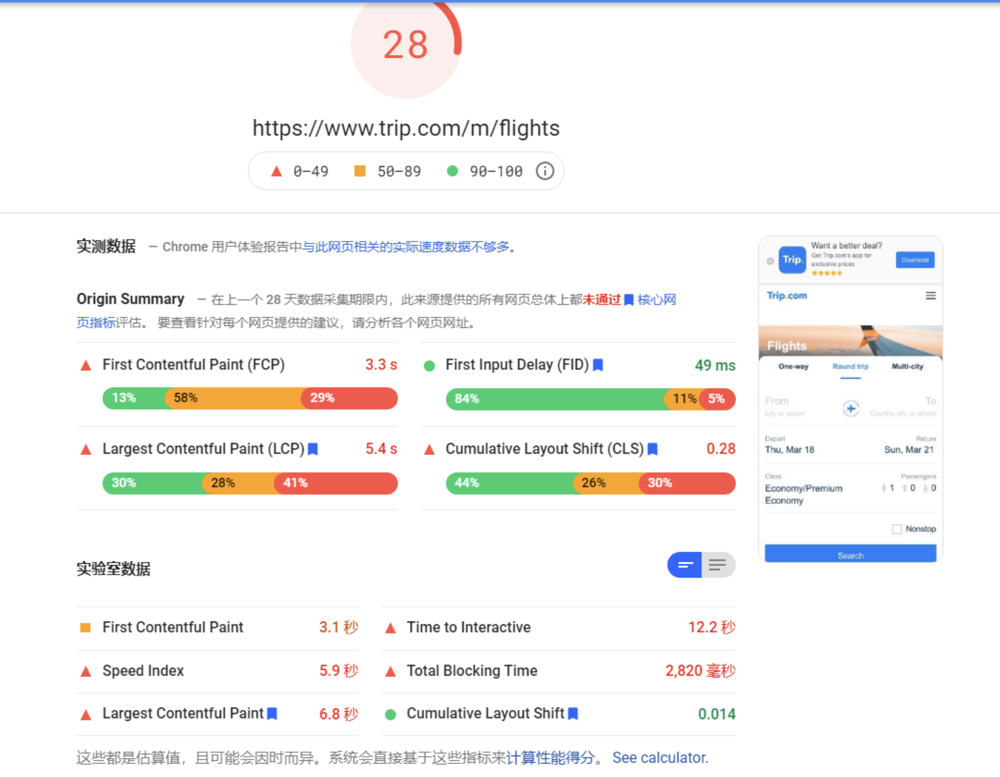

那么这个分数到底是怎么得出的呢？以及该如何针对性提高分数？

## 理解 Web Metrics 各项指标

我们先来看看 Google 是如何划定页面指标的。Google 给出的 Web Metrics 总共有六项：

+ First Contentful Paint (FCP)
+ Largest Contentful Paint (LCP)
+ Time to Interactive (TTI)
+ First Input Delay (FID)
+ Total Blocking Time (TBT)
+ Cumulative Layout Shift (CLS)

下面一项项理解其中的含义：

[First Contentful Paint (FCP)](https://web.dev/fcp/)
  + **衡量页面首个元素内容的出现时间**
  + 这个元素必须是 text、images、svg 元素或者非空白 canvas

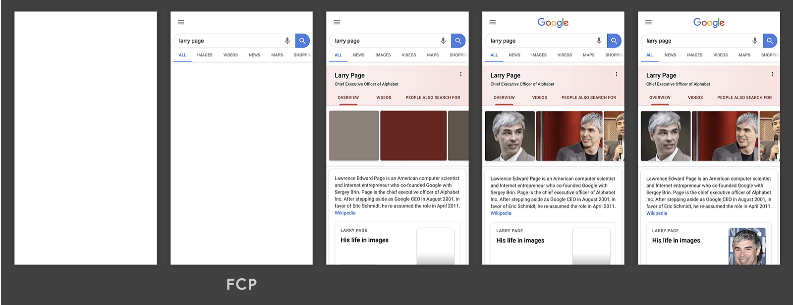

[Largest Contentful Paint (LCP)](https://web.dev/lcp/)
  + **衡量页面最大元素内容出现的时间**
  + 这些元素会被测量：img、svg 下的 image、video、使用 background-image: url() 的背景图、带文本内容的块级元素。
  + 需要注意的是，LCP 测量的元素可能会发生变化，如果在加载过程中，有更大的元素出现，LCP 时间会后移。具体见下面的图例

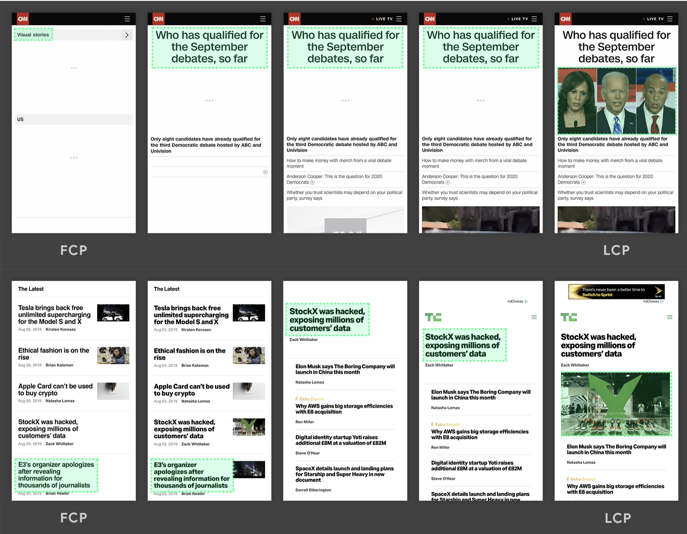

[Time to Interactive (TTI)](https://web.dev/tti/)
  + **宏观上：从页面开始加载到主要资源加载完成，并且后续可交互这段时间**
  + **微观上：有 Long Task 的时候是主线程静默期之前最后一个 Long Task 的结束时间，没有的话是跟 FCP 一样的时间**
  + 影响 TTI 的主要因素是 Long Task 和 后续的主线程静默期

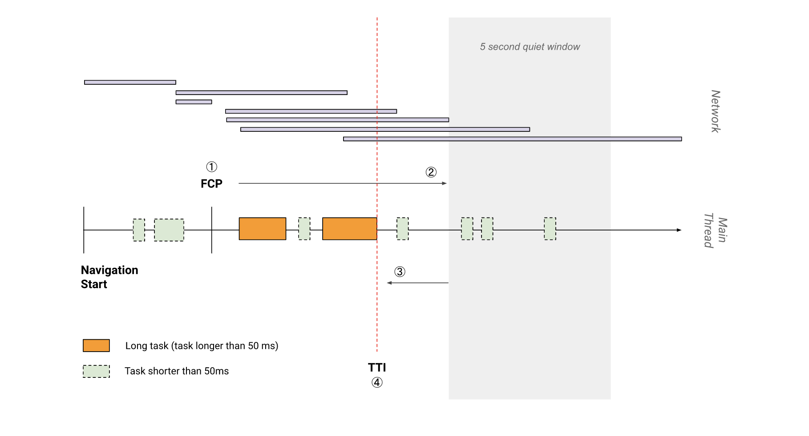

[First Input Delay (FID)](https://web.dev/fid/)
  + **宏观上：用户初次和页面交互（比如触发点击）到页面能真正处理事件两个阶段的时间**
  + **微观上：FCP 和 TTI 之间 Longest Task 就是 FID**
  + 影响 FID 的主要因素也是 Long Task
  + 此指标反应的是页面可交互性

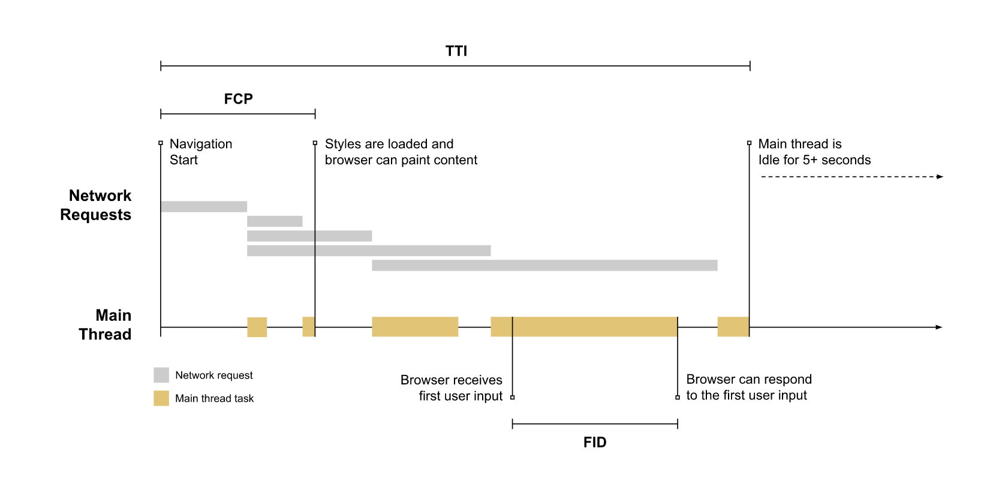

[Total Blocking Time (TBT)](https://web.dev/tbt/)
  + **FCP 和 TTI 之间的所有 Long Task 超过 50ms 部分的时间总和**
  + 影响 TBT 的主要因素也是 Long Task

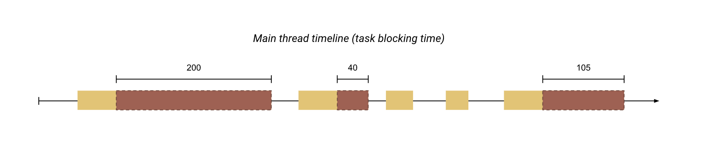

[Cumulative Layout Shift (CLS)](https://web.dev/cls/)、
  + **衡量元素位置的稳定性**
  + 影响 CLS 的主要是页面加载过程中突然出现的一些元素模块，导致页面布局发生位移变动

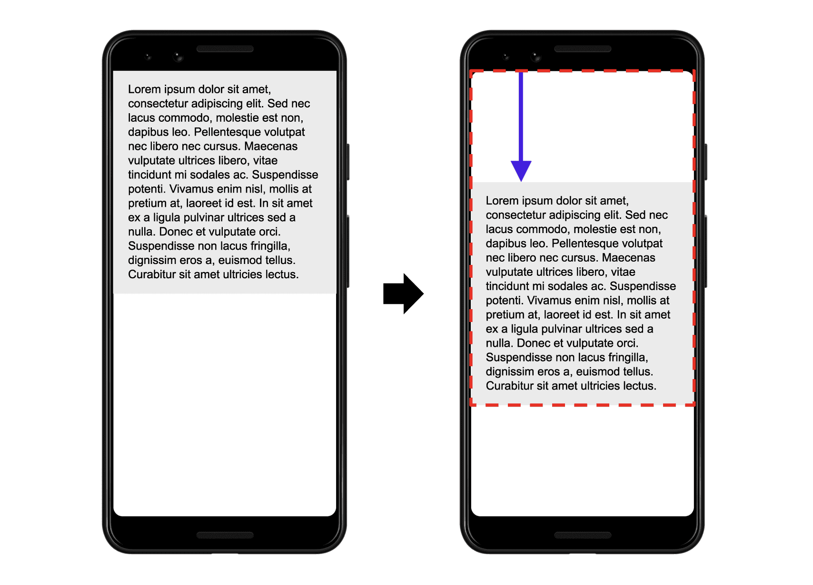

## 影响指标的因素

从上面整理总结的六大类指标中，我们可以得知，影响页面分数的主要在于：

+ 首屏资源加载太慢（SI、LCP、FCP）
+ 资源执行太耗时（TTI、TBT、FID）
+ 页面模块先后加载导致元素发生偏移（CLS）

Google 提供了一个[计算器](https://googlechrome.github.io/lighthouse/scorecalc)，可以清楚地看到各项指标的占比：

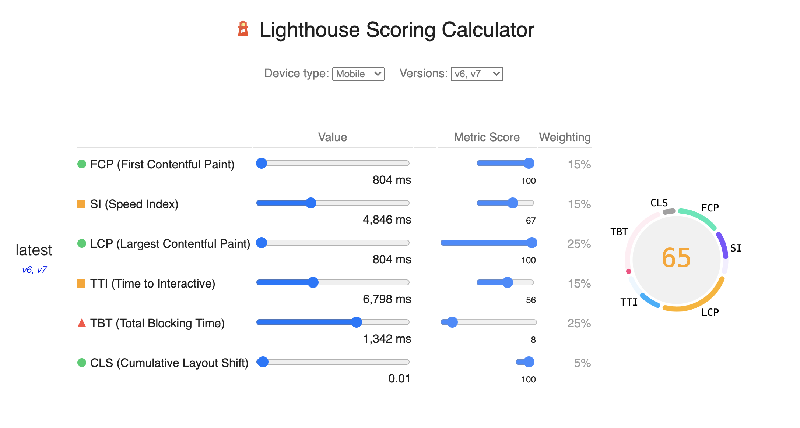

> 这里提一下，计算器中的 Speed Index（SI） 不在上一节的指标介绍中，这是因为官网中列出的最新版六大指标中没有 SI（随着技术发展，Google 性能标准也一直在变化），但目前算分的时候是算这个指标的。我们姑且把这个作为总的页面加载速度指标，无需特意在意，因为当我们优化其他指标的时候，SI 一定是会提升的。
>
> 从技术细节上，我们只要关心上一节的六项指标，万变不离其宗。基于上述六个指标，Google 还给出了[Web Vitals](https://web.dev/learn-web-vitals/) 这样的核心性能指标。有机会研读一下他们团队的一些思考。


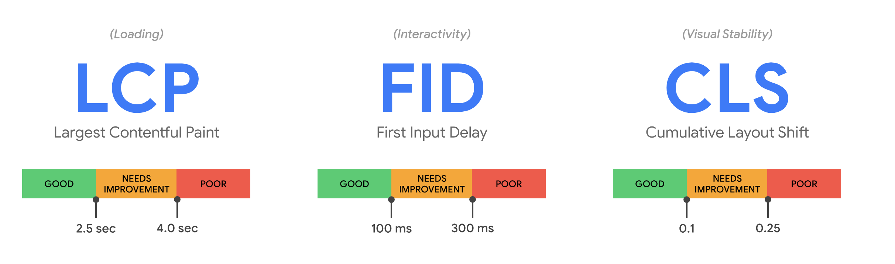

要提高分数，无非从这些角度出发进行针对性优化。这里基于我们自身项目，提供一些方案：

+ 提高资源的加载速度
+ 移除代码中无用的资源
+ 合理打包，避免资源模块的重复引入
+ 懒加载非必要模块，用户交互时再加载
+ 只加载首屏可视区域的模块，非可视区域滚动后加载
+ 去除 gagtm 等第三方脚本的影响
+ 优化 Long Task，分析代码是否有更优解法
+ 客户端首屏渲染提供 Loading 框架
+ 使用呼吸占位符
+ 压缩大图，提供 Webp 格式图片
+ 对页面性能进行长期监控

## 性能优化实践

我们的项目是一个标准的 CSR 模型，前端资源部署在静态 CDN 上，Node 服务起一个引导入口。

下面讲讲我们项目优化中的理论和实践措施。

### 提高资源的加载速度

提高资源的加载速度有助于提升 SI 指标，不过网络带宽速度前端是没法直接介入的，这是公司网络基础设施需要考虑的东西。下面是目前我们已经做到的基础优化：

+ 使用 Service Worker 缓存静态资源
  + 具体内容见[前端静态资源缓存实践](:note:61323768-b26c-4cbb-8d34-db4c0d1831cf)
+ 使用 Resource Hints 优化资源加载速度
  + DNS Prefetch：DNS 预解析
  + Preconnect：预连接
  + Prefetch：预获取资源，但不执行，优先级低
  + Prerender：预处理
  + Preload：也是预获取资源，但相比 Prefetch 优先级更高，加速关键渲染路径
+ 一些耗时的重接口可以分批查询
  + 先提供一个轻量的接口预加载数据，再调用主接口返回全部数据
  + 依赖于 API
+ 静态资源部署 CDN
  + 我们是面向国际化的站点，在海内外都需要部署静态资源
+ 升级 HTTP2
  + HTTP2 相比 HTTP1.1 带来了很多新的功能，现在主流都在升级
  + HTTP2 优势：
    + 解析速度快：基于帧的协议
    + 多路复用：多个请求可以共用一个 TCP 连接
    + 首部压缩
    + 可以对紧急请求设置优先级
    + 流量控制
    + 服务器推送

### 移除代码中无用的资源

随着项目的迭代，仓库中累积着越来越多的冗余代码。比如，在我们项目中

+ 手动引入的 zepto.js 插件，基本用不到
+ 全局引入的 css 文件，很多都被组件化的 css module 替代了
+ 国际化多语言资源，很多冗余 key

解决这类问题，思路是很简单的，只是做起来比较麻烦，是一个体力活。最难搞的是多语言资源，我们页面每次通过 shark script 脚本引入全量资源，其中有不少冗余 key。

为了解决这个问题，我自己写了个[扫描脚本](https://github.com/BetaMee/node-usage-examples/blob/master/scankey/index.ts)，扫出来 36% 的 key 是废弃的，去除后脚本资源量直接从 83KB 减少到 54KB（JP 站）。

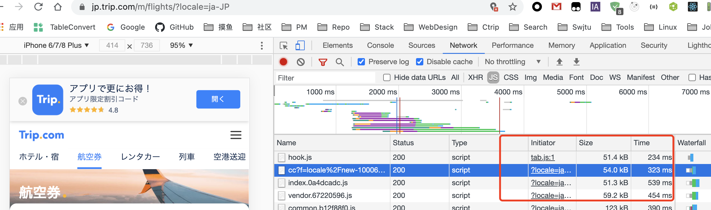

### 合理打包，避免资源模块的重复引入

这一项的优化，是对 Webpack 打包的优化。用 Webpack Analyzer 进行分析：

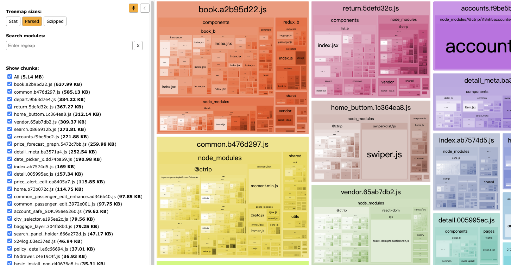

发现我们项目中，有重复打包问题，主要集中在第三方模块：

+ 某公共组件提供多个版本的打包，es、lib、dist，我们项目中直接使用了 dist 包，但我们依赖的其他组件使用了 es 目录下的包
+ 某 UI 组件（团队自己维护）使用 Webpack 打包成 amd 模块，其中编译了 Babel Polyfill 包，但我们自身项目中也用到 Babel Polyfill，Tree Shaking 无法分析其中多余的模块，这就造成了重复打包。此外打包缺乏 sourcemap，调试也困难

为了解决这些问题，调整下打包方案：

+ 统一第三方包目录，有 es 版本的全部使用 es 目录下的
+ UI 组件库调整配置，调整为使用 Babel + TS 直接编译为 ES Module 模块，还能生成 sourcemap 文件，方便调试。我们项目中引用编译后的代码，所有的 Polyfill 可以自己控制，并且 Tree Shaking 还能排除没有用到的代码

通过调整，可以看到调整前后代码量的差距，减少了一大半的冗余代码：

调整前：

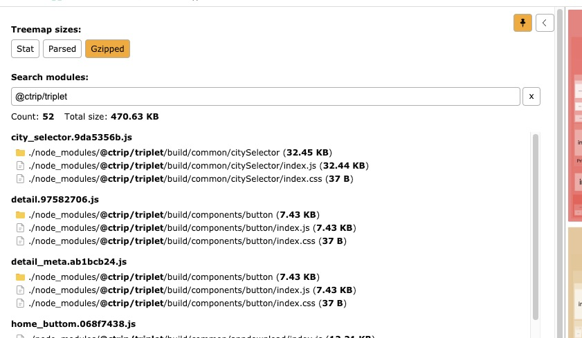

调整后：

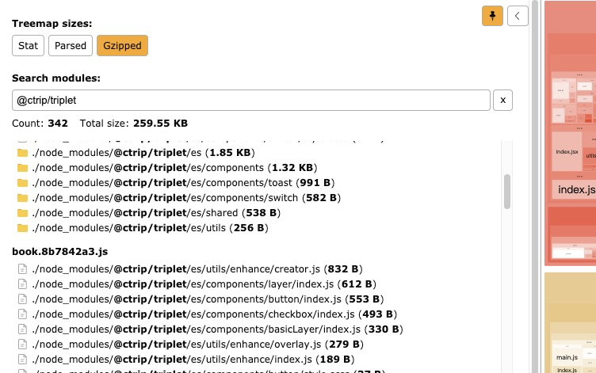

### 懒加载非必要模块，用户交互时再加载

资源懒加载也是目前前端页面一项基本功了。我们项目中的实践思路有两种：

+ 所有非首屏可视、需要用户交互的组件模块，比如点击弹出浮层、通知，统统使用 loadable 进行拆分
+ 所有特定场景的第三方 SDK、第三方脚本，使用异步动态加载，而且是只在交互时触发，避免首屏加载进来

这里的异步动态加载是这样的一个方法：

```js
/**
 * *异步加载一些非必要脚本，返回的是 Promise
 */
// 已加载的脚本
const loadedScriptList = [];

export default function loadAsyncScript(url, option = {
    anonymous: true
}) {
    return new Promise((resolve, reject) => {
        // 如果已经加载了
        if (loadedScriptList.indexOf(url) > -1) {
            resolve();
            return;
        }

        let done = false;
        const doc = window.document;
        const s = doc.createElement('script');
        s.type = 'text/javascript';
        s.async = true;
        if (option.anonymous) {
            s.setAttribute('crossorigin', 'anonymous');
        }
        s.src = url;

        const f = doc.getElementsByTagName('script')[0];
        f.parentNode.insertBefore(s, f);

        s.onload = s.onreadystatechange = function() {
            if (!done && (!this.readyState || 'loaded' === this.readyState || 'complete' === this.readyState)) {
                this.onload = this.onreadystatechange = null;

                done = true;
                loadedScriptList.push(url);
                resolve();
            }
        };

        s.onerror = function(e) {
            console.error(e);
            reject(e);
        };
    });
}
```

使用的时候，比如有一个点击出验证码拦截：

```js
class Captcha extends Component {
  handleClick() {
    loadAsyncScript(captchajs)
      .then(() => {
         // 第三方 SDK 注册
         const captcha = window.captcha
         // other thing...
         captcha.show()
      })
      .catch((e) => {
        console.log(e)
      })
  }
  render() {
    return (...);
  }
}
```

> 关于懒加载的一点进阶思考：
> 
> 我们页面中，要加载一个模块，很多时候是依赖一个变量来控制的，假设这个变量叫 isMember，来源于账户 SDK，它的状态依赖异步接口，初始的时候，isMember=false,这时候页面渲染A模块，过一会接口返回了 isMember=true，则渲染B模块，但其实对于整个应用来说，B模块才是这个页面是当前业务状态要加载的，A模块理论上来说不需要加载。这违背了懒加载的原则。
>
> 如何解决这个问题呢？可以另外设立一个变量，假设叫 isInterfaceOK，初始的时候 isInterfaceOK=false， isMember=false，都不渲染，等到接口完成后，isInterfaceOK=true，这时候再根据 isMember的值渲染不同的模块。

### 只加载首屏可视区域的模块，非可视区域滚动后加载

这块的优化是使用了 React LazyLoad + Loadable 结合。LazyLoad 的原理见这篇文章：[React LazyLoad 原理实现](:note:64251aa0-92f1-4b25-923c-3698d76bd91b)


首屏只渲染可视区域的组件：

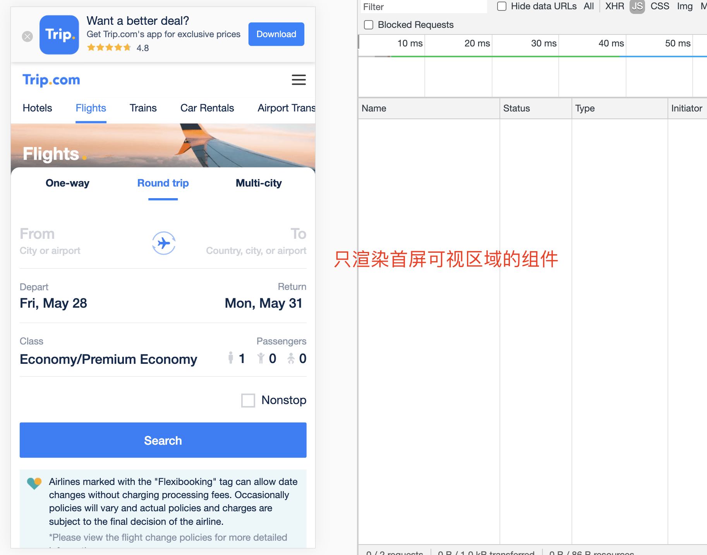

下面非可视的组件由放在 LazyLoad + Loadable 中，只在滚动到下面的时候才去加载 home_buttom.js 并渲染出来：

```jsx
import React from 'react'
import loadable from '@loadable/component'
import LazyLoad from 'react-lazyload'

const HomeButtom = loadable(() => import(/* webpackChunkName: 'home_buttom' */ './HomeButtom'))

class App extends React.Component {
  render() {
    <div>
      {/* 可视组件 */}
      <div>
        ...
      </div>
      {/* 非可视组件 */}
      <LazyLoad>
        <HomeButtom />
      </LazyLoad>
    </div>
  }
}
```

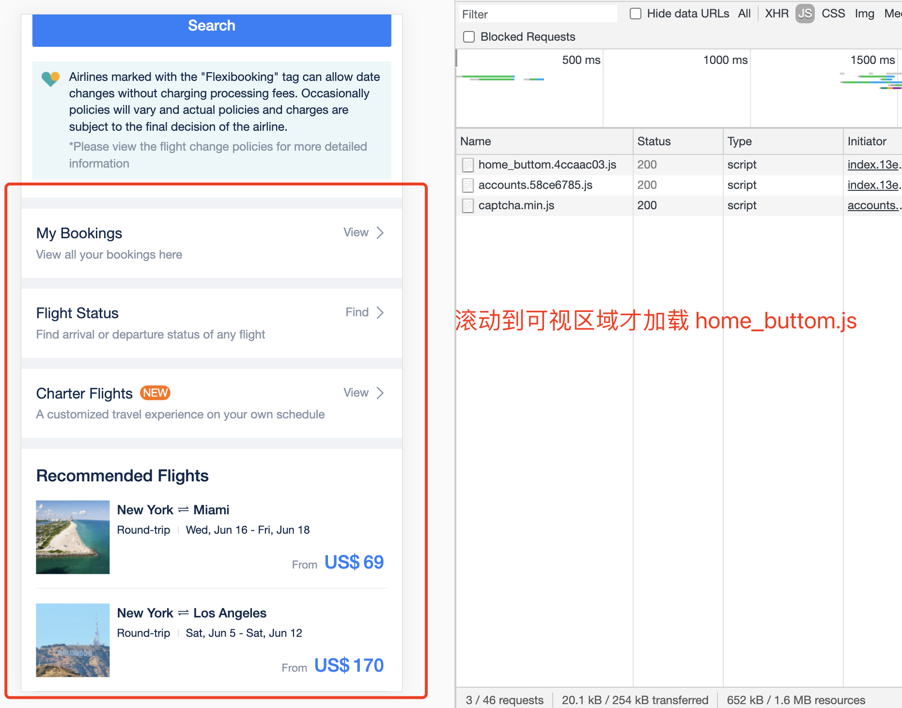

这样的优化**将资源的加载和执行后置**，能减轻不少首屏渲染的压力。

### 去除 gagtm 等第三方脚本的影响

gagtm 脚本是 Google 提供的 analytics.js 和 googletagmanager.js，主要是供站点统计和市场投放营销之用。这些脚本一直作为“第三方脚本”在我们项目中存在已久，看起来也没有啥问题。但在这次的 SEO 优化中，发现 gagtm 对我们站点的性能分数有着十分重大的影响，更多讨论可以见[这篇文章](https://www.analyticsmania.com/post/google-tag-manager-impact-on-page-speed-and-how-to-improve/)。

直观来说，gagtm 脚本影响了 TTI 和 TBT 两个指标，因为其加载执行都非常耗时，而且还会调用很多请求：

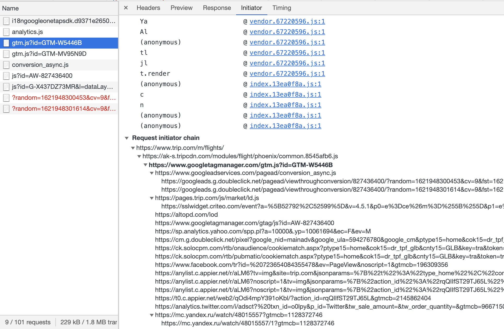

实验下来，如果站点去掉脚本，**分数能直接提升了十分之多**！

在我们项目中，可以在服务端判断请求流量是否是爬虫，然后设立 isRobot 变量，传递给前端，为 true 的时候屏蔽 gagtm 脚本的加载。

事实上，我们项目中还有 ubt.js、tarcker.js 等监控脚本，这些对 SEO 也是非必需的，可以在爬虫流量中屏蔽掉，提升更多分数。

> 这就引申出一点小思考，这种方式算不算作弊？我们使用 Google Page Insights 来测试我们的站点，这些指标本身就是衡量用户访问体验的，现在在爬虫进来的时候去掉这些附属于站点的第三方依赖，分数确实提高了，但并不能反映用户实际的体验。
>
> 但其实可以这么来思考，这些第三方脚本我们是无法直接优化的，我们能优化的只有自己项目的代码。如果我们的代码能优化到一百分，加上第三方脚本扣除 30 分，剩下的 70 分是极限体验。这和本身是 60 分的站点，扣除 30 分后，只剩 30 的体验还是有着巨大的差距的
>
> 另一方面，这次做的优化就是针对 SEO 的，去掉这些无用的“脚本”无可厚非，甚至有助于搜索引擎尽快抓取有用信息。这样想来，这种做法也不能算作弊～
>

### 优化 Long Task，分析代码是否有更优解法

Long Task 是指超过 50ms 的任务模块，它直接影响页面的交互流畅度。特别是页面首屏加载阶段，如果有太耗时的 Long Task，将会拉低 TTI 和 TBT 得分，因为 TTI 的触发需要有 5s 的**主线程静默期**，这期间不能有 Long Task。

调试 Long Task，最重要的是学会使用 Chrome Devtools 查看火焰图，定位出耗时函数的位置。以个人经验来说，超过 20ms 的单个函数模块要重点关注，超过 50ms 的则是引起卡顿的函数，需要判断这个场景下是否真的需要这么耗时的操作。

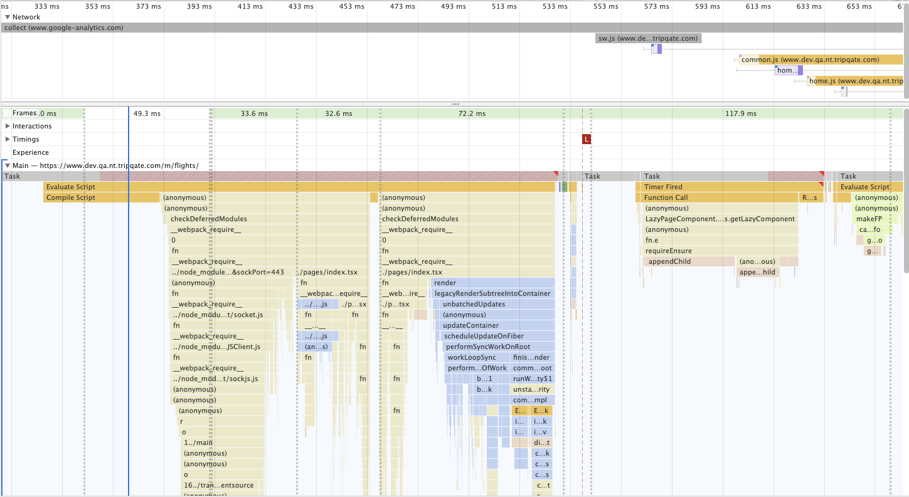

另一方面，很多短耗时但是重复多的操作也要关注，比如看起来只有 5ms、10ms 的函数，一旦堆叠也容易引起卡顿。需要分析其中的代码思路，思考有没有更优的写法。

下面是一些优化 Long Task 总结出来的实践：

+ 事件节流和防抖
  + 无限制的触发事件会拖累页面性能
+ 缓存 DOM 对象
  + DOM 操作是很损耗性能的，避免滥用
+ 避免复杂对象的过度操作
  + 如 if(isEmpty(bigObj)) 改为 if(bigObj)
+ 优化耗时的同步计算
  + 放在 WebWorker 中或者使用 Promise 异步代码
+ 优化低优先级代码
  + 使用 requestIdleCallback API，详细可见[理解 requestIdleCallback](:note:4ee30f4f-0f04-4b3d-8104-e123a1eb35d6)一文
+ 函数延迟执行
  + 柯里化（Currying）化技术将多参数函数转换成接受单一参数的函数，延迟执行代码
+ 函数缓存
  + 使用 Memorization 技术，将函数执行结果缓存，在参数不变的情况下，直接返回旧值，避免重复计算

除了关注 JavaScript 代码本身的执行效率，也要关心**框架级别的优化**。我们项目是 React 技术栈，基于 React 本身的性能优化实践，也要做到心中有数。

以个人的经验出发，React 优化思路能有这样一些实践：

+ 使用 shouldComponentUpdate 进行更新阶段优化
  + 对于 class component 组件，可以在这个生命周期阶段对 props 判断是否需要更新
+ 使用 PureComponent 和 memo 进行更新阶段优化
  + 默认只会浅比较第一层，深层复杂数据无从比较
+ 使用 useMemo 缓存昂贵计算
  + 但不要无脑依赖于 useMemo，memo 过程本身也是有开销的，要根据场景来决策
+ 使用 useCallback 缓存内联函数
  + 缓存了每次渲染时 inline callback 的实例，保证往子组件传递的是同一个函数引用
  + 需要配合 memo 或 shouldComponentUpdate，依据场景决策，不能无脑使用  
+ 使用 immutable.js 解决浅比较陷阱
  + immutable.js 会将引用对象变成一个 immutable 对象，改变某一属性的时候，会更新当前属性以及它所有的父节点属性，其余属性保持不变
  + 常规深比较算法影响性能，借助 immutable 技术可以实现数据复用，提高深比较效率
+ 大数据渲染优化
  + 使用 React-Window 和 React-Virtualized 优化大数据渲染
+ 使用 React Fragments
  + 避免无用的 HTML 嵌套
+ 少用内联函数定义
  + 每次调用 render 阶段都会创建一个新的函数实例，增加垃圾回收工作量。非必要情况下少用
+ 避免 componentWillMount 中的异步请求
  + 放到 componentDidMount  中
+ 在 constructor 中绑定函数
  + 避免在 DOM 上 bind(this)，因为每次 render 都会重复这个 bind 过程
+ class 组件中合理使用箭头函数
  + 使用箭头函数时会保留执行的上下文，非常方便
  + 添加箭头函数时，该函数被添加为对象实例，而不是类的原型属性。这意味着如果多次复用组件，那么在组件外创建的每个对象中都会有这些函数的多个实例
  + 最优的还是在 constructor 中 bind(this)
  + 常规函数和箭头函数各有优势，合理使用

代码优化既是一个细心活也是一个经验活，每一个优化可能从 10ms 优化到 5ms，但积少成多，只有保持良好的代码习惯，才能让性能维持较高的水平。

### 客户端首屏渲染提供 Loading 框架

由于我们的站点大部分页面都是 React SPA 技术栈，React 会把页面的渲染工作放在客户端，这就会导致用户从输入网址到获取到入口 html 文件再到看见页面之间有一个时间差，如果首屏渲染工作过复杂，就会出现**白屏**现象。

所以为了体验上的无缝切换，可以在入口 html 文件中提前渲染一个 Loading 框架：

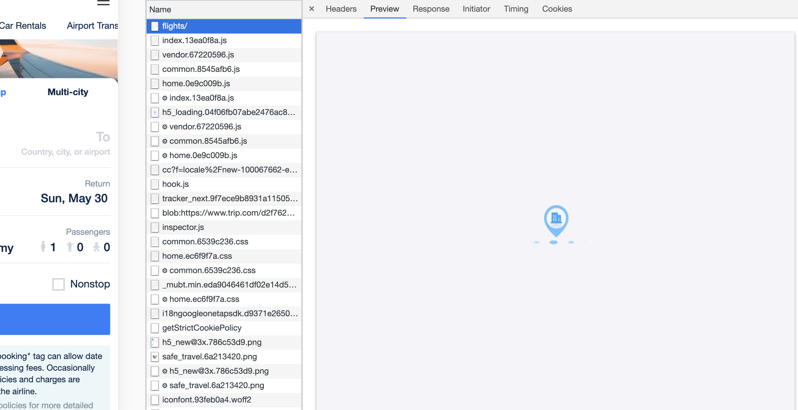

当然，这个跟 SEO 的优化没有直接关系，它不会对性能指标有任何提升，只是一个用户体验上的增强。

~~不过我们可以在这个 Loading 框架上做一点手脚，让 FCP 提前触发。根据 FCP 定义，只要视口中出现首个内容元素，浏览器就可以定义为 FCP 时间，（非必要情况下不要滥用，因为对用户来说没有任何意义～）~~

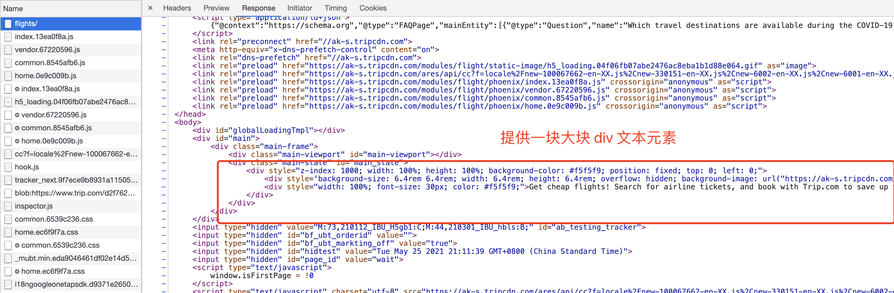

### 使用呼吸占位符

使用呼吸占位符，一是可以提供良好的用户体验，二是避免页面元素的突变，提高 CLS 分数。我们很多业务元素，不是页面进来就加载的，而是通过接口来拉取数据后展示的，使用占位符能让数据的加载有一个稳定的过渡。

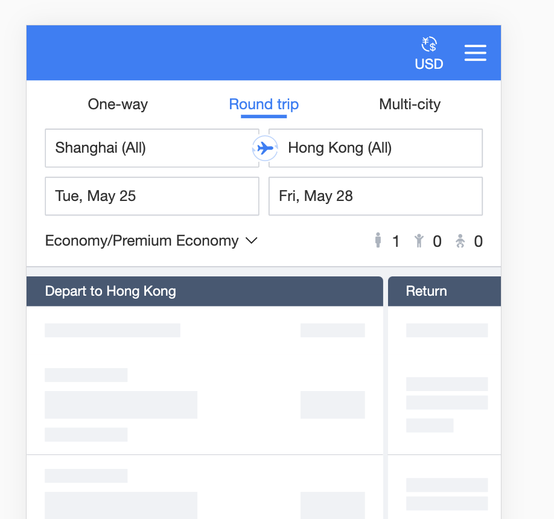

### 压缩大图，提供 Webp 格式图片

Webp 格式的图片是 Google 于 2010 年推出的新型图片格式

它具有这样的优势：

+ 更优的图像数据压缩算法，在拥有肉眼无法识别差异的图像质量前提下，带来更小的图片体积
+ 具备了无损和有损的压缩模式、Alpha 透明
+ 支持动态图片：动态 WebP 相比 GIF 支持更丰富的色彩，并且也占用更小空间，更适应移动网络的动图播放
+ 在 JPEG 和 PNG 上的转化效果都非常优秀、稳定和统一

为网站部署 Webp 图片有助于提高页面加载速度、减少带宽流量。

我们站点上首图以前是 PNG 格式，至少有 40kB+，这次优化下来为 10.8kB，优化率 75%，而且图片也依旧清晰：

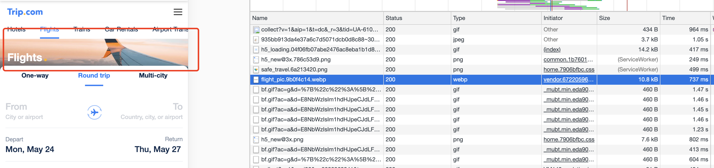

不过 Webp 也不是没有问题，它的兼容性不是很好，iOS 浏览器不支持这个格式，更别说一些老旧的浏览器：

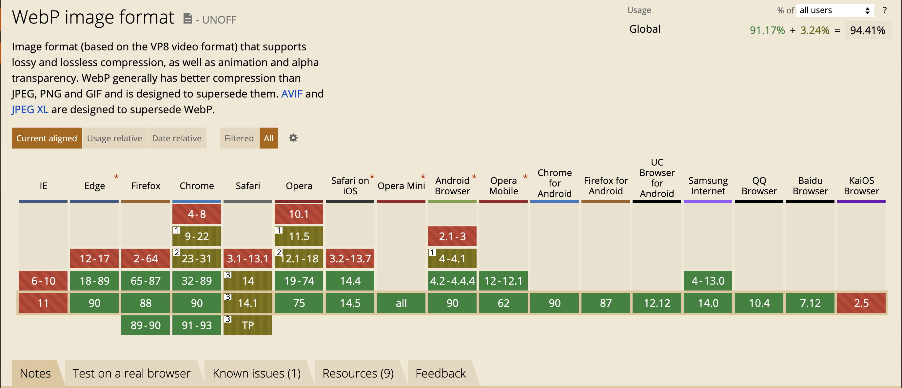

要想部署 Webp，只能采用兼容方式。前端引入图片无外乎使用 JS 动态加载、使用 CSS、或者使用 HTML img 标签。

对于 CSS，目前没有特别好的方式来做兜底，对于 HTML，可以使用 picture 标签：

```html
<picture>
  <source srcset="img/awesomeWebPImage.webp" type="image/webp">
  <source srcset="img/creakyOldJPEG.jpg" type="image/jpeg"> 
  
</picture>
```

而 JS 动态加载，可以使用 toDataURL 来判断浏览器是否支持：

```js
const isSupportWebp = () => {
  // 使用 canvas
  return document.createElement('canvas') &&
  document.createElement('canvas').toDataURL('image/webp') &&
  document.createElement('canvas').toDataURL('image/webp').indexOf('data:image/webp') === 0
}
```

如果需要在服务器端判断，则可以判断 header 头中的 accept 字段：

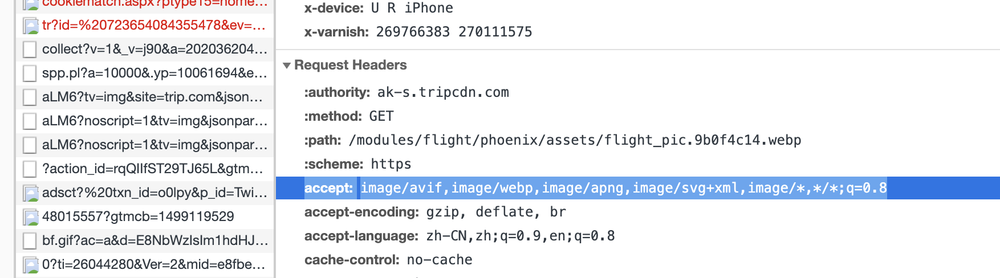

### 对页面性能进行长期监控

除了在项目开发阶段的优化之外，监控也是一个必须要跟上的不可获取的步骤，分为两步：

+ 在 CI 阶段：
  + 使用 Lighthouse SDK，每一次提交跑 CI 自动化脚本的时候统计性能分数，如果代码性能低于某一阈值，则直接警报
+ 在线上阶段：
  + 使用 [Long Tasks API](https://developer.mozilla.org/zh-CN/docs/Web/API/Long_Tasks_API) 来埋点监控，重点关注高于 50ms 的任务。让大数据来告诉我们页面的交互哪一块出现问题最多最卡顿，方便我们后续排查优化

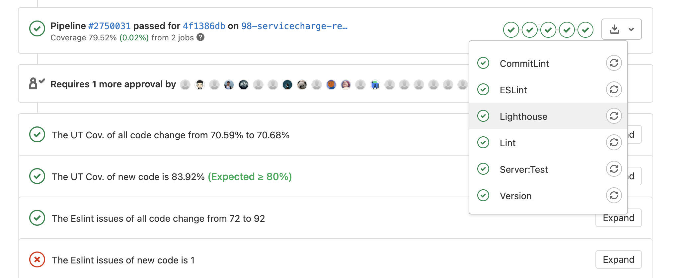

## 效果

经过将近两个月的奋力工作，我们首页的分数终于达到了 89+ 分，远超 70 基准分，算是一个比较优秀的性能结果。

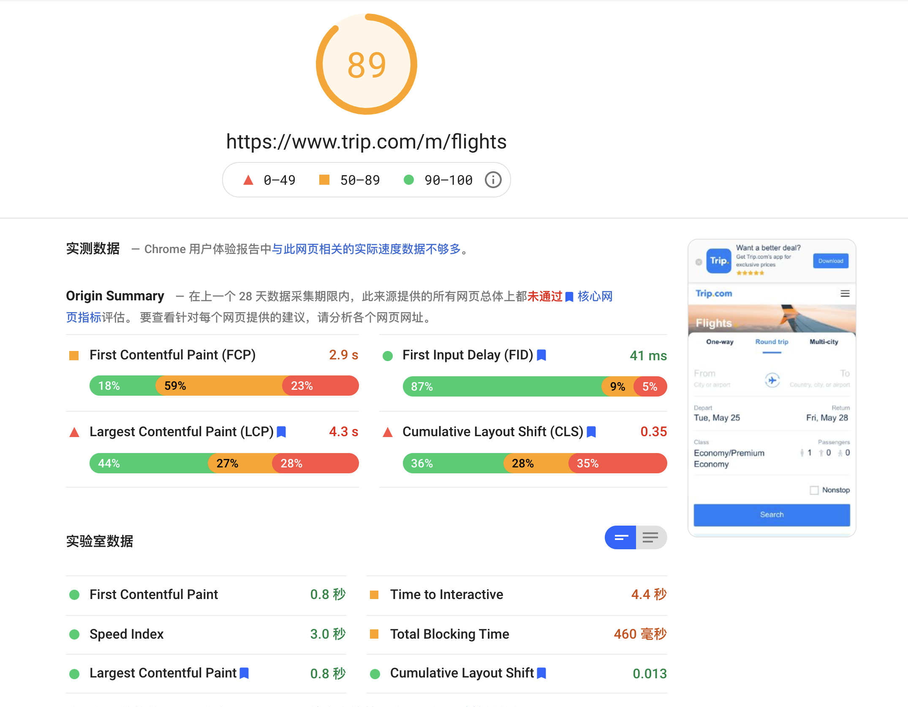

从内部工具中拉取线上数据，横向比较了一下，可以看到从三月的 30+ 到五月的 80+，经历了三次飞跃，这三次变化是在不同阶段发布的更新触发的，也是代表着这个项目中的探索过程：

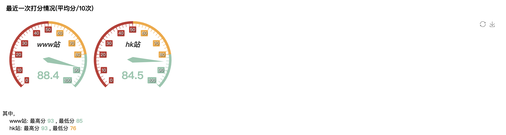

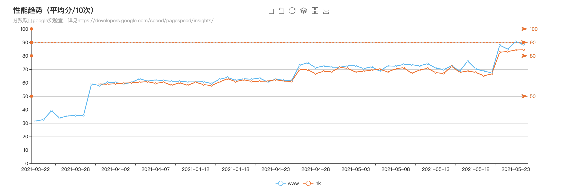

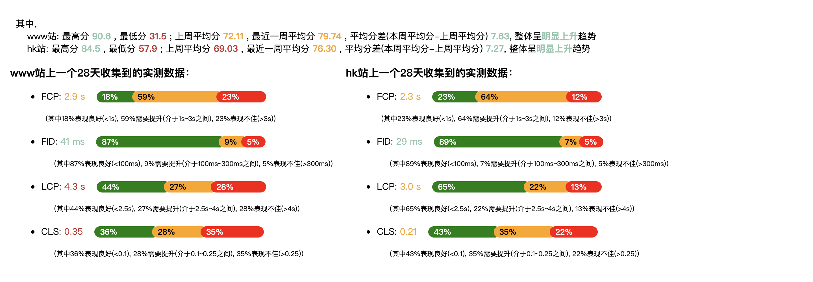

这是各个时间点的发布变更：

阶段一：3.31号

+ 首页组件滚动加载
+ 移除 lodash 和 undercore 等工具库，统一使用一个基础库 ramda
+ 移除没用使用的 zepto 插件
+ 优化第三方资源：新增 loadAsyncScript.js，使用 Promise 封装，在需要的时候加载运行

阶段二：4.14号

+ 更新第三方库目录引用，缩减了引入的体积
+ 对浮层组件进行懒加载

阶段三：4.20号

+ 清理无用的多语言资源
+ 引入 Webp 图片
+ 更新 UI 库，提供 es module 版本，合理打包，缩减打包体积，从 1.5M 缩减到 500K（Webpack 分析）
+ 给 gagtm 添加了爬虫过滤埋点，gtm 很大程度上影响了页面的加载，更新后预计会有大的性能提升
+ 分析并优化了一些代码的 Long Task issue

阶段四：5.20号

+ 给 ubt、tracker 等埋点监控脚本添加爬虫过滤
+ 添加 lighthouse CI

可以看到，不是每一次的发布都有很明显的提升，性能的提升是在一点一点摸索中前进，但积少成多，从一开始的 30 分，慢慢变为最后的 80+，是一个巨大的进步。

## 性能优化进阶方案

除了上述分享的已经实践过的方案之外，我还找出了不少可值得尝试的优化方案，只是受项目基础架构和投入项目的工期资源限制，没有进一步的深挖改造：

+ 服务端渲染
+ 使用动态 polyfill
+ 提供 es module 版本部署

### 服务端渲染

SSR 服务端渲染也不是啥非常新的技术了，我们其他项目中也是有用到，性能评分在没怎么优化的情况下也有 71 分：

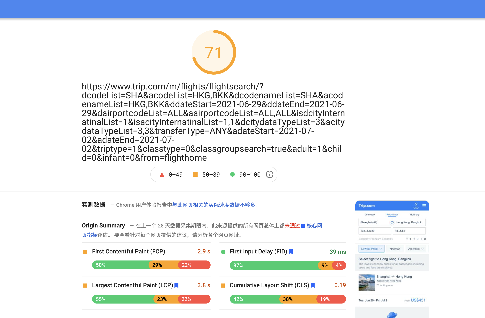

类似功能的页面，但使用了 CSR 客户端渲染的页面，分数都不太理想（这也是这次技改立项的原因）。究其原因，还是因为 SSR 在首屏展示的时候已经是渲染好了的，直接就是一堆 HTML，浏览器解析起来没有啥压力。这对于 SEO 有很大好处。

相比于 CSR 把渲染的压力给了客户端，SSR 多少也占用了服务器的资源，所以对于不同的项目，充分利用好两者的优势，将效益最大化。

### 使用动态 polyfill

动态 polyfill 的解决初衷是为了减少不必要的特性补丁资源，我们知道，使用 Babel 的一大好处就是可以将最新的 ES6+ API 无缝转换成全平台受用的代码，比如旧的浏览器不支持 Map、Set 等 API。但这就带来一个问题，最新版本的浏览器其实不太需要这个补丁，因为它本身就支持新的特性，但我们的项目构建都是同一份，这就带来性能的浪费。

动态 polyfill 的原理是根据请求判断浏览器的版本，然后出不同的 polyfill 资源，新的浏览器少一些，旧的浏览器肯定要多一些，项目中的代码就无须打补丁这一步，全部交给动态 polyfill。

我们项目中之所以没有这么搞，是因为公司团队提供的 polyfill 还有一些问题，出于稳定考量，就先不趟坑了。

### 提供 es module 版本部署

上述的动态 polyfill 是一个思路，另一种是更激进的方案，直接在有条件的浏览器上部署 ES6+ 的代码，这比转换成 ES5+ 代码能减少大量资源。

最新的 Chrome 浏览器已经支持 `<script type="module">`，但具体实践上我还没想过怎么操作，因为我们所有的静态资源都在 CDN 上，如果按这个思路的话，我们需要针对不同层次的浏览器构建多份资源，再去.....想想就觉得有点刺激，未来值得研究一下。

## 总结

前端性能优化一直是一个不断精进的课题，它随着项目的迭代以及结构、技术的升级，有着不同的实践关键点。有很多理论在前端领域中不断地被提出，但只有把理论落地实际，结合具体场景做具体的实践，才能真正深入理解其中的原理。

另一方面，技术和标准也在不断地进化，比如最新发布的 Lighthouse V8 版本就将 CLS 比重从 V6/V7 的 5% 升到了 15%：

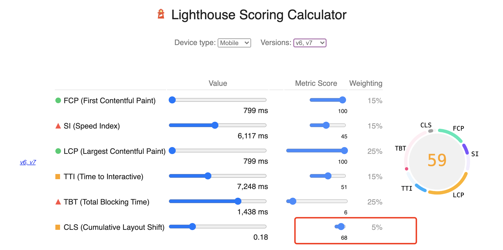

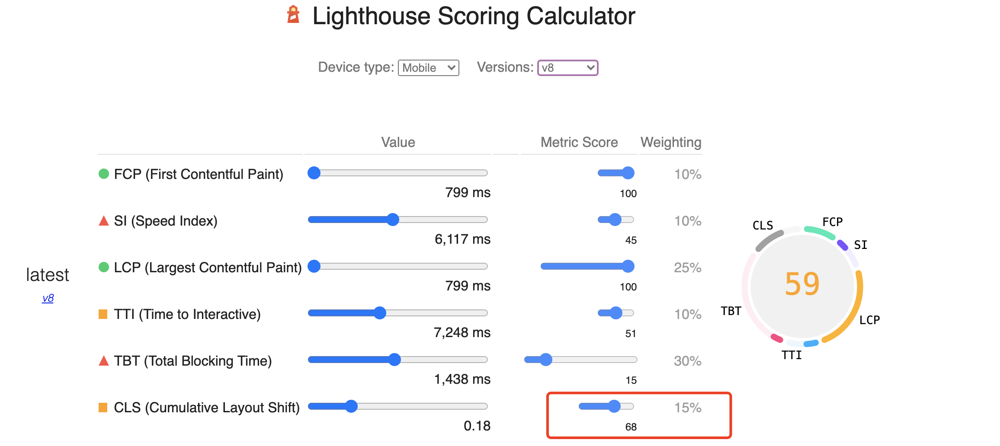

那么实践的侧重点也要随着标准的发展而做出调整，结合具体的场景业务，调整不同的模块。这样才能高效地做好性能优化这一重点课题。

## 参考

+ [Are long JavaScript tasks delaying your Time to Interactive?](https://web.dev/long-tasks-devtools/#what-is-causing-my-long-tasks)

+ [First Contentful Paint (FCP)](https://web.dev/fcp/)
+ [Largest Contentful Paint (LCP)](https://web.dev/lcp/)
+ [First Input Delay (FID)](https://web.dev/fid/)
+ [Time to Interactive (TTI)](https://web.dev/tti/)
+ [Total Blocking Time (TBT)](https://web.dev/tbt/)
+ [Cumulative Layout Shift (CLS)](https://web.dev/cls/)
