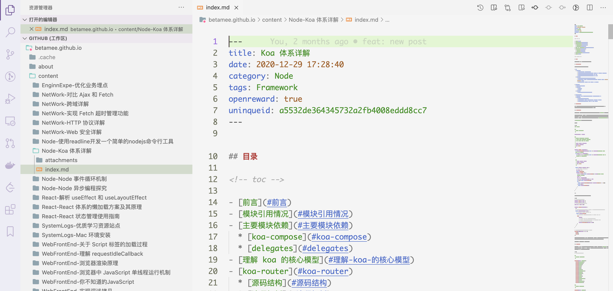

## 目录

<!-- toc -->

- [前言](#前言)
- [使用异步并发器](#使用异步并发器)
- [使用异步迭代器](#使用异步迭代器)
- [参考](#参考)

<!-- tocstop -->

## 前言

在更新博客源码的过程中，需要迁移原来的文章，给每一个文章的 metainfo 加上 uniqueid。



这就遇到一个问题，我要处理整个 content 目录下的文件，每一个文件要经历*读取文件 -> 更新文件内容 -> 写入原来文件*的过程，这是一个异步的过程。由此引申出的问题：**如何优雅地处理 N 多个异步任务**？

在前端开发者的认识里，有多个异步任务，要么一个个处理，那样效率就会很低，并且异步操作很容易写出回调嵌套函数这样难以理解的代码，要么使用类似 Promise.all 的方法，并发请求，但这样的话短时间内性能消耗很大，得不偿失。

这里提供两种思路：一是**使用异步并发器**，另一个是**使用异步迭代器**。

## 使用异步并发器

方案思路：

既然不能将所有异步任务一起并发，那么可以拆分异步任务，用排队摇号的思路，设立一个最大异步并发数,每处理完一个补一个，直到都完成。有点类似于 Promise.all 的加强版。这样既不多消耗性能，也能保证效率。

这个就是 ConcurrencyPromisePool 代码的思路。

```js
// utils/ConcurrencyPromisePool.js
class ConcurrencyPromisePool {
    constructor(limit) {
        // 限制
        this.limit = limit;
        // 正在执行的请求数
        this.runningNum = 0;
        // 队列
        this.queue = [];
        // 最终结果
        this.results = [];
    }

    all(promises = []) {
        return new Promise((resolve, reject) => {
            for (const promise of promises) {
                this._run(promise, resolve, reject);
            }
        });
    }

    _run(promise, resolve, reject) {
        // 如果请求数大于限制数，就加入 quene 队列
        if (this.runningNum >= this.limit) {
            console.log(">>> 达到上限，入队！");
            this.queue.push(promise);
            return;
        }
        // 自加
        ++this.runningNum;
        promise()
            .then(res => {
                this.results.push(res);
                --this.runningNum;
                // 当队列为 0 并且执行的任务也为 0 时，说明都完成了
                if (this.queue.length === 0 && this.runningNum === 0) {
                    return resolve(this.results);
                }
                // 当队列中还有新的任务，则递归继续 _run
                if (this.queue.length) {
                    this._run(this.queue.shift(), resolve, reject);
                }
            })
            .catch(reject);
    }
}

module.exports = ConcurrencyPromisePool;
```

```js
// 使用
async function MigrateBlogWithConcurrencyPromisePool() {
    try {
        // 异步控制并发器，最多六个
        const pool  = new ConcurrencyPromisePool(6);
        // 读取所有文件夹
        const dirs = await fsPromise.readdir(pathname)
        // 读取所有文件路径
        const files = dirs
            .filter(dir => dir !== '.DS_Store')
            .map(dir => path.resolve(__dirname, `../content/${dir}/index.md`));
        // 生成异步操作的 promise
        const filePromises = files.map(fileName => asyncHandleFileMigration(fileName));
        // 开始处理
        await pool.all(filePromises);
        console.log('done!')
    } catch(e) {
        console.log(e)
    }
}

MigrateBlogWithConcurrencyPromisePool()
```

不过这个方案也有缺点，使用 ConcurrencyPromisePool 必须是等到所有的值都处理完才会返回最终 result 数组，无法迭代一个处理一个。要想像同步代码那样迭代处理，可以使用下面的方案：异步迭代器。

## 使用异步迭代器

使用异步迭代的思路，把 filePromises 当作要迭代处理的对象，用 for..wait..of 循环处理，优点在于语义非常直观，而且能在每一次迭代中得知异步结果，并且 AsyncIterator 设置了并发数，可以在一次迭代中并发消费多个 promise 对象，提高效率。

```js
// utils/AsyncIterator.js
class AsyncIterator {
    constructor(promiseList = [], concurrencyCount = 1) {
        if (!promiseList.length) {
            throw new Error('not a list');
        }
        // 要迭代的异步对象
        this._iterableList = promiseList;
        // 支持并发处理
        this._concurrencyCount = concurrencyCount;
    }
    _splitIterableList() {
        const result = [];
        let taskList = []
        for (const iterable of this._iterableList) {
            // 当 taskList 小于限制数时，直接添加
            if (taskList.length < this._concurrencyCount) {
                taskList.push(iterable);
            }
            // 当 taskList 等于限制数时，整个 taskList 添加到 result 中，并将 taskList 置为空
            if (taskList.length === this._concurrencyCount) {
                result.push(taskList);
                taskList = [];
            }
        }
        return result;
    }
    async *[Symbol.asyncIterator] () {
        const splitedIterableList = this._splitIterableList();
        for (let taskList of splitedIterableList) {
            yield await Promise.all(taskList)
        }
    }
}

module.exports = AsyncIterator;
```

```js
// 使用
async function MigrateBlogWithAsyncIterator() {
    try {
        // 读取所有文件夹
        const dirs = await fsPromise.readdir(pathname)
        // 读取所有文件路径
        const files = dirs
            .filter(dir => dir !== '.DS_Store')
            .map(dir => path.resolve(__dirname, `../content/${dir}/index.md`));
        // 生成异步操作的 promise
        const filePromises = files.map(fileName => asyncHandleFileMigration(fileName));
        // 生成异步可迭代对象
        const filePromisesIterables  = new AsyncIterator(filePromises, 2);
        // 异步迭代
        for await (const fileResult of filePromisesIterables) {
            console.log(fileResult)
        }
        console.log('done')
    } catch(e) {
        console.log(e)
    }
}

MigrateBlogWithAsyncIterator()
```

这个方案也有缺点，目前没有支持 Symbol.asyncIterator 异步迭代器的原生对象，需要手动部署。上面使用的是异步生成器（Async Generator）来简化异步迭代器的写法。

## 参考

+ [文中的源码](https://github.com/BetaMee/betamee.github.io/blob/source-code/scripts/migrateblogid.ts)
+ [JavaScript 异步迭代器和异步生成器](https://betamee.github.io/content/webfrontend-fbc322d41e5d59a99f238ab8d164c91a)
+ [JavaScript 生成器](https://betamee.github.io/content/webfrontend-90f567f116cc51adb5ed23e6583edbd6)
+ [JavaScript 迭代器](https://betamee.github.io/content/webfrontend-48c963a56c1a5933b11cddc0a777a3c8)
