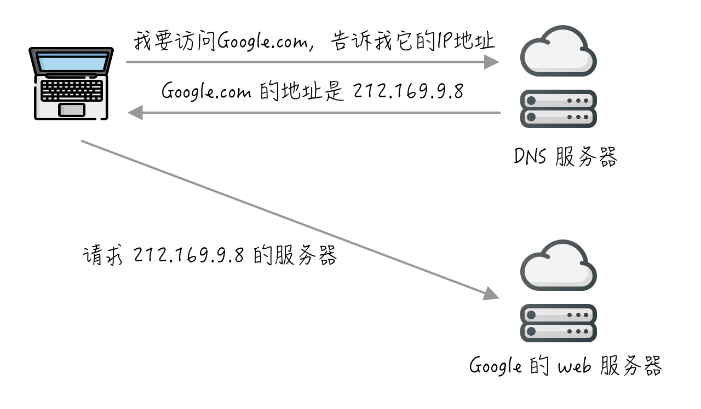
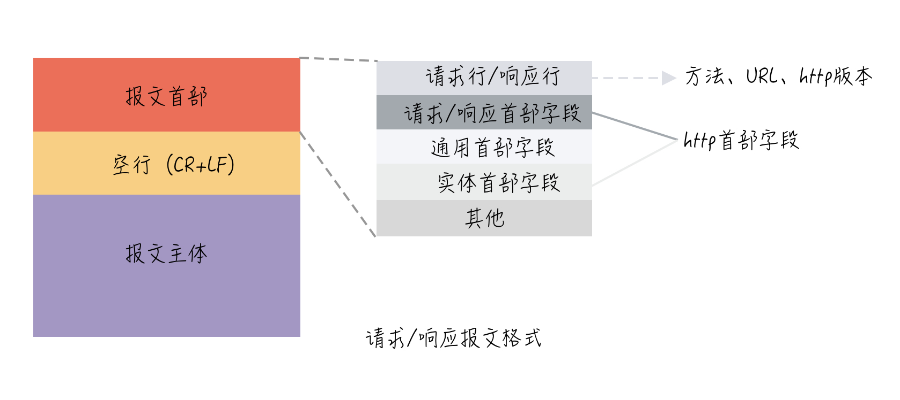
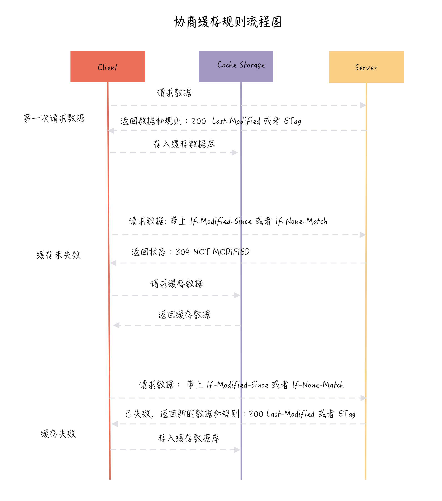
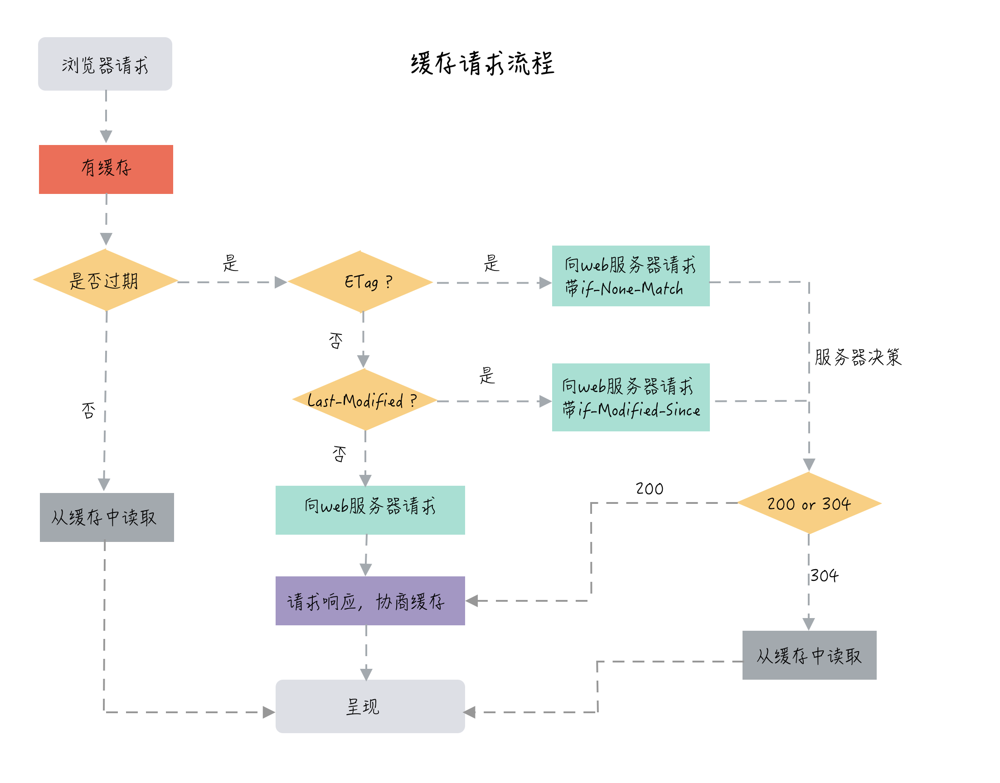
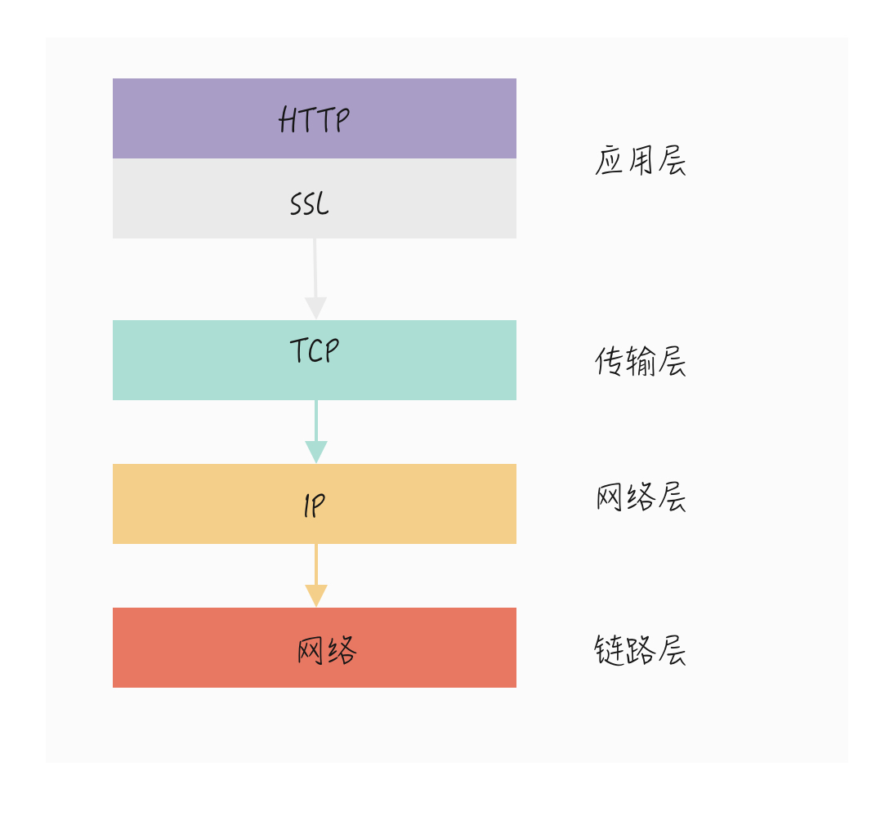
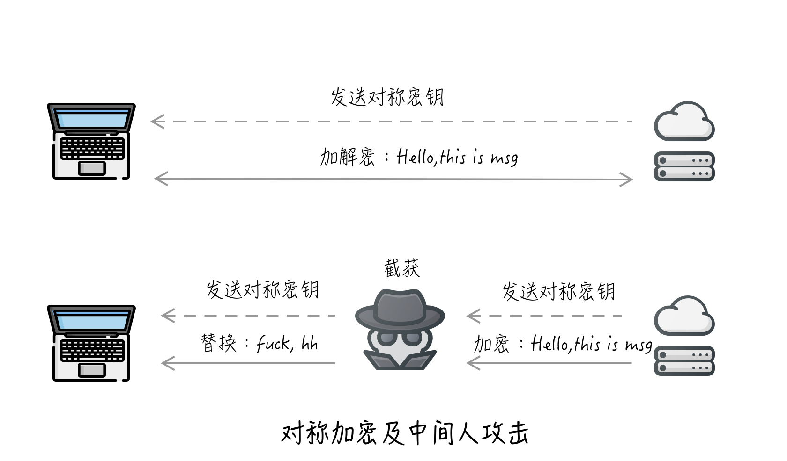
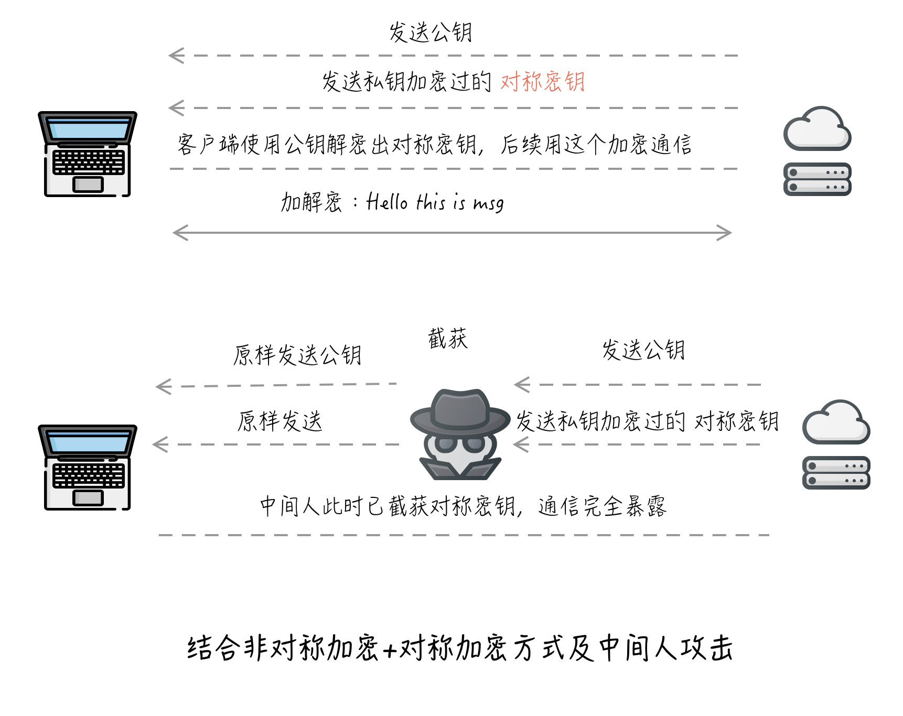
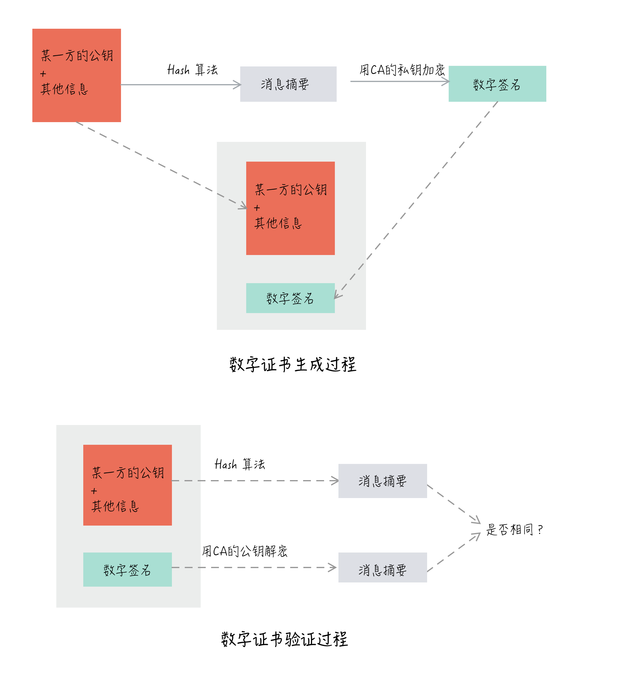
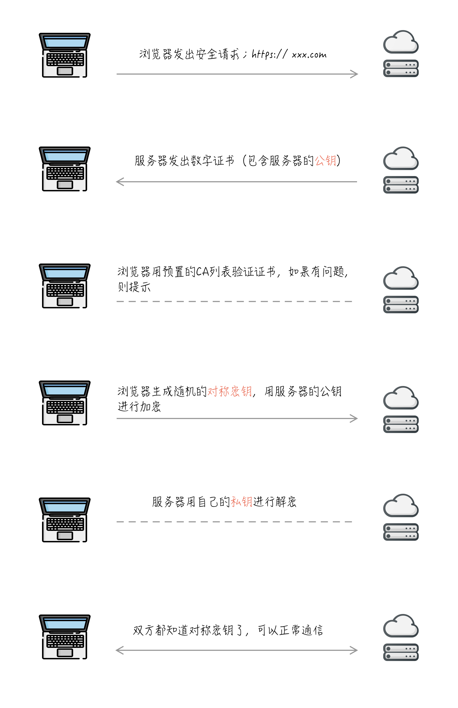
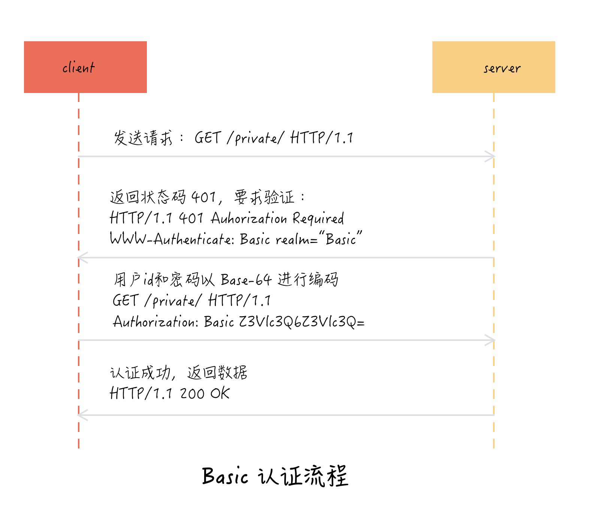

## 目录

<!-- toc -->

- [引言](#引言)
- [协议在网络中的位置](#协议在网络中的位置)
  * [TCP/IP 协议分层](#TCPIP-协议分层)
  * [TCP 三次握手](#TCP-三次握手)
  * [DNS 服务](#DNS-服务)
- [协议的发展历程](#协议的发展历程)
  * [各版本的出现时间](#各版本的出现时间)
  * [HTTP/0.9 版本](#HTTP09-版本)
  * [HTTP/1.0 版本](#HTTP10-版本)
  * [总结](#总结)
- [HTTP 1.1](#HTTP-11)
  * [改进](#改进)
  * [常用首部](#常用首部)
  * [常用状态码](#常用状态码)
  * [会话](#会话)
  * [缓存](#缓存)
      + [强制缓存](#强制缓存)
      + [协商缓存](#协商缓存)
      + [缓存总结](#缓存总结)
  * [安全](#安全)
      + [HTTPS 和 HTTP 的区别](#HTTPS-和-HTTP-的区别)
      + [HTTPS 原理](#HTTPS-原理)
  * [认证](#认证)
      + [Basic 认证](#Basic-认证)
      + [Digest 认证](#Digest-认证)
      + [SSL 客户端认证](#SSL-客户端认证)
      + [表单认证](#表单认证)
  * [同源限制](#同源限制)
- [HTTP/2](#HTTP2)
- [参考](#参考)

<!-- tocstop -->

## 引言

什么是 HTTP 协议？

在 MDN 上是这么定义的：

> 超文本传输协议（HTTP）是用于传输诸如 HTML 的超媒体文档的**应用层协议**。它被设计用于 Web 浏览器和Web服务器之间的通信，但它也可以用于其他目的。 HTTP遵循经典的**客户端-服务端**模型，客户端打开一个连接以发出请求，然后等待它收到服务器端响应。 HTTP 是无状态协议，意味着服务器不会在两个请求之间保留任何数据（状态）。该协议虽然通常基于 **TCP / IP** 层，但可以在任何可靠的传输层上使用；也就是说，一个不会像 UDP 协议那样静默丢失消息的协议。RUDP 作为 UDP 的可靠的升级版本，是一种合适的替代选择。

简单来说，HTTP 是被设计用于 Web 通信的一项协议，是 Web 的基石之一，也是学习网站开发必须深入理解的一门技术。

本文将整理总结 HTTP 协议的一些细节，以供学习之用。

## 协议在网络中的位置

HTTP 协议是构建在 TCP/IP 协议之上的，是 TCP/IP 协议的一个子集，所以要理解 HTTP 协议，有必要先了解下 TCP/IP 协议相关的知识。这章简略梳理下关于 TCP/IP 协议族的知识。

### TCP/IP 协议分层

TCP/IP协议族是由一个四层协议组成的系统，这四层分别为：应用层、传输层、网络层和数据链路层。


分层的好处是把各个相对独立的功能解耦，层与层之间通过规定好的接口来通信。如果以后需要修改或者重写某一层的实现，只需要改动对应的那一层而不影响到其他层。这里简单介绍一下各个层的作用：

1. **应用层：**
应用层一般是我们编写的应用程序，其决定了向用户提供的应用服务。应用层可以通过系统调用与传输层进行通信。
处于应用层的协议非常多，比如：FTP（文件传输协议）、DNS（域名系统）和HTTP（超文本传输协议）等。

2. **传输层：**
传输层通过系统调用向应用层提供处于网络连接中的两台计算机之间的数据传输功能。
在传输层有两个性质不同的协议：TCP（传输控制协议）和UDP（用户数据报协议）。

3. **网络层：**
网络层用来处理在网络上流动的数据包，数据包是网络传输的最小数据单位。该层规定了通过怎样的路径（传输路线）到达对方计算机，并把数据包传输给对方。

4. **链路层：**
链路层用来处理连接网络的硬件部分，包括控制操作系统、硬件设备驱动、NIC（网络适配器）以及光纤等物理可见部分。硬件上的范畴均在链路层的作用范围之内。

### TCP 三次握手

从上面的介绍可知，传输层协议主要有两个：TCP 协议和 UDP 协议。TCP 协议相对于 UDP 协议的特点是：**TCP 协议提供面向连接、字节流和可靠的传输。**

使用 TCP 协议进行通信的双方必须先建立连接，然后才能开始传输数据。TCP 连接是**全双工**的，也就是说双方的数据读写可以通过一个连接进行。为了确保连接双方可靠性，在双方建立连接时，TCP 协议采用了三次握手（Three-way handshaking）策略：


当三次握手完成后，TCP 协议会为连接双方维持连接状态。为了保证数据传输成功，接收端在接收到数据包后必须发送 ACK 报文作为确认。如果在指定的时间内（这个时间称为重新发送超时时间），发送端没有接收到接收端的 ACK 报文，那么就会重发超时的数据。

### DNS 服务

前面介绍了与HTTP协议有着密切关系的TCP/IP协议，接下来介绍的DNS服务也是与HTTP协议有着密不可分的关系。

通常我们访问一个网站，使用的是主机名或者域名（如 www.test.com）来访问，但 TCP/IP 协议使用的是 IP 地址，这是一组纯数字（如 192.176.2.1），所以必须要有一个机制来将域名转换成 IP 地址：



DNS 服务是通过 DNS 协议进行通信的，而 DNS 协议跟 HTTP 协议一样也是应用层协议。由于我们的重点是 HTTP 协议，所以这里不打算对 DNS 协议进行详细的分析，只需要知道可以通过 DNS 服务把域名解析成 IP 地址即可。

## 协议的发展历程

### 各版本的出现时间

* 1991年：HTTP/0.9
* 1996年5月：HTTP/1.0
* 1997年1月： HTTP/1.1
* 2005年： HTTP/2

现在最流行的是 HTTP/1.1，而新版本 HTTP/2 的推出是未来必定会流行开来的技术趋势，并且标准委员会对 HTTP 不再划分子版本，也就是以后的更新版本是 HTTP/3、HTTP/4...

### HTTP/0.9 版本

最早 0.9 版本的 HTTP 及其简单，只有一个 GET 命令：

```sh
GET / index.html
```

上述命令表示 TCP 连接建立后，客户端向服务端请求网页 `index.html`。

协议规定，服务器只能回应 **HTML 格式**的字符串，不能回应别的格式：

```html
<html>
  <body>Hello World</body>
</html>
```

服务器发送完毕，就关闭连接。

### HTTP/1.0 版本

1.0 版本的出现极大丰富了 HTTP 的内容（见[RFC1945](https://tools.ietf.org/html/rfc1945)），不仅可以传输文字，还能传输图像、视频、二进制文件。这为互联网的大发展奠定了基础。

还增加了新的命令：POST 命令和 HEAD 命令，丰富了和服务端交互的手段。

再次，HTTP请求和回应的格式也变了。除了数据部分，每次通信都必须包括头信息（HTTP header），用来描述一些元数据。

其他的新增功能还包括状态码（status code）、多字符集支持、多部分发送（multi-part type）、权限（authorization）、缓存（cache）、内容编码（content encoding）等。

一个典型的 HTTP 1.0 请求和响应的例子：

```sh
// 请求
GET / HTTP/1.0
User-Agent: Mozilla/5.0 (Macintosh; Intel Mac OS X 10_10_5)
Accept: */*

// 响应
HTTP/1.0 200 OK
Content-Type: text/plain
Content-Length: 137582
Expires: Thu, 05 Dec 1997 16:00:00 GMT
Last-Modified: Wed, 5 August 1996 15:55:28 GMT
Server: Apache 0.84

<html>
  <body>Hello World</body>
</html>
```

可以看到，这个格式与0.9版有很大变化。

第一行是请求命令，必须在尾部添加协议版本（HTTP/1.0）。后面就是多行头信息，描述客户端的情况。

回应的格式是"头信息 + 一个空行（`\r\n`） + 数据"。其中，第一行是"协议版本 + 状态码（status code） + 状态描述"。

在字符的编码上，1.0版规定，头信息必须是 ASCII 码，后面的数据可以是任何格式。因此，服务器回应的时候，必须告诉客户端，数据是什么格式，这个是在 Content-Type 字段中进行定义的，如 `Content-Type: text/plain`。

HTTP 1.0 的缺点主要在于，每个 TCP 连接只能发送一个请求。发送数据完毕后，连接就关闭了，如果还要请求新的资源，就必须新开一个连接。

为了解决这个问题，有些浏览器在请求的时候，使用了非标准的 `Connection` 字段：

```sh
Connection: keep-alive
```

这个字段要求服务器不要关闭TCP连接，以便其他请求复用。服务器同样也要回应这个字段。

一个可以复用的TCP连接就建立了，直到客户端或服务器主动关闭连接。但是，这不是标准字段，不同实现的行为可能不一致，因此不是根本的解决办法。

### 总结

HTTP 0.9 特点：

+ 只能返回 HTML 格式的字符串
+ 只有一个 GET 命令
+ TCP 连接不能复用

HTTP 1.0 特点：

+ 协议版本信息现在会随着每个请求发送（HTTP/1.0被追加到了GET行）
+ 传输的数据格式更丰富了（Content-Type）
+ 增加了更多的命令操作（POST）
+ 引入了 HTTP 头的概念，无论是对于请求还是响应，允许传输元数据，使协议变得非常灵活，更具扩展性
+ TCP 连接依旧不能复用，使用非标准的 Connection 字段

## HTTP 1.1

### 改进

重点来讨论下 HTTP/1.1 的细节，因为这是当下最流行的版本，只要涉及到网站开发，就需要对这个有所理解。

HTTP/1.1 只比 1.0 晚发布了几个月，消除了很多 1.0 在实际应用中的混乱地方，做出了多项改进：

+ 引入**持久连接**，即 TCP 连接默认不关闭，可以被多个请求复用，不用声明 `Connection: keep-alive`
+ 引入**管道机制**，允许在第一个应答被完全发送之前就发送第二个请求，以降低通信延迟
+ 引入**分块传输编码机制**，支持响应分块，产生一块数据，就发送一块，采用"流模式"（stream）取代"缓存模式"（buffer）
+ 引入额外的**缓存控制机制**
+ 引入**内容协商机制**，包括语言，编码，类型等，并允许客户端和服务器之间约定以最合适的内容进行交换
+ 新增 `PUT`、`PATCH`、`HEAD`、`OPTION`、`DELETE` 方法
+ 引入 Host 头，能够使不同域名配置在同一个IP地址的服务器上

当然，HTTP/1.1 不是完美的，也有缺点：同一个 TCP 连接里面，所有的数据通信按次序进行，有可能造成“**队头堵塞（Head-of-line blocking）**”

为了避免这个问题，只有两种方法：减少请求数、开更多的持久连接。社区为此总结出了很多网页优化技巧，如：

+ 合并脚本和样式表
+ 将图片嵌入 css 代码
+ 域名分片（domain sharding）
+ 将多张图片合并的雪碧图

这些额外的工作相信会随着 HTTP 的完善而逐步被淘汰。

这里提一点，通常情况下 HTTP/1.1 的响应消息的数据是整块发送的，Content-Length 消息头字段表示数据的长度。使用 Content-Length 字段的前提条件是，服务器发送回应之前，必须知道回应的数据长度。但有些很耗时的场景下，等待所有数据准备好再发送显然效率不高，这种情况下使用**分块传输编码机制**更好。

使用**分块传输编码机制**，将数据分解成块，并以一个或者多个块发送，这种情况下可以不使用 Content-Length 字段。

每个非空的数据块之前，会有一个16进制的数值，表示这个块的长度。最后是一个大小为0的块，就表示本次回应的数据发送完了。下面是一个例子：

```sh
HTTP/1.1 200 OK
Content-Type: text/plain
Transfer-Encoding: chunked

25
This is the data in the first chunk

1C
and this is the second one

3
con

8
sequence

0
```

最终的 HTTP1.1 的报文格式如图 4.1 所示：



### 常用首部

HTTP 首部字段分为**通用首部字段**、**请求首部字段**、**响应首部字段**、**实体首部字段**这四种。

+ 通用首部字段：请求报文和响应报文都会使用到的首部
+ 请求首部字段：从客户端向服务器端发送请求报文时使用的首部
+ 响应首部字段：从服务器端向客户端返回响应报文时使用的首部
+ 实体首部字段：针对**请求报文**和**响应报文**的**实体部分**使用的首部，用于补充内容的更新时间等与实体相关的内容

| 字段名称                       | 解释                                                                 |
| ------------------------------ | -------------------------------------------------------------------- |
| **通用首部**                   |                                                                      |
| Cache-Control                  | 控制缓存                                                             |
| Connection                     | 决定当前的事务完成后，是否会关闭网络连接，一般是 close 和 keep-alive |
| Date                           | 表示报文创建的时间                                                   |
| Pragma                         | http1.0 的遗留物，用于控制缓存                                       |
| **请求首部**                   |                                                                      |
| User-Agent                     | 用户请求的浏览器类型、操作系统等信息                                 |
| Host                           | 指明了服务器的域名，**域名 + 端口号**，如 www.baidu.com              |
| Origin                         | 指明请求从哪里发起的，**协议 + 域名**,如 http://www.baidu.com        |
| Referer                        | 告诉服务器是从哪个连接去访问的，**协议+域名+查询参数**               |
| Accept                         | type/subtype 能接受（返回）哪些类型                                  |
| Accept-Charset                 | 用来告知（服务器）客户端可以处理的字符集类型                         |
| Accept-Encoding                | 能接受的编码压缩类型如：gzip                                         |
| Authorization                  | Web认证信息                                                          |
| If-Match                       | 比较 ETag 是否一致                                                   |
| If-None-Match                  | 比较 ETag 是否不一致                                                 |
| If-Modified-Since              | 比较资源最后更新的时间是否一致                                       |
| If-Unmodified-Since            | 比较资源最后更新的时间是否不一致                                     |
| Access-Control-Request-Method  | 将实际请求所使用的 HTTP 方法告诉服务器                               |
| Access-Control-Request-Headers | 将实际请求所携带的首部字段告诉服务器                                 |
| **响应首部**                   |                                                                      |
| Accept-Ranges                  | 是否接受字节范围请求                                                 |
| Age                            | 推算资源创建经过时间                                                 |
| ETag                           | 资源的匹配信息                                                       |
| Location                       | 令客户端重定向至指定URI                                              |
| Proxy-Authenticate             | 代理服务器对客户端的认证信息                                         |
| Retry-After                    | 对再次发起请求的时机要求                                             |
| Server                         | 包含了处理请求的源头服务器所用到的软件相关信息                       |
| Vary                           | 代理服务器的缓存信息                                                 |
| Access-Control-Allow-Origin    | 所允许的访问的跨源域名                                               |
| Access-Control-Expose-Headers  | 让服务器把允许浏览器访问的头放入白名单                               |
| Access-Control-Allow-Methods   | 其指明了实际请求所允许使用的 HTTP 方法                               |
| Access-Control-Allow-Headers   | 其指明了实际请求中允许携带的首部字段                                 |
| **实体首部**                   |                                                                      |
| Allow                          | 资源可支持的HTTP方法                                                 |
| Transfer-Encoding              | 决定服务器发送给客户端的数据是分块的，对应分块传输编码机制           |
| Content-Encoding               | 实体主体适用的编码方式                                               |
| Content-Language               | 实体主体的自然语言                                                   |
| Content-Length                 | 实体主体的大小（单位：字节）                                         |
| Content-Location               | 替代对应资源的URI                                                    |
| Content-MD5                    | 实体主体的报文摘要                                                   |
| Content-Range                  | 实体主体的位置范围                                                   |
| Content-Type                   | 实体主体的媒体类型                                                   |
| Expires                        | http1.0 的遗留物，实体主体过期时间                                   |
| Last-Modified                  | 资源的最后一次修改的时间                                             |

### 常用状态码

| 类型       | 状态码                | 说明                                                                                                                           |
| ---------- | --------------------- | ------------------------------------------------------------------------------------------------------------------------------ |
| 信息型响应 |                       |                                                                                                                                |
| 100        | Continue              | 客户端应继续其请求                                                                                                             |
| 成功响应   |                       |                                                                                                                                |
| 200        | OK                    | 请求成功                                                                                                                       |
| 202        | Accepted              | 已接受。已经接受请求，但未处理完成                                                                                             |
| 204        | No Content            | 无内容。服务器成功处理，但未返回内容                                                                                           |
| 重定向     |                       |                                                                                                                                |
| 301        | Moved Permanently     | 永久移动。请求的资源已被永久的移动到新URI，返回信息会包括新的URI，浏览器会自动定向到新URI。今后任何新的请求都应使用新的URI代替 |
| 302        | Found                 | 临时移动。与301类似。但资源只是临时被移动。客户端应继续使用原有URI                                                             |
| 客户端错误 |                       |                                                                                                                                |
| 400        | Bad Request           | 客户端请求的语法错误，服务器无法理解                                                                                           |
| 403        | Forbidden             | 服务器理解请求客户端的请求，但是拒绝执行此请求                                                                                 |
| 404        | Not Found             | 服务器找不到资源                                                                                                               |
| 服务端错误 |                       |                                                                                                                                |
| 500        | Internal Server Error | 服务器内部错误，无法完成请求                                                                                                   |
| 502        | Bad Gateway           | 为网关或者代理工作的服务器尝试执行请求时，从远程服务器接收到了一个无效的响应                                                   |
| 504        | Gateway Time-out      | 充当网关或代理的服务器，未及时从远端服务器获取请求                                                                             |

### 会话

HTTP 协议设计之初就是**无状态**的，也就是只管传递消息，至于服务器要记录客户端的状态，就需要用另外的机制来实现。

当下流行的会话实现机制主要有：

+ Cookie
+ Session
+ JWT
+ Url 重写
+ 隐藏表单字段

这里简单讲解一下 Cookie 和 Seesion。

HTTP Cookie（也叫 Web Cookie 或浏览器 Cookie ）是服务器发送到用户浏览器并保存在本地的一小块数据，它会在浏览器下次向同一服务器再发起请求时被携带并发送到服务器上。

在 HTTP 的初次响应头中使用 `Set-Cookie` 字段来将需要存储的数据存在客户端，下一次的请求自动就会带上，服务器就会知道是哪个用户发送的。

但 Cookie 也会有不少问题：

+ Cookie 是基于浏览器本地存储数据的，不同设备之间不通用。
+ Cookie 大小限制为 4kB，跟不上时代的发展
+ Cookie 有被篡改的风险
+ Cookie 的同源策略只需要一级域名相同（比如 www.qq.com 的一级域名是 qq.com）即可，不像 ajax 需要完全同源

而 Seesion 是一种将数据保存在服务端的机制，是基于 Cookie的一种方案，相比 Cookie 更安全。Session 可以存在服务器内存中、文件中、甚至数据库中。

它的工作流程是这样的：

1. 客户端第一次访问服务端，服务端生成一个随机数，称之为 session_id，并放在响应头里，以 Cookie 的形式返回给客户端，客户端把它当作正常的 Cookie 来处理，如：`cookie：sessionID=135165432165`
2. 服务端将需要保存的数据存在对应 session_id 的名下，放在内存或者数据库中
3. 客户端再次访问服务端的时候，会带上上次获取的值为 session_id 的 Cookie，服务端通过这个值寻找匹配的数据。

如果客户端的 Cookie 被禁用的话，可以使用**URL重写、隐藏表单字段**技术实现相同的功能。

总结一下两者区别：
+ session 在服务器端，cookie 在客户端。
+ session 用户无法查看和修改，cookie 用户可以查看修改。
+ session 和 cookie 的存储容量不同。
+ session 的实现依赖于 sessionID，而 sessionID 又存储在 cookie 上，所以，可以这么说：session 是基于 cookie 实现的一种数据存储方式。

### 缓存

通过网络获取内容是一个缓慢而且成本很高的操作，特别是对重型接口和大的应用来说，所以缓存和重用原有的资源，是性能优化的一个重要手段。

这里先列出跟缓存有关的字段：

| 字段名称 | 说明 |
| --- | --- |
| **通用首部字段** |
| Cache-Control | 控制缓存的行为 |
| Pragma | http1.0 的遗留物 |
| **请求首部字段** |
| If-Match | 比较 ETag 是否一致 |
| If-None-Match | 比较 ETag 是否不一致 |
| If-Modified-Since | 比较资源最后更新的时间是否一致 |
| If-Unmodified-Since | 比较资源最后更新的时间是否不一致 |
| **响应首部字段** |
| ETag | 资源的匹配信息 |
| **实体首部字段** |
| Expires | http1.0 的遗留物，实体主体过期时间 |
| Last-Modified | 资源的最后一次修改的时间 |

这里首先得理解一个**强制缓存**和**协商缓存**的概念，这两者在请求响应会有不同的表现。

#### 强制缓存

强制缓存整体流程很简单，第一次发出请求获取数据，在过期时间内不会重复请求。实现这个流程的思路就在于当前时间是否超过过期时间。

在 http1.0 和 http1.1 中会有不同的字段控制。

在 http1.0 中，通过 `Expires` 响应头来实现。`Expires` 表示资源会过期的时间，当发起请求的时间超过 `Expires` 设定的时间，会重新到服务器获取资源，如果没有过期，则直接从本地缓存数据库中获取（`from memory` 或者 `from disk`），而且 `Status` 为 `200`。

在 http1.1 中，则通过 `Cache-Control` 响应头来实现。`Cache-Control` 有多个值：

+ private: 客户端可以缓存
+ public: 客户端和代理服务器都可缓存（前端可以认为public和private是一样的）
+ no-cache: 需要使用协商缓存来验证是否过期
+ no-store: 不可缓存
+ max-age=xxx: 缓存的内容将在 xxx 秒后失效

常用的字段就是 `max-age=xxx`，表示缓存的资源将在 xxx 秒后过期。

而为了兼容，两个版本的强制缓存都会被实现，但 http1.1 的优先级比 http1.0 高，也就是 `Cache-Control` 会优先于 `Expires`。


#### 协商缓存

协商缓存与强制缓存的不同之处在于，协商缓存每次读取数据时都需要跟服务器通信，并且会增加缓存标识。第一次请求时，服务器会返回资源和缓存标识。当第二次请求识，浏览器先将**缓存标识**发送给服务器，服务器拿到后判断是否匹配，如果不匹配，则将新的数据和缓存标识返回；如果匹配的话则标识没有更新，返回`304`状态码，浏览器从本地缓存中读取资源。

在 http1.0 中。服务器通过 `Last-Modified` 来控制，浏览器第二次请求的时候带上 `If-Modified-Since` 进行比较，如果不一致则返回新的数据和标识，如果一致，则返回 `304` 状态码。

当然，这种方式有弊端，服务器中的资源有的时候发生了改动，如多加了个字符，但内容本身没有任何更新，这也会触发资源重新请求。为了解决这个问题，http1.1 新增了 `ETag` 字段。

服务端生成的 `ETag` 和浏览器请求的 `If-None-Match` 相对应，其逻辑和 `Last-Modified` 一致，并且 `ETag` 的优先级要比 `Last-Modified` 高，但一般为了兼容，两者同时实现。



#### 缓存总结

对于**强制缓存**，服务器通知浏览器一个缓存时间，在缓存时间内，下次请求，直接用缓存，不在时间内，执行比较缓存策略。

对于**协商缓存**，将缓存信息中的 `Etag` 和 `Last-Modified `通过请求发送给服务器，由服务器校验，返回304状态码时，浏览器直接使用缓存。

我们可以看到两类缓存规则的不同，**强制缓存**如果生效，不需要再和服务器发生交互，而**协商缓存**不管是否生效，都需要与服务端发生交互。

两类缓存规则可以同时存在，**强制缓存**优先级高于对比缓存，也就是说，当执行强制缓存的规则时，如果缓存生效，直接使用缓存，不再执行**协商缓存**规则。总的流程如图 4.3 所示：



### 安全

由于 http 本身是明文传输的，在安全性上有所欠缺，容易受到**中间人攻击**，被窃取收据。为了应对更加严格的网络隐私要求，添加了 SSL 层的 https 可以有效解决这个难题。

https 虽然比 http 多了个 s，但本质大不相同，要比 http 要复杂的多。



#### HTTPS 和 HTTP 的区别

HTTPS 和 HTTP 的区别在于：

+ HTTP 是明文传输，HTTPS 通过 SSL\TLS 进行了加密
+ HTTP 的端口号是 80，HTTPS 是 443
+ HTTPS 需要到 CA 申请证书，一般免费证书很少，需要交费
+ HTTPS 的连接很简单，是无状态的；HTTPS 协议是由 SSL+HTTP 协议构建的可进行加密传输、身份认证的网络协议，比 HTTP 协议安全。

#### HTTPS 原理

HTTPS 的设计绕不开**中间人攻击**这一假设，也就是如果传输的信息、密钥被中间人获取了，应该如何防范这样的风险。

先从以下几种密钥传输设计开始说起。

+ 对称加密
+ 非对称加密（RSA）
+ 非对称加密 + 对称加密
+ 数字签名的 CA 证书

第一种是**对称加密**，信息交易双方共同持有相同的密钥，将信息加密后进行传输，但这里的问题在于第一次约定加密方式和密钥的通信仍然是明文，只要中间人截获第一次通信，就可以揭秘后续所有的通信内容。



第二种是**非对称加密**，非对称加密是一对包含公钥和私钥的密钥。明文既可以用公钥加密，用私钥揭秘，也可以用私钥加密，用公钥解密。发送信息时，可以用对方传过来的公钥进行加密，只有对方的私钥才能解开，这就保证了信息传输的安全。但中间人照样也能绕开这里的限制，只要在第一次传输的时候获取对方的公钥，然后用中间人自己的公钥去替换，一出狸猫换太子照样可以欺骗信息传递双方。非对称加密还有一个问题，在于 RSA 加密速度很慢，对网络性能有很大影响。


第三种是**非对称加密 + 对称加密**的组合方式，既然 RSA 算法速度很慢，那可以不用它每次都加密信息，而是加密对称密钥。这样只需要加密一次，前期保证对称加密的密钥安全传输后，后续用对称加密密钥进行通信。当然这里的风险点和上一个一样，中间人一样可以破解。



第四种是通过 **数字签名的 CA 证书**的方式。上述所有的问题可以总结为**密钥的分发**上，即应该如何安全的保护密钥？对于这个问题，在计算机世界建立一个公证中心，将密钥等信息通过数字签名生成消息摘要，再写入数字证书发布出去。一般这种数字证书是有公正性的，嵌入操作系统/浏览器中，必须被信任（不然整个网络都玩不转了）。



以上四种是用于解决加密问题的方案，用于 HTTPS 的原理理解，整个流程就如图所示：



### 认证

在网络活动中，身份认证是非重要的一环。现有的 HTTP 认证方式主要有四种：

+ Basic 认证
+ Digest 认证
+ SSL 客户端认证
+ 表单认证

#### Basic 认证

Basic 认证是最基础的认证，在 HTTP1.0 时代就已经引入进来了。方案古老，实现简单，并且存在安全缺陷，一般很少网站有用到。

Basic 认证中最关键的三个要素：userid、password、realm。同一个 server 中，可以针对不同的 realm 设定特定的用户访问。

其流程：

1. 客户端发起GET请求
2. 服务器响应401 Unauthorized，WWW-Authenticate 指定认证算法，realm 指定安全域
3. 客户端重新发起请求，Authorization 指定用户名和密码信息
4. 服务器认证成功，响应 200

具体步骤见图所示：



#### Digest 认证

Digest 认证和 Basic 认证的流程基本相似，但相比 Basic 认证会把密码采用 Base-64 编码传输（非常容易截获破解）,Digest 认证不以明文发送，而是发送响应摘要及质询码的计算结果，相比之下更安全了。


#### SSL 客户端认证

SSL 客户端认证是借由 HTTPS 的客户端证书完成认证的方式。凭借客户端证书，服务器可确认访问是否来自已登陆的客户端。

这里的概念和上一节提到的 HTTPS 基本原理一致的。这里提一点 SSL 单项认证和 SSL 双向认证的区别：

+ 双向认证则是需要服务端与客户端提供身份认证，只能是服务端允许的客户能去访问，安全性相对于要高一些。
+ SSL单向认证只要求站点部署了ssl证书就行，任何用户都可以去访问(IP被限制除外等)，只是服务端提供了身份认证。

一般Web应用都是采用SSL单向认证的，原因很简单，用户数目广泛，且无需在通讯层对用户身份进行验证，一般都在应用逻辑层来保证用户的合法登入。但如果是企业应用对接，情况就不一样，可能会要求对客户端（比如一些员工系统，必须本地安装证书）做身份验证，这时就需要做SSL双向认证。

后续可以深入了解。

#### 表单认证

基于表单的认证方法并不是在 HTTP 协议中定义的。简单来说，这个就是我们常见的用户登陆页面，第一次输入用户密码，后续通过 cookie 或者 session 保持登陆状态。

### 同源限制

同源策略最早是在 1995 年由 Netscape 公司引入浏览器，现在浏览器都执行这个策略。

所谓的同源是指：

+ 协议相同
+ 域名相同
+ 端口相同

同源的目的是为了保护用户信息安全，防止恶意的网站窃取数据。如果非同源，共有三种行为受到限制：

+ Cookie、LocalStorage 和 IndexDB 无法读取
+ DOM 无法获得
+ AJAX 请求不能发送

虽然这些限制是必要的，但有些场景需要跨域处理，主要有以下几种：

+ 共享 Cookie：浏览器通过设置相同的 `document.domain`
+ 共享 iframe：片段识别符、window.name、跨文档通信 API
+ AJAX 跨域通信：JSONP、WebSocket、CORS

## HTTP/2

2009 年，谷歌公开了自行研制的 SPDY 协议，主要解决 HTTP1.1 效率不够高的问题。后续这个的协议发展为 HTTP/2 的基础，一直到 2015 年 HTTP/2 的发布，主要特性都被继承了。

特点：

+ 头信息和数据体都是二进制，并且统称为"帧"（frame）：头信息帧和数据帧。为未来的拓展提供方便。
+ 支持多工，复用 TCP 连接，避免“队头堵塞”。
+ 传输的数据流可以不按顺序，并且可以取消单个请求，而无需关闭zhengge TCP 连接。
+ 头信息压缩，提高速度
+ 服务器推送

## 参考

- [MDN_HTTP](https://developer.mozilla.org/zh-CN/docs/Web/HTTP)
- [HTTP 协议入门 - 阮一峰的网络日志](http://www.ruanyifeng.com/blog/2016/08/http.html)
- [HTTP协议详解](https://mp.weixin.qq.com/s/27zpNIGhVbx-on9FDs_6dw?)
- [HTTP缓存控制小结 - 腾讯Web前端 IMWeb 团队社区 \| blog | 团队博客](https://imweb.io/topic/5795dcb6fb312541492eda8c)
- [http缓存深入研究，200 from cache or 304 not modified？ - js源码阅读 - SegmentFault 思否](https://segmentfault.com/a/1190000008277022)
- [彻底弄懂 Http 缓存机制 - 基于缓存策略三要素分解法](https://mp.weixin.qq.com/s?__biz=MzA3NTYzODYzMg==&mid=2653578381&idx=1&sn=3f676e2b2e08bcff831c69d31cf51c51&chksm=84b3b68ab3c43f9c9f5fc826f462494dc8457d8994c3789007b7182e3d30e86876688ea1bc8f&mpshare=1&scene=1&srcid=1215muPmHY8jyQT277grjyvE#rd)
- [10分钟彻底搞懂Http的强制缓存和协商缓存 - SegmentFault 思否](https://segmentfault.com/a/1190000016199807)
- [SSL双向认证原理,SSL单向认证原理,SSL双向认证和SSL单向认证的区别-沃通WoSign SSL证书!](https://www.wosign.com/faq/faq2016-0216-01.htm)
