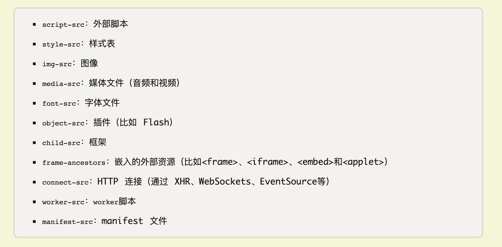
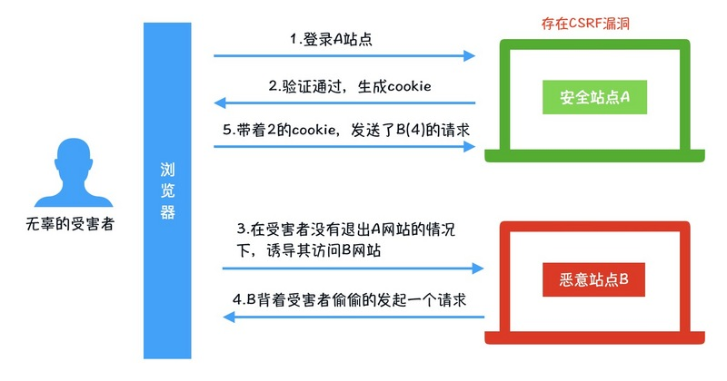
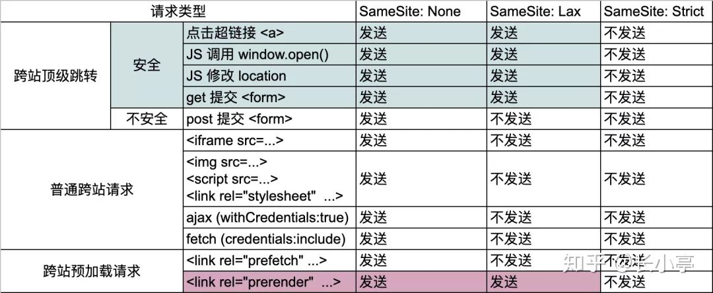
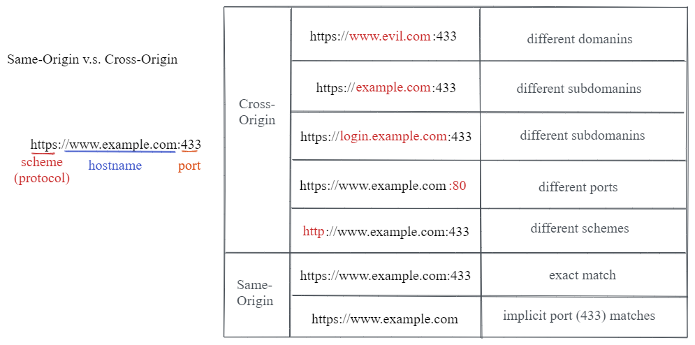
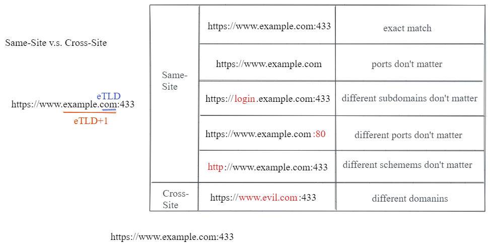
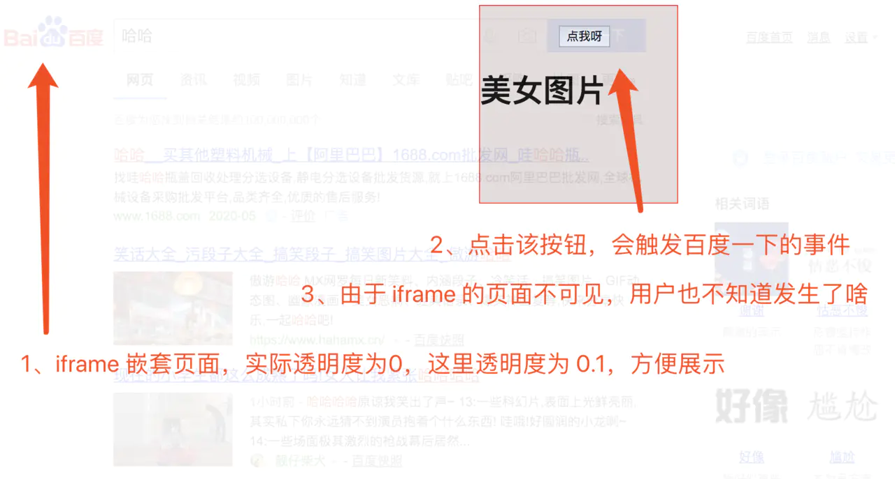

## 目录

<!-- toc -->

- [前言](#前言)
- [XSS 攻击](#XSS-攻击)
  * [反射型](#反射型)
  * [DOM 型](#DOM-型)
  * [存储型](#存储型)
  * [CSP 安全策略](#CSP-安全策略)
  * [httpOnly](#httpOnly)
- [CSRF 攻击](#CSRF-攻击)
  * [攻击流程及防范](#攻击流程及防范)
  * [跨站和跨域之区别](#跨站和跨域之区别)
- [点击劫持](#点击劫持)
- [URL 跳转漏洞](#URL-跳转漏洞)
- [SQL 注入](#SQL-注入)
- [中间人攻击](#中间人攻击)
- [接口越权问题](#接口越权问题)
- [溢出漏洞](#溢出漏洞)
- [暴力破解](#暴力破解)
- [总结](#总结)
- [参考](#参考)

<!-- tocstop -->

## 前言

作为前端工程师，Web 安全也是一个值得操心的领域，前端页面作为站点的入口，必须担起一定的防御责任，以免被恶意爆破。

对于前端工程师来说，常见的是这样的一些安全问题：

+ XSS 攻击
+ CSRF 攻击
+ 点击劫持
+ URL 跳转漏洞
+ SQL 注入
+ 中间人攻击
+ 接口越权问题
+ 溢出漏洞
+ 暴力破解

以及对于此些要做的安全措施，本文将详细整理。

## XSS 攻击

XSS (Cross-Site Scripting) 中文名为**跨站脚本攻击**，是一种**代码注入攻击**。攻击者在目标网站上注入恶意代码，当被攻击者登陆网站时就会执行这些恶意代码，这些脚本可以读取 Cookie，Session tokens，或者其它敏感的网站信息，对用户进行钓鱼欺诈，甚至发起蠕虫攻击等。

XSS 的本质是：恶意代码未经过滤，与网站正常的代码混在一起；浏览器无法分辨哪些脚本是可信的，导致恶意脚本被执行。由于直接在用户的终端执行，恶意代码能够直接获取用户的信息，利用这些信息冒充用户向网站发起攻击者定义的请求。

XSS 攻击有三种方式：反射型、存储型、DOM 型

### 反射型

反射型 XSS 可以理解为将恶意代码从服务端"反射"过来，在浏览器上执行，一般以这样的步骤发生：

+ 攻击者构造出特殊的 URL，其中包含恶意代码。
  + 如 `http://www.test.com?type=<script>恶意脚本</script>`
+ 用户打开带有恶意代码的 URL 时，网站服务端将恶意代码从 URL 中取出，拼接在 HTML 中返回给浏览器。
+ 用户浏览器接收到响应后解析执行，混在其中的恶意代码也被执行。
  + 执行 `<script>恶意脚本</script>`
+ 恶意代码窃取用户数据并发送到攻击者的网站，或者冒充用户的行为，调用目标网站接口执行攻击者指定的操作

反射型 XSS 漏洞常见于通过 URL 传递参数的功能，如网站搜索、跳转等。由于需要用户主动打开恶意的 URL 才能生效，攻击者往往会结合多种手段诱导用户点击。

值得注意的是，在 Chrome 和 Safari 上能够检测到 URL 上的 XSS 攻击，从而将网页拦截掉，但是其它浏览器不行，如 Firefox。

那么如何进行防范？记住最重要的一条原则，**不要信任用户的任何输入信息**，将前端传递过来的 url 查询参数进行转义后再输出到页面。

### DOM 型

DOM 型 XSS 攻击，来源于前端 JavaScript 代码有漏洞，把不可信的内容插入到了页面。在使用 *.innerHTML*、*.outerHTML*、*.appendChild*、*document.write()* 等API时要特别小心，不要把不可信的数据作为 HTML 插到页面上，尽量使用 *.innerText*、*.textContent*、*.setAttribute()* 等。

DOM 型 XSS 的攻击步骤：

+ 攻击者构造出特殊数据，其中包含恶意代码。
  + `<script src='外链'>恶意脚本</script>`
+ 用户浏览器执行了恶意代码。
  + `document.write(<script src='外链'>恶意脚本</script>)`
+ 恶意代码窃取用户数据并发送到攻击者的网站，或者冒充用户的行为，调用目标网站接口执行攻击者指定的操作。
  + 执行 `<script src='外链'>恶意脚本</script>`

DOM 型和反射型最大的区别在于 DOM 型不涉及到跟服务端交互，DOM 型攻击核心在于动态修改了页面，要防范这种攻击，也需要像反射型一样，**过滤用户的输入**，防止将不可信的内容输出到页面上。

### 存储型

存储型 XSS 攻击会将恶意代码永久储存在服务器上，当浏览器请求数据时，脚本从服务器传回并执行，影响范围比反射型和 DOM 型 XSS 更大。存储型 XSS 攻击的原因仍然是没有做好数据过滤：

+ 前端提交数据至服务端时，没有做好过滤
+ 服务端在接受到数据时，在存储之前，没有做过滤
+ 前端从服务端请求到数据，没有过滤输出

存储型 XSS 的攻击步骤：

+ 攻击者将恶意代码提交到目标网站的数据库中。
+ 用户打开目标网站时，网站服务端将恶意代码从数据库取出，拼接在 HTML 中返回给浏览器。
+ 用户浏览器接收到响应后解析执行，混在其中的恶意代码也被执行。
+ 恶意代码窃取用户数据并发送到攻击者的网站，或者冒充用户的行为，调用目标网站接口执行攻击者指定的操作。

这种攻击常见于带有用户保存数据的网站功能，如论坛发帖、商品评论、用户私信等。

如何防范存储型XSS攻击：

+ 前端数据传递给服务器之前，先转义/过滤(防范不了抓包修改数据的情况)
+ 服务器接收到数据，在存储到数据库之前，进行转义/过滤
+ 前端接收到服务器传递过来的数据，在展示到页面前，先进行转义/过滤

除了进行数据过滤，还可以用 CSP 安全策略。

### CSP 安全策略

CSP（Content Security Policy，网络安全策略）是为了解决恶意的外部脚本攻击（XSS 攻击）和数据注入等攻击而设计的，它的实质就是白名单制度，开发者明确告诉客户端，哪些外部资源可以加载和执行，等同于提供白名单。它的实现和执行全部由浏览器完成，开发者只需提供配置。

有两种方式开启 CSP：

+ 一种是通过设置 HTTP 头信息 Content-Security-Policy 的字段
+ 另一种是通过网页的 meta 标签

下面是几个常见的例子：

```text
// 默认配置，限制所有的外部资源，都只能从当前域名加载
Content-Security-Policy:  default-src 'self'

// 详细配置了不同资源的加载策略
Content-Security-Policy: img-src *; media-src media1.com media2.com; script-src userscripts.example.com

// 上报收到的攻击
Content-Security-Policy: default-src 'self'; ...; report-uri /my_amazing_csp_report_parser;
```

以下是各类选项的含义：



### httpOnly

如果不希望被前端拿到 Cookie，后端还可以设置 httpOnly。 httpOnly 是包含在 Set-Cookie HTTP 响应头文件中的附加标志：

如果 Cookie 中设置了 httpOnly 属性，那么通过 js 脚本将无法读取到 Cookie 信息，这样能有效的防止 XSS 攻击，增加安全性。

## CSRF 攻击

CSRF（Cross-site request forgery）**跨站请求伪造**：攻击者诱导受害者进入第三方网站，在第三方网站中，向被攻击网站发送跨站请求。利用受害者在被攻击网站已经获取的注册凭证，绕过后台的用户验证，达到冒充用户对被攻击的网站执行某项操作的目的。

### 攻击流程及防范

典型的CSRF攻击流程：

+ 受害者登录A站点，并保留了登录凭证（Cookie）。
+ 攻击者诱导受害者访问了站点B。
+ 站点B向站点A发送了一个请求，浏览器会默认携带站点A的Cookie信息。
+ 跨站请求可以用各种方式：图片 URL、超链接、CORS、Form 提交等等(来源不明的链接，不要点击)
+ 站点A接收到请求后，对请求进行验证，并确认是受害者的凭证，误以为是无辜的受害者发送的请求。
+ 站点A以受害者的名义执行了站点B的请求。
+ 攻击完成，攻击者在受害者不知情的情况下，冒充受害者完成了攻击。



那么如何才能防范 CSRF 攻击呢？

+ 添加验证码
  + 只在转账、交易等关键地方进行增加验证码，确保我们的账户安全
+ 检测 Referer
  + 通过验证 Referer 来判断该请求是否为第三方网站发起的，不过 Referer 可能被篡改，仅作辅助检测
+ 使用Token(主流)
  + 服务端给用户生成一个 token，加密后传递给用户，放在页面上或者代码里
  + 用户在提交请求时，需要携带这个 token
  + 服务端验证token是否正确
+ 设置 Samesite 属性
  + Strict 严格模式，禁止一切非同站的 Cookie
  + Lax 宽松模式，允许发送安全 HTTP 方法带上 Cookie，如 Get、Options 、Head 请求
  + None 关闭验证，但前提必须设置 Secure 属性（Set-Cookie: SameSite=None Secure）表明 Cookie 只能通过 HTTPS 协议发送

SamesSite 属性对比：



### 跨站和跨域之区别

在理解 CSRF 的过程中，有一个区别要注意一下，跨站攻击的发生是因为攻击网站偷取用户的 Cookie，发送到目标网站，但 Cookie 不是本身就能跨域发送吗？

这里就引出了一对容易混淆的概念，**跨域和跨站**。

同源(same-origin) 和跨域(cross-origin) ：具有相同**协议、主机名、端口**的组合的网站被视为 相同来源。其他所有内容均视为跨域。



同站(Same-Site)和跨站(cross-site)：Top-level domain (TLD) + TLD 前面的那部分 domain 相同的两个 URL 就是同站(Same-Site)，否则就是 Cross-Site。



可以看到 Same-Site 的判断是不会考虑 scheme 的，不过有时候可能想要加上这个判断条件，把 scheme 考虑在内的 Same-Site 判断就叫 schemeful same-site，除了增加判断两个 URL 的 scheme 是否一致这个条件，其他判断两者是一样的。

不过，对于 *.co.jp* 和 *.github.io* 这种 domain，如果只是把 .jp 和 .io 当作 TLD，这样是不够判断两个 URL 是否 Same-Site 的。所以就有了 effective TLD 这个概念，简写成 eTLD，比如以 *.co.jp* 结尾的 URL，它们的 eTLD 就是 *.co.jp*。

可以用 Sec-Fetch-Site 来判断请求是否 Same-Site 或者 Same-Origin，目前只有 Chrome 支持这个头部字段，其值为以下之一：

+ cross-site
+ same-site
+ same-origin
+ none

我们常说的解决跨域需求，是指的是 Cookie 在不同域之间传递，目前的互联网机制肯定也做不到完全让 Cookie 同源保护起来，但 Cookie 的安全问题与生俱来就与 CSRF 有关。所以对于 SameSite 和 withCredentials 的对比，有一点如下思考：

+ withCredentials 和 SameSite 属性都是针对 Cookie 跨站（域）的
+ 但是针对同样这件事，2者的态度是对立的：一个希望允许，一个则希望限制
+ withCredentials 只针对 xhr
+ SameSite 针对的是所有的请求，xhr、image 标签、a link 这些
+ withCredentials 在很早 CORS 的时候就出现了；SameSite 在 Chrome 80 才中提出，是比较晚的技术

SameSite 技术的出现让很多网站的第三方 Cookie 失效了，所以新的安全策略也有两面性，但不管怎么说，为了安全保障，有必要去升级规划好自己站点的整体架构，如服务器的 Access-Control-Allow-Origin 不能设为 * 或者增加验证码之类的，以避免潜在的攻击。必须在有效使用的目标下保证安全性。

## 点击劫持

点击劫持是指在一个 Web 页面中隐藏了一个透明的 iframe，用外层假页面诱导用户点击，实际上是在隐藏的 frame 上触发了点击事件进行一些用户不知情的操作。

典型的点击劫持攻击流程：

+ 攻击者构建了一个非常有吸引力的网页（比如小黄网）
+ 将被攻击的页面放置在当前页面的 iframe 中
+ 使用样式将 iframe 叠加到非常有吸引力内容的上方
+ 将 iframe 设置为 100% 透明
+ 你被诱导点击了网页内容，你以为你点击的是某张图片，而实际上，你成功被攻击了。比如发送邮件，或者打开摄像头、确认付款之类的



那么如何防御呢？

+ 判断是否被内嵌（frame busting）
  + if (top.location !== window.location) top.location = window.location
+ X-Frame-Options
  + 是微软提出的一个 http 头，专门用来防御利用 iframe 嵌套的点击劫持攻击
  + 设置：setHeader('X-Frame-Options', 'DENY')
  + deny: 拒绝任何域加载
  + sameorigin: 允许同源域下加载
  + allow-from uri: 可以定义允许 frame 加载的页面地址
+ 验证码
  + 增加攻击成本

## URL 跳转漏洞

URL 跳转漏洞是指后台服务器在告知浏览器跳转时，未对客户端传入的重定向地址进行合法性校验，导致用户浏览器跳转到钓鱼页面的一种漏洞。

URL 跳转一般有以下几种实现方式：

+ Header 头跳转
+ Javascript 跳转
+ META 标签跳转

之所以会出现跳转 URL 漏洞，就是因为服务端没有对客户端传递的跳转地址进行合法性校验，所以，预防这种攻击的方式，就是对客户端传递过来的跳转 URL 进行校验。

那么如何进行 URL 跳转漏洞防御呢？

+ 限制 Referer
  + 确定传递 URL 参数进入的来源，保证该URL的有效性，避免恶意用户自己生成跳转链接
+ 加入有效性验证 Token
  + 保证所有生成的链接都是来自于可信域，通过在生成的链接里加入用户不可控的token对生成的链接进行校验，可以避免用户生成自己的恶意链接从而被利用。

## SQL 注入

SQL 注入攻击是黑客对数据库进行攻击的常用手段之一，不论是在 Web 领域还是其它领域。攻击发生的原因依然是信任问题，开发人员信任用户输入，未对用户输入进行合法性检查，使应用程序存在安全隐患。譬如最常见的搜索功能，用户输入一段信息至后台进行数据库查询，当用户输入的信息中含有 SQL 语句时而后台未做安全检查时，该语句可能会被直接执行，这就是 SQL Injection。

那如何防御呢？本质上这类攻击跟 XSS 差不太多，都是轻信用户输入，没有任何校验，所以防范的最好手段就是**对用户输入进行过滤检测**，不只是前端，服务端也要检测，特别是涉及数据库交互的，一定要小心。

## 中间人攻击

中间人攻击（MITM）主要涉及 HTTP 协议部分，攻击发生是在 HTTP 的传输信息过程中，黑客会篡取和监听用户的信息。具体细节可以看[HTTP 协议详解](:note:8955dccc-0bdf-4d5a-9a8e-9c6ae5f18c4f)。

对于访问互联网而言，无论是通过浏览器还是 APP 客户端，一般都会使用 HTTPS 的方式通信，这其实就是一种比较有效的加密方式。在这种通信过程中，客户端或者操作系统内置了权威 CA(certification authority) 的根证书，服务器在通信之初，会先返回给客户端在 CA 那里获取的签名证书，然后客户端用根证书验证证书有效性，最后使用验证通过的证书提供的公钥加密数据。（细节见另一文）

到这一步，有一个中心化权威的证书作背书，是互联网最大的信任基石，没有这一层安全共识，整个网络就没法运转。

## 接口越权问题

对这个问题的认识来源于一次公司的安全培训，举一个具体的场景，比如查询订单接口，接口只验证了 cookie 是否是登陆状态，而没有验证是否是当前用户的订单，从而导致其他账户也能访问到非自身账户的信息，造成了用户信息的泄露。

## 溢出漏洞

溢出漏洞说白了就是对边界没有检验，而导致原先不应该在这里的数据反而阴差阳错的出现在了这里。

这种在计算积分、价格等敏感数字信息场景下需要十分注意，以免出现不可以预期的数据问题。

## 暴力破解

防御：验证码，设置时间，限制错误，图形验证码

## 总结

总结一下所有的攻防思路：

+ XSS 攻击
  + 本质：恶意代码未经过滤，与网站正常的代码混在一起，以不正当的手段截取用户信息，破坏网站运行
  + 攻击方式：
    + 反射型
    + DOM 型
    + 存储型
  + 防御方式：
    + 过滤用户的输入
    + CSP 安全策略限制外在脚本的执行
    + httpOnly，限制 Cookie 的读取
+ CSRF 攻击
  + 本质：盗取用户的 Cookie 等凭据，恶意请求目标网站接口
  + 攻击方式：引诱用户点击攻击网站，攻击网站像目标网站发起接口请求，默认携带用户的 Cookie
  + 防御方式：
    + 验证码
    + 验证 Referer，确保不是未知跳转来源
    + 携带唯一 token
    + SameSite 设置，限制 Cookie 的传递
+ 点击劫持
  + 攻击方式：使用 iframe + 视觉欺骗，诱骗用户点击不正常的事件
  + 防御方法
    + 判断是否被内嵌（frame busting）
    + X-Frame-Options 限制网站被内嵌
    + 验证码，增加攻击成本
+ URL 跳转漏洞
  + 攻击方式：后台服务器在告知浏览器跳转时，未对客户端传入的重定向地址进行合法性校验，导致用户浏览器跳转到钓鱼页面的一种漏洞。
  + 防御方式：
    + 限制 Referer，确定传递 URL 参数进入的来源，保证该URL的有效性，避免恶意用户自己生成跳转链接
    + 加入有效性验证 Token，确保链接来源正常
+ SQL 注入
  + 攻击方式：未对用户输入进行合法性检查，直接输入到数据库中，含有的 SQL 查询导致被攻击
  + 防御方式：任何涉及数据库的要过滤后才去操作
+ 中间人攻击
  + 攻击方式：主要是以 HTTP 网络层面的攻击，窃取密钥，监听信息，伪造请求
  + 防御方式：使用 HTTPS、使用权威的 CA 证书，不乱下载各种不知名的证书或者软件

以上的几种安全问题是前端工程师需要时常关心的，也只是九牛一毛。网络安全不只是这些议题，技术的进步也会带来新的问题，安全问题要心中有数，特别是涉及钱财相关的接口，必须要有充足的备案，保障核心功能不受损。

## 参考

+ [Content Security Policy 入门教程 - 阮一峰的网络日志](http://www.ruanyifeng.com/blog/2016/09/csp.html)
+ [内容安全策略( CSP ) - HTTP \| MDN](https://developer.mozilla.org/zh-CN/docs/Web/HTTP/CSP)
+ [当跨域遇到Cookie与SameSite](https://juejin.cn/post/6844904039935655949)
+ [「每日一题」CSRF 是什么？ - 知乎](https://zhuanlan.zhihu.com/p/22521378)
+ [前端安全系列（一）：如何防止XSS攻击？ - 美团技术团队](https://tech.meituan.com/2018/09/27/fe-security.html)
+ [关于跨域与 csrf 的那些小事](https://juejin.cn/post/6844903934310498312)
+ [HTTPS、SSL、TLS三者之间的联系和区别_Enweitech Software Works-CSDN博客_ssl tls](https://blog.csdn.net/enweitech/article/details/81781405)
+ [前端必备的 web 安全知识手记](https://juejin.cn/post/6844904157892067342)
+ [【面试篇】寒冬求职之你必须要懂的Web安全 · Issue #29 · YvetteLau/Blog · GitHub](https://github.com/YvetteLau/Blog/issues/29)