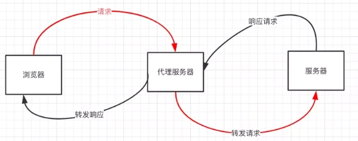

# 跨域详解

## 目录

<!-- toc -->

- [什么是同源策略及其限制内容](#什么是同源策略及其限制内容)
- [window.name + iframe](#windowname--iframe)
- [location.hash + iframe](#locationhash--iframe)
- [document.domain + iframe](#documentdomain--iframe)
- [JSONP](#JSONP)
- [CORS](#CORS)
    * [简单请求](#简单请求)
    * [预检请求](#预检请求)
    * [预检请求回应](#预检请求回应)
    * [CORS 跨域示例](#CORS-跨域示例)
      + [Ajax](#Ajax)
      + [Fetch](#Fetch)
      + [Node](#Node)
- [postMessage](#postMessage)
- [代理跨域](#代理跨域)
  * [代理服务器跨域](#代理服务器跨域)
  * [nginx 反向代理](#nginx-反向代理)
  * [区别总结](#区别总结)
- [WebSocket](#WebSocket)
- [总结](#总结)
- [参考](#参考)

<!-- tocstop -->

## 什么是同源策略及其限制内容

同源策略是一种约定，它是浏览器最核心也最基本的安全功能，如果缺少了同源策略，浏览器很容易受到 XSS、CSRF 等攻击。所谓同源是指"协议+域名+端口"三者相同，即便两个不同的域名指向同一个 ip 地址，也非同源。


同源策略主要应用于从脚本访问数据，但对于图像、视频、CSS 和脚本的获取不受限制。

同源策略限制内容有：

+ Ajax 请求不能读取响应
+ Cookie、LocalStorage 和 IndexDB 无法读取
+ DOM 无法获得

但不限制的内容：

+ img 标签
+ link 标签
+ script 标签
+ videos 标签
+ iframe 标签

下面整理所有跨域解决方案。

## window.name + iframe

这个方案利用了 window.name 属性的独特之处：**name 值在不同的页面（甚至不同域名）加载后依旧存在**，并且可以支持非常长的 name 值（2MB）。

具体过程：

```text
                  FIRST iframe.onload
domain1 域的页面A -------------------------> domain2 域的页面B
                       |                             |
   READ window.name -> |                             |
SECOND iframe.onload ->|           SET window.name ->|
                       |                             |
                       |------>domain1 域的代理页面<---|
```
  
假设有三个页面：

+ 页面A：www.domain1.com/a.html
+ 代理页面： www.domain1.com/proxy.html
+ 页面B：www.domain2.com/b.html

其中页面A和代理页面是同一个域名下的。

domain1 的页面A：

```js
const proxy = function(url, callback) {
    let state = 0;
    const iframe = document.createElement('iframe');
    // 加载跨域页面
    iframe.src = url;
    // onload 事件会触发2次，第1次加载跨域页，并留存数据于 window.name
    iframe.onload = function() {
        if (state === 1) {
            // 第2次 onload (同域proxy页)成功后，读取同域 window.name 中数据
            callback(iframe.contentWindow.name);
            destoryFrame();

        } else if (state === 0) {
            // 第1次 onload (跨域页)成功后，切换到同域代理页面
            iframe.contentWindow.location = 'http://www.domain1.com/proxy.html';
            state = 1;
        }
    };
    document.body.appendChild(iframe);
    // 获取数据以后销毁这个iframe，释放内存；这也保证了安全（不被其他域frame js访问）
    function destoryFrame() {
        iframe.contentWindow.document.write('');
        iframe.contentWindow.close();
        document.body.removeChild(iframe);
    }
};

// 请求跨域b页面数据
proxy('http://www.domain2.com/b.html', function(data){
    alert(data);
});
```

domain1 的代理页面 proxy.html：

```html
<script>
    // 可以为一个空页面
</script>
```

domain2 的页面B：

```html
<script>
    // 将需要跨域的数据塞进 window.name 中
    window.name = 'This is domain2 data!';
</script>
```
通过 iframe 的 src 属性由外域转向本地域，跨域数据即由 iframe 的 window.name 从外域传递到本地域。这个就巧妙地绕过了浏览器的跨域访问限制，但同时它又是安全操作。

## location.hash + iframe

实现方式类同于 window.name + iframe，页面A想要同页面B跨域传递数据，可以通过代理页面 proxy.html 来实现。

具体过程：

```text
                  hashchange
domain1 域的页面A ------------> domain2 域的页面B-----
  |                                                |
  | <-- onProxyCallback              hashchange -->|
  |                                                |
  |                                                |
  ---------------domain1 域的代理页面 <--------------|
```

也同样有三个页面：

+ 页面A：www.domain1.com/a.html
+ 代理页面： www.domain1.com/proxy.html
+ 页面B：www.domain2.com/b.html

domain1 的页面A：

```html
<!-- 请求页面B -->
<iframe id="iframe" src="http://www.domain2.com/b.html" style="display:none;"></iframe>
<script>
    const iframe = document.getElementById('iframe');
    // 向页面B传 hash 值
    setTimeout(function() {
        iframe.src = iframe.src + '#user=admin';
    }, 1000);
    
    // 开放给同域 proxy.html 的回调方法
    function onProxyCallback(res) {
        alert('data from c.html ---> ' + res);
    }
</script>
```

domain1 的代理页面：

```html
<script>
    // 监听页面B b.html 传来的hash值
    window.onhashchange = function () {
        // 再通过操作同域页面A a.html 的回调函数，将结果传回
        // window.parent.parent 指向页面A
        window.parent.parent.onProxyCallback('hello: ' + location.hash.replace('#user=', ''));
    };
</script>
```

domain2 的页面B：

```html
<!-- 加载代理页面 proxy.html -->
<iframe id="iframe" src="http://www.domain1.com/proxy.html" style="display:none;"></iframe>
<script>
    const iframe = document.getElementById('iframe');
    // 监听页面A传来的 hash 值，再传给 proxy.html
    window.onhashchange = function () {
        // 使用 location.hash 处理一些逻辑
        iframe.src = iframe.src + location.hash;
    };
</script>
```

## document.domain + iframe

此方案仅限主域相同，子域不同的跨域应用场景。实现原理：两个页面都通过 js 强制设置 document.domain 为基础主域，就实现了同域。

具体过程：

```text
                  SET document.domain = 'domain.com'
parent.domain.com --------------------------------> child.domain.com
      |                                                 |
      |                                                 |
      |          READ window.parent.data                |
      |<------------------------------------------------|
```

设有两个主域相同的页面：

+ 页面A: parent.domain.com
+ 页面B: child.domain.com

页面A:

```html
<!-- 加载页面B -->
<iframe id="iframe" src="http://child.domain.com/b.html"></iframe>
<script>
    document.domain = 'domain.com';
    window.user = 'admin';
</script>
```

页面B:

```html
<script>
    document.domain = 'domain.com';
    // 获取父窗口中变量
    console.log('get js data from parent ---> ' + window.parent.user);
</script>
```

## JSONP

JSONP 的原理就是利用 `<script>` 标签没有跨域限制，通过 `<script>` 标签src属性，发送带有callback 参数的GET请求，服务端将接口返回数据拼凑到 callback 函数中，返回给浏览器，浏览器解析执行，从而前端拿到 callback 函数返回的数据。

```html
<!-- domain1 域的页面 -->
 <script>
    const script = document.createElement('script');
    script.type = 'text/javascript';

    // 传参一个回调函数名给后端，方便后端返回时执行这个在前端定义的回调函数
    script.src = 'http://www.domain2.com:8080/login?user=admin&callback=handleCallback';
    document.head.appendChild(script);

    // 回调执行函数
    function handleCallback(res) {
        alert(JSON.stringify(res));
    }
 </script>
```

服务端返回如下（返回时即执行全局函数）：

```js
// 返回资源内的脚本
handleCallback({"success": true, "user": "admin"})
```

不过 JSONP 也有缺点，它只能发送 Get 一种请求，无法发送 Post 请求。

## CORS

CORS 是一个 W3C 标准，全称是"跨域资源共享"（Cross-origin resource sharing）。它定义了浏览器与服务器如何实现跨源通信，允许浏览器向跨源服务器，发出 XMLHttpRequest 请求，从而克服了 AJAX 只能同源使用的限制。

CORS 背后的基本思路就是使用自定义的 HTTP 头部允许浏览器和服务器相互了解，以确实请求或响应应该成功还是失败。

CORS 需要浏览器和服务器同时支持。目前，所有浏览器都支持该功能，IE浏览器不能低于IE10。

浏览器将 CORS 跨域请求分为简单请求和非简单请求。

### 简单请求

不会触发 CORS 预检的请求称为简单请求，一般情况下只关注前两项：

+ 使用下列方法之一：Head、Get、Post
+ 只使用了如下的安全首部字段，不得人为设置其他首部字段:
  + Accept
  + Accept-Language
  + Content-Language
  + Content-Type 仅限于以下：
    + application/x-www-form-urlencoded
    + multipart/form-data
    + text/plain
+ 请求中的任意 XMLHttpRequestUpload 对象均没有注册任何事件监听器 （针对 XMLHttpRequest.upload 属性）
+ 请求中没有使用 ReadableStream 对象（针对 Fetch API）

对于简单请求，浏览器直接发出 CORS 请求。具体来说，就是在头信息之中，增加一个 Origin 字段：

```text
// 发送简单请求
GET /cors HTTP/1.1

Origin: http://api.bob.com

Host: api.alice.com
Accept-Language: en-US
Connection: keep-alive
User-Agent: Mozilla/5.0...
```

上面的头信息中，Origin 字段用来说明，本次请求来自哪个源（协议 + 域名 + 端口）。服务器根据这个值，决定是否同意这次请求。

CORS 请求设置的响应头字段，都以 Access-Control-开头:

+ Access-Control-Allow-Origin：必选
  + 含义：它的值要么是请求时 Origin 字段的值，要么是一个 `*`，表示接受任意域名的请求
+ Access-Control-Allow-Credentials：可选
  + 含义：布尔值，表示是否允许发送 Cookie。默认情况下，Cookie 不包括在 CORS 请求之中。设为true，即表示服务器明确许可，Cookie 可以包含在请求中，一起发给服务器。这个值也只能设为 true，如果服务器不要浏览器发送 Cookie，删除该字段即可。
+ Access-Control-Expose-Headers：可选
  + 含义：CORS 请求时，XMLHttpRequest 对象的 *getResponseHeader()* 方法只能拿到6个基本字段，如果想拿到其他字段，就必须在 Access-Control-Expose-Headers 里面指定
    + Cache-Control
    + Content-Language
    + Content-Type
    + Expires
    + Last-Modified
    + Pragma

下面是一个简单请求图示：


### 预检请求

不同时满足上面条件的，都属于非简单请求。浏览器对这两种的处理，是不一样的。

非简单请求的 CORS 请求，会在正式通信之前，增加一次 HTTP 查询请求，称为"预检"请求（preflight）。

预检"请求用的请求方法是 OPTIONS，表示这个请求是用来询问的。请求头信息里面，关键字段是 Origin，表示请求来自哪个源。除了 Origin 字段，"预检"请求的头信息包括两个特殊字段。

```text
OPTIONS /cors HTTP/1.1

Origin: http://api.bob.com
// 新增的两个特殊字段
Access-Control-Request-Method: PUT
Access-Control-Request-Headers: X-Custom-Header

Host: api.alice.com
Accept-Language: en-US
Connection: keep-alive
User-Agent: Mozilla/5.0..
```

+ Access-Control-Request-Method：必选
  + 含义：用来列出浏览器的 CORS 请求会用到哪些HTTP方法，上例是PUT。
+ Access-Control-Request-Headers：可选
  + 含义：该字段是一个逗号分隔的字符串，指定浏览器 CORS 请求会额外发送的头信息字段，上例是 X-Custom-Header

### 预检请求回应

服务器收到"预检"请求以后，检查了 Origin、Access-Control-Request-Method 和 Access-Control-Request-Headers字段以后，确认允许跨源请求，就可以做出回应：

+ Access-Control-Allow-Origin：必选
  + 含义：它的值要么是请求时 Origin 字段的值，要么是一个 `*`，表示接受任意域名的请求
+ Access-Control-Allow-Methods：必选
  + 含义：它的值是逗号分隔的一个字符串，表明服务器支持的所有跨域请求的方法。注意，返回的是所有支持的方法，而不单是浏览器请求的那个方法。这是为了避免多次"预检"请求。
+ Access-Control-Allow-Headers
  + 含义：如果浏览器请求包括 Access-Control-Request-Headers 字段，则 Access-Control-Allow-Headers 字段是必需的。它也是一个逗号分隔的字符串，表明服务器支持的所有头信息字段，不限于浏览器在"预检"中请求的字段。
+ Access-Control-Allow-Credentials：可选
  + 含义：该字段与简单请求时的含义相同。用来表明是否需要 Cookie 等凭据的传递。
+ Access-Control-Max-Age：可选
  + 含义：用来指定本次预检请求的有效期，单位为秒。

下面是一个非简单请求图示：


### CORS 跨域示例

下面提供几个 CORS 示例

#### Ajax

XMLHttpRequest 默认支持跨域，只需要服务器支持就可以，只是跨域默认不带 Cookie，开启需要设置 *xhr.withCredentials*。

```js
const xhr = new XMLHttpRequest(); 
// 前端设置是否带cookie
xhr.withCredentials = true;

let json = JSON.stringify({
  name: "John",
  surname: "Smith"
});

xhr.open("POST", '/submit')
// 非简单请求字段
xhr.setRequestHeader('Content-type', 'application/json; charset=utf-8');

xhr.send(json);

xhr.onload = function() {
    if (xhr.status == 200) {
        console.log(xhr.response);
    }
};
```

#### Fetch

最新的 Fetch API 是支持跨域的，也支持跨域传递 Cookie，只需要配置 mode 和 credentials 两个选项。

```js
let response = await fetch('https://site.com/service.json', {
  // 非简单请求
  method: 'PATCH',
  headers: {
    'Content-Type': 'application/json',
    'API-Key': 'secret'
  },
  // 是否传递凭据（Cookie）
  credentials: "include",
  // 默认为 no-cors，开启需要启用 cors
  mode: 'cors'
});
```

#### Node

原生

```js
const http = require('http');
const server = http.createServer();
const qs = require('querystring');

server.on('request', function(req, res) {
    let postData = '';
    // 数据块接收中
    req.addListener('data', function(chunk) {
        postData += chunk;
    });
    // 数据接收完毕
    req.addListener('end', function() {
        postData = qs.parse(postData);
        // 跨域后台设置
        res.writeHead(200, {
            // 后端允许发送Cookie
            'Access-Control-Allow-Credentials': 'true',
            // 允许访问的域（协议+域名+端口）
            'Access-Control-Allow-Origin': 'http://www.domain1.com',
             // 此处设置的 cookie 还是 domain2 的而非 domain1
             // 因为后端也不能跨域写 cookie (nginx 反向代理可以实现)
             // 但只要 domain2 中写入一次 cookie 认证
             // 后面的跨域接口都能从 domain2 中获取 cookie，从而实现所有的接口都能跨域访问
             // HttpOnly的作用是让js无法读取cookie
            'Set-Cookie': 'l=a123456;Path=/;Domain=www.domain2.com;HttpOnly'
        });

        res.write(JSON.stringify(postData));
        res.end();
    });
});

server.listen('8080');
console.log('Server is running at port 8080...');
```

koa 中间件：

```js
// koa-cors
const URL = require('url');
/**
 * 关键点：
 * 1、如果需要支持 cookies,
 *    Access-Control-Allow-Origin 不能设置为 *,
 *    并且 Access-Control-Allow-Credentials 需要设置为 true
 *    (注意前端请求需要设置 withCredentials = true)
 * 2、当 method = OPTIONS 时, 属于预检(复杂请求), 当为预检时, 可以直接返回空响应体, 对应的 http 状态码为 204
 * 3、通过 Access-Control-Max-Age 可以设置预检结果的缓存, 单位(秒)
 * 4、通过 Access-Control-Allow-Headers 设置需要支持的跨域请求头
 * 5、通过 Access-Control-Allow-Methods 设置需要支持的跨域请求方法
 */
module.exports = async function (ctx, next) {
  const origin = URL.parse(ctx.get('origin') || ctx.get('referer') || '');
  if (origin.protocol && origin.host) {
    ctx.set('Access-Control-Allow-Origin', `${origin.protocol}//${origin.host}`);
    ctx.set('Access-Control-Allow-Methods', 'POST, GET, OPTIONS, DELETE, PUT');
    ctx.set('Access-Control-Allow-Headers', 'X-Requested-With, User-Agent, Referer, Content-Type, Cache-Control,accesstoken');
    ctx.set('Access-Control-Max-Age', '86400');
    ctx.set('Access-Control-Allow-Credentials', 'true');
  }
  if (ctx.method !== 'OPTIONS') {
    // 如果请求类型为非预检请求，则进入下一个中间件（包括路由中间件等）
    await next();
  } else {
    // 当为预检时，直接返回204,代表空响应体
    ctx.body = '';
    ctx.status = 204;
  }
};


// app.js
const cors = require('./middlewares/koa-cors');
app.use(cors); // 跨域
```

## postMessage

postMessage 是 HTML5 XMLHttpRequest Level 2 中的API，且是为数不多可以跨域操作的 window 属性之一，它可用于解决以下方面的问题：

+ 页面和其打开的新窗口的数据传递
+ 多窗口之间消息传递
+ 页面与嵌套的 iframe 消息传递
+ 上面三个场景的跨域数据传递

用法：postMessage(data,origin) 方法接受两个参数：

+ data：html5规范支持任意基本类型或可复制的对象，但部分浏览器只支持字符串，所以传参时最好用JSON.stringify()序列化
+ origin：协议+主机+端口号，也可以设置为"*"，表示可以传递给任意窗口，如果要指定和当前窗口同源的话设置为"/"

下面是一个示例：

页面A www.domain1.com/a.html：

```html
<iframe id="iframe" src="http://www.domain2.com/b.html" style="display:none;"></iframe>
<script>       
    const iframe = document.getElementById('iframe');
    iframe.onload = function() {
        var data = {
            name: 'aym'
        };
        // 向 domain2 传送跨域数据
        iframe.contentWindow.postMessage(JSON.stringify(data), 'http://www.domain2.com');
    };

    // 接受 domain2 返回数据
    window.addEventListener('message', function(e) {
        alert('data from domain2 ---> ' + e.data);
    }, false);
</script>
```

页面B www.domain2.com/b.html：

```html
<script>
    // 接收 domain1 的数据
    window.addEventListener('message', function(e) {
        alert('data from domain1 ---> ' + e.data);

        var data = JSON.parse(e.data);
        if (data) {
            data.number = 16;
            // 处理后再发回 domain1
            window.parent.postMessage(JSON.stringify(data), 'http://www.domain1.com');
        }
    }, false);
</script>
```

## 代理跨域

**同源策略是浏览器需要遵循的标准，而如果是服务器向服务器请求就无需遵循同源策略**。这就是代理跨域的思路的，通过多加一层中间层实现请求的转发。

下面介绍两种常用的思路：

+ 代理服务器跨域：使用 Node.js 中间件实现请求的转发
+ nginx 反向代理：使用 nginx 服务器实现请求的转发

### 代理服务器跨域

对于前端来说，代理服务器跨域一般可以用 Node.js 搭建。

设置代理服务器，需要做以下几个步骤：

+ 接受客户端请求
+ 将请求转发目标给服务器
+ 拿到目标服务器响应数据
+ 将响应转发给客户端



这个的方案的好处，在于浏览器和代理服务器保持同域状态，靠代理服务器和目标服务器进行沟通，对于前端部分来说，无需多作配置。

在具体的项目实践中，前端开发可以用 Node.js 来搭建中间服务层，用于启动页面，接受接口的请求，然后去向目标 API 服务器获取响应数据，再转发给前端。这就是所谓的 Backend for frontend 实践。

### nginx 反向代理

实现原理类似于代理服务器跨域，需要搭建一个中转 nginx 服务器，用于转发请求。

实现思路：通过 nginx 配置一个代理服务器（域名与 domain1 相同，端口不同）做跳板机，反向代理访问domain2 接口，并且可以顺便修改 cookie 中 domain 信息，方便当前域 cookie 写入，实现跨域登录。

配置 nginx:

```sh
// proxy服务器
server {
    listen 81;
    server_name  www.domain1.com;
    location / {
        # 反向代理
        proxy_pass   http://www.domain2.com:8080;
        # 修改 cookie 里域名
        proxy_cookie_domain www.domain2.com www.domain1.com;
        index index.html index.htm;
        # 当用 webpack-dev-server 等中间件代理接口访问 nignx 时，此时无浏览器参与，故没有同源限制，下面的跨域配置可不启用
        add_header Access-Control-Allow-Origin http://www.domain1.com;
        # 当前端只跨域不带cookie时，可为*
        add_header Access-Control-Allow-Credentials true;
    }
}
```

前端页面：

```js
// www.domain1.com index.html
const xhr = new XMLHttpRequest();
// 前端开关：浏览器是否读写 cookie
xhr.withCredentials = true;
// 访问 nginx 中的代理服务器
xhr.open('get', 'http://www.domain1.com:81/?user=admin', true);
xhr.send();
```

目标 domain2 的服务器（以 node 为例）：

```js
// server.js
const http = require('http');
const server = http.createServer();
const qs = require('querystring');
server.on('request', function(req, res) {
    const params = qs.parse(req.url.substring(2));
    // 向前台写cookie
    // 这里的 domain2 会在 nginx 的 proxy_cookie_domain 配置中被替换
    res.writeHead(200, {
        'Set-Cookie': 'l=a123456;Path=/;Domain=www.domain2.com;HttpOnly'   // HttpOnly:脚本无法读取
    });
    res.write(JSON.stringify(params));
    res.end();
});
server.listen('8080');
console.log('Server is running at port 8080...');
```

### 区别总结

上述两种思路都是常用的实践，本质上是一样的。**适合前后端分离的前端项目调后端接口**。

使用 nginx 反向代理也可以用在本地 dev 测试。比如前端项目在开发时常用的 webpack-dev-server，启动静态资源服务器，生成以 127.0.0.1 为 host 的资源地址，如果需要像线上有一样的正式路径进行调试，则可以使用 nginx 进行请求的匹配和转发：

```sh
// proxy服务器
server {
    listen 81;
    server_name  *.dev.flights.com;
    location /static {
        # 反向代理
        proxy_pass  http://127.0.0.1:8080;
    }
}
```

## WebSocket

WebSocket protocol 是 HTML5 一种新的协议。它实现了浏览器与服务器全双工通信，同时允许跨域通讯，是 server push 技术的一种很好的实现。

本节不准备对 ws 作细节整理了，只知道使用 ws 是可以进行跨域的，后续有学习再整理。

## 总结

+ CORS 支持所有类型的 HTTP 请求，是跨域 HTTP 请求的根本解决方案
+ JSONP 只支持 GET 请求，JSONP 的优势在于支持老式浏览器，以及可以向不支持 CORS 的网站请求数据
+ 不管是代理服务器跨域还是 nginx 反向代理，主要是通过同源策略对服务器不加限制
+ 日常工作中，用得比较多的跨域方案是 CORS 和 nginx 反向代理

## 参考

+ [CORS 简单请求+预检请求（彻底理解跨域） · Issue #62 · amandakelake/blog · GitHub](https://github.com/amandakelake/blog/issues/62)
+ [九种跨域方式实现原理（完整版）_前端工匠公众号 - SegmentFault 思否](https://segmentfault.com/a/1190000018017118)
+ [浏览器的同源策略 - Web 安全 | MDN](https://developer.mozilla.org/zh-CN/docs/Web/Security/Same-origin_policy)
+ [Fetch：跨源请求](https://zh.javascript.info/fetch-crossorigin)