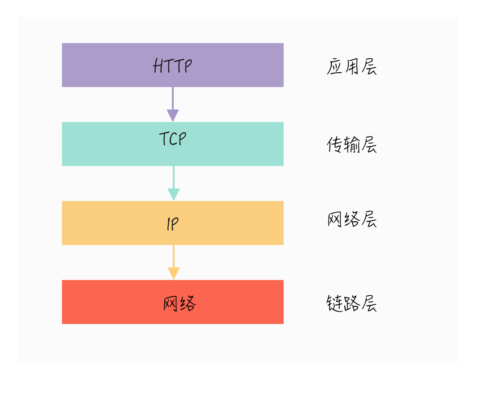
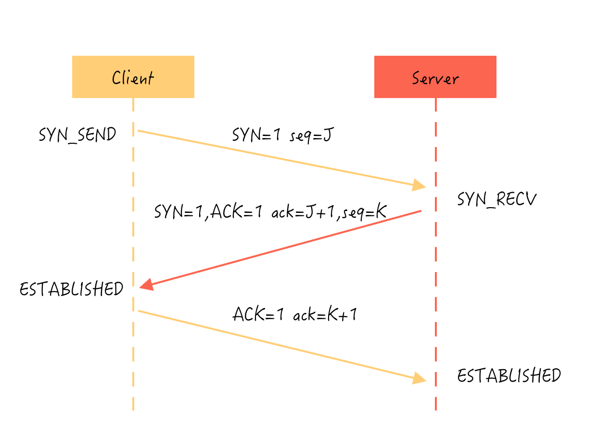
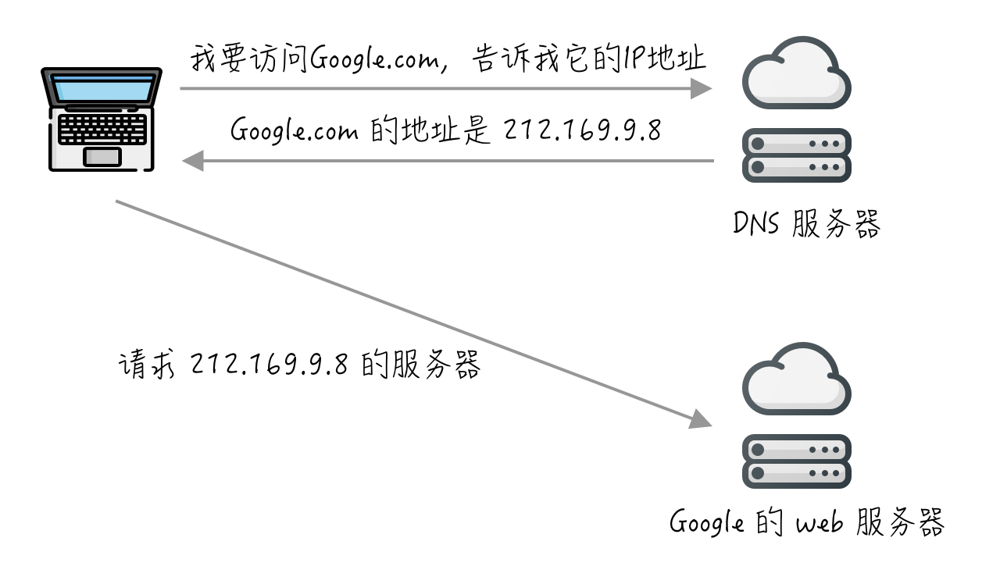

## 1. 概述

什么是 HTTP 协议？

在 MDN 上是这么定义的：

> 超文本传输​​协议（HTTP）是用于传输诸如 HTML 的超媒体文档的**应用层协议**。它被设计用于 Web 浏览器和Web服务器之间的通信，但它也可以用于其他目的。 HTTP遵循经典的**客户端-服务端**模型，客户端打开一个连接以发出请求，然后等待它收到服务器端响应。 HTTP 是无状态协议，意味着服务器不会在两个请求之间保留任何数据（状态）。该协议虽然通常基于 **TCP / IP** 层，但可以在任何可靠的传输层上使用；也就是说，一个不会像 UDP 协议那样静默丢失消息的协议。RUDP 作为 UDP 的可靠的升级版本，是一种合适的替代选择。

简单来说，HTTP 是被设计用于 Web 通信的一项协议，是 Web 的基石之一，也是学习网站开发必须深入理解的一门技术。

本文将整理总结 HTTP 协议的一些细节，以供学习之用。

## 2. 协议在网络中的位置

HTTP 协议是构建在 TCP/IP 协议之上的，是 TCP/IP 协议的一个子集，所以要理解 HTTP 协议，有必要先了解下 TCP/IP 协议相关的知识。这章简略梳理下关于 TCP/IP 协议族的知识。

### 2.1 TCP/IP 协议分层

TCP/IP协议族是由一个四层协议组成的系统，这四层分别为：应用层、传输层、网络层和数据链路层。如图 2.1。



<center>图 1.1 TCP/IP 协议族分层 </center>

分层的好处是把各个相对独立的功能解耦，层与层之间通过规定好的接口来通信。如果以后需要修改或者重写某一层的实现，只需要改动对应的那一层而不影响到其他层。这里简单介绍一下各个层的作用：

1. **应用层：**
应用层一般是我们编写的应用程序，其决定了向用户提供的应用服务。应用层可以通过系统调用与传输层进行通信。
处于应用层的协议非常多，比如：FTP（文件传输协议）、DNS（域名系统）和HTTP（超文本传输协议）等。

2. **传输层：**
传输层通过系统调用向应用层提供处于网络连接中的两台计算机之间的数据传输功能。
在传输层有两个性质不同的协议：TCP（传输控制协议）和UDP（用户数据报协议）。

3. **网络层：**
网络层用来处理在网络上流动的数据包，数据包是网络传输的最小数据单位。该层规定了通过怎样的路径（传输路线）到达对方计算机，并把数据包传输给对方。

4. **链路层：**
链路层用来处理连接网络的硬件部分，包括控制操作系统、硬件设备驱动、NIC（网络适配器）以及光纤等物理可见部分。硬件上的范畴均在链路层的作用范围之内。

### 2.2 TCP 三次握手

从上面的介绍可知，传输层协议主要有两个：TCP 协议和UDP协议。TCP 协议相对于UDP 协议的特点是：**TCP 协议提供面向连接、字节流和可靠的传输。**

使用 TCP 协议进行通信的双方必须先建立连接，然后才能开始传输数据。TCP 连接是**全双工**的，也就是说双方的数据读写可以通过一个连接进行。为了确保连接双方可靠性，在双方建立连接时，TCP 协议采用了三次握手（Three-way handshaking）策略：



<center>图 1.2 TCP 三次握手 </center>

当三次握手完成后，TCP 协议会为连接双方维持连接状态。为了保证数据传输成功，接收端在接收到数据包后必须发送 ACK 报文作为确认。如果在指定的时间内（这个时间称为重新发送超时时间），发送端没有接收到接收端的 ACK 报文，那么就会重发超时的数据。

### 2.3 DNS 服务

前面介绍了与HTTP协议有着密切关系的TCP/IP协议，接下来介绍的DNS服务也是与HTTP协议有着密不可分的关系。

通常我们访问一个网站，使用的是主机名或者域名（如 www.test.com）来访问，但 TCP/IP 协议使用的是 IP 地址，这是一组纯数字（如 192.176.2.1），所以必须要有一个机制来将域名转换成 IP 地址：



<center>图 1.3 DNS 简单工作机制 </center>

DNS 服务是通过 DNS 协议进行通信的，而 DNS 协议跟 HTTP 协议一样也是应用层协议。由于我们的重点是 HTTP 协议，所以这里不打算对 DNS 协议进行详细的分析，只需要知道可以通过 DNS 服务把域名解析成 IP 地址即可。

## 3. 协议的发展历程

### 3.1 各版本的出现时间

* 1991年：HTTP/0.9
* 1996年5月：HTTP/1.0
* 1997年1月： HTTP/1.1
* 2005年： HTTP/2

现在最流行的是 HTTP/1.1，而新版本 HTTP/2 的推出是未来必定会流行开来的技术趋势，并且标准委员会对 HTTP 不再划分子版本，也就是以后的更新版本是 HTTP/3、HTTP/4...

### 3.2 HTTP/0.9 版本

最早 0.9 版本的 HTTP 及其简单，只有一个 GET 命令：

```sh
GET / index.html
```

上述命令表示 TCP 连接建立后，客户端向服务端请求网页 `index.html`。

协议规定，服务器只能回应 **HTML 格式**的字符串，不能回应别的格式：

```html
<html>
  <body>Hello World</body>
</html>
```

服务器发送完毕，就关闭连接。

### 3.3 HTTP/1.0 版本

1.0 版本的出现极大丰富了 HTTP 的内容（见[RFC1945](https://tools.ietf.org/html/rfc1945)），不仅可以传输文字，还能传输图像、视频、二进制文件。这为互联网的大发展奠定了基础。

还增加了新的命令：POST 命令和 HEAD 命令，丰富了和服务端交互的手段。

再次，HTTP请求和回应的格式也变了。除了数据部分，每次通信都必须包括头信息（HTTP header），用来描述一些元数据。

其他的新增功能还包括状态码（status code）、多字符集支持、多部分发送（multi-part type）、权限（authorization）、缓存（cache）、内容编码（content encoding）等。

一个典型的 HTTP 1.0 请求和响应的例子：

```sh
// 请求
GET / HTTP/1.0
User-Agent: Mozilla/5.0 (Macintosh; Intel Mac OS X 10_10_5)
Accept: */*

// 响应
HTTP/1.0 200 OK
Content-Type: text/plain
Content-Length: 137582
Expires: Thu, 05 Dec 1997 16:00:00 GMT
Last-Modified: Wed, 5 August 1996 15:55:28 GMT
Server: Apache 0.84

<html>
  <body>Hello World</body>
</html>
```

可以看到，这个格式与0.9版有很大变化。

第一行是请求命令，必须在尾部添加协议版本（HTTP/1.0）。后面就是多行头信息，描述客户端的情况。

回应的格式是"头信息 + 一个空行（`\r\n`） + 数据"。其中，第一行是"协议版本 + 状态码（status code） + 状态描述"。

在字符的编码上，1.0版规定，头信息必须是 ASCII 码，后面的数据可以是任何格式。因此，服务器回应的时候，必须告诉客户端，数据是什么格式，这个是在 Content-Type 字段中进行定义的，如 `Content-Type: text/plain`。

HTTP 1.0 的缺点主要在于，每个 TCP 连接只能发送一个请求。发送数据完毕后，连接就关闭了，如果还要请求新的资源，就必须新开一个连接。

为了解决这个问题，有些浏览器在请求的时候，使用了非标准的 `Connection` 字段：

```sh
Connection: keep-alive
```

这个字段要求服务器不要关闭TCP连接，以便其他请求复用。服务器同样也要回应这个字段。

一个可以复用的TCP连接就建立了，直到客户端或服务器主动关闭连接。但是，这不是标准字段，不同实现的行为可能不一致，因此不是根本的解决办法。

### 3.4 总结

HTTP 0.9 特点：

* 只能返回 HTML 格式的字符串
* 只有一个 GET 命令
* TCP 连接不能复用

HTTP 1.0 特点：

* 协议版本信息现在会随着每个请求发送（HTTP/1.0被追加到了GET行）
* 传输的数据格式更丰富了（Content-Type）
* 增加了更多的命令操作（POST）
* 引入了 HTTP 头的概念，无论是对于请求还是响应，允许传输元数据，使协议变得非常灵活，更具扩展性
* TCP 连接依旧不能复用，使用非标准的 Connection 字段

## 4. HTTP 1.1

### 4.1 改进

重点来讨论下 HTTP/1.1 的细节，因为这是当下最流行的版本，只要涉及到网站开发，就需要对这个有所理解。

HTTP/1.1 只比 1.0 晚发布了几个月，消除了很多 1.0 在实际应用中的混乱地方，做出了多项改进：

* 引入**持久连接**，即 TCP 连接默认不关闭，可以被多个请求复用，不用声明 `Connection: keep-alive`
* 引入**管道机制**，允许在第一个应答被完全发送之前就发送第二个请求，以降低通信延迟
* 引入**分块传输编码机制**，支持响应分块，产生一块数据，就发送一块，采用"流模式"（stream）取代"缓存模式"（buffer）
* 引入额外的**缓存控制机制**
* 引入**内容协商机制**，包括语言，编码，类型等，并允许客户端和服务器之间约定以最合适的内容进行交换
* 新增 `PUT`、`PATCH`、`HEAD`、`OPTION`、`DELETE` 方法
* 引入 Host 头，能够使不同域名配置在同一个IP地址的服务器上

当然，HTTP/1.1 不是完美的，也有缺点：同一个 TCP 连接里面，所有的数据通信按次序进行，有可能造成“**队头堵塞（Head-of-line blocking）**”

为了避免这个问题，只有两种方法：减少请求数、开更多的持久连接。社区为此总结出了很多网页优化技巧，如：

* 合并脚本和样式表
* 将图片嵌入 css 代码
* 域名分片（domain sharding）
* 将多张图片合并的雪碧图

这些额外的工作相信会随着 HTTP 的完善而逐步被淘汰。

这里提一点，通常情况下 HTTP/1.1 的响应消息的数据是整块发送的，Content-Length 消息头字段表示数据的长度。使用 Content-Length 字段的前提条件是，服务器发送回应之前，必须知道回应的数据长度。但有些很耗时的场景下，等待所有数据准备好再发送显然效率不高，这种情况下使用**分块传输编码机制**更好。

使用**分块传输编码机制**，将数据分解成块，并以一个或者多个块发送，这种情况下可以不使用 Content-Length 字段。

每个非空的数据块之前，会有一个16进制的数值，表示这个块的长度。最后是一个大小为0的块，就表示本次回应的数据发送完了。下面是一个例子：

```sh
HTTP/1.1 200 OK
Content-Type: text/plain
Transfer-Encoding: chunked

25
This is the data in the first chunk

1C
and this is the second one

3
con

8
sequence

0
```

### 4.2 常见请求头 header

#### 4.2.1 Request 请求

* Accept: 能接受（返回）哪些类型
格式：type/subtype，* / * 表示接受一切类型
例子：
   * Accept: application/json
   * Accept: text/plain
   * Accept: text/html
   * Accept: image/jpeg
   * Accept: application/msword
   * Accept: image/png
   * Accept: application/pdf
* Accept-Charset: 用来告知（服务器）客户端可以处理的字符集类型
* Accept-Encoding: 能接受的编码压缩类型
例子：
   * Accept-Encoding：gzip
* User-Agent: 用户请求的浏览器类型、操作系统等信息
* Host: 指明了服务器的域名，**域名 + 端口号**，如 www.baidu.com
* Origin: 指明请求从哪里发起的，**协议 + 域名**,如 http://www.baidu.com
* Referer: 告诉服务器是从哪个连接去访问的，**协议+域名+查询参数**
* keep-Alive: 希望服务器保持此次连接（多长时间）
* Cache-Control: 控制缓存
* Content-Length: 数据内容的长度，单位：字节
* Content-Type: 返回的数据是什么格式
* Connection: 决定当前的事务完成后，是否会关闭网络连接，一般是 close 和 keep-alive

#### 4.2.2 Response 响应

* Content-Length: 返回的数据长度
* Content-Type: 返回的数据类型
* Connection: 服务器连接情况，和请求中的 Connection 对应
* Content-Encoding: 响应中使用的压缩方法
* Access-Control-Allow-Origin: 所允许的访问的跨源域名
* Access-Control-Allow-Methods: 所允许访问的方法
* Server: 包含了处理请求的源头服务器所用到的软件相关信息
* Set-Cookie: 被用来由服务器端向客户端发送 cookie
* Transfer-Encoding: 决定服务器发送给客户端的数据是分块的，对应分块传输编码机制

### 4.3 会话

### 4.4 缓存

### 4.5 认证

### 4.6 同源限制

### 4.7 代理和隧道

## HTTPS

## HTTP/2

## 参考

https://developer.mozilla.org/zh-CN/docs/Web/HTTP
http://www.ruanyifeng.com/blog/2016/08/http.html
https://mp.weixin.qq.com/s/27zpNIGhVbx-on9FDs_6dw?
