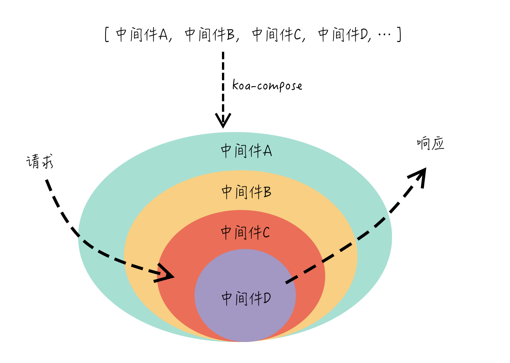

## 目录

<!-- toc -->

- [前言](#前言)
- [模块引用情况](#模块引用情况)
- [主要模块依赖](#主要模块依赖)
  * [koa-compose](#koa-compose)
  * [delegates](#delegates)
- [理解 koa 的核心模型](#理解-koa-的核心模型)
- [koa-router](#koa-router)
  * [源码结构](#源码结构)
  * [流程解析](#流程解析)
- [koa-bodypraser](#koa-bodypraser)
- [参考](#参考)

<!-- tocstop -->

## 前言

本文详细记录 koa 及其常用配套库的原理。

## 模块引用情况

下面整理出各个包的模块引用情况：

+ koa
  + 源码结构：
      + application.js: 应用程序的入口
      + context.js：全局功能模块，其实是代理 request 和 response 的一个对象
      + request.js：请求功能模块，封装了原生 req 对象
      + response.js：响应功能模块，封装了原生 res 对象
  + 模块依赖：
      + koa-compose：核心模块，实现中间件串联功能
      + cookies：封装 cookie 功能的模块，本质上是对于 req、res 对象的 `headers[cookie]` 的管理
      + delegates：帮助 context 代理 request 和 response

+ koa-router
  + 功能：路由功能的实现
  + 源码结构：
      + router.js
      + layer.js
  + 模块依赖：
      + koa-compose：路由功能的中间件串联

+ koa-bodypraser
  + 功能：实现 POST 请求参数的解析，绑定到 ctx.request.body 上
  + 模块依赖：
      + co-body：依赖于下面两个库
      + raw-body：解析 stream 流的工具，监听 data、end 这些事件
      + inflation：Automatically unzip an HTTP stream.

## 主要模块依赖

koa 本身是很简单的，翻翻它的源码，也就用到两个主要的模块：koa-compose 和 delegates，理解了这两个模块，基本上是搞通了 koa。

### koa-compose

koa-compose 的作用是将一个个中间件组成的数组转换成有顺序的**异步递归**调用高阶函数。

它的实质是递归组合 Promise 包装下的的中间件函数，将下一个中间件变为当前中间件的 next 参数，调用 next 则将控制权层层往下转移，一旦流程都结束后再层层往上冒泡，而且这个 next 由于有了 Promsie 的包裹，也具有了异步功能。最终形成一个**深v形状的洋葱圈模型**：



源码：

```js
'use strict'

/**
 * Expose compositor.
 */

module.exports = compose

/**
 * Compose `middleware` returning
 * a fully valid middleware comprised
 * of all those which are passed.
 *
 * @param {Array} middleware
 * @return {Function}
 * @api public
 */

function compose (middleware) {
  if (!Array.isArray(middleware)) throw new TypeError('Middleware stack must be an array!')
  for (const fn of middleware) {
    if (typeof fn !== 'function') throw new TypeError('Middleware must be composed of functions!')
  }

  /**
   * @param {Object} context
   * @return {Promise}
   * @api public
   */

  return function (context, next) {
    // last called middleware #
    let index = -1
    return dispatch(0)
    function dispatch (i) {
      if (i <= index) return Promise.reject(new Error('next() called multiple times'))
      index = i
      let fn = middleware[i]
      if (i === middleware.length) fn = next
      if (!fn) return Promise.resolve()
      try {
        return Promise.resolve(fn(context, dispatch.bind(null, i + 1)));
      } catch (err) {
        return Promise.reject(err)
      }
    }
  }
}

```

上面这段代码可以用下面的伪代码来理解：

```js
// 假设有两个中间件函数
function fn1(ctx, next) {}
function fn2(ctx, next) {}
// 第一步生成一个中间件的数组
const mid = [fn1, fn2];

function compose(middlewares) {
  ...
  // 第二步返回一个函数，参数为 conetxt 和 next，对接外部，比如响应对象
  return function(context, next) {
    // 第三步返回 Promise 包裹下的 fn1
    return Promise.resolve(
      // 第四步：fn1 有两个参数，context 和 Promise 化的 fn2
      fn1(
          context,
          // 第五步： 因为 fn2 是最后一个中间件了
          // 所以fn2 也有两个参数，context 和 最外层传入 next
          // 如果有更多的中间件，以此类推
          Promise.resolve(fn2(context, next))
      )
    )
  }
}

// 第五步：使用，组合返回的是一个 Promise
compose(mid)(context, () => {})
  .then()
  .catch()
```

所以每一个中间件函数中的 next 参数，是下一层 Promise 化的中间件，一旦调用，当前函数中止，然后执行下一层函数，直到最后的函数都执行完了，再回到上面的函数。

这就是整个 koa-compose 的核心原理。

### delegates

delegates 是 koa 源码包中的一个依赖，是提供给 context 对象使用的**代理委托**封装工具，这样就可以将 request 和 response 对象上的属性和方法都绑定在一个 context 对象上，这也是 koa 简洁明了优点的来源：

```js
// koa/lib/context.js

/**
 * Response delegation.
 */

delegate(proto, 'response')
  .method('attachment')
  .method('redirect')
  .method('remove')
  .method('vary')
  .method('has')
  .method('set')
  .method('append')
  .method('flushHeaders')
  .access('status')
  .access('message')
  .access('body')
  .access('length')
  .access('type')
  .access('lastModified')
  .access('etag')
  .getter('headerSent')
  .getter('writable');

/**
 * Request delegation.
 */

delegate(proto, 'request')
  .method('acceptsLanguages')
  .method('acceptsEncodings')
  .method('acceptsCharsets')
  .method('accepts')
  .method('get')
  .method('is')
  .access('querystring')
  .access('idempotent')
  .access('socket')
  .access('search')
  .access('method')
  .access('query')
  .access('path')
  .access('url')
  .access('accept')
  .getter('origin')
  .getter('href')
  .getter('subdomains')
  .getter('protocol')
  .getter('host')
  .getter('hostname')
  .getter('URL')
  .getter('header')
  .getter('headers')
  .getter('secure')
  .getter('stale')
  .getter('fresh')
  .getter('ips')
  .getter('ip');
```

源码也简单，初略摘录几个方法：

```js
module.exports = Delegator;

function Delegator(proto, target) {
  if (!(this instanceof Delegator)) return new Delegator(proto, target);
  this.proto = proto;
  this.target = target;
  this.methods = [];
  this.getters = [];
  this.setters = [];
  this.fluents = [];
}

Delegator.prototype.method = function(name){
  var proto = this.proto;
  var target = this.target;
  this.methods.push(name);

  proto[name] = function(){
    return this[target][name].apply(this[target], arguments);
  };

  return this;
};

Delegator.prototype.getter = function(name){
  var proto = this.proto;
  var target = this.target;
  this.getters.push(name);

  proto.__defineGetter__(name, function(){
    return this[target][name];
  });

  return this;
};

Delegator.prototype.setter = function(name){
  var proto = this.proto;
  var target = this.target;
  this.setters.push(name);

  proto.__defineSetter__(name, function(val){
    return this[target][name] = val;
  });

  return this;
};
```

## 理解 koa 的核心模型

以上面两个模块为基础，基本上可以摸清整个 koa 的大致架构了:

+ koa-compose：组合中间件，提供核心功能
+ delegate：为 context 代理 response 和 request 对象上的属性

给出一个 koa 的使用案例：

```js
app.use((ctx, next) => {
  console.log('a')
  const a = next();
  console.log(a)
})

app.use((ctx, next) => {
  console.log('c')
  next();
  console.log('d')
  return 'xxxxx'
})

app.listen(3333, () => {
  console.log('[demo] koa is starting at http://127.0.0.1:3333')
})
```

它等同于下面的代码，可以理解为 koa 作为 web 框架的核心模型：

```js
// 中间件
const mid = []

mid.push(async (ctx, next) => {
  console.log('a')
  next()
  console.log('b')
})

mid.push(async (ctx, next) => {
  console.log('c')
  next()
  console.log('d')
})

// 代理 context 对象
const request = context.request = Object.create(this.request);
const response = context.response = Object.create(this.response);

// 使用 node 原生的 res.end 处理请求
function respond(ctx) {
  ctx.res.end(ctx.body)
}

// compose 组合中间件，然后返回一个 promise，用于最终处理响应
compose(mid)(context).then((ctx) => {
   respond(ctx)
})
```

## koa-router

koa 只不过是一个简洁而基础的 web 框架，很多功能并没有原生提供，但利用 koa 强大的中间件模型，可以补足很多功能。这里介绍一下 koa 社区中常用的中间件实现：koa-router。

某种程度上来说，koa-router 是比 koa 更为复杂一些，因为 koa 提供一个基础的串联中间件的功能，但 koa-router 还能嵌套路由中间件。

下面是路由的基本用法：

```js
const home = new Router()

home
.param('user', (id, ctx, next) => {
  ctx.user = users[id];
  if (!ctx.user) return ctx.status = 404;
  return next();
})
.get('/users/:user', ctx => {
  ctx.body = ctx.user;
})

const page = new Router()
page
.get('/koa', async ( ctx ) => {
  ctx.body = 'hello world'
})

let router = new Router()
router.use('/', home.routes(), home.allowedMethods())
router.use('/page', page.routes(), page.allowedMethods())

// 加载路由中间件
app
  .use(router.routes())
  .use(router.allowedMethods())
```

### 源码结构

知道了 koa-router 的使用，那接着看看它是如何匹配从客户端来的请求并命中对应函数的。

这是它的源码结构：

```js
// koa-router/lib/router.js
function Router(opts) {
  if (!(this instanceof Router)) return new Router(opts);

  this.opts = opts || {};
  // verb 方法
  this.methods = this.opts.methods || [
    'HEAD',
    'OPTIONS',
    'GET',
    'PUT',
    'PATCH',
    'POST',
    'DELETE'
  ];
  // 参数
  this.params = {};
  // 堆栈
  this.stack = [];
};

// 设置 verb 方法
for (let i = 0; i < methods.length; i++) {
  function setMethodVerb(method) {
    Router.prototype[method] = function(name, path, middleware) {
      if (typeof path === "string" || path instanceof RegExp) {
        middleware = Array.prototype.slice.call(arguments, 2);
      } else {
        middleware = Array.prototype.slice.call(arguments, 1);
        path = name;
        name = null;
      }
      // 注册方法
      this.register(path, [method], middleware, {
        name: name
      });

      return this;
    };
  }
  setMethodVerb(methods[i]);
}
// 核心流程
// 可以嵌套中间件
Router.prototype.use = function () {...};
// 返回一个可以处理请求的路由中间件，供 koa 消费
Router.prototype.routes = Router.prototype.middleware = function () {...}
// 用于处理请求的错误
Router.prototype.allowedMethods = function (options) {...}
// 创建和注册一个 route
Router.prototype.register = function (path, methods, middleware, opts) {...}
// 寻找给定的匹配路由
Router.prototype.match = function (path, method) {...}

// 其他的 API
// delete 的 alias
Router.prototype.del = Router.prototype['delete'];
// 为已经 router 添加 prefix
Router.prototype.prefix = function (prefix) {...}
// 接受所有的 http 方法
Router.prototype.all = function (name, path, middleware) {...}
// 重定向
Router.prototype.redirect = function (source, destination, code) {...}
// 这个方法是寻找给定的路由名
Router.prototype.route = function (name) {...}
// 为命名路由生成 URL
Router.prototype.url = function (name, params) {...}
// 参数路由，用于匹配带参数的路由 url
Router.prototype.param = function(param, middleware) {...}
// 静态方法，也是用于生成 url
Router.url = function (path) {...}
```

```js
// koa-router/lib/layer.js
function Layer(path, methods, middleware, opts) {
  this.opts = opts || {};
  this.name = this.opts.name || null;
  this.methods = [];
  this.paramNames = [];
  // 执行函数的 stack，这是 layer 层的 stack，区别于 router 层
  this.stack = Array.isArray(middleware) ? middleware : [middleware];
  // 如果是 GET，则加上 HEAD，koa 处理 GET 请求的时候顺带将 HEAD 请求一并处理, 因为两者的区别在于 HEAD 请求不响应数据体.
  for(let i = 0; i < methods.length; i++) {
    const l = this.methods.push(methods[i].toUpperCase());
    if (this.methods[l-1] === 'GET') this.methods.unshift('HEAD');
  }
  ...

  this.path = path;
  this.regexp = pathToRegexp(path, this.paramNames, this.opts);
};
// 返回请求是否匹配路由
Layer.prototype.match = function (path) {...}
// 为给定的 path 和 paramNames 返回 URL 参数列表
Layer.prototype.params = function (path, captures, existingParams) {...}
// 返回正则 url path 捕获的数组
Layer.prototype.captures = function (path) {...}
// 使用给定的 params 参数生成 url
Layer.prototype.url = function (params, options) {...}
// 为路由url中的命名参数指定中间函数
Layer.prototype.param = function (param, fn) {...}
// 为路由 url 设置 prefix
Layer.prototype.setPrefix = function (prefix) {...}
```

### 流程解析

当我们添加给定路由处理函数的时候，是这样的流程：

```js
// 新增一个路由处理函数：
let router = new Router()
router.get('/koa', async ( ctx ) => {})

// page router 调用 register 注册
router.register('/koa', ['HEAD', 'GET'], [async (ctx, next) => {}], options)

// register 方法中会新建一个 Layer 实例，里面保存的是上一步注册路径方法对应的函数
const route = new Layer(path, methods, middleware, options);

// 推入 router 的 stack 数组中
router.stack.push(route);

// 使用 router.routes()，使用 koa-compose 组合 router.stack，返回一个中间件供 koa 消费
Router.prototype.routes = function () {
  return dispatch(ctx, next) {
    return compose(stack)(ctx, next)
  }
}

// 使用 Router.allowedMethod 处理请求错误或特定的 HTTP 方法，比如 OPTIONS
Router.prototype.allowedMethod = function(options) {
  return function allowedMethods(ctx, next) {
      return next().then(function() {
        if (!ctx.status || ctx.status === 404) {
            if (!~this.methods.indexOf(ctx.method)) {}
            if (ctx.method === 'OPTIONS') {}
        }
      })
  }
}
```

如果需要用到嵌套路由，则可使用 Router.use：

```js
// 使用 Router.use 添加新的中间件和嵌套路由
// router.use('/users', userAuth(), home.routes(), home.allowedMethod());
Router.prototype.use = function(..args) {
  let path = args.shift();
  let middleware = args;
  for (let i = 0; i < middleware.length; i++) {
     // 如果存在 router 属性，说明是 Router 对象生成的，需要合并其内部的 stack 函数
     if (middleware[i].router) {
        this.stack.concat(middleware[i].router.stack)
     } else { // 其他中间件，注册为支持全部方法的中间件
        this.register(path, [], middleware[i])
     }
  }
}
```

文字总结：

+ 新增一个路由对象 router，注册不同 method 和 path 对应的处理函数
+ router 调用 register 注册
+ 新建一个 Layer 实例，里面保存的是上一步的处理函数
+ 推入 router 的 stack 数组中
+ 使用 router.routes()，使用 koa-compose 组合 router.stack，返回一个中间件供 koa 消费
+ 使用 router.allowedMethod() 处理请求错误或特定的 HTTP 方法，比如 OPTIONS
+ 如果需要嵌套路由，则可使用 router.use() 添加新的中间件和嵌套路由
  + 如果是新的中间件，则直接 register
  + 如果同样是 Router 对象，则合并其中的 stack 数组

## koa-bodypraser

当我们使用 POST 请求时，我们需要获取请求的 body 参数，但 koa 并没有提供相应的 API，所以社区还是需要利用中间件造一个。这就是 koa-bodypraser 的来源。

我们知道，如果原生使用 Node.js 来获取 body 参数，会是一件很麻烦的事，我们需要监听 ctx.req 对象中的 data 事件，一点点拼接出来：

```js
// 解析上下文里node原生请求的POST参数
function parsePostData( ctx ) {
  return new Promise((resolve, reject) => {
    try {
      let postdata = "";
      ctx.req.addListener('data', (data) => {
        postdata += data
      })
      ctx.req.addListener("end",function(){
        let parseData = parseQueryStr( postdata )
        resolve( parseData )
      })
    } catch ( err ) {
      reject(err)
    }
  })
}
```

有了 koa-bodypraser，一切都变得简单的多：

```js
// 使用ctx.body解析中间件
app.use(bodyParser())
app.use(async ctx => {
  // 被解析过的数据在 ctx.request.body 中，如果啥也没有，默认为 {}
  ctx.body = ctx.request.body;
});
```

它的源码模型也很简单，只是对于 co-body 的一个封装，[co-body](https://github.com/cojs/co-body) 是解析请求流的一个库，它依赖于 raw-body，一个监听 data、end 这些事件，解析 stream 流的工具。

本质上，koa-bodypraser 是一种对于 stream 流的管理，流这个概念是 Node.js 中比较重要的，很多编码都会用到，HTTP 请求响应对象中也有对流的继承，不可忽视。

```js
const parse = require('co-body');

async function parseBody(ctx) {
    return await parse.form(ctx, options)
}

module.exports = function(opts) {
  return async function bodyParser(ctx, next) {
    if (ctx.request.body !== undefined || ctx.disableBodyParser) {
      return await next();
    }
    const res = await parseBody(ctx);
    ctx.request.body = res.parsed
    await next();
  }
}
```

## 参考

+ [koa2 进阶学习笔记 · GitBook](https://chenshenhai.github.io/koa2-note/)
+ [七天学会NodeJS](https://nqdeng.github.io/7-days-nodejs/#1.5.3)
+ [koa-router源码解析](https://juejin.cn/post/6844903573851996167)
+ [每天阅读一个 npm 模块（7）- delegates](https://juejin.cn/post/6844903672543969287)
+ [GitHub - koajs/router: Router middleware for koa.](https://github.com/koajs/router)
+ [delegates - npm](https://www.npmjs.com/package/delegates)
+ [GitHub - koajs/bodyparser: a body parser for koa](https://github.com/koajs/bodyparser)
+ [GitHub - cojs/co-body: Parse request bodies with co](https://github.com/cojs/co-body)
+ [GitHub - stream-utils/raw-body: Get and validate the raw body of a readable stream](https://github.com/stream-utils/raw-body)
