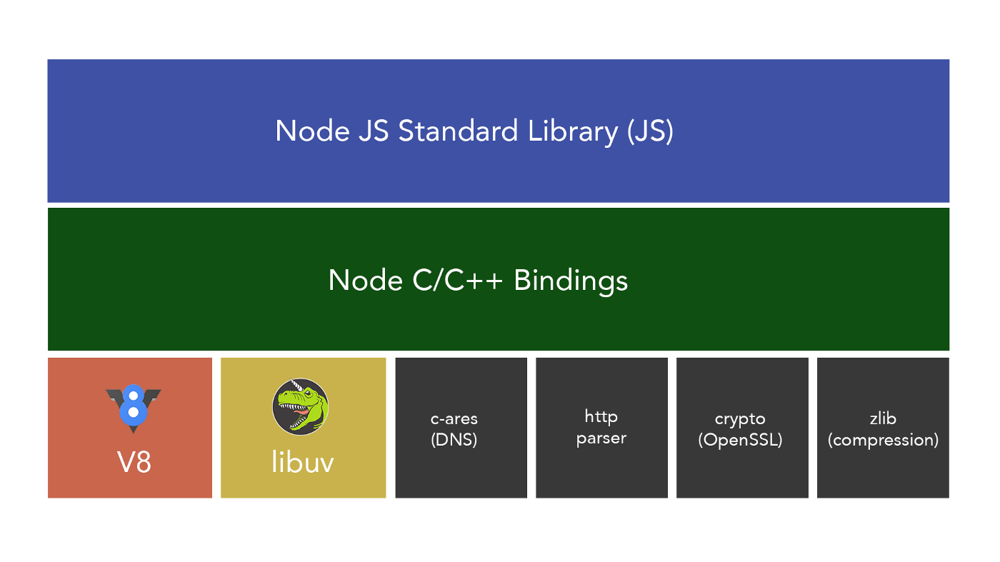
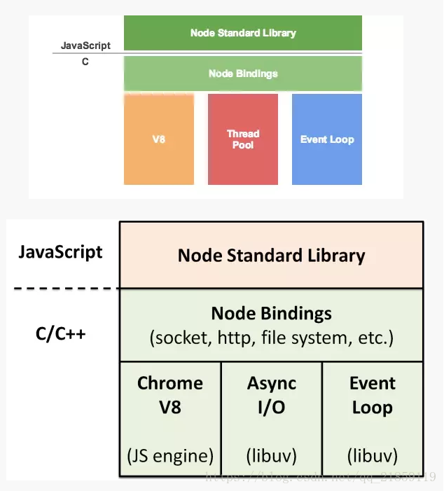
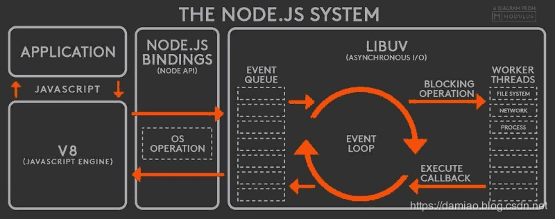
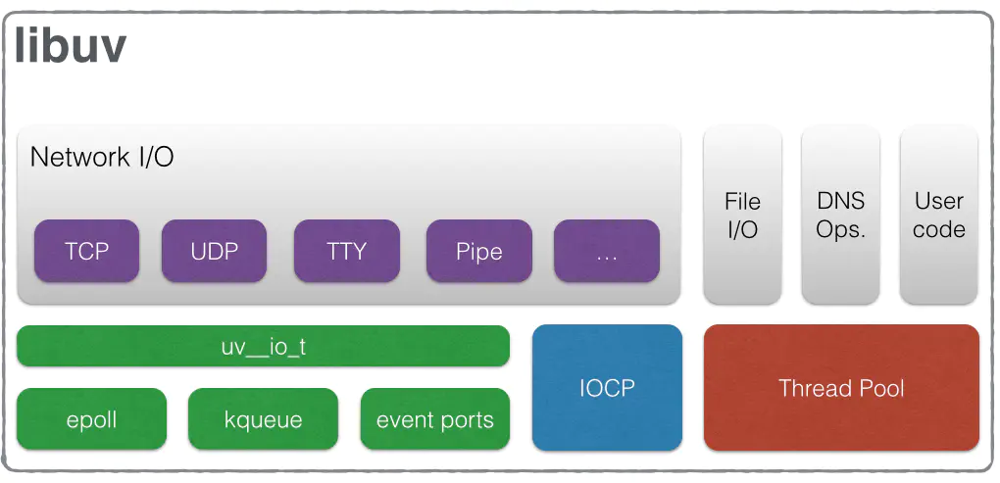
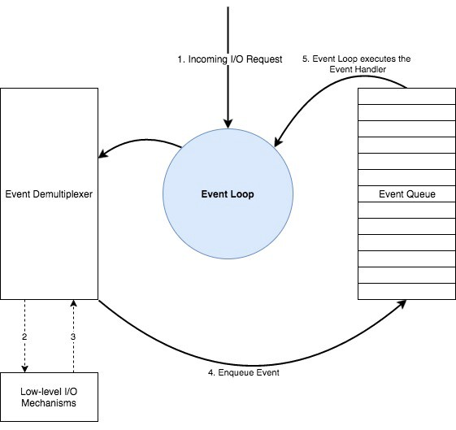
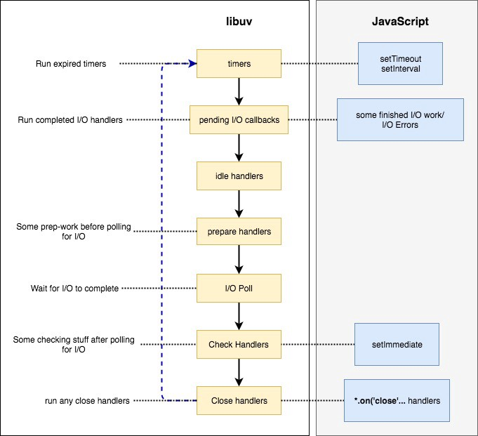
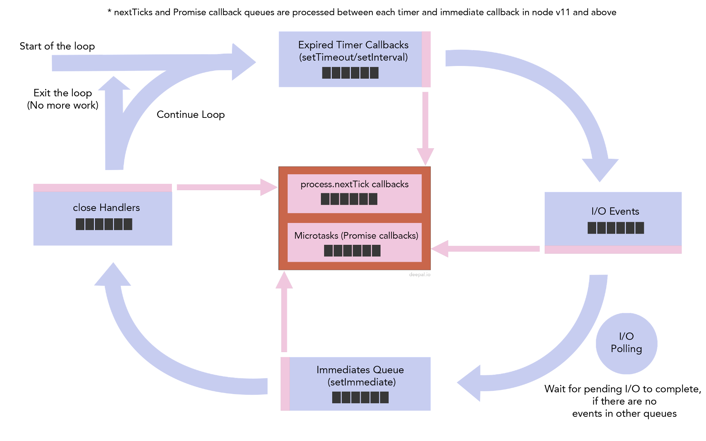
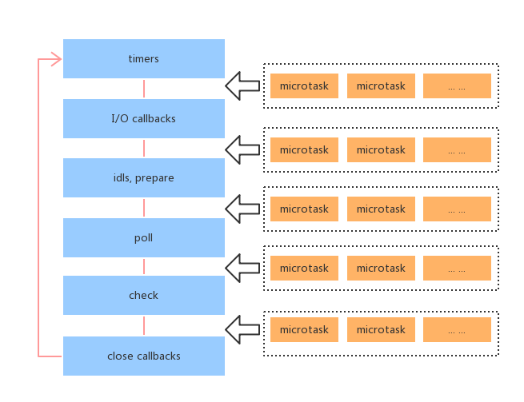

> 之前的一篇[文章](https://betamee.github.io/content/WebFrontEnd-%E6%B5%8F%E8%A7%88%E5%99%A8%E4%B8%AD%20JavaScript%20%E5%8D%95%E7%BA%BF%E7%A8%8B%E8%BF%90%E8%A1%8C%E6%9C%BA%E5%88%B6/))写了浏览器中的 JavaScript 的运行机制，谈到浏览器和 Node 关于事件循环的实现有着很大不同。本文将理清 Node 的事件循环机制，以作对比。
> 另外一个重大变更需要知道的，自从 Node V11 后，Node 中的事件循环已经和浏览器中表现一致了！具体见文。

## 目录

<!-- toc -->

- [Node 的设计架构](#Node-的设计架构)
- [阻塞和非阻塞](#阻塞和非阻塞)
- [关于 libuv](#关于-libuv)
- [事件循环的几个阶段](#事件循环的几个阶段)
- [微任务和宏任务](#微任务和宏任务)
- [nextTick 的问题](#nextTick-的问题)
- [定时器和微任务在NodeV11版本后的变更](#定时器和微任务在NodeV11版本后的变更)
- [async 代码运行机制](#async-代码运行机制)
- [代码练习](#代码练习)
- [总结](#总结)
- [参考](#参考)

<!-- tocstop -->

## Node 的设计架构

从官网的[介绍](https://nodejs.org/en/docs/meta/topics/dependencies/)中得知，Node 本身依赖于好几个类库构建而成的，底层都是 C/C++ 编写的，用于调用系统层级的 API和处理异步、网络等工作。

+ V8: JavaScript 引擎，由谷歌公司维护
+ libuv：它是一个 C 编写的高性能、事件驱动、非阻塞型 I/O 类库，并且提供了跨平台的API
+ llhttp：C 编写的 HTTP 解析类库
+ c-ares：C 编写的用于处理某些异步的 DNS 请求
+ OpenSSL：安全相关
+ zlib：压缩





由这张整体的架构图可以看到，Node 最重要的是 V8 和 libuv 这两部分，V8 不用说，是解析运行 JavaScript 的引擎，没有 V8 就没有 Node 的今天，而 libuv 是 Node 另一个重要的基石，提供事件循环和线程池，负责所有 I/O 任务的分发与执行，对开发者来说不可见，只需要调用封装好的 Node API 就可以了。

下面是另一张类似的原理图，可见要想深入理解 Node，必须要了解 libuv 的设计（深入理解需要学习 C++、操作系统）。



## 阻塞和非阻塞

在 I/O 操作中，代码有阻塞和非阻塞之分，也就是同步和异步代码，Node 同样提供了两套 API:

```js
// 同步阻塞
const fs = require('fs');
const data = fs.readFileSync('/file.md');

// 异步非阻塞
const fs = require('fs');
fs.readFile('/file.md', (err, data) => {
  if (err) throw err;
});
```

由于在 Node 中 JavaScript 的执行是单线程的，所以一旦发生长时间阻塞，会严重影响后面代码的运行，不像其他语言可以新开一个线程处理。如果选择了非阻塞的方式，就可以释放当前的 JS 引擎的工作，用于处理后面的请求，比如一个服务器请求要花 50ms，其中 45ms 花在了数据库 I/O 上，选择了非阻塞代码，可以将这 45ms 处理其他请求。这极大了提高了**并发性能**。

另外一个要注意的是，千万不要混用阻塞和非阻塞代码：

```js
// ！此代码有严重问题，会造成 BUG
const fs = require('fs');
fs.readFile('/file.md', (err, data) => {
  if (err) throw err;
  console.log(data);
});
fs.unlinkSync('/file.md');

// 正确做法！
fs.readFile('/file.md', (readFileErr, data) => {
  if (readFileErr) throw readFileErr;
  console.log(data);
  fs.unlink('/file.md', (unlinkErr) => {
    if (unlinkErr) throw unlinkErr;
  });
});
```

## 关于 libuv

libuv 是一个跨平台的类库，提供了**事件循环（event-loop）机制**和**异步 I/O 机制**，下图是其架构图：



libuv 作为底层的基石，将上层传递下来的 I/O 请求分配线程池，比如定时器请求、读取文件请求、网络请求等，待其完成后，再由**事件循环机制**分配各个请求的注册回调事件到任务队列（或者说消息队列）中，通知上层的 JS 引擎，空闲时捞起队列中的回调函数。



上图中描绘了事件循环机制的具体过程：

1. 事件调度器（Event demultiplexer ）接受 **I/O 请求**（如文件、网络），将其发给各个具体的线程或者专门的模块进行处理（底层实现比较复杂，具体见 NodeJS Event Loop Series）
2. 等 I/O 处理完了，事件调度器将**注册的回调事件**放在**任务队列**（或者也可以叫 Event Queue）中
3. 循环往复

事件循环机制将如上所示不停地保持运行状态，管理任务队列，调度各类事件，协调上下层之间的工作。而对于前端开发者来说，只需要考虑 JS 代码运行的模型，实现**异步非阻塞**的具体过程将交由 libuv 负责。

## 事件循环的几个阶段

具体到事件循环（event loop）中，也是分为好几个工作阶段：



+ 定时器（timers）阶段：这个阶段执行 `setTimeout` 和 `setInterval` 的 callback
+ 待定回调（pending I/O callbacks）阶段：这个阶段执行一些系统操作的回调，比如 TCP 错误。名字会让人误解为执行 I/O 回调处理程序, 实际上 I/O 回调会由 poll 阶段处理。
+ idle, prepare 阶段：仅 node 内部使用
+ 轮询（poll）阶段：获取新的 I/O 事件, 例如操作读取文件等等，适当的条件下 node 将阻塞在这里
+ 检查（check）阶段：执行 `setImmediate` 设定的 callback
+ 关闭的回调函数（close callbacks）阶段：一些关闭的回调函数，如：`socket.on('close', ...)`

最重要的是 timers、poll、check 阶段：

1. 定时器（timers）阶段：

指定一个下限时间，而不是精确时间，在到达下限时间后，timers 会尽可能执行回调，但系统调度或者其它回调的执行可能会延迟它们。

从技术上来说，poll 阶段会影响 timers 阶段的执行，所以 `setTimeout(callback, time)` 中， `time` 参数只是一个下限时间，是指到了这个时间后将 callback 置于 timers 阶段的队列中，至于真正的执行需要看事件循环有没有轮到这一阶段。

2. 轮询（poll）阶段

 轮询（poll）阶段是事件循环最重要的部分。它有两个重要功能：

+ 处理 poll 队列的事件
+ 当有已超时的 timer，执行它的回调函数

事件循环将同步执行 poll 队列里的回调，直到队列为空或执行的回调达到系统上限。如果没有其他阶段的事要处理，事件循环将会一直阻塞在这个阶段，等待新的 I/O 事件加入 poll 队列中。

如果其他阶段出现了事件，则有以下情况：
  + 如果 check 队列已经被 `setImmediate` 设定了回调, 事件循环将结束 poll 阶段往下进入 check 阶段来执行 check 队列（里面的回调 callback）。
  + 如果 timers 队列有到时的 `setTimeout` 或者 `setInterval` 回调，则事件循环将往上绕回 timers 阶段，并执行 timer 队列

3. 检查（check）阶段

这个阶段允许在 poll 阶段结束后立即执行回调。如果 poll 阶段空闲，并且有被 `setImmediate` 设定的回调，事件循环会转到 check 阶段而不是继续等待。

`setImmediate` 可以看作一个特殊的定时器，libuv 专门为它设置了一个独立阶段。

通常上来讲，随着代码执行，事件循环终将进入 poll 阶段，在这个阶段等待 incoming connection, request 等等。但是，只要有被 `setImmediate` 设定了回调，一旦 poll 阶段空闲，那么程序将结束 poll 阶段并进入 check 阶段，而不是继续等待 poll 事件。

这里可以用伪代码说明情况：

```js
// 事件循环本身相当于一个死循环，当代码开始执行的时候，事件循环就已经启动了
// 然后顺序调用不同阶段的方法
while(true){
// timer阶段
	timer()
// I/O callbacks阶段
	IO()
// idle阶段
	IDLE()
// poll阶段，大部分时候，事件循环将会停留在此阶段，等待 I/O 事件
	poll()
// check阶段
	check()
// close阶段
	close()
}
```

另外一个要理解的是，事件循环就像这段伪代码指明的，是一轮又一轮循环往复，所以事件回调函数**进入的时机**也很重要，以下面的代码举例：

```js
// 案例一
setTimeout(() => {
  console.log('setTimeout')
})

setImmediate(() => {
  console.log('setImmediate')
})
// 输出结果：
// 不确定，setTimeout 和 setImmediate 无法确定进入时机


// 案例二：
fs.readFile('file.path', (err, file) => {
  setTimeout(() => {
    console.log('setTimeout')
  })

  setImmediate(() => {
    console.log('setImmediate')
  })
})
// 输出结果：setImmediate setTimeout

// 案例三：
setTimeout(() => {
  console.log('setTimeout1')
  setImmediate(() => {
    console.log('setImmediate2')
  })
  setTimeout(() => {
    console.log('setTimeout2')
  })
})
// 输出结果：setTimeout1 setImmediate2 setTimeout2
```

这几个案例中，我们通过分析得以一窥事件循环的机制：

+ 案例一：在由于系统运行性能的不同，所以 `setTimeout` 进入 timers 队列时机不确定，可能比 `setImmediate` 早，也可能晚，这就导致了循环下来，输出的不确定
+ 案例二：进入事件循环的时候 `fs.readFile` 是在 I/O poll 阶段，所以事件循环的下一个阶段必然是 check 阶段，然后再绕回开头的 timers 阶段。所以一定是 `setImmediate` 比 `setTimeout` 早
+ 案例三：跟案例二相似，进入事件循环是在 timers 阶段，当此队列的回调执行完成后，又新增了 `setImmediate` 和 `setTimeout`，然后事件循环离开 timers 阶段，往下先进入 check 阶段，再回回过头来进入 timers 阶段。输出结果必然也是确定的。

## 微任务和宏任务

在 Node 中，还有另一个非常重要的概念是微任务和宏任务，微任务是指不在事件循环阶段中的任务，Node 中只有 process.nextTick 和 Promise callbacks 两个微任务，它们都有各自的队列，**不属于事件循环的一部分。**



那么它们的运行时机是在什么时候呢？

很简单，不管在什么地方调用，它们总是在各个阶段之间执行，上一阶段完成，进入下一阶段前，会清空 nextTick 和 promsie 队列！而且 nextTick 要比 promsie 要高！



下面是具体的一个案例，可以看到微任务 Promise，是在 timers 阶段之后才清空。说明微任务是在**阶段之间**才会处理，与浏览器只要有微任务就清空很不一样！

```js
setTimeout(() => {
  console.log('timeout1');
  Promise.resolve(1).then(() => {
    console.log('Promise1')
  })
});

setTimeout(() => {
  console.log('timeout2');
  Promise.resolve(1).then(() => {
    console.log('Promise2')
  })
});

// 输出
// timeout1
// timeout2
// Promise1
// Promise2
```

## nextTick 的问题

`process.nextTick` 有一个很大的问题，它会发生“饿死” I/O 的潜在风险：

```js
fs.readFile('file.path', (err, file) => {})

const loopTick = () => {
   process.nextTick(loopTick)
}
```

这段代码将会一直停留在 nextTick 阶段，无法进入到 `fs.readFile` 的回调中，这就是所谓的 *I/O starving*。

要解决这个问题，使用 `setImmediate` 替代，因为 `setImmediate` 属于事件循环，就算不停地循环，也不会阻塞整个事件循环机制，因为事件循环会在一轮又一轮处理 check 阶段的回调，而不像 nextTick 那么霸道，必须立即清空！

这特性在一些基础库中用得多。比如替代原生 Promise 的库 Q.js 和 Bluebird.js，相比于原生 Promise 的底层实现，Q 是基于 process.nextTick 来做流程控制，而 Bluebird 使用了 setImmediate。

## 定时器和微任务在NodeV11版本后的变更

随着 Node V11 的发布，nextTick 回调和 Promise 微任务将会在各个独立的 `setTimeout` and `setImmediate` 之间运行，即便当前的 timers 队列或者 check 队列不为空。这就跟浏览器的事件循环表现保持了一致！

当然，这对于从 Node V11 以下升级到 V11 以上的代码来说，可能是个潜在的风险。

## async 代码运行机制

前面谈了微任务中的 Promise 队列，那么对于同样是异步的 async 函数代码应该如何解释呢？

本段将简单说明以下 async 代码机制。

async 函数本质上是 Promise 的语法糖。每次我们使用 await, 解释器都创建一个 Promise 对象，然后把剩下的 async 函数中的操作放到 then 回调函数中。async/await 的实现，离不开 Promise。从字面意思来理解，async 是“异步”的简写，而 await 是 async wait 的简写可以认为是等待异步方法执行完成。

```js
setTimeout(function () {
  console.log('setTimeout')
})
Promise.resolve().then(() => {
  console.log('resolved')
})
async function async2() {
  console.log('async2')
}
async function async1() {
  console.log('async')
  await async2()
  console.log('async done')
}
async1()

// => 等同于

setTimeout(function () {
  console.log('setTimeout')
})
Promise.resolve().then(() => {
  console.log('resolved')
})
function async2() {
  console.log('async2')
}
function async1() {
  console.log('async')
  // wait 会将 async2 变为一个 Promise
  new Promise((resolve, reject) => {
    // 执行成功后进入 resolve 阶段
    async2()
    resolve()
  })
    // await 下面的代码运行时机是在上面的 Promise 运行之后
    .then(() => {
      console.log('async done')
    })
}
async1()
```
## 代码练习

最后整理一些代码练习，注意，这里区分新旧版本！

```js
// 案例一
setImmediate(function(){
  console.log("setImmediate");
  setImmediate(function(){
    console.log("嵌套setImmediate");
  });
  process.nextTick(function(){
    console.log("nextTick");
  })
});
// 旧版本 setImmediate nextTick setImmediate2
// 新版本 setImmediate nextTick setImmediate2

// 案例二
setTimeout(() => {
  console.log('timeout1');
  Promise.resolve(1).then(() => {
    console.log('Promise1')
  })
});

setTimeout(() => {
  console.log('timeout2');
  Promise.resolve(1).then(() => {
    console.log('Promise2')
  })
});
// 旧版本 timeout1 timeout2 Promise1 Promise2
// 新版本 timeout1 Promise1 timeout2 Promise2

// 案例三
setTimeout(() => {
  console.log('timeout0');
  Promise.resolve('resolved').then(res => console.log(res));
  Promise.resolve('time resolved').then(res => console.log(res));
  process.nextTick(() => {
      console.log('nextTick1');
      process.nextTick(() => {
          console.log('nextTick2');
      });
  });
  process.nextTick(() => {
      console.log('nextTick3');
  });
  console.log('sync');
  setTimeout(() => {
      console.log('timeout2');
  });
});

setTimeout(() => {
  console.log('setTimeout3')
  process.nextTick(() => {
    console.log('nextTick4');
  });
  Promise.resolve('resolved3').then(res => console.log(res));
})
// 旧版本：
// timeout0
// sync
// setTimeout3
// nextTick1
// nextTick3
// nextTick4
// nextTick2
// resolved
// time resolved
// resolved3
// timeout2

// 新版本：
// timeout0
// sync
// nextTick1
// nextTick3
// nextTick2
// resolved
// time resolved
// setTimeout3
// nextTick4
// resolved3
// timeout2

// 案例四：
async function async1(){
  console.log('async1 start')
  await async2()
  console.log('async1 end')
}
async function async2(){
  console.log('async2')
}
console.log('script start')
async1();
new Promise(function(resolve){
  console.log('promise1')
  resolve();
  console.log('promise2')
}).then(function(){
  console.log('promise3')
})
console.log('script end')

// 输出
// script start
// async1 start
// async2
// promise1
// promise2
// script end
// async1 end
// promise3

// 案例四：
process.nextTick(() => console.log('nextTick'));
new Promise(function(resolve){
  console.log('promise1')
  resolve();
  console.log('promise2')
}).then(function(){
  console.log('promise3')
})
// 旧版本：promise1 promise2 nextTick promise3
// 新版本：promise1 promise2 nextTick promise3
```

注意这里面的第三个案例有点奇怪，如果你能看出来的话，这点需要深入了解 async 的机制。

## 总结

讲了这么多关于 Node 事件循环的机制，跟浏览器怎么个不同法，到最后发现，新版本 Node 已经跟浏览器特性保持一致了！随着新版本的逐渐普及，以后只要记住一种运行模型就可以了，当然，Node 的事件循环阶段过程也不能忘，有必要的话甚至可以了解一些 libuv 的机制。从一个坑挖向另一个坑～

## 参考

+ [所有依赖项 \| Node.js](https://nodejs.org/zh-cn/docs/meta/topics/dependencies/)
+ [阻塞对比非阻塞一览 \| Node.js](https://nodejs.org/zh-cn/docs/guides/blocking-vs-non-blocking/)
+ [Node.js 事件循环，定时器和 process.nextTick() \| Node.js](https://nodejs.org/zh-cn/docs/guides/event-loop-timers-and-nexttick/)
+ [不要阻塞你的事件循环（或是工作线程池） \| Node.js](https://nodejs.org/zh-cn/docs/guides/dont-block-the-event-loop/)
+ [浏览器与Node的事件循环(Event Loop)有何区别?_Java_Fundebug博客-CSDN博客](https://blog.csdn.net/Fundebug/article/details/86487117)
+ [深入理解NodeJS事件循环机制_JavaScript_小青蛙的博客-CSDN博客](https://blog.csdn.net/WU5229485/article/details/103107550)
+ [从event loop到async await来了解事件循环机制 - 掘金](https://juejin.im/post/5c148ec8e51d4576e83fd836)
+ NodeJS Event Loop Series（这个系列不错）
  + [Event Loop and the Big Picture — NodeJS Event Loop Part 1](https://blog.insiderattack.net/event-loop-and-the-big-picture-nodejs-event-loop-part-1-1cb67a182810)
  + [Timers, Immediates and Process.nextTick— NodeJS Event Loop Part 2](https://blog.insiderattack.net/timers-immediates-and-process-nexttick-nodejs-event-loop-part-2-2c53fd511bb3)
  + [Promises, Next-Ticks, and Immediates— NodeJS Event Loop Part 3](https://blog.insiderattack.net/promises-next-ticks-and-immediates-nodejs-event-loop-part-3-9226cbe7a6aa)
  + [Handling IO — NodeJS Event Loop Part 4 - Deepal’s Blog](https://blog.insiderattack.net/handling-io-nodejs-event-loop-part-4-418062f917d1)
  + [Event Loop Best Practices — NodeJS Event Loop Part 5](https://blog.insiderattack.net/event-loop-best-practices-nodejs-event-loop-part-5-e29b2b50bfe2)
  + [New Changes to the Timers and Microtasks in Node v11.0.0 ( and above)](https://blog.insiderattack.net/new-changes-to-timers-and-microtasks-from-node-v11-0-0-and-above-68d112743eb3)