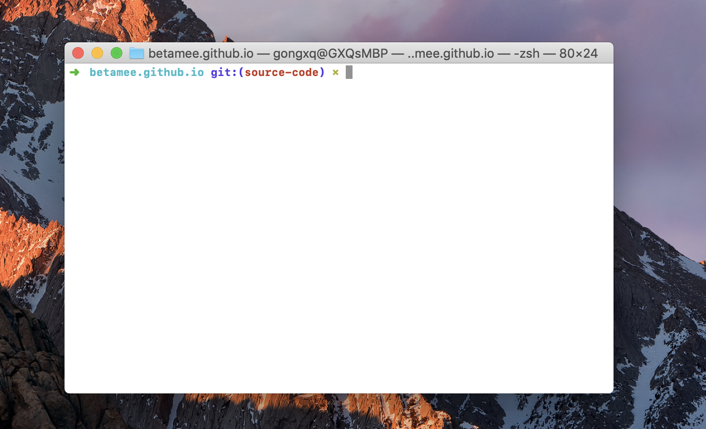
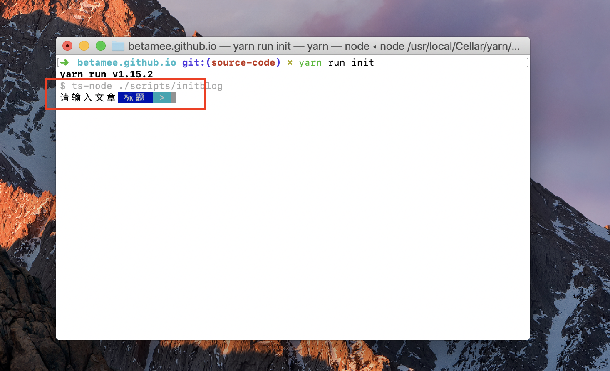
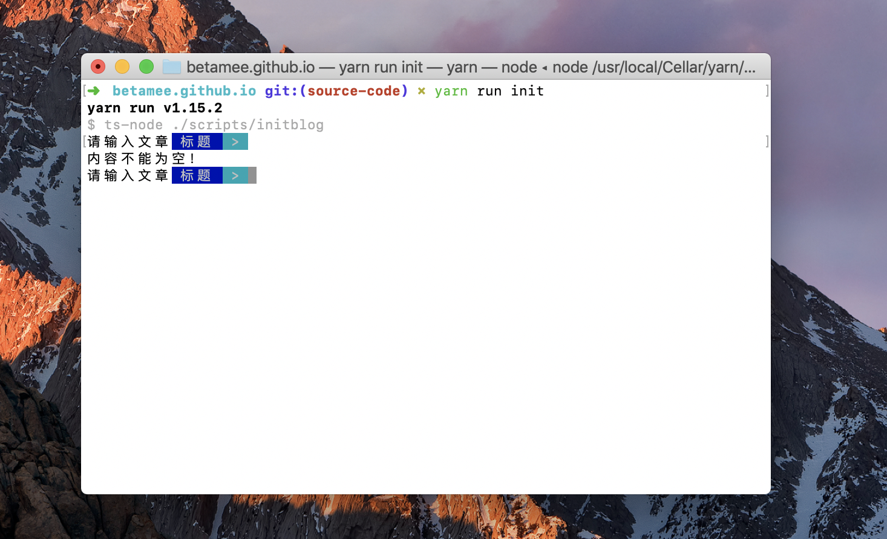
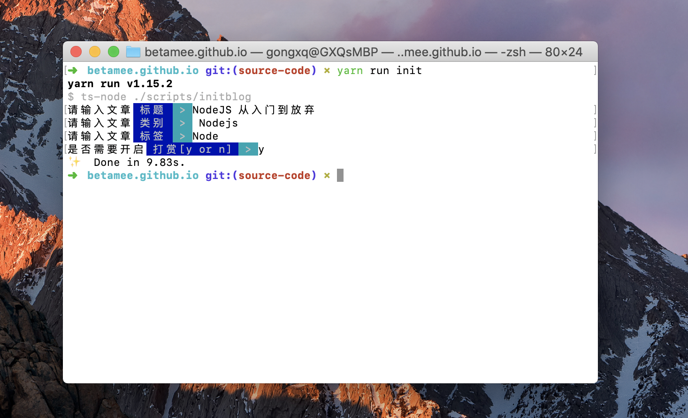
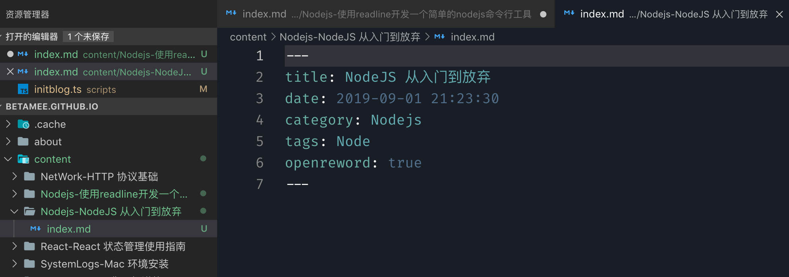

## 前言

自从开了这个博客后，时不时需要完善下博客的功能。很早以前其实我也有一个博客，不过那个用的是 [Hexo](https://hexo.io/) 傻瓜式的框架，总觉得欠缺点什么，所以自从发现了 [Gatsby.js](https://www.gatsbyjs.org/) 这个静态页面生成器后，就彻底喜欢上了这个工具。

这个工具的好处在于它提供了一套处理数据的接口，使用 graphql 进行查询，至于你用这个数据怎么玩，怎么展示，它不管，最终生成的是一个个静态页面。这就给了我非常高的自由度，可以自由定义页面、组件、功能。

现在的这个 [GitHub 仓库](https://github.com/BetaMee/betamee.github.io)就是我用 Gatsby 进行开发的源码，所有的博客文章都在 `/content` 文件夹下。上周呢，我新增了 TravisCI 进行自动部署，它会在它自己的服务器上上跑 `yarn run build`，然后将生成的 `public` 文件夹下的内容自动 deploy 到 `master` 分支上。 

到这一步，基本上已经很自动化了，不过还有一个比较难办的问题，就是每次新增一个新的文件，都需要手动添加文件夹、添加新文件、添加新的 meta 信息。所以我想着自己搞一个命令行工具来解决这个痛点。这就是本次介绍的内容：**使用readline开发一个简单的nodejs命令行工具**。

## readline 对象

这里用到的第一个 nodejs api 是 [readeline](https://nodejs.org/dist/latest-v10.x/docs/api/readline.html)。

这个 API 提供一个可以操纵 terminal 的接口：

```js
const rl = readline.createInterface({
    input: process.stdin,
    output: process.stdout,
    prompt: QuestionsPrompt[0]
})
```

通过给定的 `input`、`output` 参数，readline 可以获取 Readable stream 和 Writeable stream。这里的 `process.stdin`、`process.stdout`，也就是标准输入输出，可以在命令行中获取输入的数据。



<center>命令行</center>

初始化后，我们就可以使用 `rl` 实例对象进行操作了。

首先调用方法出提示：`rl.prompt()`：



然后注册 `line` 事件和 `close` 事件：

```js
rl.on('line', (line: string) => {
  // 处理输入事件
}).on('close', () => {
  // 处理关闭事件
})
```

`line` 事件只会在键盘输入 `\r\n` 、`\r` 、`\n` 才会触发回调函数，也就是我们习惯上常用的 `Enter` 键或者是 `Return` 键。

在 `line` 事件的回调函数中，才是我们需要关注的部分，这里我们将用来处理输入的内容：

```js
const handleSetDataFromReadline = (line: string) => {
  let result = ''
  switch(MetaResult.length) {
    case 0: // 文章
      result = line.trim()
      if (result === '') {
        process.stdout.write('内容不能为空！\r\n')
        // 出提示
        rl.prompt()
        return
      }
      // 存入数据
      MetaResult.push(line)
      // 进行下一步提问
      rl.setPrompt(`${QuestionsPrompt[1]}`)
      rl.prompt()
      break
    case 1: // 类别
      result = line.trim()
      if (result === '') {
        process.stdout.write('内容不能为空！\r\n')
        // 出提示
        rl.prompt()
        return
      }
      // 存入数据
      MetaResult.push(line)
      // 进行下一步提问
      rl.setPrompt(`${QuestionsPrompt[2]}`)
      rl.prompt()
      break
    case 2: // 标签
      result = line.trim()
      if (result === '') {
        process.stdout.write('内容不能为空！\r\n')
        // 出提示
        rl.prompt()
        return
      }
      // 存入数据
      MetaResult.push(line)
      // 进行下一步提问
      rl.setPrompt(`${QuestionsPrompt[3]}`)
      rl.prompt()
      break
    case 3: // 打赏
      result = line.trim()
      if (result === '') {
        process.stdout.write('内容不能为空！\r\n')
        // 出提示
        rl.prompt()
        return
      }

      if (result === 'y') {
        // 存入数据
        MetaResult.push(true)
        // 进行下一步提问
        rl.close()
      } else {
        process.stdout.write('输入只能为 y or n\r\n')
        // 出提示
        rl.prompt()
        return
      }
      break
    default: // 退出
      // 关闭命令行
      rl.close()
      break;
  }
}
```

这段程序的大意是对于捕获到的 `line: string` 参数进行处理，处理的方式也很简答，就是非常普通的 `swtich` 表达式来区别处理不同批次的内容，如第一行处理完后才能进行到第二行，否则程序会报错。这也是使用命令行经常见到的：




最后当都完成问题后，调用 `rl.close()` 来关闭命令行，这时候会触发 `close` 事件。在 `close` 事件的回调函数中，我们可以对输入获取到的数据进行处理，比如生成一个文件或者其他工作：





## fs 对象

上一节中提到的生成文件的工作，就是由 `fs` API 提供的，这里用到的也很简单，见代码：

```js
import fs from 'fs'
import { promisify } from 'util'

const fsMkdirAsync = promisify(fs.mkdir)
const fsWriteFileAsync = promisify(fs.writeFile)

const handleCreateNewTemplate = async () => {
  // tslint:disable-next-line: max-line-length
  const metaInfo = `---\r\ntitle: ${MetaResult[0]}\r\ndate: ${createDate()}\r\ncategory: ${MetaResult[1]}\r\ntags: ${MetaResult[2]}\r\nopenreword: ${MetaResult[3]}\r\n---`

  const newPostDir = `${newPostDirPath}${MetaResult[1]}-${MetaResult[0]}`
  // 创建目录
  await fsMkdirAsync(newPostDir)
  // 创建文件
  await fsWriteFileAsync(`${newPostDir}/index.md`, metaInfo, 'utf8')
  // 创建成功后关闭
  process.exit(0)
  console.log('再见!');
}
```

这里用到的是生成目录 `fs.mkdir` 和 `fs.writeFile` 两个方法，至于 `promisify` 这个方法是用来将 `fs` 的方法 promise 化的一个工具函数，因为如果不用 promise 的话，就要用到回调函数方式，而我讨厌回调函数。
