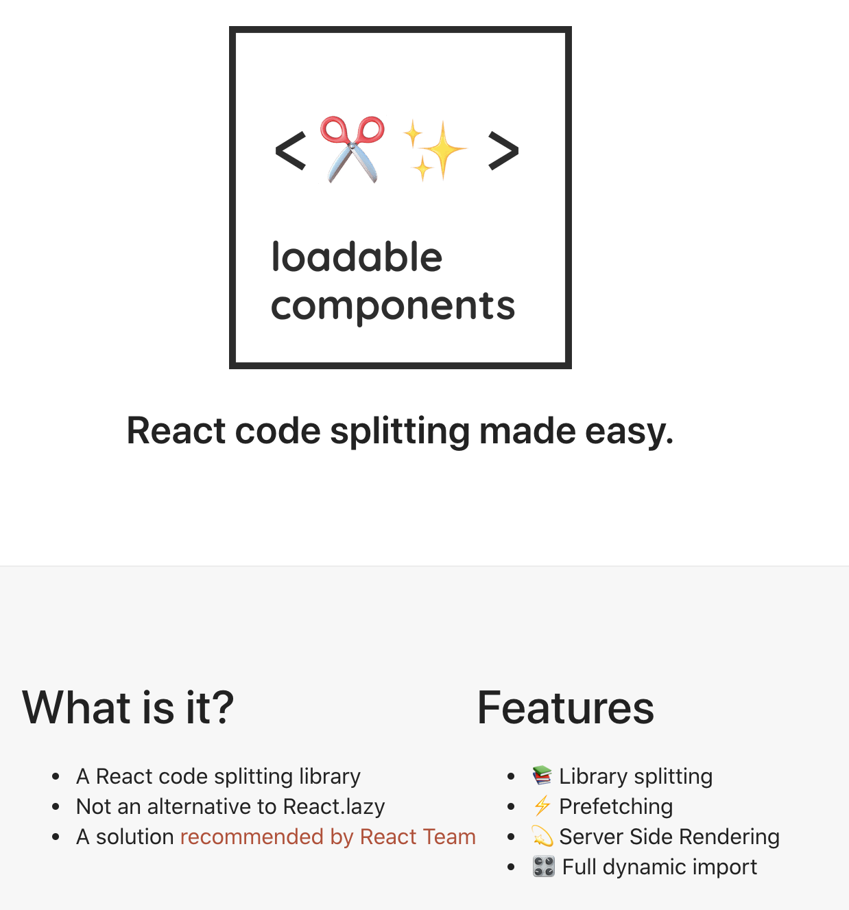
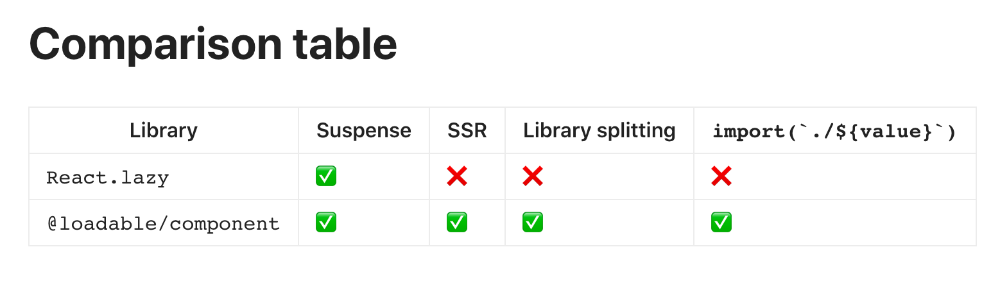
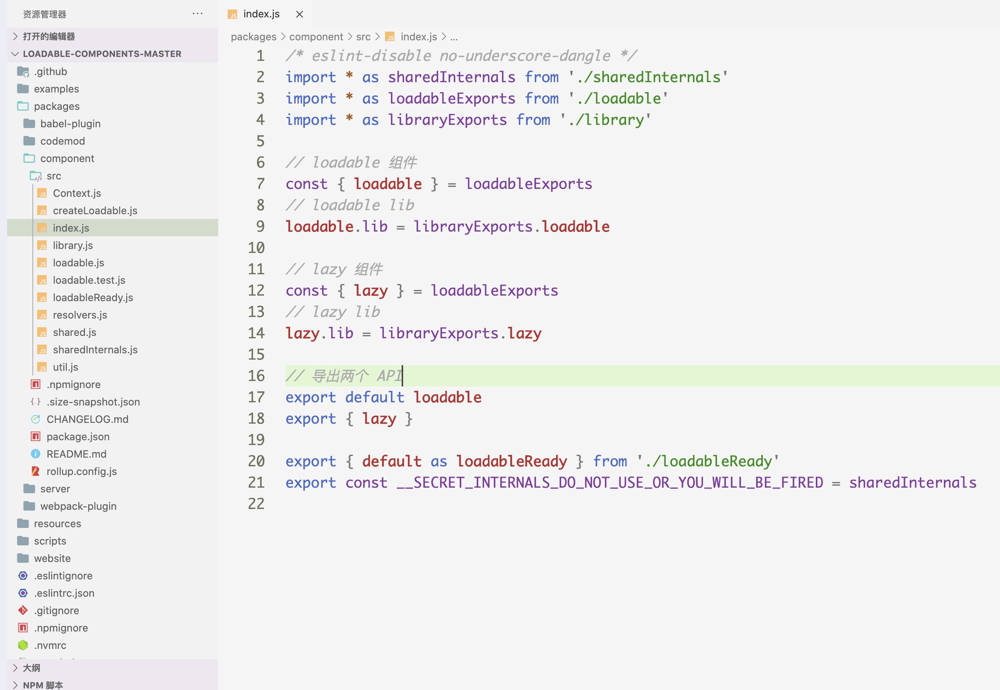

## 目录

<!-- toc -->

- [问题的产生](#问题的产生)
- [方案比较](#方案比较)
  * [动态导入](#动态导入)
  * [React.lazy](#Reactlazy)
  * [@loadable/component](#loadablecomponent)
  * [react-loadable](#react-loadable)
- [原理](#原理)
  * [@loadable/component](#loadablecomponent-1)
- [参考](#参考)

<!-- tocstop -->

## 问题的产生

代码分割是目前非常流行的前端技术。随着前端工程的日益复杂，引入了很多第三方库，代码体积也变得越来越大，我们需要合理的管理我们的资源包。

使用代码分割技术，将一个大的代码包拆分成多个小包，这个在页面前期只需要加载必须的资源，非必须的资源可以放在后期需要的时候再加载。比如有些模块用户可能都不会点击，只有等点击的时候才加载。这种懒加载可以显著提高页面早期的速度，提高性能体验。

所以我们需要寻求好的懒加载方案。

## 方案比较

在 React 体系中，目前有这几种方案可以选择：

+ import()
+ React.lazy
+ @loadable/component 
+ react-loadable

### 动态导入

动态导入 import() 是 es 原生支持的的一个方案。

import() 的优势是可以运行时加载模块，这样就能补齐 es import 命令的缺陷。因为相比于 CommonJS 的 require 可以动态加载脚本，import 命令是静态编译，在代码编译阶段就将模块关系确定了，所以这样的代码是毫无意义的：

```js
// 报错
if (x === 2) {
  import MyModual from './myModual';
}
```

有了 import()，就能动态加载脚本，在使用上非常灵活。

```js
// a.js
export default function Add() {
  ...
}
// b.js
if (x === 2) {
  import('./a.js')
    .then(module => {
      const Add = module.default
      Add()
    })
}
```

更重要的是执行 import() 返回的是 Promise，是一个异步的模块，也可以用 async 函数对其管理：

```js
async function main() {
    const myModule = await import('./myModule.js');
    const {
      export1,
      export2
    } = await import('./myModule.js');
    const [
      module1,
      module2,
      module3
    ] = await Promise.all([
      import('./module1.js'),
      import('./module2.js'),
      import('./module3.js')
    ])
}
main();
```

不过缺点在于，import() 语法很新，老的浏览器可能不会兼容。通过 Webpack + Babel 会将 import() 转换为 Promise + domcument.createElement('script') 的方式（针对于 web 端）。

### React.lazy

React.lazy 是 React 官方提供的一个代码分割方案。相比于import()，React.lazy 是针对于 React 组件的一个代码分割方案，需要配合 Suspense 使用：

```jsx
import React, { Suspense } from 'react';
import MyErrorBoundary from './MyErrorBoundary';

const OtherComponent = React.lazy(() => import('./OtherComponent'));
const AnotherComponent = React.lazy(() => import('./AnotherComponent'));

const MyComponent = () => (
  <div>
    <MyErrorBoundary>
      <Suspense fallback={<div>Loading...</div>}>
        <section>
          <OtherComponent />
          <AnotherComponent />
        </section>
      </Suspense>
    </MyErrorBoundary>
  </div>
);
```

优势上 React.lazy 是原生组件，可以搭配 ErrorBoundary 特性，容错上也更好。

缺点在于目前 React.lazy 和 Suspense 技术还不支持服务端渲染。所以如果要在服务端上使用懒加载，可以使用 @loadable/component 这个库。

### @loadable/component

@loadable/component 是社区版的一个代码分割方案，简单好用。



它相比于 React.lazy，最大的区别是支持服务端渲染。以及它跟 React.lazy 不冲突，还能使用 Suspense 特性，可以看作是 React.lazy 的一个增强版本：



使用上非常简单：

```jsx
import React, { Suspense } from 'react'
import { lazy } from '@loadable/component'

const OtherComponent = lazy(() => import('./OtherComponent'))

function MyComponent() {
  return (
    <div>
      <Suspense fallback={<div>Loading...</div>}>
        <OtherComponent />
      </Suspense>
    </div>
  )
}
```

### react-loadable

react-loadable 是另一个代码分割的方案，只不是这个库相比于 比较老，官网的介绍是这样的：

> A higher order component for loading components with dynamic imports.

可以简单看一下：

```jsx
import Loadable from 'react-loadable';
import Loading from './my-loading-component';

const LoadableComponent = Loadable({
  loader: () => import('./my-component'),
  loading: Loading,
});

export default class App extends React.Component {
  render() {
    return <LoadableComponent/>;
  }
}
```
react-loadable 属于上一代的方案，它很早就不维护了，不兼容 Webpack v4+ and Babel v7+。所以在目前的实践中还是考虑上面三种方案。

## 原理

### @loadable/component

这里研究一下 @loadable/component 这个库的源码。@loadable/component 其实是 @loadable 下的一个包，还有 @loadable/server、 @loadable/babel-plugin、@loadable/webpack-plugin 等包，是为服务端渲染而准备的，纯前端应该用不太到。目前只研究 @loadable/component。

下载 [@loadable/components](https://github.com/gregberge/loadable-components) 源码，可以看到它的目录结构：



最重要的部分是在 createLoadable.js 中：

```js

function createLoadable({
  defaultResolveComponent = identity,
  render,
  onLoad,
}) {
    function loadable(loadableConstructor, options = {}) {
      const ctor = resolveConstructor(loadableConstructor)
      const cache = {}
      // 获取缓存的 key，key 发生改变的时候会 reload 新资源
      function getCacheKey(props) {}
      // 将加载进来的模块通过 options.resolveComponent 取出模块
      function resolve(module, props, Loadable) {}
      // 内部主类
      class InnerLoadable extends React.Component {
        static getDerivedStateFromProps(props, state) {
          const cacheKey = getCacheKey(props)
          return {
            ...state,
            cacheKey,
            // key 的改变会触发新的 render 流程
            loading: state.loading || state.cacheKey !== cacheKey,
          }
        }

        constructor(props) {
          super(props)

          this.state = {
            result: null,
            error: null,
            loading: true,
            cacheKey: getCacheKey(props),
          }
        }

        componentDidMount() {
          this.mounted = true
          // 获取缓存
          const cachedPromise = this.getCache()
          // 如果 promise 状态是失败的，则清理
          if (cachedPromise && cachedPromise.status === STATUS_REJECTED) {
            this.setCache()
          }
          // 当还在 loading 的时候，则 loadAsync
          if (this.state.loading) {
            this.loadAsync()
          }
        }

        componentDidUpdate(prevProps, prevState) {
          // 只在 key 变更后才触发变化
          if (prevState.cacheKey !== this.state.cacheKey) {
            this.loadAsync()
          }
        }

        componentWillUnmount() {
          this.mounted = false
        }

        safeSetState(nextState, callback) {
          if (this.mounted) {
            this.setState(nextState, callback)
          }
        }

        getCacheKey() {
          return getCacheKey(this.props)
        }

        getCache() {
          return cache[this.getCacheKey()]
        }

        setCache(value = undefined) {
          cache[this.getCacheKey()] = value
        }

        triggerOnLoad() {
          if (onLoad) {
            setTimeout(() => {
              onLoad(this.state.result, this.props)
            })
          }
        }

        // 同步加载模块，在一些场景有用，比如 node 端（webpack target=node）
        loadSync() {}

        // 核心：异步加载模块，加载和解析过程分解的
        loadAsync() {
          const promise = this.resolveAsync()

          promise
            .then(loadedModule => {
              const result = resolve(loadedModule, this.props, { Loadable })
              this.safeSetState(
                {
                  result,
                  loading: false,
                },
                () => this.triggerOnLoad(),
              )
            })
            .catch(error => this.safeSetState({ error, loading: false }))

          return promise
        }

        // 核心：异步解析模块
        resolveAsync() {
          const { __chunkExtractor, forwardedRef, ...props } = this.props

          let promise = this.getCache()

          if (!promise) {
            // requireAsync 就是使用中用到的 () => import('./')，它会返回一个 promise
            promise = ctor.requireAsync(props)
            promise.status = STATUS_PENDING

            this.setCache(promise)

            promise.then(
              () => {
                promise.status = STATUS_RESOLVED
              },
              error => {
                promise.status = STATUS_REJECTED
              },
            )
          }

          return promise
        }
        // render 函数，其实就是 React 组件的 render，没有啥特别的
        render() {
          const {
            forwardedRef,
            fallback: propFallback,
            __chunkExtractor,
            ...props
          } = this.props
          const { error, loading, result } = this.state
          // suspense 功能配置
          if (options.suspense) {
            const cachedPromise = this.getCache() || this.loadAsync()
            if (cachedPromise.status === STATUS_PENDING) {
              throw this.loadAsync()
            }
          }
          // 错误则 throw
          if (error) {
            throw error
          }
          // 兜底 loading
          const fallback = propFallback || options.fallback || null
          if (loading) {
            return fallback
          }
          
          return render({
            fallback,
            result,
            options,
            props: { ...props, ref: forwardedRef },
          })
        }
      }
      // 这里是对于 InnerLoadable 做一些增强功能，包括转发 ref
      const EnhancedInnerLoadable = withChunkExtractor(InnerLoadable)
      const Loadable = React.forwardRef((props, ref) => (
        <EnhancedInnerLoadable forwardedRef={ref} {...props} />
      ))

      // preload 功能
      Loadable.preload = props => ctor.requireAsync(props)

      return Loadable
    }
    function lazy(ctor, options) {
      ...
    }

    return { loadable, lazy }
}

export default createLoadable
```

整体阅读下来不难，就是一个 React 组件，内部去调用 loadAsync()，帮开发者去管理懒加载资源，本质上还是跑 import() 命令，在 Webpack 的编译下，也是 Promise + document.createElement('script') 这一套。

lazy 部分的函数我没有研究，因为这个需要深入看一下 React.lazy 和 Suspense 的东西，所以先放一放，后续有需要再说。

## 参考

+ [GitHub - gregberge/loadable-components: The recommended Code Splitting library for React ✂️✨](https://github.com/gregberge/loadable-components)
+ [GitHub - jamiebuilds/react-loadable: A higher order component for loading components with promises.](https://github.com/jamiebuilds/react-loadable)
+ [代码分割 – React](https://zh-hans.reactjs.org/docs/code-splitting.html)
