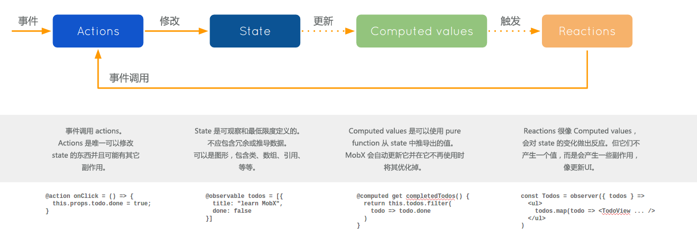

## 目录

<!-- toc -->
- [1. 引言](#1-引言)
- [2. 状态管理之 Redux 解决方案](#2-状态管理之-redux-解决方案)
- [3. 状态管理之 MobX 解决方案](#3-状态管理之-mobx-解决方案)
- [4. 这个 example 长啥样](#4-这个-example-长啥样)
- [5. Classic React App with Redux](#5-Classic-React-App-with-Redux)
- [6. Classic React App with Mobx](#6-Classic-React-App-with-Mobx)
- [7. React Hooks App with Redux](#7-React-Hooks-App-with-Redux)
- [8. React Hooks App with Mobx](#8-React-Hooks-App-with-Mobx)
- [9. 总结](#9-总结)
- [参考](#参考)
<!-- tocstop -->

## 1. 引言

在日趋复杂的 Web 应用中，状态管理一直是一个很重要的话题。React 技术栈中也衍生出了不少解决方案，如 Redux、Mobx，并且随着 React Hooks 的发布，带来全新的代码编写模式，在状态管理库的使用上也出现了很多新变化。

为了指明 React 状态管理，我写了几个 examples，并比较一下其中的使用差异。

开发同一个 Todo App，但使用方式分为以下四种：

* 使用类模式的 React + Redux
* 使用类模式的 React + Mobx
* 使用 Hooks 模式的 React + Redux
* 使用 Hooks 模式的 React + Mobx

全部代码发布在 Github 的这个仓库 [GitHub - BetaMee/react-usage-examples: React Usage Examples](https://github.com/BetaMee/react-usage-examples) 上，可供参考。

## 2. 状态管理之 Redux 解决方案

Redux 是很火的一个技术解决方案，甫一推出就备受关注。Redux 由 [Flux](http://facebook.github.io/flux/) 演变而来，但受 Elm 的启发，避开了 Flux 的复杂性。它提供了一套简单但有效的 API，提供可预测化的状态管理。但在学习难度上非常陡峭，因为它带来新的概念和约定，只有理解通了，才可以更好的应用它。

要理解 Redux，可以分为以下几个点：

> 1. 所有的 state 都以一个对象树的形式存储在一个单一的 store 中
> 2. UI 是这个 state 树某一时刻状态的映射
> 3. 改变 state 树的唯一方式是触发一个 action，一个描述发生什么的对象
> 4. 至于对 state 树的具体改变操作，是由叫 reducers 的纯函数来实现
> 5. 更新后的 state 树又映射为新的 UI


<center>图 2.1 Redux Flow</center>

由上可以总结为**Redux 三大原则：**

> * 单一数据源
> * state 是只读的
> * 使用纯函数来执行修改

理通上述概念基本上可以入门 Redux 了。但只有上述概念无法解决 Web 应用更复杂的场景，如异步加载数据更新界面。

这就需要涉及到 Redux 中的**中间件**概念。

使用中间件，我们可以在 state 变化的时候对数据进行*监控、截获、更改*，还可以拓展异步操作。这就给了我们很大的自由，充分发挥 Redux 的潜力。

Redux 的中间件实质上是一个函数，是对`store.dispatch`方法进行了改造，在发出 Action 和执行 Reducer 这两步之间，添加了特定功能。


<center>图 2.2 Redux Flow Middleware</center>

Redux 社区已经发展了很多成熟的中间件，如 redux-thunk、redux-soga，只需要按需使用即可。

具体可参考：[redux#ecosystem#middleware](https://redux.js.org/introduction/ecosystem#middleware) 和 中文版本的 [cnredux#ecosystem](http://cn.redux.js.org/docs/introduction/Ecosystem.html)

## 3. 状态管理之 MobX 解决方案

与 Redux 相似的，前端出现的另一个状态管理方案是 MobX。

MobX 的官网是这样介绍的：

> MobX 是一个经过战火洗礼的库，它通过透明的函数响应式编程 (transparently applying functional reactive programming - TFRP) 使得状态管理变得简单和可扩展。MobX背后的哲学很简单:
> *任何源自应用状态的东西都应该自动地获得。*
> 其中包括UI、数据序列化、服务器通讯，等等。



<center>图 3-1 MobX Flow</center>

其实相比 Redux 的强规则约定，MobX 明显更简单灵活，MobX 的核心原理是**通过 action  触发 state 的变化，进而触发 state 的衍生对象（Computed value & Reactions）**。开发者只需要定义需要 Observe 的数据和由此衍生的数据（Computed value）或者操作 (Reactions），剩下的更新自然就交给 MobX 去做就可以了。

MobX 和 Redux 比较大概体现出这些差异：

> 1. Redux 是函数式而 MobX 是面向对象
> 2. Redux 的 state 每次返回新的数据，理想状态是 immutable 的，MobX 则至始至终保持一份引用
> 3. Redux 可支持数据回朔，MobX 由于只有一份引用，无法支持回朔
> 4. Redux 约定单一数据源，MobX 可以将 state 树拆分进多个 store 中
> 5. Redux 需要中间件处理异步，MobX 可以直接使用 async/await 来处理

总之，两者相比，MobX 确实比 Redux 上手更容易些，并且不需要写很多样板代码，但 Redux 的这种“复杂”不一定是无用的，强约定的规则可以为大型项目，复杂数据状态管理提供可靠的支持，而 MobX 在某些场景下确实可以比 Redux 项目提供更高效的选择。

但也不能简单地就将 Redux 复杂化，MobX 简单化，还是要看适合的场景。我们应该更关注它们解决什么问题，它们解决问题的关注点，或者说实现方式是什么，它们的优缺点还有什么，哪一个更适合当前项目，以及项目未来发展。

## 4. 这个 example 长啥样

我们做的这个 Todo 只涉及到简单的增删功能：


## 5. Classic React App with Redux

接下来我将具体介绍四个 example 的用法，并从中学习**项目的组织模式、代码的编写模式**，看一看 React 的状态管理库的应用发展。

第一个是 Classic React App with Redux，是使用“传统”的类模式 + Redux 进行开发的。这个模式在 Redux 刚推出时就有了。

我们通过 create-react-app 脚手架来搭建我们的启动应用，这将会节省我们很多时间：

```bash
npx create-react-app classicreactwithredux --typescript
```

这里使用的是 Typescript 模版，整个应用都将以 TS 来开发，所以这也是个学习 TS 的一个练手机会。

以下是整个应用的代码文件：

```text
├── README.md
├── package.json
├── public
│   ├── favicon.ico
│   ├── index.html
│   └── manifest.json
├── src // 源码文件，所有的代码在这里
│   ├── App.css
│   ├── App.test.tsx
│   ├── App.tsx // App 入口
│   ├── components // UI 组件
│   │   ├── TodoAdd.tsx
│   │   ├── TodoCounter.tsx
│   │   ├── TodoView.tsx
│   │   ├── TodoViewList.tsx
│   │   ├── assets
│   │   │   ├── delete.svg
│   │   │   ├── select.svg
│   │   │   └── select2.svg
│   │   └── styles
│   │       ├── TodoAdd.css
│   │       ├── TodoCounter.css
│   │       ├── TodoView.css
│   │       └── TodoViewList.css
│   ├── containers // 容器组件
│   │   ├── TodoAddContainer.ts
│   │   ├── TodoCounterContainer.ts
│   │   └── TodoViewListContainer.ts
│   ├── index.css
│   ├── index.tsx // 整个应用的入口文件
│   ├── interfaces // 定义的 ts 接口文件
│   │   ├── component.ts
│   │   └── index.ts
│   ├── react-app-env.d.ts
│   ├── serviceWorker.ts
│   └── store // 这里放置 store 文件
│       ├── store.ts
│       └── todo // 按角色划分 state 树，一个文件夹一个角色
│           ├── actions.ts
│           ├── index.ts
│           ├── reducers.ts
│           └── types.ts
├── tsconfig.json
└── yarn.lock
```

`index.tsx` 作为入口文件，承担着全局初始化工作的任务，可以将初始化 store 、render app 等任务放在这里。

我们通过 `react-redux` 提供的 `Provider` 包裹 `App` 组件，将 store 数据注入全局应用，下面的组件可以通过一定方式获取 redux 的数据。后续我会介绍如何在 container 组件中使用。

```ts
import React from 'react';
import ReactDOM from 'react-dom';
import { Provider } from 'react-redux';
import './index.css';
import App from './App';
import * as serviceWorker from './serviceWorker';

import configureStore from './store/store'
// 初始化 redux store
const AppStore = configureStore()

ReactDOM.render(
  <Provider store={AppStore}>
    <App />
  </Provider>,
  document.getElementById('root')
);

serviceWorker.unregister();
```
在 `configureStore` 函数中，执行的是组合 root state、加载中间件任务，所有对 redux 的配置基本上都在这里：

```ts
import {
  createStore,
  combineReducers
} from 'redux';

import { todoReducer } from './todo/';

// 根 rootReducer
const rootReducer = combineReducers({
  todoReducer: todoReducer
})

// 导出store 类型
export type AppState = ReturnType<typeof rootReducer>

const configureStore = () => {
  // 组合中间件，这个例子没有用到
  // const middlewares = [thunkMiddleware];
  // const middleWareEnhancer = applyMiddleware(...middlewares);
  // 创建 store
  const store = createStore(rootReducer);
  return store;
}

export default configureStore

export * from './todo'
```
这里我们对 Redux 的 state 按**角色**划分，如这里的状态数据 todo，我们在 todo 的文件夹下配置 `action`、`reducers` 项，然后统一导出：

```text
│       └── todo // 按角色划分 state 树，一个文件夹一个角色
│           ├── actions.ts
│           ├── index.ts
│           ├── reducers.ts
│           └── types.ts
```

这个的好处就是依赖清晰，后续扩展很方便，比如再增加一个新的状态数据，只需要新增文件夹，把这个“**角色**”的逻辑写清楚就可以了。

当然，Redux 不只是可以按照角色划分，也可以按照**功能**划分，如所有的 `actions` 统一放到 action 文件夹下， `reducers` 放到 renduers 文件夹下:

```text
// 示例：按功能拆分文件夹
│       └── actions
│           ├── index.ts
│       └── renduers
│           ├── index.ts
│       └── types
│           ├── index.ts
```

接下来，我们看一下 todo 文件下，是如何编写 Reducer 和 Action 逻辑的：


**reducers.ts:**

```ts
import {
  TodoReducerType,
  TodoActionType
} from './types'

import {
  ADD_TODO,
  REMOVE_TODO,
  SELECT_TODO
} from './types'

// 初始化状态
const initalState: TodoReducerType = []

export const todoReducer = (state = initalState, action: TodoActionType): TodoReducerType => {
  switch(action.type)  {
    case ADD_TODO:
      return [...state, {
        id: Math.random(),
        name: action.name,
        finished: false
      }]

    case REMOVE_TODO:
      return state.filter(todo => todo.id !== action.id)

    case SELECT_TODO:
      return state.map(todo => {
        if (todo.id === action.id) {
          return {
            ...todo,
            finished: !todo.finished
          }
        } else {
          return todo
        }
      })
    default:
      return state;
  }
}

```

**actions.ts:**

```ts
import {
  ADD_TODO,
  REMOVE_TODO,
  SELECT_TODO
} from './types'

import {
  TodoActionType
} from './types'

export const addTodo = (name: string): TodoActionType => ({
  type: ADD_TODO,
  name: name
})

export const removeTodo = (id: number): TodoActionType => ({
  type: REMOVE_TODO,
  id: id
})

export const selectTodo = (id: number): TodoActionType => ({
  type: SELECT_TODO,
  id: id
})
```

这两个文件决定了每个角色 state 以下两个关键点，这是使用 Redux 的精髓：

> 1. action 纯函数：描述如何改变状态（是什么）
> 2. reducer 纯函数：描述具体改变状态的逻辑（怎么做）


其中 `actions.ts` 中的函数是我们需要导入到 UI 组件中去的，才能发挥作用。

那么我们是如何将 `actions`（操作） 和 `state`（状态）具体导入到组件中去呢？

这就是 container 文件夹下的 container 组件需要回答的问题:

```text
│   ├── containers // 容器组件
│   │   ├── TodoAddContainer.ts
│   │   ├── TodoCounterContainer.ts
│   │   └── TodoViewListContainer.ts
```

其实不要被 Redux 中所谓的**容器组件**、**UI 组件**概念迷惑，这其实就是一个连接 Redux 和 React 组件的中间步骤而已。

这里以 `TodoViewListContainer.ts` 为例：

```ts
import { connect } from 'react-redux'
import {
  Dispatch
} from 'redux'

import TodoViewList from '../components/TodoViewList'

import {
  AppState,
  TodoActionType,

  removeTodo,
  selectTodo
} from '../store/store'

const mapStateToProps = (state: AppState) => ({
  todos: state.todoReducer
})

const mapDispatchToProps = (dispatch: Dispatch<TodoActionType>) => ({
  removeTodoById: (id: number) => dispatch(removeTodo(id)),
  selectTodoById: (id: number) => dispatch(selectTodo(id))
})

export default connect(mapStateToProps, mapDispatchToProps)(TodoViewList)
```

其中，`TodoViewList` 是具体的 React 组件，`mapStateToProps`、`mapDispatchToProps` 如其名字所示，是将 action 和 state 作为 React 的 `props` 往下导入。

然后在 `TodoViewList` 组件中，我们这样使用：

```tsx
import React from 'react'

import TodoView from './TodoView'
import './styles/TodoViewList.css'

import {
  IViewListProp
} from '../interfaces'

const TodoViewList: React.FC<IViewListProp> = ({
  todos,
  selectTodoById,
  removeTodoById
}) => (
  <div className="viewlist">
    {todos.map((item, index) => (
      <TodoView
        todo={item}
        selectTodoById={selectTodoById}
        removeTodoById={removeTodoById}
        key={index}
      />
    ))}
  </div>
)

export default TodoViewList
```

这就是 React 和 Redux 的结合使用，到这一步基本完成所有的工作了，后续只要 state 有变化，组件就会发生更新，而**要使 state 发生变化，唯一的途径是传入的 action 函数**。这样，整个应用依赖清晰，数据流变化清晰可调控，对于排查问题非常方便。

## 6. Classic React App with Mobx

接下来我们看看使用类模式 + MobX 架构的 Todo 应用。

先整体看一下这里的文件结构：

```text
├── README.md
├── package.json
├── public
│   ├── favicon.ico
│   ├── index.html
│   └── manifest.json
├── src // 源码
│   ├── App.css
│   ├── App.test.tsx
│   ├── App.tsx
│   ├── components // UI 组件
│   │   ├── TodoAdd.tsx
│   │   ├── TodoCounter.tsx
│   │   ├── TodoView.tsx
│   │   ├── TodoViewList.tsx
│   │   ├── assets
│   │   │   ├── delete.svg
│   │   │   ├── select.svg
│   │   │   └── select2.svg
│   │   └── styles
│   │       ├── TodoAdd.css
│   │       ├── TodoCounter.css
│   │       ├── TodoView.css
│   │       └── TodoViewList.css
│   ├── index.css
│   ├── index.tsx // 入口
│   ├── interfaces // 定义的 ts 接口
│   │   ├── base.ts
│   │   └── index.ts
│   ├── react-app-env.d.ts
│   ├── serviceWorker.ts
│   └── store // 存放 mobx store
│       ├── TodoListStore.ts
│       └── index.ts
├── tsconfig.json
└── yarn.lock
```

和 Redux 的最大区别在于，Redux 是面向函数式的思维，而 MobX 是**面向对象**的思维。我们来看一下在 MobX 中是如何定义 store 的：

```ts
import {
  observable,
  computed,
  action
} from 'mobx'

import {
  ITodo
} from '../interfaces'

class Todo {
  id = Math.random();
  @observable name: string;
  @observable finished = false;
  constructor(name: string) {
    this.name = name;
  }
}

class TodoListStore {
  @observable todos: Array<ITodo> = []
  @computed get finishedTodoCount() {
    return this.todos.filter(todo => todo.finished).length
  }
  @computed get totalCount() {
    return this.todos.length
  }
  @action
  public finishTodoById = (id: number) => {
    this.todos.forEach(todo => {
      if (todo.id === id) {
        todo.finished = !todo.finished
      }
    })
  }
  @action
  public addNewTodo = (name: string) => {
    this.todos.push(new Todo(name))
  }
  @action
  public removeTodoById = (id: number) => {
    // 找到某一项的位置
    const index = this.todos.findIndex(todo => todo.id === id)
    this.todos.splice(index, 1)
  }
}

export default TodoListStore
```

我们定义一个类，里面封装**状态 + 函数**，给状态打上 `@observable` 装饰器，给函数打上 `@action` 装饰器。因为 MobX 在约束上很自由，只要触动 ` @observable` 的数据就会发生更新，但这样的话就会发生滥用**通过状态直接更新**的操作，不容易追踪数据变化流程。比如在组件中随手的一个：`this.props.todos.push(...)`，这就会触发整个应用数据更新。

所以 MobX 推荐使用严格模式，我们只能通过被 `@action` 状态装饰过的函数来变更状态，这个和 Redux 中通过 action 函数来变更状态思路是一致，保证数据变化可追踪调控。

与 Redux 另一个不同点，是在 MobX 中我们直接可以编写**计算过**的 `@computed` 数据逻辑，在 Redux 中，我们只能通过获取的 state 手动计算，而在 MobX 中，通过 `@computed` 装饰的 `get` 函数可以一直获取最新的计算值。这也是 MobX 的理念：**任何源自应用状态的东西都应该自动地获得**。

由于 MobX 不像 Redux 约定单一数据源，所以我们要拓展状态也很简单，继续添加新的类，封装好需要 `@observable` 的状态、 `@computed` 的状态以及对应于数据更新的 `@action` 函数。

在组件接入 MobX 的过程也比 Redux 要简单很多。

首先是在入口组件中配置：

```tsx
import React from 'react';
import ReactDOM from 'react-dom';
import './index.css';
import App from './App';
import {
  TodoListStore
} from './store'

import {
  Provider
} from 'mobx-react'

// 状态
const rootStore = {
  todoListStore: new TodoListStore()
} 

// 通过 Provider/inject 来注入，react 16.8 + 可以使用 hooks + context 来注入
ReactDOM.render(
  <Provider {...rootStore} >
    <App />
  </Provider>,
  document.getElementById('root') as HTMLElement
);
```

然后在需要使用 MobX 状态的组件中使用 `mobx-react` 包中的 `observer` 和 `inject` 高阶函数将数据注入：

**App.tsx:**

```tsx
import React from 'react';

import {
  observer,
  inject
} from 'mobx-react'

import TodoAdd from './components/TodoAdd'
import TodoViewList from './components/TodoViewList'
import TodoCounter from './components/TodoCounter'
import './App.css';

import { IAppProp } from './interfaces'

// ! @inject 高阶方法注入会和 Typescript 有冲突，原因在于 TS 会检查外部调用传进来的 props 接口，
// ! 但是 inject 相当于中间注入，避开了检查，这就导致 TS 报错。

const App: React.FC<IAppProp> = inject('todoListStore')(observer(({ todoListStore }) => {
  return (
    <div className="app">
      <div className="app-title">Classic React App ( mobx )</div>
      <TodoAdd
        addNewTodo={todoListStore!.addNewTodo}
      />
      <TodoViewList
        todos={todoListStore!.todos}
        finishTodoById={todoListStore!.finishTodoById}
        removeTodoById={todoListStore!.removeTodoById}
      />
      <TodoCounter
        finishedCount={todoListStore!.finishedTodoCount}
        totalCount={todoListStore!.totalCount}
      />
    </div>
  );
}))

export default App;
```

**TodoViewList.tsx:**

```tsx
import React from 'react'
import { observer } from 'mobx-react'

import TodoView from './TodoView'
import './styles/TodoViewList.css'

import {
  IViewListProp
} from '../interfaces'

@observer
class TodoViewList extends React.Component<IViewListProp, {}> {
  render() {
    const {
      removeTodoById,
      finishTodoById,
      todos
    } = this.props
    return (
      <div className="viewlist">
        {todos.map((item, index) => (
          <TodoView
            todo={item}
            finishTodoById={finishTodoById}
            removeTodoById={removeTodoById}
            key={index}
          />
        ))}
      </div>
    )
  }
}

export default TodoViewList
```

这里相比 Redux 复杂的“容器组件”概念来说，简单很多，只要在需要 MobX 状态的组件中使用 `@observer` 装饰器就可以了。简单明了。


## 7. React Hooks App with Redux

React 16.8 的发布带来了全新的 Hooks API，给 React 生态圈带来很多新思路。这里我们看看如何结合 Hooks + Redux 编写一样的应用，和类模式 + Redux 相比有何优势。

应用结构：

```text
├── README.md
├── package.json
├── public
│   ├── favicon.ico
│   ├── index.html
│   └── manifest.json
├── src // 源码
│   ├── App.css
│   ├── App.test.tsx
│   ├── App.tsx
│   ├── components
│   │   ├── TodoAdd.tsx
│   │   ├── TodoCounter.tsx
│   │   ├── TodoView.tsx
│   │   ├── TodoViewList.tsx
│   │   ├── assets
│   │   │   ├── delete.svg
│   │   │   ├── select.svg
│   │   │   └── select2.svg
│   │   └── styles
│   │       ├── TodoAdd.css
│   │       ├── TodoCounter.css
│   │       ├── TodoView.css
│   │       └── TodoViewList.css
│   ├── index.css
│   ├── index.tsx
│   ├── interfaces
│   │   ├── base.ts
│   │   └── index.ts
│   ├── react-app-env.d.ts
│   ├── serviceWorker.ts
│   └── store // redux store
│       ├── store.tsx
│       └── todo
│           ├── actions.ts
│           ├── index.ts
│           ├── reducers.ts
│           └── types.ts
├── tsconfig.json
└── yarn.lock
```

我们发现一个很大的区别，和 Classic React App with Redux 相比这里没有了 container 文件夹了！也就是说我们不需要使用 container 接入 Redux 了。

是的，原因在于这里我们使用的是 Context API + Hooks API。

Context API 来替代原有的 `react-redux` 包中 `Provider` 组件来全局注入数据。`Provider` 组件本质上也是用的 React Context API，只是以前不怎么受官方推崇，React 16 出来后，Context API 才正式被认可，使用方式上也变得更简单了。而另一方面， Hooks 中直接内置了对 Redux 的支持，这样就不用安装额外的 Redux 包了。

事实上，这个应用只用到了 React 自身的特性，没有安装任何外部依赖库：

```json
  "dependencies": {
    "@types/jest": "24.0.15",
    "@types/node": "12.6.8",
    "@types/react": "16.8.23",
    "@types/react-dom": "16.8.5",
    "react": "^16.8.6",
    "react-dom": "^16.8.6",
    "react-scripts": "3.0.1",
    "typescript": "3.5.3"
  }
```

Hooks 出现的意义在于可以共享业务逻辑，所以这个应用中最核心的文件在于 store 文件夹下的 `store.tsx`:

```tsx
import React from 'react'

import {
  TodoReducerType,
  TodoActionType,

  initalTodoState,
  todoReducer
} from './todo'

type combineDispatchsType = React.Dispatch<TodoActionType>

// 将所有的 dispatch 组合
const combineDispatchs = (dispatchs: Array<combineDispatchsType>) => (obj: TodoActionType) => {
  for (let i = 0;  i < dispatchs.length; i++) {
    dispatchs[i](obj)
  }
}

// 根组件状态
const AppState = {
  todoState: [] as TodoReducerType,
  dispatch: {} as ReturnType<typeof combineDispatchs>
}

// Context
export const ContextStore = React.createContext(AppState)

const HookContextProvider: React.FC = ({ children }) => {

  const [todoState, todoDispatch] = React.useReducer(
    todoReducer,
    initalTodoState
  )

  return (
    <ContextStore.Provider
      value={{
        todoState,
        dispatch: combineDispatchs([
          todoDispatch
        ])
      }}
    >
      {children}
    </ContextStore.Provider>
  )
}

export default HookContextProvider
```

这个文件干了这些事：

> 1. 定义包含 state 和 action 的 AppState
> 2. 使用 AppState 初始化 React.createContext，生成全局的 ContextStore
> 3. 使用 React.useReducer 生成具体的 todoState、todoDispatch
> 4. 通过 ContextStore.Provider 组件将 todoState、todoDispatch 注入整个应用

可以看到,`todoState`、`todoDispatch` 才是整个代码的重点，因为这里包含着整个应用的 state 和 action，而生成 state 和 action 的 `React.useReducer` 中的参数：`todoReducer`、`initalTodoState`，就是正常的 Redux 模式中的 `Reducer` 函数，事实上，这里的 todo 文件夹就是原封不动将类模式那个 todo 文件夹搬过来的。核心概念都是一样的。

这也说明了，React 通过 Hooks API 将 Redux 概念整个地吸收进来了。

而在组件中，我们使用也很方便：

**TodoViewList.tsx:**

```tsx
import React, {
  useContext
} from 'react'

import TodoView from './TodoView'

import {
  ContextStore
} from '../store/store'

import {
  SELECT_TODO,
  REMOVE_TODO
} from '../store/todo'

import './styles/TodoViewList.css'

const TodoViewList: React.FC = () => {
  const {
    todoState,
    dispatch
  } = useContext(ContextStore)
  // 发起 action 操作
  const selectTodoById = (id: number) => dispatch({
    type: SELECT_TODO,
    id
  })

  const removeTodoById = (id: number) => dispatch({
    type: REMOVE_TODO,
    id
  })

  return (
    <div className="viewlist">
      {todoState.map((item, index) => (
        <TodoView
          todo={item}
          selectTodoById={selectTodoById}
          removeTodoById={removeTodoById}
          key={index}
        />
      ))}
    </div>
  )
}

export default TodoViewList
```

只需要使用 `  const { todoState, dispatch } = useContext(ContextStore)`，非常方便。

## 8. React Hooks App with Mobx

相比起 Hooks 吸收了 Redux，MobX 并没有直接被 Hooks 化，还是需要外部的依赖。

```json
  "dependencies": {
    "@types/jest": "24.0.15",
    "@types/node": "12.6.8",
    "@types/react": "16.8.23",
    "@types/react-dom": "16.8.5",
    "mobx": "^5.13.0",
    "mobx-react-lite": "^1.4.1",
    "react": "^16.8.6",
    "react-dom": "^16.8.6",
    "react-scripts": "3.0.1",
    "typescript": "3.5.3"
  },
```

值得一提的是，`mobx-react-lite` 这个包是 `mobx-react` 的精简，是为了跟进 Hooks 而发布的，也就是只能在 React 16.8+ 中使用，不兼容类模式。根据官方说法，lite 包最终还是会合并进 `mobx-react` 中的。

```text
├── README.md
├── package.json
├── public
│   ├── favicon.ico
│   ├── index.html
│   └── manifest.json
├── src // 源码
│   ├── App.css
│   ├── App.test.tsx
│   ├── App.tsx
│   ├── components // UI 组件
│   │   ├── TodoAdd.tsx
│   │   ├── TodoCounter.tsx
│   │   ├── TodoView.tsx
│   │   ├── TodoViewList.tsx
│   │   ├── assets
│   │   │   ├── delete.svg
│   │   │   ├── select.svg
│   │   │   └── select2.svg
│   │   └── styles
│   │       ├── TodoAdd.css
│   │       ├── TodoCounter.css
│   │       ├── TodoView.css
│   │       └── TodoViewList.css
│   ├── index.css
│   ├── index.tsx
│   ├── interfaces
│   │   ├── base.ts
│   │   └── index.ts
│   ├── react-app-env.d.ts
│   ├── serviceWorker.ts
│   └── store // mobx store
│       ├── index.ts
│       └── useTodoStore.tsx
├── tsconfig.json
└── yarn.lock
```

这里直接说重点，整个应用的重点在 store 文件夹下的 `useTodoStore.tsx`：

```tsx
import React, {
  useContext
} from 'react'

import {
  useLocalStore
} from 'mobx-react-lite'

import {
  observable
} from 'mobx'

import {
  ITodo
} from '../interfaces'

// 定义 store shape
const createStore = () => ({
  todos: [] as ITodo[], // 或者 Array<ITodo>
  get finishedTodoCount() {
    return this.todos.filter(todo => todo.finished).length
  },
  get totalCount() {
    return this.todos.length
  },
  finishTodoById(id: number) {
    this.todos.forEach(todo => {
      if (todo.id === id) {
        todo.finished = !todo.finished
      }
    })
  },
  addNewTodo(name: string) {
    // *新增 observable Todo 对象
    this.todos.push(observable({
      id: Math.random(),
      name: name,
      finished: false
    }))
  },
  removeTodoById(id: number) {
    // 找到某一项的位置
    const index = this.todos.findIndex(todo => todo.id === id)
    this.todos.splice(index, 1)
  }
})

type TTodoStore = ReturnType<typeof createStore>


// 创建 context
const TodoStoreContext = React.createContext<TTodoStore | null>(null)

// 创建 Provider，通过 React.Context 来注入
const TodoStoreProvider: React.FC = ({ children }) => {
  const store = useLocalStore(createStore)
  return (
    <TodoStoreContext.Provider value={store}>
      {children}
    </TodoStoreContext.Provider>
  )
}

// 创建 Hook
const useTodoStore = () => {
  const store = useContext(TodoStoreContext)
  if (!store) {
    throw new Error('You have forgot to use StoreProvider, shame on you.')
  }
  return store
}

export {
  TodoStoreProvider,
  useTodoStore
}
```
这里，`TodoStoreProvider` 组件是 Context 的封装，使用 `useLocalStore` 生成 MobX store，而 `useTodoStore` Hook 是对于 `useContext` 的封装，所以，在组件中使用也就变得很方便：

**App.tsx:**

```tsx
import React from 'react';
import './App.css';

import TodoAdd from './components/TodoAdd'
import TodoViewList from './components/TodoViewList'
import TodoCounter from './components/TodoCounter'

import {
  TodoStoreProvider
} from './store'

const App: React.FC = () => {
  return (
    <TodoStoreProvider>
      <div className="app">
        <div className="app-title">React Hooks App ( mobx )</div>
        <TodoAdd />
        <TodoViewList />
        <TodoCounter />
      </div>
    </TodoStoreProvider>
  );
}

export default App;
```

**TodoViewList.tsx:**

```tsx
import React from 'react'

import {
  observer
} from 'mobx-react-lite'

import TodoView from './TodoView'
import './styles/TodoViewList.css'

import {
  useTodoStore
} from '../store'

const TodoViewList: React.FC = observer(() => {
  const todoStore = useTodoStore()
  return (
    <div className="viewlist">
      {todoStore.todos.map((item, index) => (
        <TodoView
          todo={item}
          finishTodoById={todoStore.finishTodoById}
          removeTodoById={todoStore.removeTodoById}
          key={index}
        />
      ))}
    </div>
  )
})

export default TodoViewList
```

个人觉得，比起 React Hooks App with Redux 这个例子，使用方式要复杂一点，但比类模式要简约不少，定义的 `useTodoStore` 可以在任何组件中使用，如果后续要拓展的话，完全可以照着再写一个 `useXXXStore`。


## 9. 总结

四个 example 写下来，我的个人感受：

1. Hooks 确实比类模式简化很多，是 React 技术栈的未来趋势
2. MobX 也不一定比 Redux 简约，比如 Hooks 下 MobX 接入也稍显麻烦，不像 Redux 那样直接内化为官方 API
3. Redux 的 reducer 和 action 的功能可以由类模式无痛迁移到 Hooks 中
4. Typescript 是真的 power！中央决定了，以后就由你当我的主力语言了！

## 参考

- [Dan Abramov - You Might Not Need Redux](https://medium.com/@dan_abramov/you-might-not-need-redux-be46360cf367)
- [MobX 中文官网](https://cn.mobx.js.org/)
- [MobX with React](https://mobx-react.js.org)
- [Using MobX with React Hooks](https://dev.to/ryands17/using-mobx-with-react-hooks-52h5)
- [透過 React CreateContext 搭配 React useContext 與 useReducer 來做 Global State Manager](https://medium.com/@Whien/%E9%80%8F%E9%81%8E-react-usecontext-%E8%88%87-usereducer-%E4%BE%86%E5%81%9A-global-state-manager-bed30fb1f08b)
