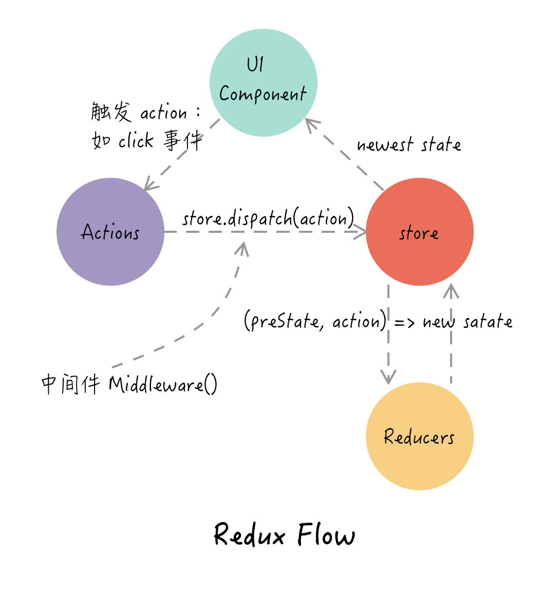
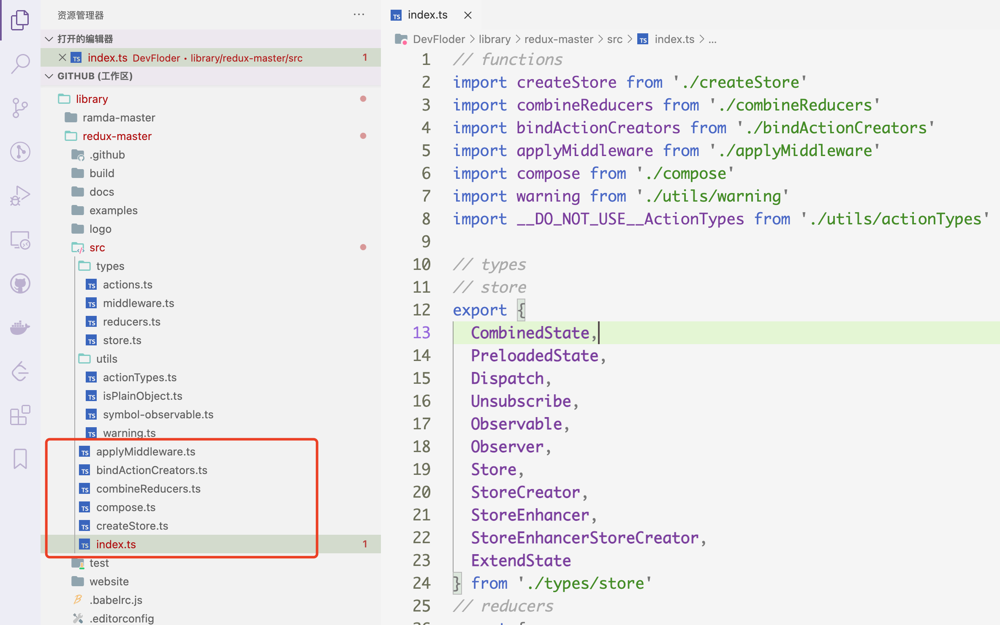
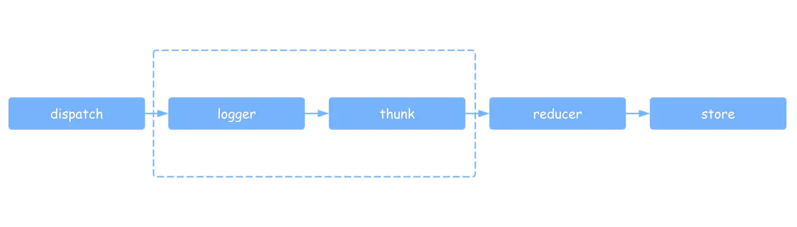
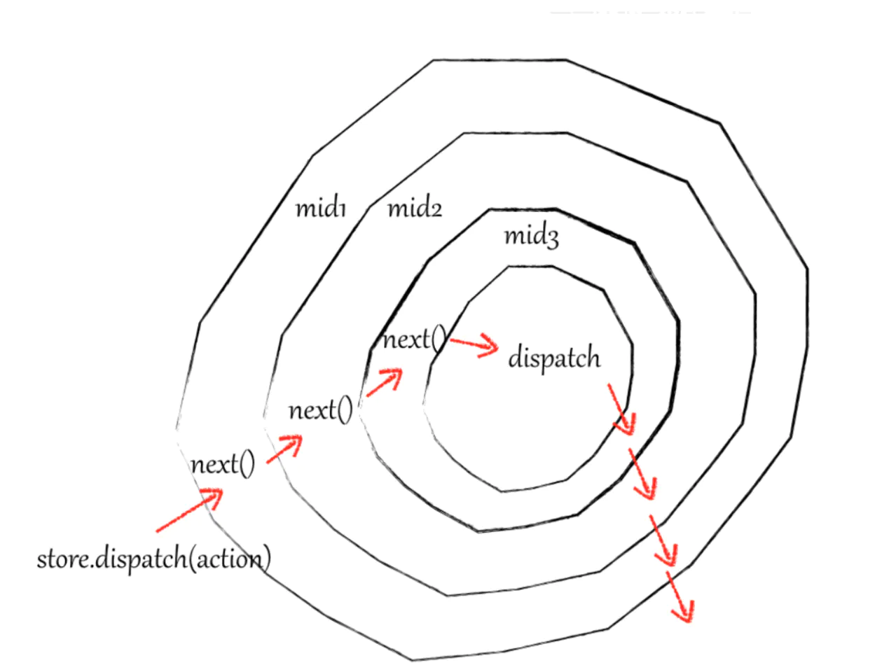

## 目录

<!-- toc -->

- [前言](#前言)
- [Redux 的设计](#Redux-的设计)
  * [全局 store 的设计](#全局-store-的设计)
  * [getState 的实现](#getState-的实现)
  * [subscribe 的实现](#subscribe-的实现)
  * [dispatch 的实现](#dispatch-的实现)
  * [基本运行模型总结](#基本运行模型总结)
  * [Redux 中的概念与术语](#Redux-中的概念与术语)
- [Redux 中间件的设计思路及其实现原理](#Redux-中间件的设计思路及其实现原理)
  * [常规中间件的成型](#常规中间件的成型)
  * [函数式编程改造中间件和 applyMiddleware 模块](#函数式编程改造中间件和-applyMiddleware-模块)
  * [洋葱圈模型](#洋葱圈模型)
  * [异步中间件](#异步中间件)
    + [redux-thunk](#redux-thunk)
    + [redux-soga](#redux-soga)
- [Redux 的辅助模块 combineReducers 和 bindActionCreators](#Redux-的辅助模块-combineReducers-和-bindActionCreators)
- [React-Redux 的设计](#React-Redux-的设计)
- [相关库使用及其原理](#相关库使用及其原理)
  * [reselect.js](#reselectjs)
  * [redux-ignore](#redux-ignore)
- [总结](#总结)
- [参考](#参考)

<!-- tocstop -->

## 前言

Redux 是 React 社区非常有名的状态管理库。思考一下，在出现 Redux 这种状态管理库之前，React 组件之间要相互通信，只能依赖父子组件相互传递，即靠两个组件的共用父组件来传递信息，如果两个组件离得比较远，那么通信成本就会倍增，为了传递一个值，需要层层穿透不同的组件，非常冗余和复杂。

而 Redux 的出现，即是为解决这个问题而生的。它将整个应用的状态提炼出来，放在一个单一的公共 store 中来管理。如果需要传递数据进行组件之间通信，只要改变这个公共 store，其他组件就能得到更新，无需数据的层层传递。

下图是 Redux 的使用模型，详见[React 状态管理使用指南](https://betamee.github.io/content/react-afa32e6d440952fcab1dc6f77363d5ae)一文。



本文将花更多精力对 **Redux 源码体系**进行学习理解。

分为以下几个模块讲解：
+ Redux 的设计思路及其实现原理
+ Redux 中间件的设计思路及其实现原理
+ Redux 社区常用中间件原理
+ React-Redux 的设计思路及其实现原理

## Redux 的设计

下载了 Redux 的源码，可以看到它的文件结构非常清晰：



主要就这几个模块：

+ createStore.js：初始化，创建 store
+ combineReducers.js：组合 reducer 函数
+ bindActionCreators.js： 绑定 actions
+ applyMiddleware.js：组合中间件
+ compose.js：将函数进行组合，服务于 applyMiddleware 模块，其核心作用

下面会仔细讲解这几个模块，并从源码中抽离出核心运行模型，便于理解。

### 全局 store 的设计

在 Redux 项目中，我们会有一个全局 store，也就是唯一数据源。先对其进行封装，描述出基本的骨架：

> 注：以下所有的代码都来于 Redux 源码，为了方便理解，会精简删除非必要代码

```js
export const createStore = (reducer) => {
    // *reducer 方法
    let currentReducer = reducer
    // *state
    let currentState = undefined
    // *事件监听列表
    let currentListeners = []
    let nextListeners = currentListeners

    // *状态管理方法
    function getState() {...}
    function subscribe(listener) {...}
    function dispatch() {...}

    // 生成初始状态
    dispatch({ type: ActionTypes.INIT })

    // 返回 store 对象
    const store = {
      dispatch,
      subscribe,
      getState
    }
    return store
}
```

这个骨架中，核心在于这三个方法，定义了如何获取和改变 store 的路径：

+ getState()
+ dispatch()
+ subscribe()

下面一个个看：

### getState 的实现

getState() 的设计最简单，其返回的是全局状态 currentState。

```js
function getState() {
    return currentState
}
```

### subscribe 的实现

subscribe() 的目的是添加 listener，然后在 dispatch 阶段 state 发生变化时可以执行一遍。这个有点类似于[观察者模式](https://betamee.github.io/content/webfrontend-3159d12b99fb520a9c11583ccaabffb2)。

```js
function subscribe(listener) {
  // 主要是添加进 listeners 数组中
  nextListeners.push(listener)

  // 返回取消订阅的方法
  return function unsubscribe() {...}
}
```

### dispatch 的实现

在 Redux 中，我们要改变 store 数据，一般是通过传入具名的 action 对象，action 对象携带着相关的数据以及 actionType，根据 actionType，store 会修改对应的 state。

```js
// action 对象
{
  type: 'ADD_TODO',
  data: { ... }
}
```

dispatch() 中主要干两件事：

1. 调用 currentReducer 生成新的 state
2. state 发生变化时，执行一遍 listeners

```js
function dispatch(action) {
  // 1. 调用 currentReducer 生成新的 state
  currentState = currentReducer(currentState, action)

  // 2. 当 state 发生变化时，执行一遍 listeners
  const listeners = (currentListeners = nextListeners)
  for (let i = 0; i < listeners.length; i++) {
    const listener = listeners[i]
    listener()
  }

  return action
}
```

currentReducer 函数是在创建 store 时候传进来的，是自定义的改变 store 中数据的方法，要求必须是**纯函数**，返回的是全新的 state。

创建一个 reducer.js 文件，在这里根据业务需求更新数据：

```js
const todoReducer = (state = initalState, action) => {
  switch(action.type)  {
    case ADD_TODO:
      return {
        ...state,
        todo: action.data
      }
    default:
      return state
  }
}
```

### 基本运行模型总结

到这一步，整个 Redux 运行的基本模型就讲清楚了。对应源码 *createStore.js*，主要就上面三个方法的实现。当然，Redux 本身不止这么简单，它的精华来源于**中间件设计**，这是下一节要分析的主题。

下面的 demo 用来总结 Redux 的基本使用：

```js
import { reducer } from './reducer'

// 创建store
const store = createStore(reducer)

// 订阅通知
store.subscribe(() => {
  console.log('组件1收到 store 的通知')
})
store.subscribe(() => {
  console.log('组件2收到 store 的通知')
})

// 执行 dispatch，触发 store 的通知
store.dispatch({
   type: 'add_todo'
})
```

### Redux 中的概念与术语

这里整理一下 Redux 中会用到的一些概念：

+ Store: 全局唯一，用于存储 state，以及相应的更新方法
+ Actions: 一个带有 type 字段的纯对象，描述应用应该发生了些什么变化
+ Action Creator： 生成 Actions 的函数，有同步和异步两种，同步的返回一个 Actions 对象，异步的是返回一个函数
+ Reducers：纯函数，接收 state 和 action，返回一个全新的 state
+ Dispatch: Redux 内部用于更新的唯一方法，它会调用 reducer 函数
+ Selectors：用于获取 state 中的某一个层级的值，随着应用 state 的变大变深，有利于减少重复逻辑

## Redux 中间件的设计思路及其实现原理

如果没有中间件的加持的话，只依赖上面所分析的 Redux 代码，我们所用到的不过就是使用一个外部的 store 存取数据，并没有体现 Redux 有多么大的优势。

正是因为有了中间件，我们可以在数据的流通过程中实现很多新的功能。中间件可以理解为拦截器，是在 dispatch 到 reducer 过程中，对数据进行修改，从而增强 dispatch 的功能。



### 常规中间件的成型

用下面的例子来一步一步讲解中间件是如何形成的：

1. 在每次 dispatch 之后手动打印 store 的内容。

```js
// action { type: 'plus' }
store.dispatch(action)
console.log('next state', store.getState())
```

这种方式简单直接，但不符合封装的要求。

2. 封装 dispatch

```js
function dispatchAndLog(store, action) {
    store.dispatch(action)
    console.log('next state', store.getState())
}
```

通过封装为一个方法，达到可复用的要求。

3. 替换 dispatch

```js
let next = store.dispatch
store.dispatch = function dispatchAndLog(action) {
    let result = next(action)
    console.log('next state', store.getState())
    return result
}
```

把原来的 dispatch 函数提出来，命为 next，然后替换 store.dispatch，加上自定义的功能。

4. 模块化

```js
// 打印日志中间件
function logger(store) {
    let next = store.dispatch
    store.dispatch = function dispatchAndLog(action) {
        let result = next(action)
        console.log('next state', store.getState())
        return result
    }
}

// 监控错误中间件
function crashReport(store) {
    // 这里取到的 dispatch 已经是被上一个中间件包装过的 dispatch, 从而实现中间件串联
    let next = store.dispatch
    store.dispatch = function dispatchAndReportErrors(action) {
        try {
            let result = next(action)
            return result
        } catch (err) {
            console.error(err)
        }
    }
}
```

随着功能模块的的增多，我们需要**独立的可拔插的**模块。不同的模块拆分成不同方法，通过**在方法内获取上一个中间件包装过的 store.dispatch 实现链式调用**。然后我们就能通过调用这些中间件方法，分别使用、组合这些中间件。

```js
// 内部已经实现链式调用了
logger(store)
crashReport(store)
```

5. 组合中间件

有了多个中间件模块后，最终要组合成一起，按顺序调用。提供一个 applyMiddleware 的方法：

```js
function applyMiddleware(store, middlewares) {
    middlewares = [ ...middlewares ] 
    // 由于循环替换 dispatch 时,前面的中间件在最里层,因此需要翻转数组才能保证中间件的调用顺序
    middlewares.reverse()                     
    // 循环替换 dispatch   
    middlewares.forEach(middleware =>      
        store.dispatch = middleware(store)    
    )
}
```

稍微改造一下上面的代码：

```js
function logger(store) {
    let next = store.dispatch
    console.log('logger enter')

    // 之前的做法(在方法内直接替换 dispatch):
    // store.dispatch = function dispatchAndLog(action) { ... }

    return function dispatchAndLog(action) {
        let result = next(action)
        console.log('logger out')
        return result
    }
}

function crashReport(store) {
    // 这里取到的 dispatch 已经是被上一个中间件包装过的 dispatch, 从而实现中间件串联    
    let next = store.dispatch
    console.log('crashReport enter')

    // store.dispatch = function dispatchAndReportErrors(action) { ... }
    
    return function dispatchAndReportErrors(action) {        
        try {
            let result = next(action)        
            console.log('crashReport out')      
            return result
        } catch (err) {            
            console.error(err)            
        }    
    }
}
```

这样就可以以下面的形式使用中间件：

```js
applyMiddleware(store, [crashReport, logger])
// 中间件调用顺序：logger -> crashReport
// 打印顺序：
// logger enter -> crashReport enter -> crashReport out -> logger out
```

### 函数式编程改造中间件和 applyMiddleware 模块

上面的例子基本上已经成型了，但也有一些问题，这些函数不够“纯”，直接在函数内部改动 store.dispatch，造成不可预期的副作用。从**函数式编程**的思想出发，我们将中间件柯里化：

```js
const logger = store => next => action => {
  console.log('logger enter')
  let result = next(action)        
  console.log('logger out')      
  return result
}

const crashReport = store => next => action => {
  console.log('crashReport enter')
  try {
    let result = next(action)
    console.log('crashReport out')
    return result
  } catch(e) {
    console.error(err)
  }
}
```

然后改造 applyMiddleware：

```js
function compose(...funcs) {
    if (funcs.length === 0) {
      return (arg) => arg
    }

    if (funcs.length === 1) {
      return funcs[0]
    }

    return funcs.reduce((a, b) => (...args) => a(b(...args)))
}

function applyMiddleware(...middlewares) {
    return (createStore) => (reducer) => {
        const store = createStore(reducer)
        // *这个变量是临时的，会被下面的 dispatch 覆盖，所以不要迷惑
        // *之所以这样弄，是为了防止中间件组合阶段没有成功，报个错
        let dispatch = () => {
            throw new Error(
            'Dispatching while constructing your middleware is not allowed. ' +
                'Other middleware would not be applied to this dispatch.'
            )
        }

        const middlewareAPI = {
            getState: store.getState,
            // *这里不直接使用 dispatch(action, ...args)，是因为闭包原因，防止共享一个 dispatch
            dispatch: (action, ...args) => dispatch(action, ...args)
        }
        // *使用 compose 来组合
        const chain = middlewares.map(middleware => middleware(middlewareAPI))
        // 覆盖上面的 dispatch 变量
        dispatch = compose(...chain)(store.dispatch)

        return {
            ...store,
            dispatch
        }
    }
}
```

这里做了两处改动：

1. 使用 compose 方法取代了 middlewares.reverse()，compose 是函数式编程中常用的一种组合函数的方式，compose 内部使用 reduce 巧妙地组合了中间件函数，使传入的中间件形式 compose(f, g, h) 变成 (...args) => f(g(h(...args))) 这种形式
2. 不直接替换 dispatch，而是作为高阶函数增强 createStore，最后 return 的是一个新的 store

最后是 createStore 需要兼容中间件模式：

```js
export const createStore = (reducer, enhancer) => {
  if (typeof enhancer !== 'undefined' && typeof enhancer === 'function') {
    // *函数式思想增强 createStore，enhancer 是中间件增强
    // return enhancer(createStore)(reducer)
    // vs.
    // return createStore(reducer)
    return enhancer(createStore)(reducer)
  }

  // *reducer 方法
  let currentReducer = reducer
  // *state
  let currentState = undefined
  // *事件监听列表
  let currentListeners = []
  let nextListeners = currentListeners

  // *状态管理方法
  function getState() {...}
  function subscribe(listener) {...}
  function dispatch() {...}

  // 生成初始状态
  dispatch({ type: ActionTypes.INIT })

  // 返回 store 对象
  const store = {
    dispatch,
    subscribe,
    getState
  }
  return store
}
```

这样，整个中间件的模型就跑通了。

请记住中间件的三层参数：

```js
const mid = store => next => action => { ... }
```

这里的参数 store 指向 middlewareAPI 变量，包含用于获取当前状态的 store.getState 和一个 compose 各种中间件后生成的 dispatch 方法，它能让初始的 store.dispatch 在中间件中进行流通，在最后一层得到调用。

能让这一切组合起来并执行的核心是 *applyMiddleware* 函数，理解了这个模块，也就理解了 Redux 中间件的原理。

### 洋葱圈模型

我们巧妙的发现了一个事实，*applyMiddleware* 中使用了 *compose* 函数，而在[Koa 体系详解](https://betamee.github.io/content/node-a5532de364345732a2fb4008eddd8cc7) 一文中，我也整理到了 Koa 中间件也使用了 *compose* 函数，形成了所谓的**洋葱圈模型**。那么这里 Redux 中间件同理，执行顺序异曲同工：

```js
const logger1 = store => next => action => {
    console.log('进入log1')
    let result = next(action)
    console.log('离开log1')
    return result
}

const logger2 = store => next => action => {
    console.log('进入log2')
    let result = next(action)
    console.log('离开log2')
    return result
}

const logger3 = store => next => action => {
    console.log('进入log3')
    let result = next(action)
    console.log('离开log3')
    return result
}
```

代码执行结果：*进入log1 -> 进入log2 -> 进入log3 -> 离开log3 -> 离开log2 -> 离开log1*

代码执行路径：*进入log1 -> 执行next -> 进入log2 -> 执行next -> 进入log3 -> 执行next -> next执行完毕 -> 离开log3 -> 回到上一层中间件,执行上层中间件next之后的语句 -> 离开log2 -> 回到中间件log1, 执行log1的next之后的语句 -> 离开log1*



### 异步中间件

上面讲解了 Redux 常规的中间件是如何一步步成型的，这种中间件都是同步代码，但有的时候我们需要处理一些异步操作，比如网络请求数据、使用 Promise 等**异步场景**，这些就无法使用常规中间件了，那么该如何解决这个问题。

Redux 社区中有不少知名的模块可以帮我们解决问题，如

+ [Redux-Thunk](https://github.com/reduxjs/redux-thunk)
+ [Redux-Saga](https://redux-saga.js.org/)
+ [Redux Promsie](https://github.com/redux-utilities/redux-promise)

下面来一个个分析其原理。

#### redux-thunk

thunk 中间件源码非常简单：

```js
// 创建中间件，extraArgument 能带给 action 函数一些额外的参数
function createThunkMiddleware(extraArgument) {
  return ({ dispatch, getState }) => (next) => (action) => {
    // 如果 action 是函数类型，直接执行
    if (typeof action === 'function') {
      return action(dispatch, getState, extraArgument);
    }
    // 如果 action 是对象，则传递给下一个中间件
    return next(action);
  };
}

const thunk = createThunkMiddleware();
thunk.withExtraArgument = createThunkMiddleware;

export default thunk;
```

它内部对 action 多了一层判断：
+ 如果 action 是函数，则传入 dispatch getState 参数，直接执行
+ 如果 action 是对象，则调用 next(action) 传入下一层中间件

在使用上，比起同步 Action Creator 多一层函数（案例来自 Redux-Thunk 的官网）：

```js
import { createStore, applyMiddleware } from 'redux';
import thunk from 'redux-thunk';
import rootReducer from './reducers';

// 创建 store
const store = createStore(rootReducer, applyMiddleware(thunk));

// 同步 Action Creator
function makeASandwich(forPerson, secretSauce) {
  return {
    type: 'MAKE_SANDWICH',
    forPerson,
    secretSauce,
  };
}

function apologize(fromPerson, toPerson, error) {
  return {
    type: 'APOLOGIZE',
    fromPerson,
    toPerson,
    error,
  };
}

function withdrawMoney(amount) {
  return {
    type: 'WITHDRAW',
    amount,
  };
}

// 异步 Action Creator
function makeASandwichWithSecretSauce(forPerson) {
  // 返回的是一个 thunk 函数
  return async function(dispatch, getState) {
    try {
      // 发起请求获取数据
      const sauce = await fetch('...')
      return dispatch(makeASandwich(forPerson, sauce)
    } catch (e) {
      return dispatch(apologize('The Sandwich Shop', forPerson, error))
    } 
  };
}

// 通过 store 发起数据 dispatch
store.dispatch(makeASandwichWithSecretSauce('Me'));
// 甚至还能接收 thunk 函数的返回值，因为 thunk 中返回了 Promise value
store.dispatch(makeASandwichWithSecretSauce('My partner')).then(() => {
  console.log('Done!');
});

// 还可以组合多个异步 Action Creator
function makeSandwichesForEverybody() {
  return async function(dispatch, getState) {
    if (!getState().sandwiches.isShopOpen) {
      return Promise.resolve();
    }

    // 下面 dispatch 的既可以是异步 Action Creator，也可以是同步 Action Creator
    try {
      // 多层异步 Action Creator
      await dispatch(makeASandwichWithSecretSauce('My Grandma'))
      await Promise.all([
          dispatch(makeASandwichWithSecretSauce('Me')),
          dispatch(makeASandwichWithSecretSauce('My wife')),
      ])
      await dispatch(makeASandwichWithSecretSauce('Our kids')

      // 同步 Action Creator
      return dispatch(
          getState().myMoney > 42
            ? withdrawMoney(42)
            : apologize('Me', 'The Sandwich Shop'),
        )
    } catch (e) {
      return Promise.reject(e)
    }
  }
}

// 可以方便服务端渲染
store
  .dispatch(makeSandwichesForEverybody())
  .then(() =>
    response.send(ReactDOMServer.renderToString(<MyApp store={store} />)),
  );
```
thunk 函数中，如果需要一些额外的参数传递，可以这样使用：

```js
const api = "http://www.example.com/sandwiches/";
const whatever = 42;

const store = createStore(
  reducer,
  // 在创建 thunk 中间件的时候，传递一些额外的参数
  applyMiddleware(thunk.withExtraArgument({ api, whatever })),
);

// 异步 Action Creator
function fetchUser(id) {
  return (dispatch, getState, { api, whatever }) => {
    // ....
  };
}
```

#### redux-soga

（未完待续...学不动了.jpg）

## Redux 的辅助模块 combineReducers 和 bindActionCreators

在实际项目中，我们会根据场景拆分 reducer 和 action 进多个文件，这就需要 **combineReducers.js** 和 **bindActionCreators.js**。从字面意思上就能看出，这两个源码模块是整合 reducer 和 action 函数。我把它定位为是辅助 Redux 体系的工具函数。

让我们来看看它是如何被设计出来的：

```js
// combineReducers.js
function combineReducers(reducers) {
    // *获取 key 数组
    const reducerKeys = Object.keys(reducers)
    const finalReducers = {}
    for (let i = 0; i < reducerKeys.length; i++) {
      const key = reducerKeys[i]
      // *如果 reducers[key] 为函数，则放入 finalReducers 中
      if (typeof reducers[key] === 'function') {
        finalReducers[key] = reducers[key]
      }
    }
    // *？？ 其实只是复制了一下，干了个寂寞
    const finalReducerKeys = Object.keys(finalReducers)

    // *返回一个 combination 组合函数
    // *参数： newstate, newaction
    return function combination(state, action) {
      let hasChanged = false
      const nextState = {}
      // *对 finalReducerKeys 进行循环
      for (let i = 0; i < finalReducerKeys.length; i++) {
        // *读取 reducer
        const key = finalReducerKeys[i]
        const reducer = finalReducers[key]
        // *获取 previousStateForKey
        const previousStateForKey = state[key]
        // *使用 previousStateForKey + action => nextStateForKey
        // *这里有一个问题，每一个 action 都会走一遍所有的 render，即使有些 action 不属于对应的 reducer
        const nextStateForKey = reducer(previousStateForKey, action)
        // *覆盖原来的 key 的位置
        nextState[key] = nextStateForKey
        // *是否发生变化：
        // *nextStateForKey !== previousStateForKey 这是因为如果 reducer 返回默认 state，两者就会一致
        hasChanged = hasChanged || nextStateForKey !== previousStateForKey
      }
      // *最终判定是否改变：如果 hasChanged 为true 或者单纯的传入的 state keys length 不等于 finalReducerKeys.length
      hasChanged = hasChanged || finalReducerKeys.length !== Object.keys(state).length
      // *返回新 state
      return hasChanged ? nextState : state
    }
}
```

combineReducers 函数其实是将多个 reducer 合成一个统一的 reducer，它是这样的步骤：

1. 循环生成一个全新的 finalReducers 对象，里面是 (k, v) 一一对应的 sub state render
2. 循环 finalReducers 对象，对每一个 sub state render 都会调用 render(action)，覆盖生成一个 total state tree 对象。分两种情况：
   + 如果 sub state render 匹配 action，则会生成新的 sub state
   + 其他不匹配的则返回 default state
4. 这样生成了新的 total state tree，里面的 (k, v) 一一对应 sub state
   + 只有得到更新的 sub state 是全新对象
   + 没有得到更新的 sub state 还是原来的引用

但 combineReducers 也有问题，每发起一个 action 会将所有的 reducer 都过一遍，即使这个 action 只对应某一个 reducer。这也就造成了性能的浪费。（下面的 redux-ignore 会解决这个问题）

```sh
combineReducers(
  {
    potato: potatoReducer,
    tomato: tomatoReducer
  }
)
=> combination(state, action)
=> ({
   potato: { ... },
   tomato: { ... }
})
```

下面是 bindActionCreators 源码：

```js
// bindActionCreators.js
function bindActionCreator(actionCreator, dispatch) {
    // *包一层调用 dispatch 的函数
    return function (this, ...args) {
      return dispatch(actionCreator.apply(this, args))
    }
  }

export default function bindActionCreators(
    actionCreators,
    dispatch
  ) {
    if (typeof actionCreators === 'function') {
      return bindActionCreator(actionCreators, dispatch)
    }

    const boundActionCreators = {}
    for (const key in actionCreators) {
      const actionCreator = actionCreators[key]
      if (typeof actionCreator === 'function') {
        boundActionCreators[key] = bindActionCreator(actionCreator, dispatch)
      }
    }
    return boundActionCreators
}
```

bindActionCreator 比较简单，它是将所有的 action creator 生成一个新的包裹函数：

```text
bindActionCreators(
  {
    () => ({}), // 普通 Action Creator
    () => (dispatch, getState) => {} // 异步 Action Creator
  },
  dispatch
)
=> bindActionCreator(actionCreator, dispatch)
=> (this, ...args) => {
  // 包裹一层 dispatch 的函数
  return dispatch(actionCreator.apply(this, args))
}
```

## React-Redux 的设计

源码有点多，另起炉灶写一篇...

## 相关库使用及其原理

这个章节，简单分析两个 Redux 社区中常见的库，因为源码比较简单，直接拿来分析。有些比较复杂的库比如 immer.js、normalizr.js，后续会开专门的文章来分析讲解。

### reselect.js

reselect 是一个缓存 selector 函数结果的库。

在 Redux 中，我们在把 state 传递给 React 组件之前，一般会根据业务场景 **select** 出一些合适的数据：

```js
const getVisibleTodos = (todos, filter) => {
  switch (filter) {
    case 'SHOW_ALL':
      return todos
    case 'SHOW_COMPLETED':
      return todos.filter(t => t.completed)
    case 'SHOW_ACTIVE':
      return todos.filter(t => !t.completed)
  }
}

const mapStateToProps = (state) => {
  return {
    todos: getVisibleTodos(state.todos, state.visibilityFilter)
  }
}

const mapDispatchToProps = (dispatch) => {
  return {
    onTodoClick: (id) => {
      dispatch(toggleTodo(id))
    }
  }
}

const VisibleTodoList = connect(
  mapStateToProps,
  mapDispatchToProps
)(TodoList)
```

但这里会有一个问题，每次组件渲染，这些 selector 函数都会执行一遍。本质上，这些 selector 都是纯函数，如果前后参数一致的情况下，执行的结果都是一样的。我们需要在这里进行性能优化，如果**前后参数一致的情况下，则直接返回缓存结果**，这就是 reselect 的作用：

```js
import { createSelector } from 'reselect'

const shopItemsSelector = state => state.shop.items
const taxPercentSelector = state => state.shop.taxPercent

const subtotalSelector = createSelector(
  shopItemsSelector,
  items => items.reduce((subtotal, item) => subtotal + item.value, 0)
)

const taxSelector = createSelector(
  subtotalSelector,
  taxPercentSelector,
  (subtotal, taxPercent) => subtotal * (taxPercent / 100)
)

console.log(taxSelector(exampleState))  // 0.172
```

reselect.js 精简后的源码：

```js
export function createSelectorCreator(memoize, ...memoizeOptions) {
    // *返回一个接收 funcs 数组的函数
    return (...funcs) => {
        let recomputations = 0
        // * pop 出最后一个函数，剩下的都是依赖
        const resultFunc = funcs.pop()
        // *获取依赖，Function[]
        const dependencies = getDependencies(funcs)
        // *生成缓存函数
        const memoizedResultFunc = memoize(
            function () {
            // *每次执行就++
            recomputations++
            // *执行最后一个函数
            return resultFunc.apply(null, arguments)
            },
            ...memoizeOptions
        )

        // *如果一个 selector 每次调用的都是同一个参数，则无需再执行后面的
        const selector = memoize(function () {
            const params = []
            const length = dependencies.length

            // *将依赖存入 params 中
            for (let i = 0; i < length; i++) {
                params.push(dependencies[i].apply(null, arguments))
            }

            // *给的是一个参数列表，注意 apply 是接收数组形式
            return memoizedResultFunc.apply(null, params)
        })

        selector.resultFunc = resultFunc
        selector.dependencies = dependencies
        // *recomputations 参数可以得知函数是否被调用，缓存的情况下是不会被调用的
        selector.recomputations = () => recomputations
        selector.resetRecomputations = () => recomputations = 0
        return selector
    }
}

export const createSelector = /* #__PURE__ */ createSelectorCreator(defaultMemoize)

// 使用
const shopItemsSelector = state => state.shop.items
const subtotalSelector = createSelector(
  shopItemsSelector,
  items => items.reduce((subtotal, item) => subtotal + item.value, 0)
)
```

先简单理一下 *createSelectorCreator* 工厂函数的思路：

1. 调用 createSelectorCreator(defaultMemoize) 生成 createSelector
2. createSelector 接收一个 func list，其中最后一个函数的参数依赖之前函数返回的结果，这里会有一些步骤
    + 获取 dependencies 依赖函数列表
    + 对 func list 最后一个函数设为 resultFunc，并使用 memoize 包裹，表明是需要缓存优化的
    + 再使用 memoize 包裹一个新的函数，这个才是 selector
    + 也即是初始化 const selectorForState = createSelector(...dependencyFuncs, resultFunc) 后，内部会有两层 memoize
      + 第一层：入口参数如果前后一致，则返回缓存结果
      + 第二层：调用 dependencyFuncs 后形成的参数，如果前后一致，则返回缓存结果

而缓存的核心在于 *defaultMemoize* 函数：

```js
// *默认相等比较，=== 比较
function defaultEqualityCheck(a, b) {
  return a === b
}

// *参数浅比较相等
function areArgumentsShallowlyEqual(equalityCheck, prev, next) {
  // *预先比较
  if (prev === null || next === null || prev.length !== next.length) {
    return false
  }

  // *使用 for-loop 可以尽早判断，不符合的情况下可以 drop
  const length = prev.length
  for (let i = 0; i < length; i++) {
    if (!equalityCheck(prev[i], next[i])) {
      return false
    }
  }

  return true
}

// *默认的缓存函数
// *简单来说：如果前后两个参数不等，则直接返回原来的结果
export function defaultMemoize(func, equalityCheck = defaultEqualityCheck) {
  let lastArgs = null
  let lastResult = null

  return function () {
    // *如果之前的参数 lastArgs 和 新的参数不等
    // *则调用 func，赋值 lastResult
    if (!areArgumentsShallowlyEqual(equalityCheck, lastArgs, arguments)) {
      lastResult = func.apply(null, arguments)
    }
    // *保留之前的参数
    lastArgs = arguments
    return lastResult
  }
}
```

Memoize 原理非常简单：
1. 第一次调用缓存参数和结果
2. 第二次比较上一次和这次的参数，是否一致
   + 一致：返回上次结果，不去执行原函数
   + 不一致：执行原函数，并缓存新的参数和结果

可以看到，*equalityCheck* 的实现只是 a === b 这样的浅比较，当然也可以自定义使用比如 lodash.isEqual 这样深比较方式。

下面的例子实际讲解结合 redux 的细节，比如我们有一个复杂的 state 树:

```js
const exampleState = {
  // shop sub state 对应 shop render
  shop: {
    taxPercent: 8,
    items: [
      {},
      {},
    ]
  },
  // snacks sub state 对应 snacks render
  snacks: {
    items: [
      {},
      {}
    ]
  }
}
```

当有一个更新 shop 的 action 发出，根据前文 combineReducers 函数的原理，它只会更新 shop 这个子对象，生成新的引用，而 snacks 这个引用不会有啥变化，所以这种情况下，用到 snacks 的 selector 函数前后引用就会一致，会被缓存。但是用到 shop 下面的数据的 selector 前后参数引用（===浅比较）就会发生变化，进而重新执行一遍。

但需要注意的，selector 函数如果引入其他参数如组件的 prop，就需要注意这个 selector 函数实例是否被**共享**了：

```js
// getVisibleTodos.js
const getVisibilityFilter = (state, props) =>
  state.todoLists[props.listId].visibilityFilter

const getTodos = (state, props) =>
  state.todoLists[props.listId].todos

const getVisibleTodos = createSelector(
  [ getVisibilityFilter, getTodos ],
  (visibilityFilter, todos) => {
    ....
  }
)

export default getVisibleTodos
```

```js
// VisibleTodoList.js
const mapStateToProps = (state, props) => {
  return {
    // 这个 getVisibleTodos 不会被正确缓存优化
    todos: getVisibleTodos(state, props)
  }
}

const mapDispatchToProps = (dispatch) => {...}

const VisibleTodoList = connect(
  mapStateToProps,
  mapDispatchToProps
)(TodoList)

export default VisibleTodoList
```

```js
// App.jsx
const App = () => (
  <div>
    <VisibleTodoList listId="1" />
    <VisibleTodoList listId="2" />
    <VisibleTodoList listId="3" />
  </div>
)
```

在这里，*VisibleTodoList* 组件的多次调用，传入的不同 *listId* 参数，会共享一个 *getVisibleTodos* 实例，导致不会按照预期缓存结果。

要想解决这个问题，需要给每一个组件单独生成一个 selector 实例：

```js
// *1. 动态生成 selector
const makeGetVisibleTodos = () => {
  return createSelector(
    [ getVisibilityFilter, getTodos ],
    (visibilityFilter, todos) => {
      ...
    }
  )
}

// *2. 组装
const makeMapStateToProps = () => {
  const getVisibleTodos = makeGetVisibleTodos()
  const mapStateToProps = (state, props) => {
    return {
      todos: getVisibleTodos(state, props)
    }
  }
  return mapStateToProps
}

// *3. 传入组件中
const VisibleTodoList = connect(
  makeMapStateToProps,
  mapDispatchToProps
)(TodoList)
```

更多关于这个问题的细节见 [reselect 文档](https://github.com/reduxjs/reselect#accessing-react-props-in-selectors)：

以上就是整个的 reselect 结合 redux 源码的性能优化细节！

### redux-ignore

在讲解 *combineReducers* 时，浮现过一个问题，我们的复杂 state 会拆分成多个子 state，并且有对应的 reducer 函数，但有个问题，外部每次发起 action，其实所有的 reducer 函数都会走一遍，不管是不是跟其匹配，这就造成了性能的浪费。

redux-ignore 是用来解决这个问题的一个库，其使用很简单，在 combineReducers 时，确定 action 的适用范围：

```js
combineReducers({
  // 只 reduce 符合正则的 action 
  counter: filterActions(counter, (action) => action.type.match(/COUNTER$/)),
  // 只 reduce 符合 [] 中的 action
  notACounter: filterActions(notACounter, [STAY_COOL, KEEP_CHILLIN])
});
```
其源码：

```js
// *ignore 是忽略或者过滤模式
function createActionHandler (ignore) {
  // redux-ignore higher order reducer
  // *返回一个高阶函数
  return function handleAction (reducer, actions = []) {
    // *判断入参条件
    const predicate = isFunction(actions)
        ? actions
        : (action) => actions.indexOf(action.type) >= 0
    // *生成一个初始 state
    const initialState = reducer(undefined, {})
    // *入口：跟 reducer 一样
    return (state = initialState, action) => {
      // *如果 action 是相匹配的
      if (predicate(action)) {
        // * ignore 模式下直接返回 state，否则走 render 模式，更新
        return ignore ? state : reducer(state, action)
      }
      // *action 没有匹配
      // *ignore 模式下：调用 reducer，否则返回 state
      return ignore ? reducer(state, action) : state
    }
  }
}

export const ignoreActions = createActionHandler(true)
export const filterActions = createActionHandler(false)
```

原理很简单：

+ 当 action 不符合规则时，直接返回原 state，不走 reducer 流程
+ 当 action 符合规则时，走 reducer 流程
+ ignore 只是用于控制 ignore 或者 filter 两种模式

## 总结

本文最主要的内容是学习 Redux 的源码，理清了 Redux 的原理。以及学习了 Redux 周边的涉及性能优化的两个库： reselect.js 和 redux-ignore。

+ Redux 源码如何组合的
  + getState 实现
  + subscribe 实现
  + dispatch 实现
  + combineReducers 模块和 bindActionCreators 模块
+ 中间件原理
  + 常规中间件的原理：中间件是如何一步步成型的
  + 异步中间件的原理： redux-thunk 的设计
  + applyMiddleware 模块组合中间件
  + 洋葱圈模型
+ 性能优化
  + reselect.js：缓存重复调用 selector 函数的结果
  + redux-ignore：过滤非必要 action

本来想深入 React-Redux 原理，但看了下其源码有点多，准备后面再开文章学习。

## 参考

+ [8k字 | Redux/react-redux/redux中间件设计实现剖析](https://juejin.im/post/6844904036013965325)
+ [Redux Fundamentals, Part 4: Store \| Redux](https://redux.js.org/tutorials/fundamentals/part-4-store#middleware)
+ [Build Yourself a Redux - The Zapier Engineering Blog \| Zapier](https://zapier.com/engineering/how-to-build-redux/)
+ [GitHub - reduxjs/redux-thunk: Thunk middleware for Redux](https://github.com/reduxjs/redux-thunk)
+ [GitHub - omnidan/redux-ignore: higher-order reducer to ignore redux actions](https://github.com/omnidan/redux-ignore)
