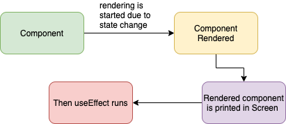
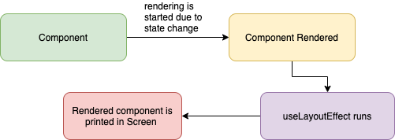
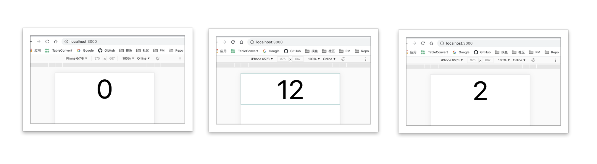
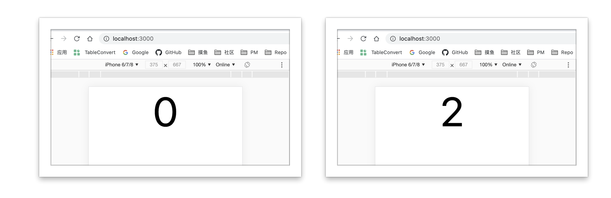

## 目录

<!-- toc -->

- [函数参数详解](#函数参数详解)
- [两个 hook 的区别](#两个-hook-的区别)
- [替代 class 的生命周期函数](#替代-class-的生命周期函数)
- [effect 中使用 props 和 state 的陷阱](#effect-中使用-props-和-state-的陷阱)
- [关于 Hooks 的一点思考](#关于-Hooks-的一点思考)
- [参考](#参考)

<!-- tocstop -->

## 函数参数详解

两个 effect hook 是 React 提供给用户处理**副作用逻辑**的一个窗口，比如改变 DOM、添加订阅、设置定时器、记录日志以及执行其他各种渲染过程中不允许出现的操作。

在使用上，两个 hook 的函数签名是一样的:

```js
useEffect(() => {
  // 执行一些副作用
  // ...
  return () => {
    // 清理函数
  }
})
```

这样会每次组件更新后都会执行，有点类似于 componentDidUpdate，但请不要用 class 组件的生命周期思维方式来看待 hooks，只是看起来可以先这么理解。如果想要像 componentDidMount 那样只执行一次的话，第二个参数传入空数组：

```js
useEffect(() => {
  // 执行一些副作用
  // ...
  return () => {
    // 清理函数
  }
}, [])
```

但有的时候需要根据 props 的变化来条件执行 effect 函数，要实现这一点，可以给 useEffect 传递第二个参数，它是 effect 所依赖的值数组：

```js
useEffect(
  () => {
    const subscription = props.source.subscribe();
    return () => {
      subscription.unsubscribe();
    };
  },
  [props.source],
);
```

此时，只有当 `props.source` 改变后才会重新创建订阅。

## 两个 hook 的区别

这里就要说到 useEffect 和 useLayoutEffect 区别了。

官网中的提示，绝大部分场景只用到 useEffect 就可以，只有当它出问题的时候再尝试使用 useLayoutEffect。

但什么样的情况下 useLayoutEffect 才能体现不同之处呢？

首先我们知道，浏览器中 JS 线程和渲染线程（注意是线程）是互斥的，对于 React 的函数组件来说，其更新过程大致分为以下步骤：

（这里假设 React 组件已初次渲染成功）

1. 用户点击事件，改变了某一个state
2. React 内部更新 state 变量
3. React 处理更新组件中 return 出来的 DOM 节点（进行一系列 diff 调度等流程）
4. 将更新过后的 DOM 数据绘制到浏览器中
5. 用户看到新的页面

前三步都是 React 在处理，也就是 JS 线程执行我们所写的代码，都是在内存中进行一系列操作，而第四步才是真正将更新后数据交给渲染线程进行处理。

那这时候的 useEffect 只会在第四步后才会调用，也就是在浏览器绘制完后才调用，而且 useEffect 还是异步执行的，所谓的异步就是被 React 使用 requestIdleCallback 封装的，只在浏览器空闲时候才会执行，这就保证了不会阻塞浏览器的渲染过程。



而 useLayoutEffect 就不一样，它会在第三第四步之间执行，而且是同步阻塞后面的流程。




这两者的差距会在某些 DOM 变化的场景下体现出来：

以下面的代码举例：

```jsx
export default function FuncCom () {
    const [counter, setCounter] = useState(0);

    useEffect(() => {
        if (counter === 12) {
            // 为了演示，这里同步设置一个延时函数 500ms
            delay()
            setCounter(2)
        }
    });
    return (
        <div style={{
            fontSize: '100px'
        }}>
            <div onClick={() => setCounter(12)}>{counter}</div>
        </div>
    )
}
```

可以观察到，初始屏幕上是 0，当点击触发 `setCounter` 后，屏幕上先是出现了 12，最后变为了 2:



想象一下，这就是有些动画场景会出现的**闪屏**现象，原因在于 useEffect 执行的时候 `setCounter(12)` 已经触发一次渲染了。这在体验上很不好。

换成了 useLayoutEffect 后，屏幕上只会出现 0 和 2，这是因为 useLayoutEffect 的同步特性，会在浏览器渲染之前**同步更新 DOM 数据**，哪怕是多次的操作，也会在渲染前一次性处理完，再交给浏览器绘制。这样不会导致**闪屏**现象发生。



这里简单总结一下：

+ useEffect 是异步非阻塞调用
+ useLayoutEffect 是同步阻塞调用
+ useEffect 浏览器绘制后
+ useLayoutEffect 在 DOM 变更（React 的更新）后，浏览器绘制前完成所有操作

## 替代 class 的生命周期函数

进一步分析，我们希望在函数组件中使用 hook 函数替换 class 组件中的生命周期，那么这里是如何对应的？

同样举一个 class 组件的例子：

```jsx
class ClassCom extends React.Component {
    state = {
        value: 'a'
    }
    componentDidMount() {
        // 延时触发
        delay()
        this.setState({
            value: 'fasd'
        })
    }
    componentDidUpdate() {
        if (this.state.value === 'b') {
            // 延时触发
            delay()
            this.setState({
                value: 'c'
            })
        }
    }
    render() {
        return (
            <div
                onClick={() => this.setState({
                    value: 'b'
                })}
            >
                Class Components {`${this.state.value}`}
            </div>
        )
    }
}
```

在浏览器中，初次渲染用户不会看到 *Class Components a* 这个值，而是直接出现 mount 状态之后的值 *Class Components fasd*，当触发点击事件后，只会显示 didupdate 之后的值 *Class Components c*。

这说明了 componentDidMount 和 componentDidUpdate 都是同步阻塞的，而且是在 React 提交给浏览器渲染步骤之前。

所以从表现（以及源码中的流程）来看，useLayoutEffect 和 componentDidMount，componentDidUpdate 调用时机是一致的，且都是被 React 同步调用，都会阻塞浏览器渲染。

同上，useLayoutEffect 返回的 clean 函数的调用位置、时机与 componentWillUnmount 一致，且都是同步调用。useEffect 的 clean 函数从调用时机上来看，更像是 componentDidUnmount (尽管 React 中并没有这个生命周期函数)。

虽然 useLayoutEffect 更像 class 中的生命周期函数，但官方的建议是大多数正常情况下，并不需要使用它，而是使用 useEffect，因为 useEffect 不会阻塞渲染，只有在涉及到**修改 DOM、动画等场景下**考虑使用 useLayoutEffect，所有的修改会一次性更新到浏览器中，减少用户体验上的不适。

## effect 中使用 props 和 state 的陷阱

在使用 effect 的过程中，有一个隐形的 bug 要注意。

```jsx
function Counter() {
  const [count, setCount] = useState(0);

  useEffect(() => {
    const id = setInterval(() => {
      setCount(count + 1);
    }, 1000);
    return () => clearInterval(id);
  }, []);

  return <h1>{count}</h1>;
}
```

这段代码的意图很简单，每隔 1000ms 更新 *count*，但事实上，count 永远只会增加到 1！

同样的代码用 class 组件来实现，就不会有这个问题：

```jsx
class Counter extends Components {
  state = {
    count: 0
  }
  id = null;
  componentDidMount() {
    this.id = setInterval(() => {
      this.setState(({
        count: this.state.count + 1
      }));
    }, 1000);
  }
  componentWillUnmount() {
    clearInterval(this.id)
  }
  render() {
    return <h1>{this.state.count}</h1>
  }
}
```

上面 class 组件和函数组件的代码的差异在于，class 组件中的 *this.state* 是可变的！每一次的更新都是对 state 对象的一个更新，一次又一次的 setInterval 中引用的都会是新 state 中的值。这在使用 class 组件中很常见，我们对于 state 对象也是这么期待的。

然而在函数组件中情况就不一样了。函数组件由于每次更新都会经历重新调用的过程，*useEffect(callback)* 中的回调函数都是全新的，这样其中引用到的 state 值将只跟当次渲染绑定。这是很神奇吗？不，这就是闭包！这只是 JavaScript 的语言特性而已。

```jsx
useEffect(() => {
    // 回调函数只运行一次，这里的 count 只记住初次渲染的那个值
    // 所以导致每一次的 setInterval 中用到的永远都不会变！
    const id = setInterval(() => {
      setCount(count + 1);
    }, 1000);
    return () => clearInterval(id);
}, []);
```

这点在使用函数组件要小心，写惯了 class 组件后，我们对于变量的一些使用上很容易产生误解。把函数组件当成纯粹的函数，每一次的组件更新渲染当前的页面，也会记住当前环境下的变量值。这就是 React Hooks 所推崇的**逻辑和状态的同步**，这跟 class 组件以**生命周期**为划分的思维有着令人迷惑的差距，虽然同是 React，但这是全新的一个思维方式，甚至我觉得更接近 JavaScript 语言的本质，更有函数式的气质。

要想解决这个 setInterval 带来的困惑，可以深入看一下这篇 post: [Making setInterval Declarative with React Hooks](https://overreacted.io/zh-hans/making-setinterval-declarative-with-react-hooks/)

解决方案很简单，但解决思考的过程很惊奇。

## 关于 Hooks 的一点思考

React 从刚推出来的时候就宣扬**单向数据流**的特点，根据 *state* 和 *props* 对象的变化来更新组件，这带来了前端的一次革命，让开发者摆脱了 jquery 这样命令式的思维编程方式，拥抱声明式编程。

但经典的 calss 组件也不是没有问题，复杂难懂的**生命周期 API**将我们的**状态逻辑**拆分到各个阶段，这就给我们设计组件多了一个时间维度思考。

而 Hooks 是进一步的革命，彻底抛弃**时间**这一思考负重，从思考“我的状态逻辑应该放在组件哪些生命周期中”到思考“随着状态变化，我的页面应该展示成什么样” 和 “随着状态变化，什么样的副作用应该被触发”。

这种“逻辑状态和与页面的同步”才是真正的 React 数据流思维方式，这是一种巨大的思维减负。

useEffect 和 useLayoutEffect 相对于 componentDidMount 这样的 API 来说，尽管可以替代模仿，但本质上是不同的。 对于 effect hook API，我们思考的是* UI 状态完成后，我们需要做一些什么的副作用操作* ？而在 componentMount API 中我们思考的是*这个时间阶段中我们可以做些什么副作用操作*？

componentMount API 思考的是各个时间阶段中的操作，effect hook API 不需要考虑时间这一因素，只需要考虑组件状态变化后的处理。

## 参考

+ [1] [How Are Function Components Different from Classes? — Overreacted](https://overreacted.io/how-are-function-components-different-from-classes/)
+ [2] [A Complete Guide to useEffect — Overreacted](https://overreacted.io/a-complete-guide-to-useeffect/)
+ [3] [Making setInterval Declarative with React Hooks — Overreacted](https://overreacted.io/making-setinterval-declarative-with-react-hooks/)
+ [4] [When to useLayoutEffect Instead of useEffect (example)](https://daveceddia.com/useeffect-vs-uselayouteffect/)
+ [5] [useEffect和useLayoutEffect的区别_hsany330的专栏-CSDN博客_uselayouteffect](https://blog.csdn.net/hsany330/article/details/106143592)
+ [6] [useEffect vs. useLayoutEffect in plain, approachable language](https://blog.logrocket.com/useeffect-vs-uselayouteffect/)
+ [7] [React Training: useEffect(fn, []) is not the new componentDidMount()](https://reacttraining.com/blog/useEffect-is-not-the-new-componentDidMount/)
