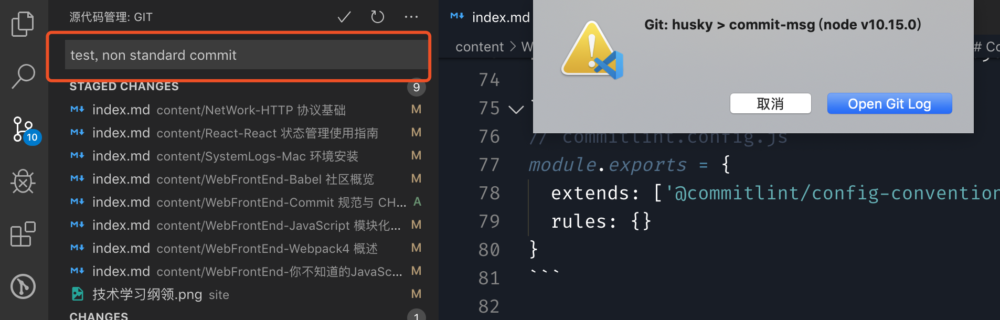
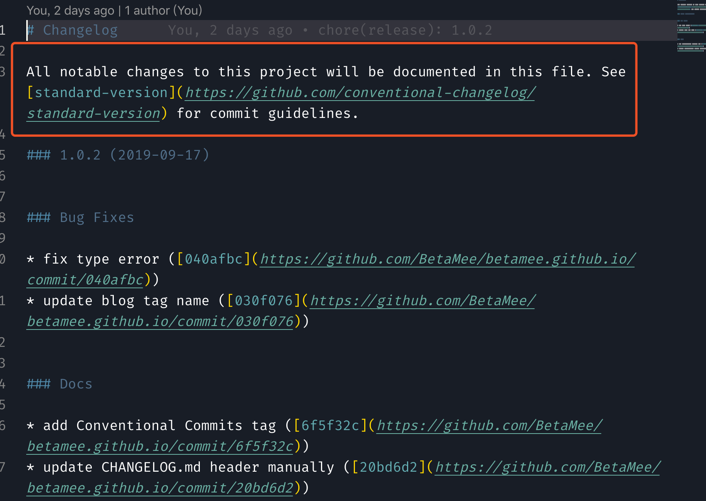

## 目录

<!-- TOC -->
- [前言](#前言)
- [Commit 规范](#commit-规范)
- [Commit 校验工具](#commit-校验工具)
- [CHANGELOG 生成](#changelog-生成)
- [参考](#参考)
<!-- /TOC -->

## 前言

Git 是我们开发项目中日常接触到的工具，使用 Git 我们需要根据改动的内容提交不同的信息，然后 push 到远程仓库中。在团队协作中，如果每个人提交的信息都不一样，甚至很随意的如"update"、"fix bug"这类毫无含义的信息，这对于后期的维护产生很多困扰，一旦需要甩锅和回退的时候，很难定位到当初的提交 commit。所以为了写好 Git Commit Message，我们需要一个合理的规范。

一个好的提交规范可以：

* 正确传达出每一份 commit 影响到的代码改动
* 可以通过 commit 历史信息追溯项目开发改动过程
* 可以直接从 commit 历史信息中过滤生成 CHANGELOG.md
* 可以由相应的 commit 直接触发自动化构建部署流程

本文将分两部分介绍这一块知识，一个是 commit 规范校验，另一个是由 commit 信息生成 CHANGELOG.md。

## Commit 规范

对于如何规范 Commit，社区里有比较好的实践是 Angular 团队的规范, 继而衍生了 Conventional Commits specification。 很多工具也是基于此规范, 它的 message 格式如下:

```txt
<type>(<scope>): <subject>
<BLANK LINE>
<body>
<BLANK LINE>
<footer>
```

我们在书写 Commit 的时候，分为三大部分，用空行分割：

> * 标题行：必须，描述主要修改类型和内容
> * 主题内容：可选，详细描述为什么修改, 做了什么样的修改, 以及开发的思路等等
> * 页尾注释：可选，放 Breaking Changes 或 Closed Issues

而 type 部分是由固定的类型指定，主要有：

> * feat: 新特性新功能
> * fix: 修改的 BUG
> * refactor: 代码重构
> * chore: 项目相关修改, 比如构建流程, 依赖管理
> * docs: 文档修改
> * style: 代码格式修改, 注意不是 css 修改
> * test: 测试用例修改
> * hotfix: 紧急发布的修改

scope 部分是描述出改动的范围，比如改动了路由部分、或者某个组件。

subject 简明扼要描述本次提交的内容，首字母无需大写，结尾不需要使用`.`，并且以动词开头，如 `change`、`fix`。

body 则详细描述本次提交，比如此次变更的动机，如需换行，则使用 |。

footer 描述与之关联的 issue 或 break change。

通过以上的规范写出来的 Commit，就像一份邮件，可以清楚描述出每一次的改动内容。

## Commit 校验工具

有了规范，那么自然就有相应的工具来帮助我们进行校验，就如 eslint、stylelint 之类的流程工具。

我用的是 [conventional-changelog](https://github.com/conventional-changelog) 社区的 [commitlint](https://github.com/conventional-changelog/commitlint) 工具，来帮助我们在校验项目每一个 Commit。

要让你的项目实现这个功能，需要安装以下依赖包：

> * @commitlint/cli
> * @commitlint/config-conventional
> * husky

`@commitlint/config-conventional` 是社区使用广泛的规范配置包，里面应用的是我们上一节讨论的规范，你也可以根据自己团队编写属于自己的规范，就像 `eslint` 一样，可以自由拓展。

在项目的全局文件夹中新添 `commitlint.config.js`：

```js
// commitlint.config.js
module.exports = {
  extends: ['@commitlint/config-conventional'],
  rules: {}
}
```

至于 rules 的配置可以参考[官网](https://commitlint.js.org/#/reference-rules)。

然后再在 `packages.json` 中添加 `husky` 配置，这个才是连接 Git 的工具：

```json
{
  "husky": {
    "hooks": {
      "commit-msg": "commitlint -E HUSKY_GIT_PARAMS"
    }
  }
}
```

以上配置后，就可以愉快地开启 Commit 校验了，如果写得不规范，`husky` 直接给你打回来：



## CHANGELOG 生成

如果你的项目 Commit 写得非常规范，可以使用工具来读取 Git Commit 自动生成 CHANGELOG.md，我调研了很多工具，最后发现 [conventional-changelog](https://github.com/conventional-changelog) 社区的 [standard-version](https://github.com/conventional-changelog/standard-version) 还算符合我的要求。为什么是 *还算* 呢？因为这个工具有 BUG...

先安装：`yarn add standard-version`，然后配置 npm script：

```json
"release": "standard-version",
"release:minor": "standard-version --release-as minor && git push --follow-tags",
"release:major": "standard-version --release-as major && git push --follow-tags",
"release:patch": "standard-version --release-as patch && git push --follow-tags"
```

这里的 `minor`、`major`、`patch`，是指 Semver 规范版本号，这个后面我会再整理一篇文章出来，整理一下语义化版本号的知识。每一个正式软件版本可以用`minor.major.patch`来表示，使用 `release:minor` 可以将当前项目由 `1.0.0` 升级到 `2.0.0，相似的，`release:major` 升级次版本号，`release:patch` 升级小版本号。

通过这样的命令，`standard-version` 可以帮助我们生成一份 CHANGELOG.md、升级版本、发布新的 tag、发布 Github release。非常自动化：



特别注明以下，红框中就是 `standard-version@7.0.0` 的 BUG，暂时无法更改其内容...

## 参考

* [规范你的 commit message 并且根据 commit 自动生成 CHANGELOG.md](https://juejin.im/post/5bd2debfe51d457abc710b57)

* [优雅的提交你的 Git Commit Message](https://zhuanlan.zhihu.com/p/34223150)

* [你可能会忽略的 Git 提交规范](http://jartto.wang/2018/07/08/git-commit/)

* [Commit message 和 Change log 编写指南](http://www.ruanyifeng.com/blog/2016/01/commit_message_change_log.html)

* [conventional-changelog · GitHub](https://github.com/conventional-changelog)

* [Angular 工具篇之规范化Git版本管理](https://juejin.im/entry/5b97cea65188255c7f5e96a4)
