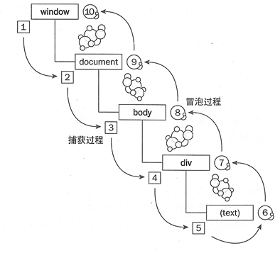

## 目录

<!-- toc -->

- [前言](#前言)
- [事件冒泡](#事件冒泡)
- [事件捕获](#事件捕获)
- [过程](#过程)
- [addEventListener](#addEventListener)
- [事件代理](#事件代理)
- [target 和 currentTarget](#target-和-currentTarget)
- [阻止事件](#阻止事件)
- [参考](#参考)

<!-- tocstop -->

## 前言

本文整理下 DOM 事件模型的知识。

DOM 事件模型是为了解决页面中事件流（发生顺序）的问题而产生的。有事件捕获和事件冒泡两种模式，分别由网景和微软公司提出。

```html
<div id="outer">
    <p id="inner">Click me!</p>
</div>
```

## 事件冒泡

微软提出的是事件冒泡(event bubbling)的解决方案。对于冒泡，它的发生顺序是这样的：

```text
p -> div -> body -> html -> document
```

## 事件捕获

与事件冒泡相反的是，事件捕获(event capturing)从最外层再到最里层：

```text
document -> html -> body -> div -> p
```

## 过程



1-5 是捕获过程，5-6 是目标阶段，6-10 是冒泡阶段。

## addEventListener

DOM2 级事件中规定的事件流同时支持了事件捕获阶段和事件冒泡阶段，而作为开发者，我们可以选择事件处理函数在哪一个阶段被调用。

JavaScript 中使用 addEventListener 方法用来为一个特定的元素绑定一个事件处理函数。addEventListener有三个参数：

```js
element.addEventListener(event, function, useCapture)
```

其中 useCapture：

+ false：默认。事件句柄在冒泡阶段执行
+ true：事件句柄在捕获阶段执行

## 事件代理

在实际的开发当中，利用事件流的特性，我们可以使用一种叫做事件代理的方法。

```html
<ul class="color_list">        
    <li>red</li>        
    <li>orange</li>        
    <li>yellow</li>        
    <li>green</li>        
    <li>blue</li>        
    <li>purple</li>    
</ul>
<div class="box"></div>
```

假设这么一个 list，如果给每一个 li 绑定一个响应函数，那么一旦 list 复杂的情况下，造成性能损耗。这种时候可以使用事件代理，把事件的管理收口到父层的元素上，统一管理。

```js
function colorChange(e){                
    var e=e||window.event;//兼容性的处理         
    if(e.target.nodeName.toLowerCase()==="li"){                    
        box.innerHTML="该颜色为 "+e.target.innerHTML;                
    }                            
}            
color_list.addEventListener("click",colorChange,false)
```

利用事件冒泡机制，可以将子层元素的事件冒泡到父层上，利用 e.target 找到事件实际发生的元素，就可以达到预期的效果。

## target 和 currentTarget

+ e.target：指向用户点击的元素
+ e.currentTarget：指向绑定事件监听的元素，等同于 this

## 阻止事件

+ event.preventDefault()：阻止默认事件
+ event.stopPropagation()：阻止事件冒泡
+ return false：阻止事件冒泡，并且阻止事件本身

## 参考

+ [你真的理解 事件冒泡 和 事件捕获 吗？ - 掘金](https://juejin.im/post/5cc941436fb9a03236394027)