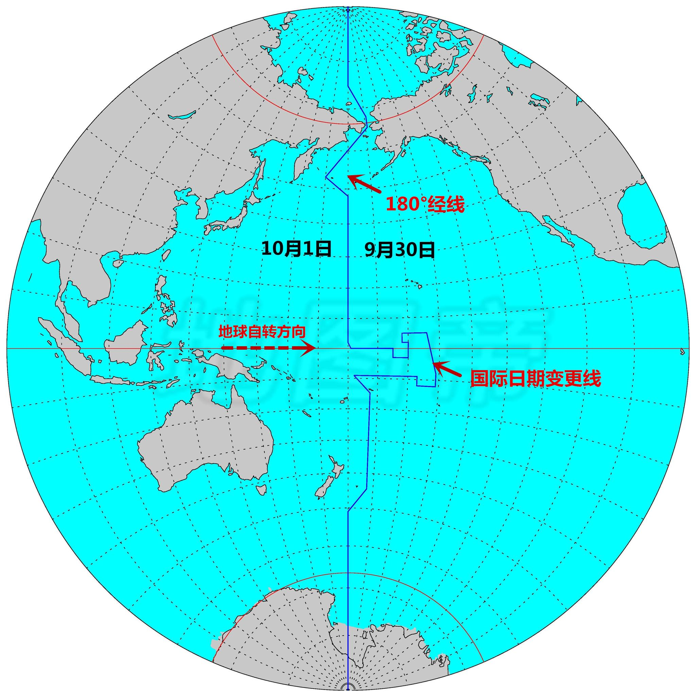
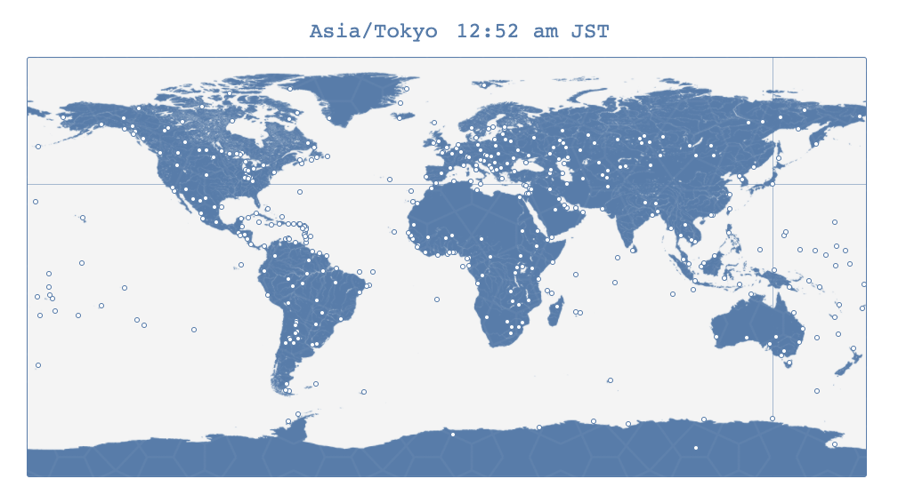

## 目录

<!-- toc -->

- [问题的产生](#问题的产生)
- [时区](#时区)
  * [理论时区](#理论时区)
  * [实际时区](#实际时区)
  * [国际日期变更线](#国际日期变更线)
- [时间标准](#时间标准)
  * [GMT](#GMT)
  * [UTC](#UTC)
  * [各国标准](#各国标准)
- [JavaScript 中的 Date 使用](#JavaScript-中的-Date-使用)
  * [Date 实例化](#Date-实例化)
  * [获取时区](#获取时区)
  * [处理 YYYY-MM-DD 日期字符串](#处理-YYYY-MM-DD-日期字符串)
  * [Safari 中的格式](#Safari-中的格式)
- [总结](#总结)
- [参考](#参考)

<!-- tocstop -->

## 问题的产生

时间是一个很大但又跟每个人息息相关的概念。从每天的日程安排，到买机票出国旅行，我们都需要准确的时间来规划我们的生活，以在这无序的世界中寻找到共同的节奏。

在互联网产品的前端流程部分，必须要注意呈现给用户的时间是否正确。比如做国际化的团队，设计的产品全世界用户是否能无歧义使用？有哪些时间是本地时间，只需当地人有共同感知即可，有哪些又是需要全世界统一时间呢？

本文并不对时间的作种种更广泛的讨论，只是整理一下常见的概念以及 JavaScript 中的 Date 对象中的用法。

## 时区

### 理论时区

1884 年，在华盛顿召开的一次国际经度会议（又称国际子午线会议）上，规定将全球划分为 24 个时区（东、西各 12 个时区）。规定英国（格林尼治天文台旧址）为中时区（零时区）、东 1-12 区，西 1-12 区。每个时区横跨经度 15 度，时间正好是 1 小时。

不过上述时区定义其实是**理论时区**。理论时区的时间采用其中央经线（或标准经线）的地方时。比如东八区的经度范围是 112.5°E~127.5°E，中央经线为 120°E。

北京处于东八区，也就是说北京的时间要比伦敦早上八小时，当伦敦还是 2020-09-30 12:00 的时候，北京已经是 2020-09-30 20:00。

### 实际时区

有些幅员辽阔的国家，横跨多个时区，常常以国家内部行政分界线为时区界线。这就是实际时区，即**法定时区**。

我国地理上跨越多个时区，但法定时区只有东八区标准时，尽管从新疆到北京日夜感受上差异很大。而美国会使用多个时区，西部时间（-8）、山地时间（-7）、中部时间（-6）、东部时间（-5）。

还有些国家会实行夏令时，

每个国家有每个国家的国情，具体时间还是以当地为准。

### 国际日期变更线

在时区的划分上，还有一条**国际日期变更线**。

东 12 区和西 12 区的中央经线其实都是 180° 经线，为了避免同一个时区即存在新的一天，又存在旧的一天，人为规定 180° 以西至 0 点所在经线，为新的一天，以东为旧的一天。

但是太平洋上存在一些国家，行政区划横跨 180° 经线，为了方便管理，国际日期变更线其实不是一条直线。



前面提到，理论时区只包括西 12 区~东 12 区 24 个时区。但是太平洋国家萨摩亚在 2011 年 12 月 29 日完结时把标准时间从国际日期变更线以东调整到国际日期变更线以西，即从时区 UTC-11 改为 UTC+13 （夏时制由 UTC-10 改为 UTC+14）。因此，现行国际时区标准中，存在一个“东 13 区”。

```js
// 太平洋阿皮亚地区的时区
moment().tz('Pacific/Apia').format('Z')
// "+13:00"
```

## 时间标准

有了时区，就有了时间标准。

最大名鼎鼎的是 GMT，其他的还有 UTC，GMT，DST，CST 等。

### GMT

GMT 即 Greenwich Mean Time， 代表**格林威治标准时间**。

前文提到，1884年国际经度会议决定选择格林威治的子午线，作为划分地球东西两半球的经度零度。而格林威治皇家天文台早在十七世纪，就已经是海上霸主大英帝国的扩张而进行天体观测。

GMT 零时区的标准正是建立在英国人最早的全球探索功业上，影响了后世对于时区标准的划分。

而我们常说的时间戳 timestamp，指格林威治时间 1970 年 01 月 01 日 00 时 00 分 00 秒(北京时间1970 年 01 月 01 日 08 时 00 分 00 秒)起至现在的总秒数，JavaScript 中出输出的 timestamp 是到毫秒级的。

```js
// 输出的是 GMT 自 1970 年 01 月 01 日 00 时 00 分 00 秒 到现在的毫秒数
new Date().getTime()
// 1599568950947
```

要注意的是，时间戳是系统递增的一个秒数数字，不管你在全世界哪一个地方，它都是一致的。另一个点，我们开发常说的本地时间，指的是用户的客户端所在时区的时间，是用户看到的实实在在的时间。对于服务端来说，是没有本地时间这个概念的！UNIX 系统上输出的就是一个时间戳 timestamp，要转换成本地时间，要么通过时区信息转换，要么交给客户端代码，比如 JavaScript 中的 Date 对象跑一下。


### UTC

UTC 即 Coordinated Universal Time，代表**世界协调时间**或**协调世界时**。

UTC 是经过平均太阳时(以格林威治时间 GMT 为准)、地轴运动修正后的新时标以及以“秒”为单位的国际原子时所综合精算而成的时间，计算过程相当严谨精密。协调世界时是最接近 GMT 的几个替代时间系统之一。

普遍认为，UTC 时间被认为能与 GMT 时间互换，GMT 时间已不再被科学界所确定。

一般来说，当我们提到 **UTC 时间**而不带任何别的修饰时，常指 UTC 0点。

UTC 和 GMT 唯一的差别，UTC 有闰秒，GMT 没有。

### 各国标准

每个国家/地区使用的时区标准，都用不同的简称，可参考 [Moment Timezone \| Home](https://momentjs.com/timezone/)。

不同的浏览器显示效果相同，Chrome 会显示 GMT，以及一个已经翻译好的地方时区标准：

```js
new Date();
// Sat Jun 15 2019 20:36:10 GMT+0800 (中国标准时间)
```

而 Safari 则显示的是当地标准名称：

```js
new Date();
// Thu Oct 10 2019 00:00:00 GMT+0800 (CST)
```



## JavaScript 中的 Date 使用

### Date 实例化

有以下方法：

+ *new Date()*	
+ *new Date(timestamp)*
+ *new Date(date string)*
+ *new Date(year, month, day, hours, minutes, seconds, milliseconds)*

其中的 datestring 有很多类型，具体可见： [Date.parse()](https://developer.mozilla.org/en-US/docs/Web/JavaScript/Reference/Global_Objects/Date/parse)

ISO 标准类型有：

+ *2019-06-10 (date-only form)*
+ *2019-06-10T14:48:00 (date-time form)*
+ *2019-06-10T14:48:00.000+09:00 (date-time form with milliseconds and time zone)*
+ *2019-06-10T00:00:00.000Z* (specifying UTC timezone via the ISO date specification，Z is the same with +00:00)*

一些非 ISO 标准的类型：

+ *Aug 9, 1995*
+ *Wed, 09 Aug 1995 00:00:00*
+ *Wed, 09 Aug 1995 00:00:00 GMT*


### 获取时区

如果想在js中获取一个日期的时区，可以直接使用 [Date.prototype.getTimezoneOffset()](https://developer.mozilla.org/en-US/docs/Web/JavaScript/Reference/Global_Objects/Date/getTimezoneOffset)。

```js
const date1 = new Date('August 19, 1975 23:15:30 GMT+07:00');
const date2 = new Date('August 19, 1975 23:15:30 GMT-02:00');

console.log(date1.getTimezoneOffset());
// expected output: your local timezone offset in minutes
// (eg -120). NOT the timezone offset of the date object.

console.log(date1.getTimezoneOffset() === date2.getTimezoneOffset());
// expected output: true


// -480
// -480
// -480
```

*getTimezoneOffset* 返回的结果，是当前地方时和 UTC 时间的差值，用分钟表示。上述 dateLocal 可以理解为，( 0 时区 - 本地时区(+8) ) * 60min = -480.

这里的代码也可以看到，*Date* 的构造函数中设置时区是无效的，JavaScript 不会帮你存储实例化该日期时的时区信息。因为 JavaScript 是跑在客户端本地的，是跟着客户端时区来运行的，如果强行给它改变时区，容易造成困惑。

> It's important to keep in mind that the date and time is stored in the local time zone, and that the basic methods to fetch the date and time or its components all work in the local time zone as well.


```js
new Date('June 15, 2019 23:15:30 GMT+10:00')；

// 东10区的时间，实例化成功后，日期被转换成了本地时区
// Sat Jun 15 2019 21:15:30 GMT+0800 (中国标准时间)
```

### 处理 YYYY-MM-DD 日期字符串

处理 *YYYY-MM-DD* 日期字符串需要特别小心：

```js
var date1 = new Date('2019-10-10')
// Thu Oct 10 2019 08:00:00 GMT+0800 (中国标准时间)

var date2 = new Date('2019-10-10 00:00:00')
// Thu Oct 10 2019 00:00:00 GMT+0800 (中国标准时间)
```

这里差了有八个小时，原因在于直接传 *YYYY-MM-DD* 得到的是一个基于 UTC 时间的 Date 实例，UTC时间即是零时区的标准时间，既是 `2019-10-10 00:00:00 GMT+0000` 这样的默认 UTC 时间，然后再转到本地时区的时间 `2019-10-10 08:00:00 GMT+0800`。

而 *date2* 中的实例化时间已经指定了 `00:00:00` ，即是本地时区 `GMT +08:00` 的时间。

有些场景，直接使用 *YYYY-MM-DD* 会有问题:

```js
// code is runningg on GMT +08:00
const d = new Date('2019-10-10');
const date = d.getDate();

// 10
// Looks good!


// code is runningg on GMT -10:00
const d = new Date('2019-10-10');
const date = d.getDate();

// 9
// Amazing?!
```

所以在使用的是要特别注意。

### Safari 中的格式

在 Safari 中，实例化 Date 要特别注意：

```js
new Date('2019-10-10 00:00:00')
// Invalid Date

new Date('2019/10/10 00:00:00')
// Thu Oct 10 2019 00:00:00 GMT+0800 (CST)
```

## 总结

本文大致梳理了一下时区的概念和 JavaScript Date 对象的运用，只要理清这些基本概念就不容易犯错。如果要基于一些业务上的考虑，可以做的事情有很多，比如时间本地化，不同国家有不同的时间展示方式，而不是生硬的 *2020-09-10 12:30:00* 这样的数字格式。我司的国际化机票中就用上了一套时间本地化 SDK，用于处理不同站点机票业务的时间展示需求。

## 参考

+ [时区与JS中的Date对象 - 掘金](https://juejin.im/post/6844903885505576968)
+ [UTC is Enough for Everyone, Right?](https://zachholman.com/talk/utc-is-enough-for-everyone-right)