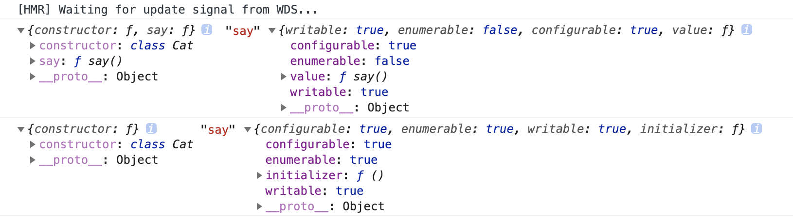

## 目录

<!-- toc -->

- [前言](#前言)
- [语法的进化](#语法的进化)
- [使用场景](#使用场景)
  * [作用于类的装饰器](#作用于类的装饰器)
  * [作用于类属性的装饰器](#作用于类属性的装饰器)
  * [装饰器加载顺序](#装饰器加载顺序)
- [原理](#原理)
- [限制](#限制)
- [应用](#应用)
- [参考](#参考)

<!-- tocstop -->

## 前言

什么是装饰器模式？

装饰器模式（Decorator Pattern）允许向一个现有的对象添加新的功能，同时又不改变其结构。这种类型的设计模式属于结构型模式，它是作为现有的类的一个包装。

## 语法的进化

在 JavaScript 中，在 ES5 时代，由于没有 class 语法糖，ES5 的面向对象是用 function 函数模拟出来的，所以那个时候的装饰器模式更像是一种高阶函数模式，用来增强原来的函数。

```js
const log = (srcFun) => {
  if(typeof(srcFun) !== 'function') {
    throw new Error(`the param must be a function`);
  }
  return (...arguments) => {
    console.info(`${srcFun.name} invoke with ${arguments.join(',')}`);
    srcFun(...arguments);
  }
}

const plus = (a, b) => a + b;

const logPlus = log(plus);

logPlus(1,2); // this will log : plus invoke with 1,2
```

ES6 的出现带来了 class 语法糖，ES7 带来了 Decorator 语法，这让 JavaScript 的装饰器模式更加接近其他语言的语法：

```js
const log = (target, name, descriptor) => {
  var oldValue = descriptor.value;
  descriptor.value = function() {
    console.log(`Calling ${name} with`, arguments);
    return oldValue.apply(this, arguments);
  };
  return descriptor;
}

class Math {
  @log  // Decorator
  plus(a, b) {
    return a + b;
  }
}
const math = new Math();

math.add(1, 2); // this will log: Calling plus with 1,2
```

## 使用场景

Decorator 语法的作用场景有两种：

+ 作用于类的装饰器
+ 作用于类属性（不仅仅是方法）的装饰器

### 作用于类的装饰器

当一个装饰器作用于类的时候，是这个样子的：

```js
function isAnimal(target) {
    target.isAnimal = true;
  	return target;
}

@isAnimal
class Cat {
    ...
}

console.log(Cat.isAnimal);    // true
```

### 作用于类属性的装饰器

当一个装饰器作用于类属性的时候，是这个样子的：

```js
function readonly(target, name, descriptor) {
    discriptor.writable = false;
    return discriptor;
}

class Cat {
    @readonly
    say() {
        console.log("meow ~");
    }
}

var kitty = new Cat();

kitty.say = function() {
    console.log("woof !");
}

kitty.say()    // meow ~
```
### 装饰器加载顺序

+ 装饰器的执行发生在类创建后，实例创建前
+ 有多个装饰器时，由近及远执行
+ 类装饰器总是最后执行
+ 类的各个属性绑定的装饰器，谁写在前面谁先执行

## 原理

Decorator 语法的实质是 Object.defineProperty 的语法糖，所以其实装饰器在起作用的时候，实际上是通过 Object.defineProperty 来进行扩展和封装的。

```js
let descriptor = {
    value: function() {
        console.log("meow ~");
    },
    enumerable: false,
    configurable: true,
    writable: true
};

descriptor = readonly(Cat.prototype, "say", descriptor) || descriptor;

Object.defineProperty(Cat.prototype, "say", descriptor);
```

所以，我们可以进一步得出：

+ 当装饰器作用于类本身的时候
  + 装饰器函数的参数为：target
  + target 为类本身
+ 当装饰器作用于类的某个具体的属性的时候
  + 装饰器函数的参数为：target, name, descriptor
  + target 为类的 prototype
  + name 为属性名
  + descriptor 为属性描述符，可以进行扩展和封装

## 限制

目前使用 Decorator 会有一个问题，那就是 class 中的箭头函数跟普通函数用装饰器会有不一样的效果。

```js
function test(target, name, descriptor) {
    console.log(target, name, descriptor)
    return descriptor
}

class Cat {
    @test
    say = () => {}
    @test
    say() {}
}
```



具体表现来说：

常规类方法：
+ 是直接绑在类的 prototype 中，所有能在 target 上看到，通过原型链共享该方法
+ descriptor 有 value 值，为此方法

属性方法：
+ 归属于类的实例，不能在 target 上看到，在类的不同实例中并不相同
+ descriptor 没有 value 值，只有一个 initializer 的值，调用 initializer() 会返回这个属性方法

原因在于，装饰器的执行是在类创建后（实例生成前），这里就发生了一个概念上的小冲突，装饰器执行时属性方法似乎还没创建。

当然，为了弥合这个问题，babel 工具会在编译的时候就做好了兼容，这就是给属性方法添加一个 initializer，具体细节可以见[此文](https://www.insomnia7.com/js/decorator.html#%E4%B8%89%E3%80%81%E5%BD%93class-properties%E9%81%87%E5%88%B0decorator)，或者研究 babel 编译过程。

总之，Decorator 目前还不算特别成熟，实际应用中不同的实现会有差异，以观后效吧。

## 应用

实现一个兼容普通类函数和类属性函数的装饰器，并且保留箭头函数的 this 绑定。

```js
function test() {
  return function (target, name, descriptor) {
    // 类属性方法
    if (descriptor.initializer) {
      const originInitializer = descriptor.initializer
      descriptor.initializer = function() {
        // 执行 initializer 会返回这个原始的属性方法
        const fn = originInitializer.call(this)
        return function(...args) {
          // 做其他的工作
          ...
          // 调用原来的方法
          fn.call(this, ...args)
        }
      }
    } else {
      // 常规方法
      const originValue = descriptor.value;
      descriptor.value = function(...args) {
        // 做其他的工作
        ...
        // 将 this 绑定
        originValue.call(this, ...args)
      };
      return descriptor;
    }
  }
}

class Cat {
  @test()
  say = () => {
    console.log(this)
  }
  @test()
  hello() {
    console.log(this)
  }
}
```

## 参考

+ [Decorators · TypeScript Handbook（中文版）](https://zhongsp.gitbooks.io/typescript-handbook/content/doc/handbook/Decorators.html)
+ [Javascript 中的装饰器 \| Aotu.io「凹凸实验室」](https://aotu.io/notes/2016/10/24/decorator/index.html)
+ [进阶版decorator，为class箭头函数添加装饰器 \| Insomnia's Blog](https://www.insomnia7.com/js/decorator.html#%E4%B8%89%E3%80%81%E5%BD%93class-properties%E9%81%87%E5%88%B0decorator)
