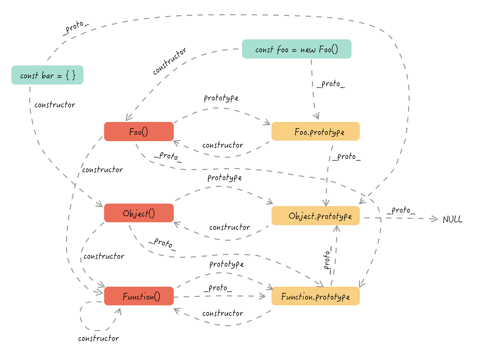
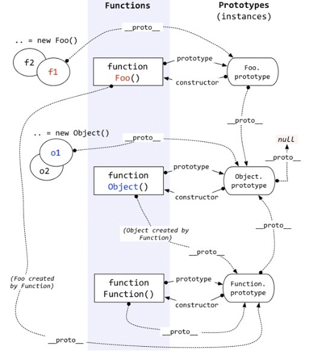
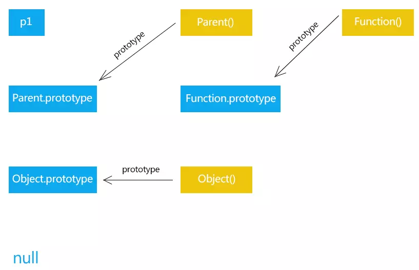
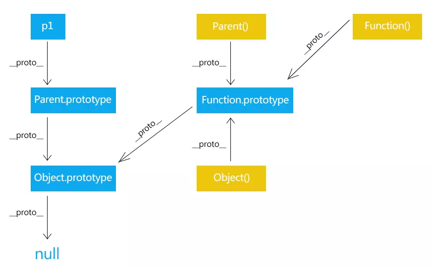
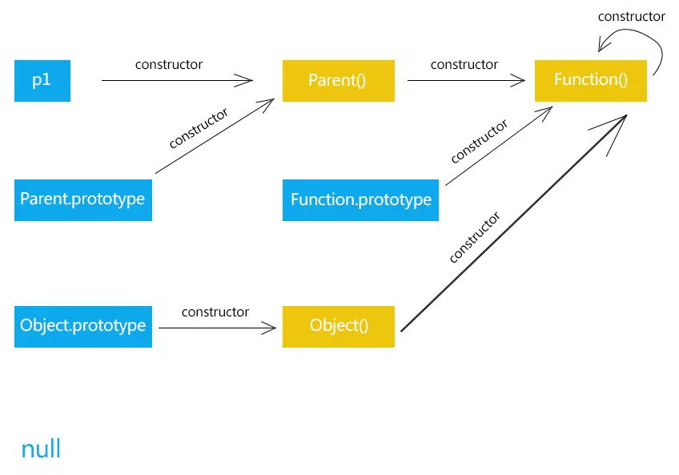

## 目录

<!-- toc -->

- [前言](#前言)
- [原型和原型链](#原型和原型链)
  * [prototype 属性](#prototype-属性)
  * [proto 属性](#proto-属性)
  * [constructor 属性](#constructor-属性)
  * [总结](#总结)
- [new 的原理](#new-的原理)
- [typeof 原理](#typeof-原理)
- [instanceof 原理](#instanceof-原理)
- [参考](#参考)

<!-- tocstop -->

## 前言

在 JavaScript 中，原型和原型链是一个关乎这门语言最根本的知识点，实在是有必要搞懂搞透彻。本文将整理原型相关知识，以及由此引申出的 JavaScript 中面向对象相关的知识点。

## 原型和原型链

要想搞明白原型和原型链，下面几个概念关系必须理解：

+ 对象和函数的关系
  + 一切皆对象
  + 函数是对象的一种
+ 函数和构造函数的关系
  + 只有 new 调用的函数才叫构造函数
+ proto、prototype、constructor 的指向
  + prototype 属性是函数独有的
  + proto、constructor属性是对象所独有的
  + 函数也是对象，所有函数也有 proto、constructor 属性
+ 隐式原型和显式原型
  + prototype：显式原型，只有函数才有的属性，指向函数的原型对象
  + proto：隐式原型，指向了创建该对象的构造函数的原型对象

下图是整个原型链的两种图解：

自己画的版本：



流传比较广的一个版本：



以下面代码为例子做一个整体理解：

```js
function Parent() {}
// 作为构造函数调用
const p1 =  new Parent()
```

### prototype 属性



prototype 属性是函数独有的，记住这个关键点。*它从一个函数指向另一个对象*，代表这个对象是这个函数的**原型对象**，这个对象也是当前函数所创建的实例的原型对象。

prototype 设计之初就是为了实现继承，让由特定函数创建的所有实例共享属性和方法，也可以说是让某一个构造函数实例化的所有对象可以找到公共的方法和属性。有了 prototype 就不需要为每一个实例创建重复的属性方法，而是将属性方法创建在构造函数的原型对象上（prototype）。那些不需要共享的才创建在构造函数中。

但问题来了，这个 prototype 属性是绑定在函数上的，函数实例化后的对象如何得知这个原型对象呢？

这就是通过 proto 属性来完成的。

### proto 属性



proto 属性是对象（包括函数）独有的。从图中可以看到 proto 属性是*从一个对象指向另一个对象*，即从一个对象指向该对象的原型对象（也可以理解为父对象）。显然它的含义就是告诉我们一个对象的原型对象是谁。

Parent.prototype 上添加的属性和方法叫做**原型属性和原型方法**，该构造函数的实例可以通过 proto 属性访问调用。每个对象都有 proto 属性，该属性指向的就是该对象的原型对象。

proto 通常称为隐式原型，prototype 通常称为显式原型。

```js
p1.__proto__ === Parent.prototype; // true
```

Parent.prototype 也是对象，它也有隐式原型：

```js
Parent.prototype.__proto__ === Object.prototype; //true
```

这也是为什么普通对象可以拥有 Object 的方法的原因，通过 proto 属性直接链接到 Object 原型对象上，上面有很多基础的方法。这就是**原型链**的概念。

```js
p1.toString();
```

当我们调用 p1.toString() 的时候，先在 p1 对象本身寻找，没有找到则通过 p1.\_\_proto\_\_ 找到了原型对象 Parent.prototype，也没有找到，又通过Parent.prototype.\_\_proto\_\_ 找到了上一层原型对象 Object.prototype。在这一层找到了 toString 方法。返回该方法供 p1 使用。

当然如果找到 Object.prototype 上也没找到，就在 Object.prototype.\_\_proto\_\_ 中寻找，但是 Object.prototype.\_\_proto\_\_ === null 所以就返回undefined。这就是为什么当访问对象中一个不存在的属性时，返回 undefined。

另外对于 Parent() 函数来说，它也是对象，也有隐式原型，指向了 Function 的原型对象，说明所有的函数都是 Function 函数的实例，享有相同的原型方法：

```js
Parent.__proto__ === Function.prototype // true
Object.__proto__ === Function.prototype // true
```

所以我们可以看到：

+ 所有函数的 proto 指向 Function.prototype
+ 所有对象的 proto 最终指向为 Object.prototype

对于使用对象字面量创建的对象来说，它们的原型指向是直接到 Object.prototype 的，这是因为它等于是是 Object() 构造函数创造的实例对象：

```js
const bar = {}

bar.__proto__ === Object.prototype // true
```

### constructor 属性



constructor 是对象才有的属性，从图中看到它是从一个对象指向一个函数的。指向的函数就是该对象的构造函数。

每个对象都有构造函数。而最终的最终，constructor 指向了 Function 函数，并且可以看到 Function 函数的构造函数就是本身了，那我们也就可以说 Function 是所有函数的根构造函数。


### 总结

原型链是一个重要但很容易绕晕的概念，其实主要把握住上面 proto、prototype、constructor 三个属性的指向，以及上面的关系图就可以了。

+ prototype 只有函数有，指向函数的原型对象
+ proto 是所有的对象都有，指向对象的原型对象
  + 所有函数的 proto 指向 Function.prototype
  + Function.prototype 的 proto 指向 Object.prototype 
  + 所有对象的 proto 最终指向为 Object.prototype 
+ constructor 是所有的对象都有，但它只指向函数
  + 最终统统指向 Function()

## new 的原理

new 操作也是 JavaScript 中一个很重要的点，它直接决定了一个函数是否能成为构造函数。它在执行的时候会确定几件事：

+ 使用 Object.create() 创建一个新的空对象
+ 它自动将这个空对象的 proto 指向构造函数的原型对象上，从而继承原型上的方法属性
+ 构造函数使用 .apply() 将 this 指向这个新对象，以获取私有属性
+ 如果构造函数有返回对象，就使用该对象，如果返回值不是对象，就将创建的对象返回

```js
/**
 * 模拟实现 new 操作符
 * @param  {Function} ctor [构造函数]
 * @return {Object|Function|Regex|Date|Error} [返回结果]
 */
 function newOperator(ctor, ...args){
    if(typeof ctor !== 'function'){
      throw 'newOperator function the first param must be a function';
    }
    // ES6 new.target 是指向构造函数
    newOperator.target = ctor;
    // 1. 创建一个全新的对象，
    // 2. 并且执行__proto__链接
    // 3. 通过`new`创建的每个对象将 __proto__ 指向函数的`prototype`对象上。Object.create() 创建的对象是放在 prototype 上的。
    const newObj = Object.create(ctor.prototype);
    // 4. 将构造函数中的this指向obj，执行构造函数代码,获取返回值
    const ctorReturnResult = ctor.apply(newObj, ...args);
    // 5. 判断返回的类型，合并起来只有 Object 和 Function 两种类型 typeof null 也是'object'所以要不等于null，排除null
    const isObject = typeof ctorReturnResult === 'object' && ctorReturnResult !== null;
    const isFunction = typeof ctorReturnResult === 'function';
    if(isObject || isFunction){
        return ctorReturnResult;
    }
    // 6.如果函数没有返回对象类型`Object`(包含`Functoin`, `Array`, `Date`, `RegExg`, `Error`)，那么`new`表达式中的函数调用会自动返回这个新的对象。
    return newObj;
}
```

## typeof 原理

typeof 一般被用于判断一个变量的类型，适合判断基本数据类型：

```js
let bol = true
let nll = null
let udefd = undefined
let str = 'str'
let num = 123
let bigint = 123n
let smy =  Symbol(42)

typeof bol // => boolean
typeof nll // => object
typeof udefd // undefined
typeof str // => string
typeof num // => number
typeof bigint // => bigint
typeof smy // => symbol
```

而对于复杂类型，typeof 就力所不及了：

```js
typeof window // => "object"
typeof Array // => "function"
```

至于 typeof null 也为 object 的原因在于，null 在存储的时候机器码全为 0，而 js 在底层存储变量的时候，会在变量的机器码的低位 1-3 位存储其类型信息：

+ 000：对象
+ 010：浮点数
+ 100：字符串
+ 110：布尔
+ 1：整数

所以 null 就直接被当成了对象来对待。

## instanceof 原理

在 MDN 上是这样描述 instanceof 的：

> instanceof 运算符用于测试构造函数的 prototype 属性是否出现在对象原型链中的任何位置

在使用中 instanceof 一般有两个作用：
+ 判断一个实例是否属于某构造函数
+ 在继承关系中用来判断一个实例是否属于它的父类型或者祖先类型的实例

其原理就是检查右边变量的 prototype 是否在左边变量的原型链上（使用 proto 往上追溯）。因此，instanceof 在查找的过程中会遍历左边变量的原型链，直到找到右边变量的 prototype，如果查找失败，则会返回 false。

```js
function instance_of(L, R) {
    var O = R.prototype; 
    L = L.__proto__;
    while (true) {    
        if (L === null)      
             return false;   
        if (O === L) 
             return true;   
        L = L.__proto__;  
    }
}
```

下面一些案例可以配合上一节的 proto 属性关系图来理解原型链关系：

```js
function Foo() {}
const foo  = new Foo()

// true，foo 是 Foo 构造出来的
// foo.__proto__ === Foo.prototype
foo instanceof Foo

// true，foo 是 Foo 构造出来的
// foo.__proto__ === Foo.prototype
// Foo.prototype.__proto__ === Object.prototype
foo instanceof Object

// true，Object 是构造函数，继承于 Function，Function 则最终指向 Object.prototype
// Object.__proto__ === Function.prototype
// Function.prototype.__proto__ === Object.prototype
Object instanceof Object

// true，Function 的构造函数是自己，“小丑竟是我自己”
// Function.__proto__ === Function.prototype
Function instanceof Function 

// true，函数也是对象一种
// Function.__proto__ === Function.prototype
// Function.prototype.__proto__ === Object.prototype
Function instanceof Object

// false，普通构造函数无法指向自己，它是 Function 的构造函数
// Foo.__proto__ === Function.prototype
Foo instanceof Foo

// true，因为任何函数都是 Function 的构造函数 
// Foo.__proto__ === Function.prototype
Foo instanceof Function // true

// true，因为 Function.prototype 最终也是指向 Object.prototype
// Foo.__proto__ === Function.prototype
// Function.prototype.__proto__ === Object.prototype
Foo instanceof Object // true

// false，内置构造函数也是无法指向自己，与普通函数无异，它也是 Function 的构造函数
// Number.__proto__ === Function.prototype
Number instanceof Number

// false
// null 不具有任何对象的特性,也没有__proto__ 属性
null instanceof Object

// false，所以基础类型不要用 instanceof 来判断，使用 typeof
'string' instanceof String
123 instanceof Number
// true，这个是对象，才好用 instanceof
const s = new String('string')
s instanceof String
```

## 参考

+ ["instanceof 的原理是什么"？大声告诉面试官，我知道！_pantone44 - SegmentFault 思否](https://segmentfault.com/a/1190000018874474)
+ [一张图搞定JS原型&原型链_个人文章 - SegmentFault 思否](https://segmentfault.com/a/1190000021232132)
