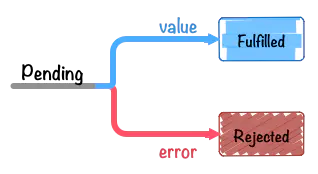

## 目录
<!-- toc -->

- [前言](#前言)
- [Promise 实现](#Promise-实现)
  * [观察者模式](#观察者模式)
  * [Promise A+ 规范](#Promise-A-规范)
  * [Promise 状态机](#Promise-状态机)
  * [then 的链式调用](#then-的链式调用)
  * [Promise.prototype.catch()](#Promiseprototypecatch)
  * [Promise.prototype.finally()](#Promiseprototypefinally)
  * [Promise.resolve()](#Promiseresolve)
  * [Promise.reject()](#Promisereject)
  * [Promise.all()](#Promiseall)
  * [Promise.race()](#Promiserace)
  * [Promise.allSettled](#PromiseallSettled)
- [Generator 实现](#Generator-实现)
  * [regeneratorRuntime.mark()](#regeneratorRuntimemark)
  * [regeneratorRuntime.wrap()](#regeneratorRuntimewrap)
  * [原理实现思路](#原理实现思路)
- [async-await 实现](#async-await-实现)
  * [原理实现](#原理实现)
- [参考](#参考)

<!-- tocstop -->

## 前言

之前有整理过 [Node 异步编程探究](:note:281b4dfa-3e7e-4da7-8ca3-b45867117301)，只写了一些用法，没有深入解析其实现。

本文将整理 JavaScript 中三种异步编程的实现原理：

+ Promise 的实现原理
+ Generator 的实现原理
+ Async 的实现原理

## Promise 实现

### 观察者模式

来看一个简单的 Promise 的代码：

```js
const p1 = new Promise((resolve, reject) => {
    setTimeout(() => {
        resolve('result')
    },
    1000);
}) 

p1.then(res => console.log(res), err => console.log(err))
```

Promise 的调用流程：

+ Promise 的构造方法接收一个 executor()，在 new Promise() 时就立刻执行这个 executor 回调
+ executor() 内部的异步任务被放入宏/微任务队列，等待执行
+ then() 被执行，收集成功/失败回调，放入成功/失败队列
+ executor() 的异步任务被执行，触发 resolve/reject，从成功/失败队列中取出回调依次执行

这种收集依赖 -> 触发通知 -> 取出依赖执行 的方式和观察者模式很像。在 Promise 里，执行顺序是 then收集依赖 -> 异步触发 resolve -> resolve 执行依赖。

### Promise A+ 规范

Promise 实现中，有一个[Promise A+ 规范](https://promisesaplus.com/)。该规范对 Promise 的状态控制做了要求。总结一下其中的核心：

+ Promise 本质是一个状态机，且状态只能为以下三种：Pending（等待态）、Fulfilled（执行态）、Rejected（拒绝态），状态的变更是单向的，只能从 Pending -> Fulfilled 或 Pending -> Rejected，状态变更不可逆
+ then 方法接收两个可选参数，分别对应状态改变时触发的回调。then 方法返回一个 Promise。then 方法可以被同一个 Promise 调用多次。



依据上面两条重要规范，我们来一点点实现一个 Promise：

### Promise 状态机

我们先实现一个 Promise 的基本骨架，它的 constructor 管理着状态切换和执行：

```js
// Promise/A+
const STATUS = {
    PENDING: 'pending',
    FULFILLED: 'fulfilled',
    REJECTED: 'rejected'
}

class MyPromise {
    constructor(executor) {
        this._status = STATUS.PENDING // 初始为 pending 状态
        this._value = undefined // then 的回调
        this._resolveQueue = [] // resolve 时触发的成功队列
        this._rejectQueue = [] // reject 时触发的失败队列

        const resolve = value => {
            const run = () => {
                // Promise/A+ 规范规定的 Promise 状态只能从 pending 触发，变成 fulfilled
                if (this._status === STATUS.PENDING) {
                    this._status = STATUS.FULFILLED
                    this._value = value
                    // 执行 resolve 回调
                    // 这里之所以使用一个队列来储存回调，是为了实现规范要求的 "then 方法可以被同一个 promise 调用多次"
                    // 如果使用一个变量而非队列来储存回调，那么即使多次 p1.then() 也只会执行一次回调
                    while(this._resolveQueue.length) {
                        const callback = this._resolveQueue.shift()
                        callback(value)
                    }
                }
            }
            //把 resolve 执行回调的操作封装成一个函数,放进 setTimeout 里,以实现 promise 异步调用的特性（规范上是微任务，这里是宏任务）
            setTimeout(run)
        }
        // 同 resolve
        const reject = value => {
            const run = () => {
            if (this._status === STATUS.PENDING) {
                this._status = STATUS.REJECTED
                this._value = value

                while (this._rejectQueue.length) {
                    const callback = this._rejectQueue.shift()
                    callback(value)
                }
            }
            }
            setTimeout(run)
        }

        // new Promise() 时立即执行 executor，并传入 resolve 和 reject
        executor(resolve, reject)
    }
    then() { ... }
    catch() { ... }
    static resolve() { ... }
    static reject() { ... }
}
```

### then 的链式调用

然后来实现 then 链式调用规范，这是 Promise 知识点的重点和难点。

这里要注意两个点：

+ 值穿透：根据规范，如果 then() 接收的参数不是 function，那么我们应该忽略它。如果没有忽略，当then() 回调不为 function 时将会抛出异常，导致链式调用中断
+ 处理状态为 resolve/reject 的情况：其实我们上边 then() 的写法是对应状态为 padding 的情况，但是有些时候，resolve/reject 在 then() 之前就被执行（比如 Promise.resolve().then() ），如果这个时候还把 then() 回调 push 进 resolve/reject 的执行队列里，那么回调将不会被执行，因此对于状态已经变为 fulfilled 或 rejected 的情况，我们直接执行 then 回调：

```js
// then 方法,接收一个成功的回调和一个失败的回调
then(onFulfilled, onRejected) {
    // 根据规范，如果 then 的参数不是 function，则忽略它, 让值继续往下传递，链式调用继续往下执行
    typeof onFulfilled !== 'function' ? onFulfilled = value => value : null
    typeof onRejected !== 'function' ? onRejected = value => value : null

    // then 返回一个新的 promise
    return new MyPromise((resolve, reject) => {
        const resolveFn = value => {
            try {
                const x = onFulfilled(value)
                // 分类讨论返回值,如果是 Promise，那么等待 Promise 状态变更,否则直接 resolve
                x instanceof MyPromise ? x.then(resolve, reject) : resolve(x)
            } catch(e) {
                reject(e)
            }
        }
        const rejectFn = error => {
            try {
                const x = onRejected(error)
                x instanceof MyPromise ? x.then(resolve, reject) : reject(x)
            } catch(error) {
                reject(e)
            }
        }

        switch(this._status) {
            case STATUS.PENDING:
                this._resolveQueue.push(resolveFn)
                this._rejectQueue.push(rejectFn)
                break
            case STATUS.FULFILLED:
                resolveFn(this._value)
                break
            case STATUS.REJECTED:
                rejectFn(this._value)
                break
        }
    })
}
```

### Promise.prototype.catch()

catch() 方法返回一个 Promise，并且处理拒绝的情况。它的行为与调用Promise.prototype.then(undefined, onRejected) 相同。

```js
// catch 只是一个 then 的别名
catch(rejectFn) {
  return this.then(undefined, rejectFn)
}
```

### Promise.prototype.finally()

finally() 方法返回一个 Promise。在当前 promise 结束时，无论结果是 fulfilled 或者是 rejected，都会执行指定的回调函数。在 finally 之后，还可以继续 then。并且会将值原封不动的传递给后面的 then。

```js
finally(callback) {
    return this.then(
        // MyPromise.resolve 执行回调,并在 then 中 return 结果传递给后面的 Promise
        value => MyPromise.resolve(callback()).then(() => value),
        error => MyPromise.resolve(callback()).then(() => error)
    )
}
```

### Promise.resolve()

静态方法 Promise.resolve(value) 方法返回一个以给定值解析后的 Promise 对象。如果该值为promise，返回这个 promise；如果这个值是 thenable（即带有"then" 方法)），返回的 promise 会“跟随”这个 thenable 的对象，采用它的最终状态；否则返回的 promise 将以此值完成。此函数将类 promise 对象的多层嵌套展平。

```js
static resolve(value) {
  // 根据规范, 如果参数是 Promise 实例, 直接 return 这个实例
  return value instanceof MyPromise
    ? value
    : new MyPromise(resolve => resolve(value))
}
```

### Promise.reject()

静态方法 Promise.reject() 方法返回一个带有拒绝原因的Promise对象。

```js
static reject(error) {
  return new MyPromise((resolve, reject) => reject(error))
}
```

### Promise.all()

Promise.all(iterable) 方法返回一个 Promise 实例，此实例在 iterable 参数内所有的 promise 都“完成（resolved）”或参数中不包含 promise 时回调完成（resolve）；如果参数中  promise 有一个失败（rejected），此实例回调失败（reject），失败原因的是第一个失败 promise 的结果。

```js
static all(promiseArr) {
    let count = 0
    let result = []
    return new MyPromise((resolve, reject) => {
        if (!promiseArr.length) {
            return resolve(result)
        }
        promiseArr.forEach((p, i) => {
            MyPromise.resolve(p).then(
                value => {
                    count++
                    result[i] = value
                    if (count === promiseArr.length) {
                        resolve(result)
                    }
                },
                error => {
                    reject(error)
                }
            )
        })
    })
}
```

### Promise.race()

Promise.race(iterable) 方法返回一个 promise，一旦迭代器中的某个 promise 解决或拒绝，返回的  promise 就会解决或拒绝。

```js
// 静态 race 方法，只要有一个成功或者失败，就回调
static race(promiseArr) {
    return new MyPromise((resolve, reject) => {
        promiseArr.forEach(p => {
            MyPromise.resolve(p).then(value => {
                    resolve(value)
                }, error => {
                    reject(error)
                })
        })
    })
}
```

### Promise.allSettled

Promise.allSettled() 方法也是返回一个合成的 Promise，不过只有等到所有包含的每个 Promise 实例都返回结果落定时，不管是解决(fulfilled)还是拒绝(rejected)，合成的 Promise 才会结束。一旦结束，状态总是 fulfilled。

```js
static allSettled(promiseArr) {
  return new MyPromise((resolve) => {
    const length = promiseArr.length;
    const result = [];
    let count = 0;

    if (length === 0) {
      return resolve(result);
    } else {
      for (let item of promiseArr) {
        Promise.resolve(item).then((value) => {
            result[count++] = {
              status: 'fulfilled',
              value: value
            };
            if (count === length) {
                return resolve(result);
            }
        }, (reason) => {
            result[count++] = {
              status: 'rejected',
              reason: reason
            };
            if (count === length) {
                return resolve(result);
            }
        });
      }
    }
  });
}
```


## Generator 实现

在谈 async/await 函数，必须要讲一讲 Generator 函数的实现。由于 Generator 出现不久就被 async/await 取代了，Generator 就相对于小众陌生，这里先来看看 Generator 的用法：

```js
// 使用 * 表示这是一个 Generator 函数
// 内部可以通过 yield 暂停代码
// 通过调用 next 恢复执行
function* foo() {
  yield 'result1'
  yield 'result2'
  yield 'result3'
}
  
const gen = foo()
console.log(gen.next().value) // 'result1'
console.log(gen.next().value) // 'result2'
console.log(gen.next().value) // 'result3'
```

上面代码可以在[babel官网](https://babeljs.io/repl/)上在线测试，看看ES5环境下是如何实现Generator的：

```js
"use strict";

var _marked =
/*#__PURE__*/
regeneratorRuntime.mark(foo);

function foo() {
  return regeneratorRuntime.wrap(function foo$(_context) {
    while (1) {
      switch (_context.prev = _context.next) {
        case 0:
          _context.next = 2;
          return 'result1';

        case 2:
          _context.next = 4;
          return 'result2';

        case 4:
          _context.next = 6;
          return 'result3';

        case 6:
        case "end":
          return _context.stop();
      }
    }
  }, _marked);
}

var gen = foo();
console.log(gen.next().value);
console.log(gen.next().value);
console.log(gen.next().value);
```

这里有两个关键代码：regeneratorRuntime.mark 和 regeneratorRuntime.wrap。这两者其实是 regenerator-runtime 模块里的两个方法，regenerator-runtime 模块来自 facebook 的 regenerator 模块，完整代码在[runtime.js](https://github.com/facebook/regenerator/blob/master/packages/regenerator-runtime/runtime.js)。下面只是简单讲解：

### regeneratorRuntime.mark()

regeneratorRuntime.mark(foo)这个方法在第一行被调用，源码的大致定义：

```js
runtime.mark = function(genFun) {
  genFun.__proto__ = GeneratorFunctionPrototype;
  genFun.prototype = Object.create(Gp);
  return genFun;
};
```

本质上，只要知道这段 mark() 代码为生成器函数（foo）绑定了一系列原型就可以了，更深的内容就略过了。

### regeneratorRuntime.wrap()

从上面babel转化的代码可以看到，执行 foo()，其实就是执行 wrap()，那么 wrap() 的大致定义：

```js
function wrap(innerFn, outerFn, self) {
  var generator = Object.create(outerFn.prototype);
  var context = new Context([]);
  generator._invoke = makeInvokeMethod(innerFn, self, context);

  return generator;
}
```

这里 outerFn 其实就是外部的 \_marked 模块，也就是 genFun。

wrap() 先创造了一个 generator，然后 new 一个 context 对象，最后使用 makeInvokeMethod() 绑定生成一个 \_invoke() 方法。

本质上，wrap() 相当于是给 generator 增加了一个 \_invoke() 方法，而且 generator.\_invoke 其实就等同于 gen.next， context 对象存储整个内部的状态，每一次的 \_invoke 都将改变内部的状态切换。这就是 generator 可以暂停/继续的内部（大概）原理。

### 原理实现思路

上面只是讲了一个基本的源码思路，更多的源码理解就不展开了，因为不太好理解。所以下面简单实现一个 Generator，来辅助思考：

```js
// 生成器函数根据 yield 语句将代码分割为 switch-case 块
// 后续通过切换 _context.prev 和_context.next 来分别执行各个 case
function gen$(_context) {
    while (1) {
      switch (_context.prev = _context.next) {
        case 0:
          _context.next = 2;
          return 'result1';
        case 2:
          _context.next = 4;
          return 'result2';
        case 4:
          _context.next = 6;
          return 'result3';
        case 6:
        case "end":
          return _context.stop();
      }
    }
}

// 低配版 context，管理状态
const context = {
    next:0,
    prev: 0,
    done: false,
    stop: function stop () {
        this.done = true
    }
}

// 低配版 invoke
const gen = function() {
    return {
        next: function() {
            value = context.done ? undefined: gen$(context)
            done = context.done
            return {
                value,
                done
            }
        }
    }
}

// 测试使用
let g = gen()
g.next()  // {value: "result1", done: false}
g.next()  // {value: "result2", done: false}
g.next()  // {value: "result3", done: false}
g.next()  // {value: undefined, done: true}
```

分析下调用流程：

1. 定义的 function* 生成器函数被转化为以上代码
2. 转化后的代码分为三大块：
   + gen$(\_context) 由 yield 分割生成器函数代码而来
   + context 对象用于储存函数执行上下文
   + next() 用于执行 gen$(\_context) 来跳到下一步
+ 当我们调用 g.next()，就相当于调用 invoke() 方法，执行 gen$(\_context)，进入 switch 语句，switch 根据 context 的标识，执行对应的 case 块，return 对应结果
+ 当生成器函数运行到末尾（没有下一个 yield 或已经 return），switch 匹配不到对应代码块，就会 return 空值，这时 g.next() 返回 {value: undefined, done: true}


从上面分析可以看出，**Generator 实现的核心在于上下文的保存**，函数并没有真的被挂起，每一次yield，其实都执行了一遍传入的生成器函数，只是在这个过程中间用了一个 context 对象储存上下文，使得每次执行生成器函数的时候，都可以从上一个执行结果开始执行，看起来就像函数被挂起了一样。

更多有关 Generator 的使用，可以参考我的另一篇文章：[JavaScript 生成器](https://betamee.github.io/content/webfrontend-90f567f116cc51adb5ed23e6583edbd6)。

## async-await 实现

虽然 Promise 很好用，相比于 callback 是一个巨大的进步，但 Promise 也不是没有问题。如果异步流程很长，如 a -> b -> c -> d，那么多层 then 链式调用代码的可读性和流程控制也将变得很差：

```js
Promise.resolve(a)
  .then(b => {
    // do something
  })
  .then(c => {
    // do something
  })
  .then(d => {
    // do something
  })
```

ES7 提出了异步的终极方案 async/await 函数，让我们可以用更直观简洁的方式来管理异步流程：

```js
async () => {
  const a = await Promise.resolve(a);
  const b = await Promise.resolve(b);
  const c = await Promise.resolve(c);
}
```

那么如何实现 async/await 函数呢？首先要知道，**async/await 本质上是对 Generator（生成器）的封装，是一个语法糖**。

相比于 Generator，async/await 更进一步：

+ async/await 自带执行器，不需要手动调用 next() 就能自动执行下一步
+ async 函数返回值是Promise对象，而 Generator 返回的是生成器对象
+ await 能够返回 Promise 的 resolve/reject 的值
+ 语义更好
+ 调试、捕获错误很方便

### 原理实现

既然 Generator 不带执行器，这里先实现一个 run 的方法，来自动执行 Generator：

```js
function run(gen) {
    // 把返回值包装成promise
    return new Promise((resolve, reject) => {
        const g = gen()

        function _next(val) {
            // 错误处理
            try {
                const res = g.next(val)
                if(res.done) {
                    return resolve(res.value);
                }
                // res.value包装为 promise，以兼容 yield 后面跟基本类型的情况
                Promise.resolve(res.value).then(
                    val => _next(val),
                    err => g.throw(err) // 抛出错误
                );
            } catch(err) {
                return reject(err);
            }
        }
        _next();
    });
}


function* myGenerator() {
    try {
        const a =  yield Promise.resolve(1);
        console.log(a)

        const b = yield 2;
        console.log(b)

        const c = yield Promise.reject('error')
        console.log(c)
    } catch (error) {
        console.log(error)
    }
}

const result = run(myGenerator) // => 1 2 error
```

在实际的项目，一般不会这么复杂地使用 Generator 来写异步，这种转换直接交给 Babel 就好。在 [Babel 官网](https://babeljs.io/repl)中，可以尝试转换：

```js
async function foo() {
  await bar();
}
```

转换为：

```js
let foo = (() => {
  var _ref = _asyncToGenerator(function* () {
    yield bar();
  });

  return function foo() {
    return _ref.apply(this, arguments);
  };
})();

function _asyncToGenerator(fn) { ... }
```

\_asyncToGenerator 是核心实现，下面来看下这个模块的细节：

```js
function _asyncToGenerator(fn) {
    // return 一个 function，和 async 保持一致
    return function() {
        var self = this
        var args = arguments
        return new Promise(function(resolve, reject) {
            var gen = fn.apply(self, args);

            // 相当于 _next()
            function _next(value) {
                asyncGeneratorStep(gen, resolve, reject, _next, _throw, 'next', value);
            }
            // 处理异常
            function _throw(err) {
                asyncGeneratorStep(gen, resolve, reject, _next, _throw, 'throw', err);
            }
            _next(undefined);
        });
    };
}

function asyncGeneratorStep(gen, resolve, reject, _next, _throw, key, arg) {
    try {
        var info = gen[key](arg);
        var value = info.value;
    } catch (error) {
        reject(error);
        return;
    }
    if (info.done) {
        resolve(value);
    } else {
        Promise.resolve(value).then(_next, _throw);
    }
}
```

其实 \_asyncToGenerator 跟上面的 run 很相似，都是为了驱动 Generator 的状态变化，所以本质上，async/await 就是 Generator 的语法糖而已。

读懂了 \_asyncToGenerator 和 Generator，对 async 异步函数能有更深的理解。

## 参考

+ [JavaScript Promise：简介  \|  Web Fundamentals  |  Google Developers](https://developers.google.com/web/fundamentals/primers/promises)
+ [9k字 \| Promise/async/Generator实现原理解析 - 掘金](https://juejin.im/post/5e3b9ae26fb9a07ca714a5cc)
+ [手写 Promise 全家桶 + Generator + async/await](https://mp.weixin.qq.com/s/wBnev5LhSL7qIGFjg8ZvrQ)
+ [JavaScript 生成器](https://betamee.github.io/content/webfrontend-90f567f116cc51adb5ed23e6583edbd6)
