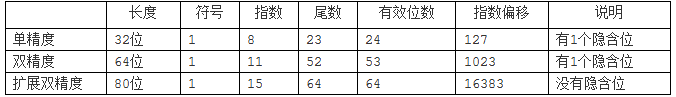
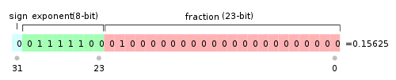
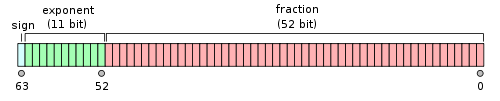
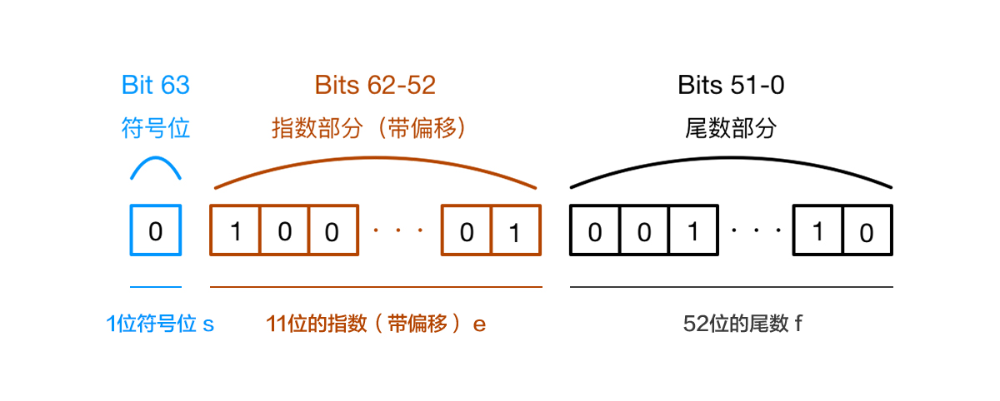

## 目录

<!-- toc -->

- [起因](#起因)
- [进制转换](#进制转换)
- [浮点数](#浮点数)
- [js 中的浮点数计算](#js-中的浮点数计算)
- [整数的精度问题](#整数的精度问题)
- [设计一个精确的浮点数运算函数](#设计一个精确的浮点数运算函数)
  * [浮点小数判断](#浮点小数判断)
  * [精确的加法函数](#精确的加法函数)
  * [精确的减法函数](#精确的减法函数)
  * [精确的乘法函数](#精确的乘法函数)
  * [精确的除法函数](#精确的除法函数)
- [参考](#参考)

<!-- tocstop -->

## 起因

在 JavaScript 作数学计算的时候，经常会遇到这样的问题：

```js
// 加法 =====================
// 0.1 + 0.2 = 0.30000000000000004
// 0.7 + 0.1 = 0.7999999999999999
// 0.2 + 0.4 = 0.6000000000000001
// 2.22 + 0.1 = 2.3200000000000003

// 减法 =====================
// 1.5 - 1.2 = 0.30000000000000004
// 0.3 - 0.2 = 0.09999999999999998

// 乘法 =====================
// 19.9 * 100 = 1989.9999999999998
// 19.9 * 10 * 10 = 1990
// 1306377.64 * 100 = 130637763.99999999
// 1306377.64 * 10 * 10 = 130637763.99999999
// 0.7 * 180 = 125.99999999999999
// 9.7 * 100 = 969.9999999999999
// 39.7 * 100 = 3970.0000000000005

// 除法 =====================
// 0.3 / 0.1 = 2.9999999999999996
// 0.69 / 10 = 0.06899999999999999
```

这种不太精确的值原因在于，在 JavaScript 中整数和浮点数都是属于 *Number* 类型，所有数字都是以 64 位浮点数（double float）形式存储，即便整数也是如此。

它的实现遵循 IEEE 754 标准，使用 64 位固定长度来表示，也就是标准的 double 双精度浮点数（相关的还有 float 32 位单精度）。

在解决这个问题前，先理解一下进制的知识、浮点数的概念以及计算机内部是如何存储这些值的。

## 进制转换

计算机中都是以二进制存储数据的，我们举一些常见的十进制和二进制转换例子。

```js
// 十进制
100.3
// 二进制
1100100.0100110011001100110011001100110011001100110011（1001无限循环）

// 十进制
0.1
// 二进制
0.0001100110011001...(1001无限循环)

// 十进制
0.2
// 二进制
0.0011001100110011...(1001无限循环)
```

由于计算机内部的存储不可能是无限的位数，必然会有取舍。假设一个 8 位的存储器都用来存这些数据（不考虑正负等其他情况），那么多于 8 位以外的值将会被舍弃，舍弃的原则是第九位**0 舍 1 进**：

```js
// 现实值
0001100110011001...

// 放在计算机的存储器中，第九位 0 舍 1 进
00011010
```

这说明了进制的转换，或者说计算器存储数据本身是有一定的误差的。

## 浮点数

那么什么是浮点数呢？

上面的案例中提到，使用一个 8 位的存储器，最多只能存 $2^8 = 256$ （0 -255）个值，就算使用 32 位，64 位存储器，也最多能放$2^{32}$、$2^{64}$，这离现实中使用的场景差距远着呢。

为了解决这个问题，引入一种*科学计数法*的数学工具，就是用简洁的方式来表示世间各种各样的数据，它的公式如下表示：

$$d.dddd \times \beta^ e( 0 \leqslant di < \beta)$$

其中：$d.ddd$ 为尾数、$\beta$为基数、$e$ 为加权指数。

比如，我们常用的十进制 $1901.23$，用科学计数法来表示：$1.90123 \times 10^2$。

同样的，二进制也可以用科学计数法来表示，比如 $1001.1101$，可以写成这样: $1.0011101 \times 2^{11}$。

不要被这里的 11 误解，它是二进制的，等于十进制的 3，也就是说左移 3 位。

有了这个规则，进入到计算中的浮点数存储器，根据 IEEE 745 标准，计算机内部有单精度、双精度、拓展双精度等实现：




> 需要特别注意的是，扩展双精度类型没有隐含位，因此它的有效位数与尾数位数一致，而单精度类型和双精度类型均有一个隐含位，因此它的有效位数比位数位数多一个。

它其实也是根据这个数学工具来摆放数据的：

$$(-1)^S \times 2^{E-bias} \times 1.M$$

存储的是 SEM 组成的二进制。

其中：

1. S 为 sign，是符号位，S = 0 为正， S = 1 为负
2. 1.M 是二进制的**有效数字**，IEEE 754规定，在计算机内部保存这个值时，默认这个数的第一位总是 1，因此可以被舍去，只保存后面的 M 部分
3. E 是**指数**，一个无符号整数
4. bias 是**指数偏移**，用于确定浮点数偏执，E - bias 后才是加权值

IEEE 754 规定，对于 32 位的浮点数，最高的1位是符号位 S，接着的 8 位是指数 E，剩下的 23 位为有效数字 M。



对于 64 位的浮点数，最高的 1 位是符号位 S，接着的11位是指数 E，剩下的 52 位为有效数字 M。



这里第三第四点需要整体理解一下。在内存中，存储的是 E 指数的二进制，它是一个无符号整数，这意味着，如果 E 为 8 位，它的取值范围为 0 ~ 255；如果 E 为 11 位，它的取值范围为 0 ~ 2047。但是，由于科学计数法中的指数是可以出现负数的，所以这里需要减去 bias 值，所以IEEE 754 规定，E 的真实值必须再减去一个中间数，对于 32 位浮点数（有 8 位 E 空间），这个中间数是 127；对于 64 位浮点数（有 11 位 E 空间），这个中间数是 1023。

举个例子，1.1011 x 2^10 这个二进制的数的权为 10（十进制的 10）， 表示左移了 10 位，那么存在 32 位的 E 空间中需要加上 127，保存为 10 + 127 = 137，其二进制数为：10001001

然后，指数E还可以再分成三种情况：

1. E 不全为 0 或不全为 1。这时，浮点数就采用上面的规则表示，即指数E的计算值减去127（或1023），得到真实值，再将有效数字M前加上第一位的1。

2. E 全为 0。这时，浮点数的指数 E 等于 1-127（或者 1-1023），有效数字 M 不再加上第一位的1，而是还原为 0.xxxxxx 的小数。这样做是为了表示 ±0，以及接近于 0 的很小的数字。

3. E 全为 1。这时，如果有效数字 M 全为 0，表示 ± 无穷大（正负取决于符号位 s）；如果有效数字 M 不全为 0，表示这个数不是一个数（NaN）。

## js 中的浮点数计算

学习了上面的理论知识（晕），现在来看 JavaScript 中的运算过程。

下图展示了 JavaScript 中的存储方式，也就是 64 位浮点数的规则，跟上面的理论知识是一样的。



复盘 0.1 + 0.2 = 0.30000000000000004 这个经典问题：

```js
// 0.1 和 0.2 都转化成二进制后再进行运算
0.00011001100110011001100110011001100110011001100110011010 +
0.0011001100110011001100110011001100110011001100110011010 =
0.0100110011001100110011001100110011001100110011001100111

// 转成十进制正好是 0.30000000000000004
```

总结一下误差产生的根本原因：对因**浮点数小数位的限制而截断**的二进制数字进行了运算，再转换为十进制，这就造成了一定的误差！

这里还有另外一个有趣的地方，由于浮点数的不精确，0.1 其实也不是真正的 0.1:

```js
0.1.toPrecision(16) = 0.1000000000000000
0.1.toPrecision(21) = 0.100000000000000005551
0.1.toPrecision(32) = 0.10000000000000000555111512312578

0.3.toPrecision(25) = 0.2999999999999999888977698
```

这是因为 M 固定长度是 52 位，再加上省略的一位，最多可以表示的数是 2^53 = 9007199254740992，对应科学计数尾数是 9.007199254740992，这也是 JavaScript 最多能表示的精度。它的长度是 16，所以默认使用 toPrecision(16) 来做精度运算，超过的精度会自动做凑整处理。

## 整数的精度问题

上面提到的 JavaScript 能表示的最大值，实际上 JavaScript 安全整数范围为：

+ 最大 (2^53 - 1)，Number.MAX\_SAFE\_INTEGER，9007199254740991
+ 最小 -(2^53 - 1)，Number.MIN\_SAFE\_INTEGER，-9007199254740991

超过这个范围的数会有问题：

```js
console.log(19571992547450991); //=> 19571992547450990
console.log(19571992547450991===19571992547450992); //=> true
```

本质上都是因为 64 位浮点数存储的问题。

当然，新的 es 特性中，引入了 bigint 类型，可以处理更大的数，这个留待有需要再去研究。

## 设计一个精确的浮点数运算函数

### 浮点小数判断

```js
/**
* 严格判断 a + b === c
* a、b、c 都为浮点小数，如 0.1 + 0.2 === 0.3
*/
function check (a, b, c) {
  const digits = Math.max(
    String(a).split('.')[1].length,
    String(b).split('.')[1].length,
    String(c).split('.')[1].length
  )
  // Math.pow(指数，幂指数)
  const m = Math.pow(10, digits);

  return a*m + b*m === c*m
}
```

### 精确的加法函数

```js
/**
 ** 加法函数，用来得到精确的加法结果
 ** 说明：javascript的加法结果会有误差，在两个浮点数相加的时候会比较明显。这个函数返回较为精确的加法结果。
 ** 调用：accAdd(arg1,arg2)
 ** 返回值：arg1加上arg2的精确结果
 **/
function accAdd(arg1, arg2) {
    var r1, r2, m, c;
    try {
        r1 = arg1.toString().split(".")[1].length;
    }
    catch (e) {
        r1 = 0;
    }
    try {
        r2 = arg2.toString().split(".")[1].length;
    }
    catch (e) {
        r2 = 0;
    }
    c = Math.abs(r1 - r2);
    m = Math.pow(10, Math.max(r1, r2));
    if (c > 0) {
        var cm = Math.pow(10, c);
        if (r1 > r2) {
            arg1 = Number(arg1.toString().replace(".", ""));
            arg2 = Number(arg2.toString().replace(".", "")) * cm;
        } else {
            arg1 = Number(arg1.toString().replace(".", "")) * cm;
            arg2 = Number(arg2.toString().replace(".", ""));
        }
    } else {
        arg1 = Number(arg1.toString().replace(".", ""));
        arg2 = Number(arg2.toString().replace(".", ""));
    }
    return (arg1 + arg2) / m;
}
```

### 精确的减法函数

```js
/**
 ** 减法函数，用来得到精确的减法结果
 ** 说明：javascript的减法结果会有误差，在两个浮点数相减的时候会比较明显。这个函数返回较为精确的减法结果。
 ** 调用：accSub(arg1,arg2)
 ** 返回值：arg1加上arg2的精确结果
 **/
function accSub(arg1, arg2) {
    var r1, r2, m, n;
    try {
        r1 = arg1.toString().split(".")[1].length;
    }
    catch (e) {
        r1 = 0;
    }
    try {
        r2 = arg2.toString().split(".")[1].length;
    }
    catch (e) {
        r2 = 0;
    }
    m = Math.pow(10, Math.max(r1, r2)); //last modify by deeka //动态控制精度长度
    n = (r1 >= r2) ? r1 : r2;
    return ((arg1 * m - arg2 * m) / m).toFixed(n);
}
```

### 精确的乘法函数

```js
/**
 ** 乘法函数，用来得到精确的乘法结果
 ** 说明：javascript的乘法结果会有误差，在两个浮点数相乘的时候会比较明显。这个函数返回较为精确的乘法结果。
 ** 调用：accMul(arg1,arg2)
 ** 返回值：arg1乘以 arg2的精确结果
 **/
function accMul(arg1, arg2) {
    var m = 0, s1 = arg1.toString(), s2 = arg2.toString();
    try {
        m += s1.split(".")[1].length;
    }
    catch (e) {
    }
    try {
        m += s2.split(".")[1].length;
    }
    catch (e) {
    }
    return Number(s1.replace(".", "")) * Number(s2.replace(".", "")) / Math.pow(10, m);
}
```

### 精确的除法函数

```js
/** 
 ** 除法函数，用来得到精确的除法结果
 ** 说明：javascript的除法结果会有误差，在两个浮点数相除的时候会比较明显。这个函数返回较为精确的除法结果。
 ** 调用：accDiv(arg1,arg2)
 ** 返回值：arg1除以arg2的精确结果
 **/
function accDiv(arg1, arg2) {
    var t1 = 0, t2 = 0, r1, r2;
    try {
        t1 = arg1.toString().split(".")[1].length;
    }
    catch (e) {
    }
    try {
        t2 = arg2.toString().split(".")[1].length;
    }
    catch (e) {
    }
    with (Math) {
        r1 = Number(arg1.toString().replace(".", ""));
        r2 = Number(arg2.toString().replace(".", ""));
        return (r1 / r2) * pow(10, t2 - t1);
    }
}
```

## 参考

+ [JavaScript 浮点数运算的精度问题-WEB前端开发](https://www.html.cn/archives/7340)
+ [程序员必知之浮点数运算原理详解 - 极客先锋 - 博客园](https://www.cnblogs.com/jikexianfeng/p/6407017.html)
+ [Floating Point Math](http://0.30000000000000004.com/)
+ [浮点数的二进制表示 - 阮一峰的网络日志](https://www.ruanyifeng.com/blog/2010/06/ieee_floating-point_representation.html)
