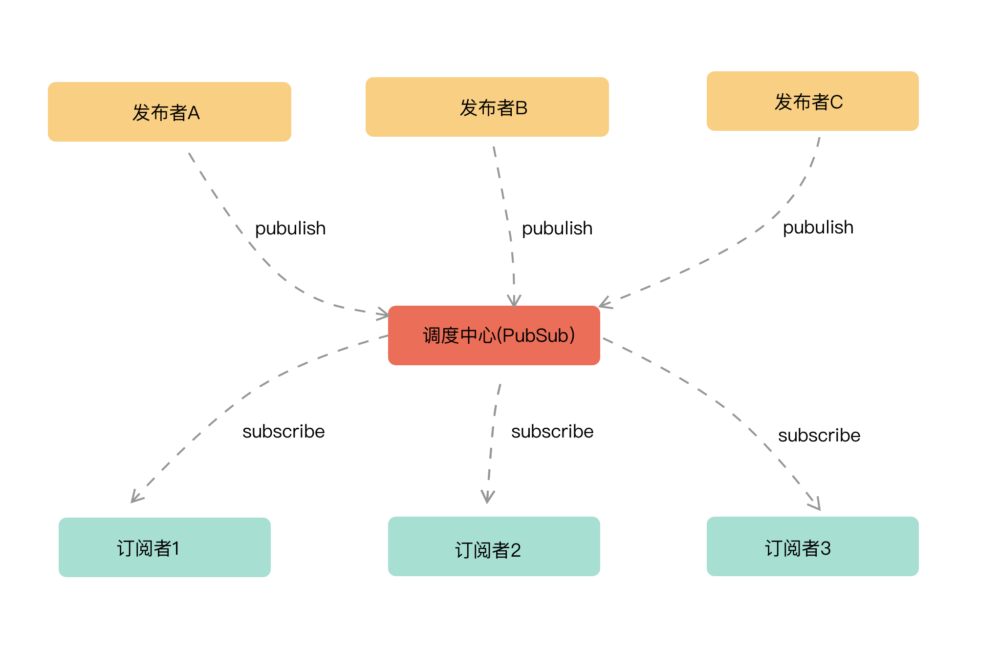

## 目录

<!-- toc -->

- [前言](#前言)
- [观察者模式(Observer Pattern)](#观察者模式Observer-Pattern)
- [发布订阅模式(Pub-Sub Pattern)](#发布订阅模式Pub-Sub-Pattern)
- [两者概念区别](#两者概念区别)
- [EventEmitter](#EventEmitter)
- [参考](#参考)

<!-- tocstop -->

## 前言

在 JavaScript 的设计模式中，观察者模式一直是常用的一个模式，本文将整体理解**观察者模式**，以及它的衍生模式**发布订阅模式**，还有在 JavaScript 中常见的 Eventemiter 模式，其实也是观察者模式的一种。

## 观察者模式(Observer Pattern)

观察者模式中，有两种对象：观察者（Observer）和被观察者（Subject）。从字面意思上理解，被观察者发生某些行为或者变化时，会通知观察者，观察者根据此行为或者变化做出处理。


```js
// 观察者
class Observer {
    constructor () {
        this.observerId = '';
    }
    // 观测到变化后的处理
   update(data){
        console.log(data);
    }
}
// 被观察者
class Subject {
    constructor() {
        this.observers = [] //观察者队列
        this.subjectId = '';
    }
    // 添加观察者
    addObserver(observer) {
        this.observers.push(observer)//往观察者队列添加观察者
    }
    // 删除观察者
    removeObserver(observer) {
        this.observers = this.observers.filter(o => {
            return o.observerId != observer.observerId;
        });
    }
    // 通知所有的观察者
    notify(data) {
        this.observers.forEach(observer => {
            observer.update(data);
        });
    }
}

// 被观察者
const subject = new Subject()
// 观察者1
const ob1 = new Observer()
// 观察者2
const ob2 = new Observer()
// 观察者1 订阅 subject 的通知
subject.addObserver(ob1)
// 观察者2 订阅 subject 的通知
subject.addObserver(ob2)
// 发出广播 ，执行所有观察者的 update 方法
subject.notify()
```

## 发布订阅模式(Pub-Sub Pattern)

发布订阅者模式与观察者模式类似，但是两者并不完全相同，发布订阅者模式与观察者相比多了一个中间层的调度中心，用来对发布者发布的信息进行处理再发布到订阅者。



```js
/**
 * 发布订阅模式
 */
class PubSub {
    constructor() {
      // 一个对象存放所有的消息订阅
      // 每个消息对应一个数组，数组结构如下
      // {
      //   "event1": [cb1, cb2]
      // }
      this.events = {}
    }

    subscribe(event, callback) {
        if(this.events[event]) {
            // 如果有人订阅过了，这个键已经存在，就往里面加就好了
            this.events[event].push(callback);
        } else {
            // 没人订阅过，就建一个数组，回调放进去
            this.events[event] = [callback]
        }
    }

    publish(event, ...args) {
        // 取出所有订阅者的回调执行
        const subscribedEvents = this.events[event];

        if(subscribedEvents && subscribedEvents.length) {
            subscribedEvents.forEach(callback => {
                callback.call(this, ...args);
            });
        }
    }

    unsubscribe(event, callback) {
      // 删除某个订阅，保留其他订阅
      const subscribedEvents = this.events[event];

      if(subscribedEvents && subscribedEvents.length) {
        this.events[event] = this.events[event].filter(cb => cb !== callback)
      }
    }
}

const pubSub = new PubSub();

// A 订阅了 SMS 事件（A只关注SMS本身，而不关心谁发布这个事件）
pubSub.subscribe('SMS', (...args) => {
    // ...
});
// B 订阅了 SMS 事件
pubSub.subscribe('SMS', (...args) => {
    // ...
});

// C 发布了 SMS 事件（C 只关注 SMS 本身，不关心谁订阅了这个事件）
pubSub.publish('SMS', 'I published `SMS` event');
```

## 两者概念区别

观察者模式: 观察者(Observer)直接订阅(subscribe)主体(Subject)，而当主体(Subject)被激活时，会触发(notify)观察者里的事件。

发布-订阅模式: 订阅者(Subscriber)把自己想订阅的事件注册(subscribe)到调度中心(PubSub)，当发布者(Publisher)发布该事件(publish)到调度中心，再由调度中心统一执行订阅者之前注册的事件。

## EventEmitter

EventEmitter 是 Node.js 中提供的一个 API，跟 Pub-Sub 设计思想是差不多的，只是有更好的错误处理和更多的功能。具体源码可见：[node-events.js](https://github.com/nodejs/node/blob/master/lib/events.js)。

下面是简化的一个实现：

```js
class EventEmitter {
    constructor() {
        this.events = {};
    }
    on(type, listener) {
        // 因为其他的类可能继承自 EventEmitter，子类的events可能为空，保证子类必须存在此实例属性
        if(!this.events) {
            this.events = {};
        }
        if(this.events[type]) {
            this.events[type].push(listener);
        } else {
            this.events[type] = [listener]
        }
    }
    emit(type, ...args) {
        if(this.events[type]) {
            this.events[type].forEach(fn => fn.call(this, ...args));
        }
    }
    // 只绑定一次，然后解绑
    once(type, listener) {
        const me = this;
        function oneTime(...args) {
            listener.call(this, ...args);
            me.off(type, oneTime);
        }
        me.on(type, oneTime)
    }
    // 移除事件
    off(type, listener) {
        if(this.events[type]) {
            const index = this.events[type].indexOf(listener);
            this.events[type].splice(index, 1);
        }
    }
}

// 运行示例
let events = new EventEmitter();
// A 处监听 say 事件
events.on('say', (...args) => {
    // ...
});
// B 处监听 say 事件
events.once('say', (...args) => {
    // ...
})

//  C 处触发事件
events.emit('say','visa');
```

## 参考

+ [Node Observer Pattern - DEV](https://dev.to/alemagio/node-observer-pattern-27oj)
+ [观察者模式 vs 发布订阅模式 - 知乎](https://zhuanlan.zhihu.com/p/51357583)
