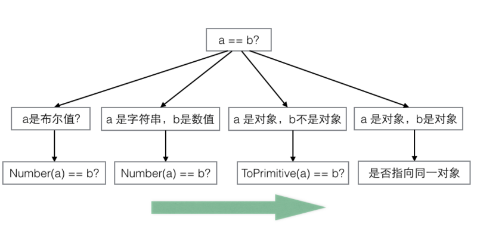

## 目录

<!-- toc -->

- [类型系统](#类型系统)
- [类型判断](#类型判断)
- [类型转换](#类型转换)
- [隐式转换](#隐式转换)
- [参考](#参考)

<!-- tocstop -->

## 类型系统

JavaScript 的类型分为基本类型（原始类型，或者称为 primitive values ）和引用类型（对象类型，reference values）。

最新的 ECMAScript 标准定义了 8 种数据类型，其中七种基本类型和一种引用类型：

基本类型：
  + boolean
  + null
  + undefined
  + string
  + number
  + bigInt
  + symbol

引用类型：
  + Object

基本类型的值是不可更改的，它们在内存中是以**栈（Stack）的形式**存放着，栈中的每一项是存放着*标识符和基本类型的值*，而与之不同的引用类型在栈中存放的是*标识符和地址值*，其中地址值引向**堆（Heap）区**，那里才是具体的存放数据的地方。

引用类型中，有很多内置的高级对象，如 *Array*、*Date*、*RegExp*、*Math*、*Error*，这些对象有各自的属性和方法。

## 类型判断

对类型判断一般使用 `typeof`：

```js
let bol = true
let nll = null
let udefd = undefined
let str = 'str'
let num = 123
let bigint = 123n
let smy =  Symbol(42)

typeof bol // => boolean
typeof nll // => object
typeof udefd // undefined
typeof str // => string
typeof num // => number
typeof bigint // => bigint
typeof smy // => symbol
```

这里的 `typeof null == 'object'` 是属于历史遗留问题，不能被这个表象欺骗了，以为是对象，其实它是基本数据类型。具体细节可以参考 [The history of “typeof null”](https://2ality.com/2013/10/typeof-null.html)。

## 类型转换

下面罗列几种常见的不同类型之间的转换方式：

```js
// 数字转字符串：
String(123) // => '123'

// 字符串转数字
Number('1234') //  => 123
+'123' // => 123
parseInt('123') //  => 123

// 数字检测
isNaN(123) => true
isNaN('123') => false

// 字符串转数组
'fdasf'.split('') // => ["f", "d", "a", "s", "f"]
Array.from('fdasf') // => ["f", "d", "a", "s", "f"]
```

## 隐式转换

由于 JavaScript 是一门弱类型的语言，在变量的使用中会涉及到一个隐式转换的问题。

隐式转换的有两个场景需要注意，一个是 *+操作符*，另一个是 *==操作符*。

*+操作符* 会隐式地将值转变为数字类型：

```js
// 字符串转数字
let str = '123'
+str => 123

let str2 = 'fasd'
+str2 => NaN

// 数组转数字
let arr = []
+arr => 0

let arr2 = [1]
+arr => 1

let arr3 = [1,2]
+arr => NaN

//对象转数字
let obj = {}
+obj => NaN
```

这里字符串转数字没有什么疑问，问题在于数组`[1]`和`[1,2]` 为啥一个能转成数字，另一个就是 NaN 呢？

原因在于这里引用类型（如数组、对象）转换的时候会先调用`toString()`方法，变为字符串后再转为数字：

```js
// 等同于
let arr2 = [1]
let arr2Str = arr2.toString() // '1'
+arr2Str => 1

let arr3 = [1,2]
let arr3Str = arr2.toString() // '1,2'
+arr3Str => NaN

let obj = {}
let objStr = obj.toString() // '[object Object]'
+objStr => NaN
```

同理，更为复杂的 *==操作符* 也是会内部进行一个隐式转换，转换的规则有如下：

1. 如果有一个操作数是布尔值，则先将其转换为数字，false => 0, true => 1
2. 如果有一个操作数为数字，另一个为字符串，则将字符串转为数字进行比较
3. 如果有一个操作数为对象，另一个不是对象，则将对象转为原始值（调用 *toString()* 方法）
4. 如果双方都是对象，则比较对象地址

如下图总结所示：



这里有一个点需要理解的，布尔数转数字的场景，只有当布尔对象参数为以下值时，才为 false，其余都为 true：

+ 0
+ -0
+ null
+ ''
+ false
+ undefined
+ NaN

这样的话 `![]` 和 `!{}` 为 false，因为 `Boolean([])` 和 `Boolean({})` 都为 true。我们在判断空对象和空数组的时候千万要小心这样的陷阱！

而对于 Number 对象，也有一个潜在的坑，`Number(null)` 为 1，而 `Number(undefined)` 为 NaN。判类型的时候也要小心。

所以按照上面的规则来分析常见的一到题目：`[] == ![]`

```js
[] == ![]
// 等同于
[] == !Boolen([]) // ![] 是转布尔数，等同于!Boolen([])，等同于 false
[] == false // 满足第一条，false 转数字，为 0
[] == 0 // 满足第三条，ToPrimitive([]) 为 ''
'' == 0 // 满足第二条，字符串转数字，'' 转为 0
 0 == 0 // 完美
```

而 `[1] == [1]` 为 false，是因为两者比较的都是地址，但两个对象地址是不一样的。

## 参考

+ [前端碎碎念 之 为什么[] == ![] ? - 前端开发之道 - SegmentFault 思否](https://segmentfault.com/a/1190000008594792)

