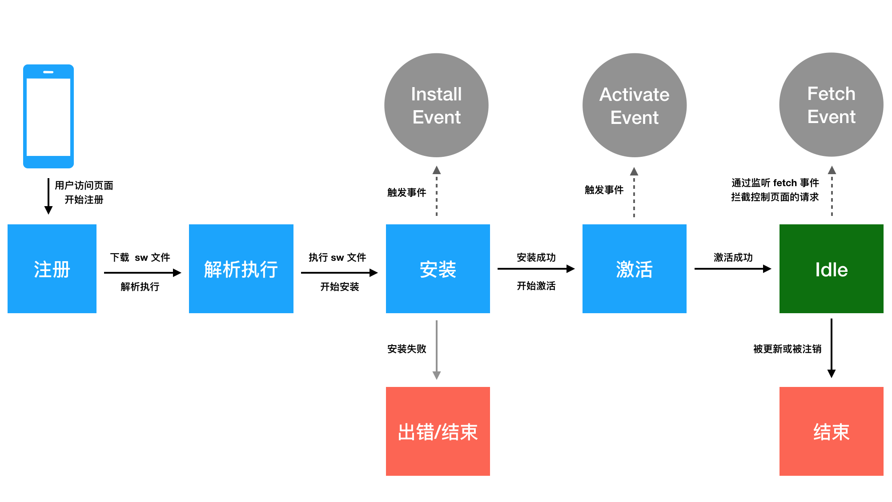
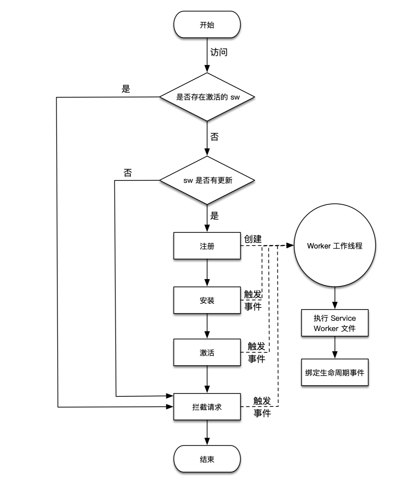
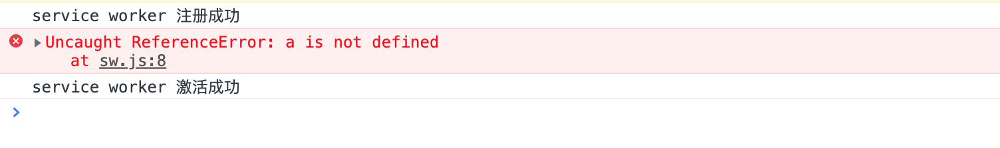
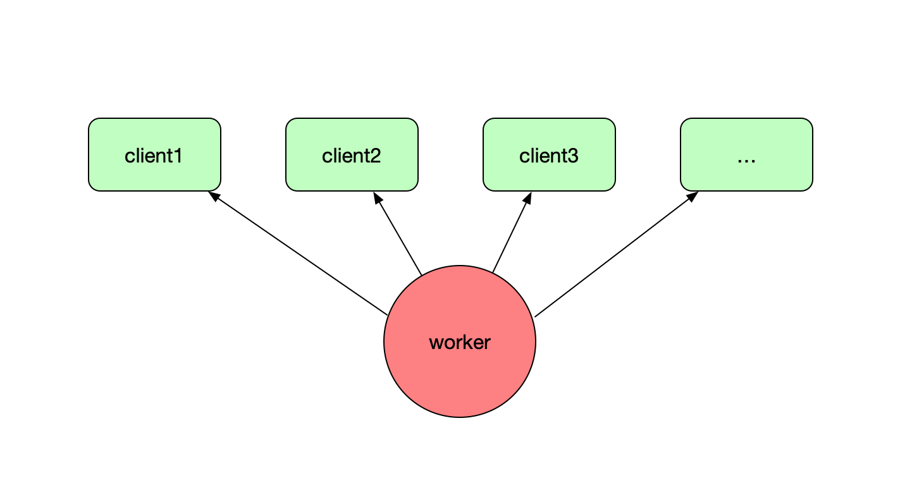
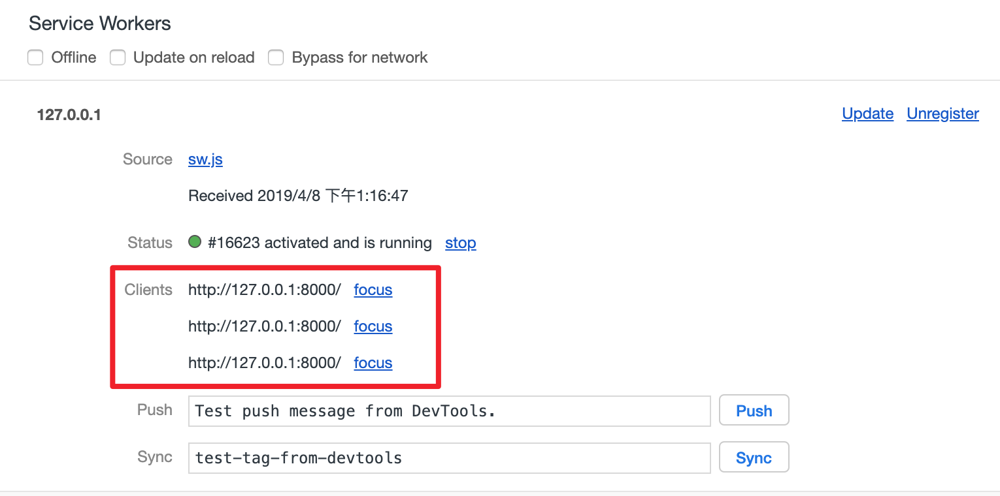
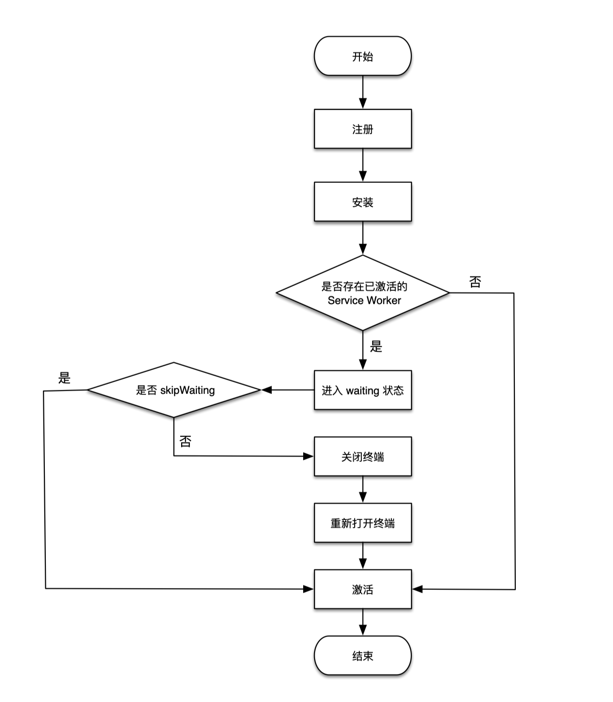
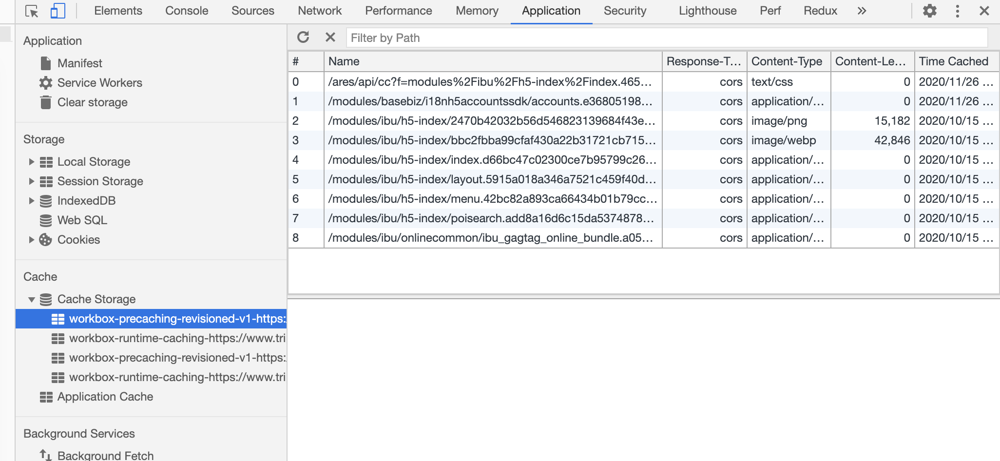

## 目录

<!-- toc -->

- [前沿](#前沿)
- [Service Worker](#service-worker)
  + [历史](#历史)
  + [特点](#特点)
  + [开始使用](#开始使用)
  + [作用域](#作用域)
  + [作用域污染](#作用域污染)
  + [生命周期](#生命周期)
  + [工作流程](#工作流程)
  + [waitUntil 机制](#waituntil-机制)
  + [终端概念](#终端概念)
  + [更新](#更新)
      + [更新原理](#更新原理)
      + [skipWaiting](#skipwaiting)
      + [手动更新](#手动更新)
  + [容错](#容错)
- [WorkBox](#workbox)
  + [引入 Workbox](#引入-workbox)
  + [Workbox 配置](#Workbox-配置)
  + [Workbox.precaching 预缓存功能](#workboxprecaching-预缓存功能)
  + [Workbox.routing 路由功能](#workboxrouting-路由功能)
      + [路由匹配规则](#路由匹配规则)
      + [资源请求处理方法](#资源请求处理方法)
  + [Workbox.strategies 缓存策略](#workboxstrategies-缓存策略)
      + [缓存策略配置](#缓存策略配置)
      + [指定资源缓存名称](#指定资源缓存名称)
      + [添加插件](#添加插件)
      + [配置 fetchOptions](#配置-fetchOptions)
      + [配置 matchOptions](#配置-matchOptions)
  + [小结](#小结)
- [参考](#参考)

<!-- tocstop -->

## 前沿

在我们看到的很多技术文章中，Service Worker 经常跟 PWA（Progressive Web App 渐进式 Web 应用）放在一起讨论，但其实这两个是不同的东西，不是绑定在一起的。

PWA 技术是一整套解决方案，其理念是通过多种技术来增强 Web 站点性能，目标是提供可媲美原生应用的用户体验。它是一整套技术的集合：

+ [Manifest](https://developer.mozilla.org/zh-CN/docs/Web/Manifest)：使得Web应用可以被添加到主屏幕。需要创建一个用以描述 Web 应用被添加至主屏幕的名称、图标等信息的 manifest.json 文件。
+ [Service Worker](https://developer.mozilla.org/zh-CN/docs/Web/API/Service_Worker_API/Using_Service_Workers)：为 Web 应用提供离线缓存，使得 Web 应用可以在离线状态下继续使用（部分功能）。
+ [Push Notification](https://developer.mozilla.org/zh-CN/docs/Web/API/notification)：提供了消息推送功能。

可以看到 Service Worker 只是 PWA 体系中的一项比较重要的技术，但不是全部。Service Worker 优秀的控制缓存功能可以为很多新旧 Web 应用提供性能上的增强，但不是所有的 Web 应用都会全套改造为 PWA 体系。 

通常所讲的 Service Worker 指的是 Service Worker 线程。了解浏览器工作原理的开发者都知道浏览器中执行的 JavaScript 文件是运行在一个单一线程上，称之为 主线程。而 Service Worker 是一种独立于浏览器主线程的工作线程，与当前的浏览器主线程是完全隔离的，并有自己独立的执行上下文（context）。

本文会讨论更多技术细节，以及更好用的库 Workbox，为项目中需要用到的**缓存控制功能**提供技术背景知识。

## Service Worker

下面将具体介绍 Service Worker API 来龙去脉。

### 历史

为什么有 Service Worker 的出现？W3C（国际万维网联盟）早在 2014 年 5 月就提出了 Service Worker HTML5 API 草案，用来进行 Web 资源和请求的持久离线缓存。Service Worker 的来历可以从两个方面来介绍。

一方面，浏览器中的 JavaScript 都是运行在一个单一主线程上的，在同一时间内只能做一件事情。随着 Web 业务不断复杂，在 JavaScript 中的代码逻辑中往往会出现很多耗资源、耗时间的复杂运算过程。这些过程导致的性能问题在 Web App 日益增长的复杂化过程中更加凸显出来。所以 W3C 提出了 Web Worker API 来专门解放主线程，Web Worker 是脱离在主线程之外的工作线程，开发者可以将一些复杂的耗时的工作放在 Web Worker 中进行，工作完成后通过 postMessage 告诉主线程工作的结果，而主线程通过 onmessage 得到 Web Worker 的结果反馈，从而释放了主线程的性能压力。

代码执行性能问题好像是解决了，但 Web Worker 是临时存在的，每次做的事情的结果不能被持久存下来，如果下次访问 Web App 同样的复杂工作还是需要被 Web Worker 重新处理一遍，这同样是一件消耗资源的事情，只不过不是在主线程消耗罢了。那能不能有一个 Worker 线程是一直是可以持久存在的，并且随时准备接受主线程的命令呢？基于这样的需求 W3C 推出了最初版本的 Service Worker，Service Worker 在 Web Worker 的基础上加上了持久离线缓存能力，可以通过自身的生命周期特性保证复杂的工作只处理一次，并持久缓存处理结果，直到修改了 Service Worker 的内在的处理逻辑。

而另一方面，为了解决 Web 网络连接不稳定的问题，W3C 在很早的时候提出了 ApplicationCache 机制来解决离线缓存的问题，做法是在 HTML 页面中可以指定一个清单文件 manifest.appcache，清单中指定需要离线缓存的静态资源。虽然 ApplicationCache 能够解决离线可访问的问题，但是它的痛点在于：

+ 靠一个 manifest.appcache 配置文件来维护一个复杂站点的缓存策略实在是一件非常艰难的工作，毕竟单纯靠配置是非常不灵活的。
+ 每次修改资源文件的同时，需要修改 manifest.appcache 文件，以触发资源文件的重新加载和缓存，维护成本太高。
+ 对动态请求无法处理。

通过一段时间的实践后，W3C 决定废弃 ApplicationCache。一些主流浏览器甚至已经将 ApplicationCache 标注为不推荐使用，并引导开发者使用 Service Worker。Service Worker 就很好的解决了 ApplicationCache 的痛点问题，它能够通过非常多的缓存策略来灵活的管理 Web App 的离线缓存，大大降低维护成本。

### 特点

Service Worker 功能虽然强大，但是使用 Service Worker 还是有一定的条件以及一些专有的特点的。

+ 必须运行在 HTTPS 协议下
  + 为了便于本地开发，localhost、127.0.0.1 这种非 HTTPS 协议也被浏览器认为是安全源
+ 有自己完全独立的执行上下文
  + 一旦被安装成功就永远存在，除非线程被程序主动解除。
  + 在访问页面的时候可以直接被激活，如果关闭浏览器或者浏览器标签的时候会自动睡眠，以减少资源损耗
+ 可以拦截并代理请求，可以处理请求的返回内容
  + 开发者完全可控
  + 控制动态请求
  + 控制第三方资源
+ 不能直接操作 DOM
  + 出于安全和体验的考虑，UI 的渲染工作必须只能在主线程完成
+ 完全异步实现的
  + 内部的接口的异步化都是通过 Promise 实现
+ 可以离线并且在后台工作
  + 可以进行推送消息
  + 后台同步资源
  + ...衍生出更多原生化的特性

### 开始使用

下面一段代码是注册代码：

```html
<!DOCTYPE html>
<html>
  <head>
    <title>Service Worker Scope Demo</title>
  </head>
  <body>
    <script>
      if ('serviceWorker' in navigator) {
        navigator.serviceWorker.register('./a/b/sw.js', {
          // 手动指定一个作用域
          scope: '/a/b/c/'
        }).then(reg => {
          console.log(reg.scope)
          // http://127.0.0.1:8000/a/b/c/
        })
      }
    </script>
  </body>
</html>
```

不过这里要注意的是，scope 的域名不能超过默认的注册作用域的范围，比如 *./a/b/sw.js* 的默认注册作用域为 */a/b*，那 scope 不能设为 */a*，浏览器会报错。

### 作用域

Service Worker 有自己的作用域，它是一个 URL path 地址，指的是 Servcie Worker 能够控制的页面的范围，例如：某个 Service Worker 的作用域为 https://somehost/a/b/， 那这个 Service Worker 能控制 https://somehost/a/b/ 目录下的所有页面，可以包含下面列出的页面：

+ https://somehost/a/b/index.html
+ https://somehost/a/b/c/index.html
+ https://somehost/a/b/anothor.html
+ ...

所谓的 “控制页面” 指的是 Service Worker 可以处理这些页面里面的资源请求和网络请求，然后通过 Service Worker 自身的调度机制构建离线缓存策略。如果页面不在 Service Worker 的作用域范围内，Service Worker 就无法处理页面的任何资源或请求。

### 作用域污染

当存在多个 Service Worker 控制一个页面的情况，会出现作用域污染这个问题，这种情况下可以使用 *navigator.serviceWorker.getRegistrations()* 方法将污染的 Service Worker 先注销掉，然后在注册自己的所在作用域的 Service Worker:

```html
<!DOCTYPE html>
<html>
  <head>
    <title>Service Worker Scope Demo1 PageA</title>
  </head>
  <body>
    <script>
      if ('serviceWorker' in navigator) {
        navigator.serviceWorker.getRegistrations()
          .then(regs => {
            for (let reg of regs) {
              // 注销掉不是当前作用域的所有的 Service Worker
              if (reg.scope !== 'https://127.0.0.1:8000/a/') {
                reg.unregister()
              }
            }
            // 注销掉污染 Service Worker 之后再重新注册自己作用域的 Service Worker
            navigator.serviceWorker.register('./a-sw.js')
          })
      }
    </script>
  </body>
</html>
```

在复杂的项目架构中，Service Worker 的作用域污染问题会经常发生，在设计 Service Worker 注册逻辑的时候，尤其是大型的 Web App 项目的时候需要考虑到这点。

### 生命周期

每个 Service Worker 都有一个独立于 Web 页面的生命周期:



1. 在主线程成功注册 Service Worker 之后，开始下载并解析执行 Service Worker 文件，执行过程中开始安装 Service Worker，在此过程中会触发 worker 线程的 install 事件。

2. 如果 install 事件回调成功执行（在 install 回调中通常会做一些缓存读写的工作，可能会存在失败的情况），则开始激活 Service Worker，在此过程中会触发 worker 线程的 activate 事件，如果 install 事件回调执行失败，则生命周期进入 Error 终结状态，终止生命周期。

3. 完成激活之后，Service Worker 就能够控制作用域下的页面的资源请求，可以监听 fetch 事件。

4. 如果在激活后 Service Worker 被 unregister 或者有新的 Service Worker 版本更新，则当前 Service Worker 生命周期完结，进入 Terminated 终结状态。

简单总结：

```text
install -> activate -> idle(监听 fetch 事件，进行资源管理)
        |                |
        |--> error       |--> terminated
```

### 工作流程

Service Worker 在内部都有一系列的工作流程，这些工作流程决定了开发者可以在 Service Worker 文件中如何进行开发。

以下面的代码为例：

```js
// sw.js
console.log('service worker 注册成功')

self.addEventListener('install', () => {
  // 安装回调的逻辑处理
  console.log('service worker 安装成功')
})

self.addEventListener('activate', () => {
  // 激活回调的逻辑处理
  console.log('service worker 激活成功')
})

self.addEventListener('fetch', event => {
  console.log('service worker 抓取请求成功: ' + event.request.url)
})
```

第一次注册页面：

```text
service worker 注册成功
service worker 安装成功
service worker 激活成功
```

第二次刷新页面：

```text
service worker 抓取请求成功：http://127.0.0.1:8000/imgs/dog.jpg
```

从这个执行结果来看，可以说明以下几点：

+ Service Worker 文件只在**首次注册或者有新版本触发更新**的时候执行一次。
+ 安装、激活流程也只是在首次执行 Service Worker 文件的时候进行了一次。
+ 首次注册成功的 Service Worker 不能拦截当前页面的请求，因为注册激活是一个异步过程。
+ 非首次注册的激活状态下的 Service Worker 可以在后续的访问中通过 fetch 事件监听并拦截请求。

整个的流程：



### waitUntil 机制

由于 Service Worker 生命周期异步触发的特性，并不是像同步执行模式，如果报错就会中断执行， intall 阶段回调出错了并不会导致生命周期中断，甚至第二次刷新还能正常拦截请求。



如果需要保证生命周期的执行顺序，可以使用 *ExtendableEvent.waitUntil()* 方法，该方法接收一个 Promise 参数，开发者通常会将 install 的回调执行逻辑（如缓存的写入）封装在一个 Promise 里，如果操作报错应该通过 Promise 来 reject 错误，这样 Service Worker 就知道了安装失败，然后 Service Worker 就能中断生命周期。

```js
// sw.js
console.log('service worker 注册成功')

self.addEventListener('install', event => {
  // 引入 event.waitUntil 方法
  event.waitUntil(new Promise((resolve, reject) => {
    // 处理一些异步逻辑，比如读写缓存或者其他
    // 模拟 promise 返回错误结果的情况
    reject('安装出错')
    // resolve('安装成功')
  }))
})

self.addEventListener('activate', () => {
  // 激活回调的逻辑处理
  console.log('service worker 激活成功')
})

self.addEventListener('fetch', event => {
  console.log('service worker 抓取请求成功: ' + event.request.url)
})
```

当 install 阶段的 reject error 后，后续的 activate 阶段就不会执行。

事实上，ExtendableEvent.waitUntil() 方法扩展了事件的生命周期，在 install 事件回调被调用时，它把即将被激活的 worker 线程状态延迟为 installing 状态，直到传递的 Promise 被成功地 resolve，这主要用于确保：Service Worker 工作线程在所有依赖的核心 cache 被缓存之前都不会被安装。

如果在 activate 事件回调被调用时，它把即将被激活的 worker 线程状态延迟为 activating 状态，直到传递的 Promise 被成功地 resolve。这主要用于确保：任何功能事件不会被分派到 ServiceWorkerGlobalScope 对象，直到它升级数据库模式并删除过期的缓存条目。

### 终端概念

在浏览器中，**有且只有一个 Service Worker 工作线程**，所有当开启多个 tab 后，Service Worker 可以控制多个终端（tab 页）。





如果浏览器有多个终端，需要 Service Worker 激活之后能够马上作用于所有的终端，通常在激活 Service Worker 后，通过在其中调用 *self.clients.claim()* 方法控制未受控制的客户端。

```js
self.addEventListener('activate', event => {
  event.waitUntil(
    self.clients.claim()
      .then(() => {
        // 返回处理缓存更新的相关事情的 Promise
      })
  )
})
```

### 更新

通常在每次进行 Web App 升级的时候，都必须伴随着 Service Worker 文件 sw.js 的升级，当浏览器检测到 sw.js 的升级之后，就会重新触发注册、安装、激活、控制页面的流程，并在这个过程中就会更新当前 Web App 的离线缓存为最新的上线内容。

在执行 *navigator.serviceWorker.register()* 方法注册 Service Worker 的时候，浏览器通过自身 diff 算法能够检测 sw.js 的更新包含两种方式：

+ Service Worker 文件 URL 的更新
+ Service Worker 文件内容的更新

文件 URL 更新可以在 sw.js 后加个版本号：

```js
if ('serviceWorker' in navigator) {
  navigator.serviceWorker.register('./sw.js?v=20190401235959')
}
```

文件内容更新可以直接在内部添加版本号：

```js
// sw.js
self.version = '20190401235959'
```

这样就能保证每次 Web App 都能够有最新的 Service Worker 文件 diff 被浏览器检测到。

#### 更新原理

Service Worker 的更新和首次注册有一定的区别，主要是多了一个 waiting 的状态：



当浏览器监测到新的 Service Worker 更新之后，会重新进行注册、安装，当检测到当前的页面被激活态的 Service Worker 控制着的话，会进入 waiting 状态，之后可以有两种选择：

+ 通过 skipWaiting 跳过 waiting 状态
+ 在所有终端保持 waiting 状态，直到 Service Worker 对所有终端失去控制（用户关闭所有终端的时候）

#### skipWaiting

Service Worker 一旦更新，需要等所有的终端都关闭之后，再重新打开页面才能激活新的 Service Worker，这个过程太复杂了。通常情况下，开发者希望当 Service Worker 一检测到更新就直接激活新的 Service Worker。

Service Worker 在全局提供了一个 *skipWaiting()* 方法，*skipWaiting()* 在 waiting 期间调用还是在之前调用并没有什么不同。一般情况下是在 install 事件中调用它：

```js
// sw.js
console.log('service worker 注册成功')

self.addEventListener('install', event => {
  // 跳过等待
  self.skipWaiting()
  // 引入 event.waitUntil 方法
  event.waitUntil(new Promise((resolve, reject) => {
    // 模拟 promise 返回错误结果的情况
    // reject('安装出错')
    resolve('安装成功')
    console.log('service worker 安装成功')
  }))
})

self.addEventListener('activate', () => {
  // 激活回调的逻辑处理
  console.log('service worker 激活成功')
})

self.addEventListener('fetch', event => {
  console.log('service worker 抓取请求成功: ' + event.request.url)
})
```

这种方式也被普遍应用在 Service Worker 的更新策略中，主要是为了让用户能够最快的体验到站点的升级和变化。

不过要注意的，*skipWaiting()* 意味着新 Service Worker 可能会控制使用*较旧 Service Worker 控制的页面*，比如两个 tab 终端，一个 tab 刷新后更新了 sw.js，直接 skipWaiting 到新激活状态，另一个 tab 页面逻辑还没刷新，可能会出现缓存数据不一致问题。

#### 手动更新

当刷新页面重新执行 register 方法的时候，浏览器检测到 Service Worker 文件更新就会触发 Service Worker 更新，但是如果站点在浏览器后台长时间没有被刷新，则浏览器将自动检查更新，通常是每隔 24 小时检查一次，但是 24 小时也太长了，所以也可以在代码中手动触发更新：

```js
navigator.serviceWorker.register('/sw.js')
  .then(reg => {
    setInterval(() => {
      reg.update()
    }, 60 * 60 * 1000)
  })
```

### 容错

有的时候项目中 Service Worker 出现问题后，必须重新上线 Web App 来解决问题，对于大型项目来说成本就很高，止损效果差。为了避免重新上线 Web App，可以在Service Worker 注册的时候通过一个 “开关请求” 做一个容错降级的处理，这个开关请求需要满足几个条件：

+ 能够快速上线，和 Web App 的上线解耦
+ 不能被缓存（无论是 HTTP 缓存还是 Service Worker 缓存）

实际项目中，可以通过专门的配置服务器来配置一个开关，这个开关变量每次跟随 html 文件，来动态开关 sw 的功能：

```html
<!DOCTYPE html>
<html>
  <head>
    <title>Service Worker Unregister Demo</title>
  </head>
  <body>
    <script>
        window.config = {
          // 服务器端动态获取变量
          SW_TURN_OFF: qconfig.query('sw_turn_off')
        }
    </script>
    <script>
      if ('serviceWorker' in navigator) {
        // sw 开关
        if (window.config.SW_TURN_OFF) {
          // 关掉 sw
          navigator.serviceWorker.getRegistrations()
            .then(regs => {
              for (let reg of regs) {
                // 注销掉所有的 Service Worker
                reg.unregister()
              }
            })
        } else {
          // 正常进行注册 Service Worker
          navigator.serviceWorker.register('./sw.js?v=20190401235959')
        }
      }
    </script>
  </body>
</html>
```
## WorkBox

上一章节解析了很多 Service Worker 的知识，在实际项目中，还要配合上 Cache API 进行的缓存的管理，才能搭建起一套可用的架构，比较复杂。

相比之下，我们可以利用 Google Chrome 团队推出的 PWA 解决方案 Workbox 实现 Service Worker 的快速开发。

Workbox 可以理解为 Service Worker API + Cache API 的一个库，封装了很多好用的功能。


### 引入 Workbox

Service Worker 文件引入 Workbox 的方法非常简单，只需要在文件顶部增加一行代码即可：

```js
importScripts('https://storage.googleapis.com/workbox-cdn/releases/4.2.0/workbox-sw.js')
```

Workbox 从 3.x 版本开始便将其核心文件托管到 CDN 上进行维护，开发者也可以下载下来自行维护。

我们可以通过判断全局对象 workbox 是否存在来确认 Workbox 是否加载完成：

```js
if (workbox) {
  // Workbox 加载完成
}
```

### Workbox 配置

Workbox 提供了默认的预缓存和动态缓存的名称，可分别通过*workbox.core.cacheNames.precache* 和 *workbox.core.cacheNames.runtime* 获取当前定义的预缓存和动态缓存名称。



这里的缓存名称对应着 Chrome 开发者工具 > Applications > Cache Storage 中存储的 key 名。

在通常情况下，我们使用默认的缓存名称进行资源存取即可，假如遇到缓存名称冲突的情况，也可以调用 *workbox.core.setCacheNameDetails* 方法去修改这些默认名称：

```js
// 修改默认配置
workbox.core.setCacheNameDetails({
  prefix: 'app',
  suffix: 'v1',
  precache: 'precache',
  runtime: 'runtime'
})

// 打印修改结果

// 将打印 'app-precache-v1'
console.log(worbox.core.cacheNames.precache)
// 将打印 'app-runtime-v1'
console.log(workbox.core.cacheNames.runtime)
```

### Workbox.precaching 预缓存功能

*workbox.precaching* 对象提供了常用的预缓存功能，其中最常用的方法是 *workbox.precaching.precacheAndRoute*。

```js
workbox.routing.precacheAndRoute([
  {
    url: '/index.html',
    revision: 'asdf'
  },
  '/index.abc.js',
  '/index.bcd.css'
])
```

### Workbox.routing 路由功能

Workbox 对资源请求匹配和对应的缓存策略执行进行了统一管理，采用路由注册的组织形式，以此来规范化动态缓存。

```js
workbox.routing.registerRoute(match, handlerCb)
```

#### 路由匹配规则

*workbox.routing.registerRoute* 的第一个参数 match 是路由的匹配规则，支持以下几种匹配模式：

1. 对资源 URL 进行字符串匹配

```js
workbox.routing.registerRoute('https://somehost/index.css', handlerCb)
workbox.routing.registerRoute('/index.css', handlerCb)
workbox.routing.registerRoute('./index.css', handlerCb)
```

2. 对资源 URL 进行正则匹配

```js
workbox.routing.registerRoute(/\/index\.css$/, handlerCb)
```

那么以下以 '/index.css' 为结尾的同域资源都能够命中这条路由规则：

+ https://somehost/index.css
+ https://somehost/a/index.css
+ https://somehost/a/b/index.css

但是对于**跨域资源**来说并不会命中这条路由规则。如果需要匹配跨域资源，需要明确整个 URL 信息：

```js
workbox.routing.registerRoute(
  /^https:\/\/third-party-site\.com\/.*\/index\.css$/,
  handlerCb
)
```

3. 自定义路由匹配方法

```js
const match = ({url, event}) => {
  return url.pathname === '/index.html'
}
```

自定义路由匹配方法有两点要求，首先要求是个同步执行函数，其次函数在表示资源请求匹配成功的时候，只需要返回一个真值（即强制转化为布尔值后为 true 的值）即可。

#### 资源请求处理方法

*workbox.routing.registerRoute* 的第二个参数 handlerCb 是对匹配到的资源请求进行处理的方法，开发者可以在这里决定如何响应请求，无论是从网络、从本地缓存还是在 Service Worker 中直接生成都是可以的。比如：

```js
const handlerCb = ({url, event, params}) => {
  // 返回一个 Promise 包装下的 Response 对象
  return Promise.resolve(new Response('Hello World!'))
}
```

其中，传入资源请求处理方法的对象包含以下属性：

+ url：event.request.url 经 URL 类实例化的对象；
+ event：fetch 事件回调参数；
+ params：自定义路由匹配方法所返回的值。

对资源请求处理方法的要求是:

+ 函数必须是个异步方法并返回一个 Promise
+ 且这个 Promise 解析的结果必须是一个 Response 对象。

### Workbox.strategies 缓存策略

*workbox.strategies* 对象提供了一系列常用的动态缓存策略来实现对资源请求的处理。包括了以下几种策略：

+ NetworkFirst：网络优先
+ CacheFirst：缓存优先
+ NetworkOnly：仅使用正常的网络请求
+ CacheOnly：仅使用缓存中的资源
+ StaleWhileRevalidate：从缓存中读取资源的同时发送网络请求更新本地缓存

下面的例子来演示 Workbox 缓存策略的使用。假设需要对 /api 的资源请求采用 NetworkFirst 的策略，那么相应的路由规则和策略的使用代码如下所示：

```js
workbox.routing
  .registerRoute(
    /\/api/,
    new workbox.strategies.NetworkFirst()
  )
```

#### 缓存策略配置

Workbox 缓存策略均可进行如下配置：

+ cacheName：指定当前策略进行资源缓存的名称
+ plugins：指定当前策略所使用的插件列表

对于需要使用 Fetch API 来发送网络请求的策略将会多出以下配置项：

+ fetchOptions：作为 Fetch API 的第二个参数透传给当前策略中所有使用到的 Fetch API；

对于需要使用 Cache API 操作本地缓存的策略将多出以下配置项：

+ matchOptions：作为 Cache 对象所提供的查找方法 match 的第二个参数透传给当前策略中所有使用到 cache.match 的地方。

#### 指定资源缓存名称

假设我们需要针对图片资源单独进行存储管理，那么可以在策略中设置 cacheName 来指定缓存名称：

```js
workbox.routing.registerRoute(
  /\.(jpe?g|png)/,
  new workbox.strategies.CacheFirst({
    cacheName: 'image-runtime-cache'
  })
)
```

这样当站点图片资源缓存成功之后，打开 Chrome 开发者工具 > Applications > Cache Storage，就可以看到此时多了一个名为“image-runtime-cache”的缓存空间，里面缓存的内容全是图片资源。

#### 添加插件

Workbox 提供了一些功能强大的插件来强化缓存策略，在这里简单演示一下如何使用 workbox.expiration.Plugin 来实现对图片资源的过期管理：

```js
workbox.routing.registerRoute(
  /\.(jpe?g|png)/,
  new workbox.strategies.CacheFirst({
    plugins: [
      new workbox.expiration.Plugin({
        // 对图片资源缓存 1 星期
        maxAgeSeconds: 7 * 24 * 60 * 60,
        // 匹配该策略的图片最多缓存 10 张
        maxEntries: 10
      })
    ]
  })
)
```

#### 配置 fetchOptions

对于设置了 CORS 的跨域请求的图片资源，可以通过配置 fetchOptions 将策略中 Fetch API 的请求模式设置为 cors：

```js
workbox.routing.registerRoute(
  /^https:\/\/third-party-site\.com\/.*\.(jpe?g|png)/,
  new workbox.strategies.CacheFirst({
    fetchOptions: {
      mode: 'cors'
    }
  })
)
```

#### 配置 matchOptions

假设图片资源缓存的存取需要忽略请求 URL 的 search 参数，可以通过设置 matchOptions 来实现：

```js
workbox.routing.registerRoute(
  /\.(jpe?g|png)/,
  new workbox.strategies.CacheFirst({
    matchOptions: {
      ignoreSearch: true
    }
  })
)
```

### 小结

本章对 Workbox 有一个大致的介绍，更多具体细节见[官方文档](https://developers.google.com/web/tools/workbox)。

Workbox 的功能非常完善，插件机制也能够很好的满足各种业务场景需求，如果自己手动维护一个应用的原生的 Service Worker 文件工作量非常巨大，而且有很多潜在的问题不容易被发现，Workbox 很好的规避了很多 Service Worker 潜在的问题，也大大减小了 Service Worker 的维护成本，所以大型项目可以优先考虑 Workbox。

## 参考

+ [第4章 Service Worker · PWA 应用实战](https://lavas-project.github.io/pwa-book/chapter04.html)
+ [Workbox  \|  Google Developers](https://developers.google.com/web/tools/workbox)
