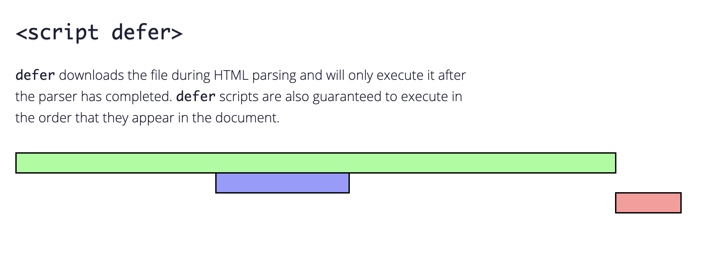

## 目录

<!-- toc -->

- [script 标签加载过程](#script-标签加载过程)
- [async 和 defer 属性差异](#async-和-defer-属性差异)
- [如何使用](#如何使用)
- [DOMContentLoaded 与 load 的区别](#domcontentloaded-与-load-的区别)
- [参考](#参考)

<!-- tocstop -->

## script 标签加载过程

这里简单提一下 *script* 标签加载过程，具体的细节要放在整个浏览器渲染过程中来讲解。

我们知道，浏览器请求并解析一个页面的大致过程：

1. 解析 HTML 标签为 DOM 对象
2. 解析 CSS 标签为 CSSOM 对象
3. 由 DOM 和 CSSOM 合并产生渲染树
4. 有了渲染树，知道了所有节点的样式，下面便根据这些节点以及样式计算它们在浏览器中确切的大小和位置，这就是布局阶段
5. 绘制


在这个过程中，我们需要知道 JavaScript 执行的两个细节：

1. JavaScript 可以阻塞 DOM 的生成，

也就是说当浏览器在解析 HTML 文档时，如果遇到 `<script>`，便会停下对 HTML 文档的解析，转而去处理脚本。如果脚本是内联的，浏览器会先去执行这段内联的脚本，如果是外链的，那么先会去加载脚本，然后执行。在处理完脚本之后，浏览器便继续解析 HTML 文档。

当然，下文提及的 *async* 和 *defer* 会对这个过程有不同的影响。

3. JavaScript 必须在 CSSOM 完成后才能执行

因为 JavaScript 可以查询任意对象的样式，所以意味着在 CSS 解析完成后，JavaScript 才能操作。

## async 和 defer 属性差异

在使用 `<script>` 的过程中，有两个属性是对脚本的加载顺序有着很大影响的：*async* 和 *defer*。

让我们看这三种使用情况：

1. 不使用附加属性

`<script src="script.js"></script>`

没有指定 *async* 和 *defer*，这种情况下浏览器会立即下载脚本并执行，这会打断 HTML parsing 过程。


2. 指定 *async*

`<script async src="script.js"></script>`

指定了 *async* 后，脚本的下载过程不会打断其他操作，只有在脚本执行阶段才会暂停 HTML parsing。


3. 指定 *defer*

指定了 *defer* 后，脚本的下载和执行都不会暂停 HTML parsing。



## 如何使用

至于在什么样的场景下使用这些属性，大概有这三条总结（见参考文章）：

* 如果脚本是模块化的并且不依赖于任何脚本，则使用 *async*。
* 如果该脚本有相互依赖的情况，则使用 *defer*。
* 如果该脚本很小，并且有异步脚本所依赖，则请使用一个内联脚本，该脚本应在 *async* 脚本上方，并且不放置任何属性。

在真实的浏览器环境下，由于异步网络情况，加载的脚本并不一定按照指定的顺序执行，对互相有依赖的脚本有一定风险。为了保证 HTML 渲染，**最好的方式还是将 *script* 脚本放在 *body* 下面**。

以及 *async* 和 *defer* 都不能保证一定不会中断 HTML 渲染，所以得确保脚本内容在 *onLoad* 事件之后才开始运行。

```html
<body>
  <!-- 其它的 html 内容 -->
  <script src="app.js"></script>
</body>
```

## DOMContentLoaded 与 load 的区别

script 标签对于页面加载的另一个影响在于 *DOMContentLoaded* 与 *load* 事件的时机。

简单看图，了解一下什么是 *DOMContentLoaded* 与 *load*:


这两个事件有啥区别呢？点击这个[网页](https://testdrive-archive.azurewebsites.net/HTML5/DOMContentLoaded/Default.html)你就能明白。

当 HTML 文档解析完成就会触发 *DOMContentLoaded*，而所有资源加载完成之后，*load* 事件才会被触发。

1. defer 与 DOMContentLoaded

如果 *script* 标签中包含 *defer*，那么这一块脚本将不会影响 HTML 文档的解析，而是等到 HTML 解析完成后才会执行。而 *DOMContentLoaded* 只有在 *defer* 脚本执行结束后才会被触发。 所以这意味着什么呢？HTML 文档解析不受影响，等 DOM 构建完成之后 *defer* 脚本执行，但脚本执行之前需要等待 CSSOM 构建完成。

所以得出结论：**在 DOM、CSSOM 构建完毕，*defer* 脚本执行完成之后，*DOMContentLoaded* 事件才会触发**。

2. async 与 DOMContentLoaded

如果 *script* 标签中包含 *async*，则 HTML 文档构建不受影响，解析完毕后，*DOMContentLoaded* 触发，而不需要等待 *async* 脚本执行、样式表加载等等。

另外需要提一下的是，我们在 jQuery 中经常使用的 `$(document).ready(function() { // ...代码... });` 其实监听的就是 *DOMContentLoaded* 事件，而 `$(document).load(function() { // ...代码... });` 监听的是 *load* 事件。

## 参考

+ [async vs defer attributes - Growing with the Web](https://www.growingwiththeweb.com/2014/02/async-vs-defer-attributes.html#script-defer)
+ [再谈 load 与 DOMContentLoaded - 掘金](https://juejin.im/post/5b2a508ae51d4558de5bd5d1)
+ [DOMContentLoaded](https://testdrive-archive.azurewebsites.net/HTML5/DOMContentLoaded/Default.html)
