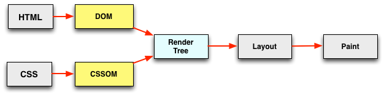
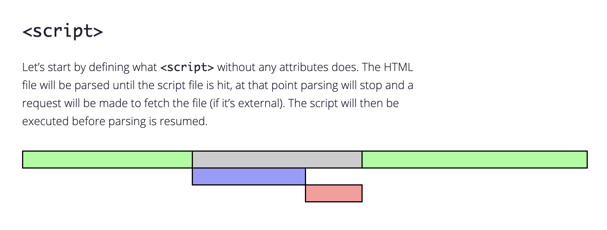
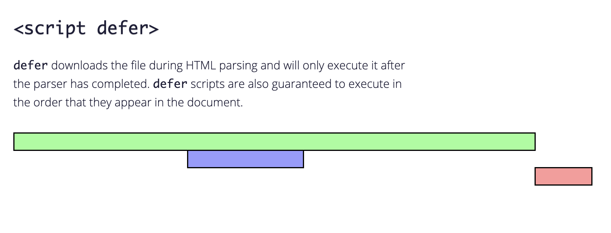
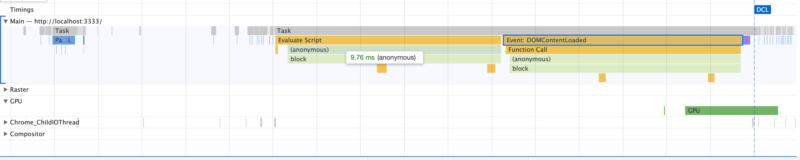
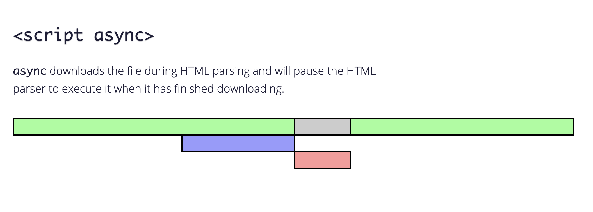
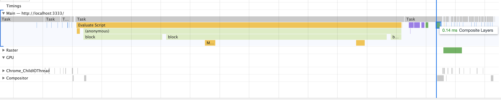
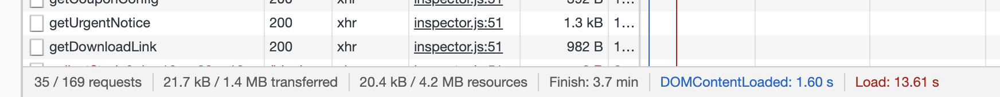

# 关于 Script 标签的加载知识

## 目录

<!-- toc -->

- [script 标签加载过程](#script-标签加载过程)
- [async 和 defer 属性差异](#async-和-defer-属性差异)
- [如何使用](#如何使用)
- [DOMContentLoaded 与 load 的区别](#DOMContentLoaded-与-load-的区别)
- [动态加载脚本对于渲染的影响](#动态加载脚本对于渲染的影响)
- [参考](#参考)

<!-- tocstop -->

## script 标签加载过程

这里简单提一下 *script* 标签加载过程，具体的细节要放在整个浏览器渲染过程中来讲解。

我们知道，浏览器请求并解析一个页面的大致过程：

1. 解析 HTML 标签为 DOM 对象
2. 解析 CSS 标签为 CSSOM 对象
3. 由 DOM 和 CSSOM 合并产生渲染树
4. 有了渲染树，知道了所有节点的样式，下面便根据这些节点以及样式计算它们在浏览器中确切的大小和位置，这就是布局阶段
5. 绘制



在这个过程中，我们需要知道 JavaScript 执行的两个细节：

1. JavaScript 可以阻塞 DOM 的解析

也就是说当浏览器在解析 HTML 文档时，如果遇到 `<script>`，便会停下对 HTML 文档的解析，转而去处理脚本。如果脚本是内联的，浏览器会先去执行这段内联的脚本，如果是外链的，那么先会去加载脚本，然后执行。在处理完脚本之后，浏览器便继续解析 HTML 文档。

当然，下文提及的 *async* 和 *defer* 会对这个过程有不同的影响。

3. JavaScript 必须在 CSSOM 完成后才能执行

因为 JavaScript 可以查询任意对象的样式，所以意味着在 CSS 解析完成后，JavaScript 才能操作。

## async 和 defer 属性差异

在使用 `<script>` 的过程中，有两个属性是对脚本的加载顺序有着很大影响的：*async* 和 *defer*。

让我们看下面四种使用情况：

1. 不使用附加属性

`<script src="script.js"></script>`

没有指定 *async* 和 *defer*，这种情况下浏览器会立即下载脚本并执行，这会打断 HTML parsing 过程。



2. 指定 *defer*

指定了 *defer* 后，脚本的下载和执行都不会暂停 HTML parsing。



*defer* 脚本会在 HTML 解析完成后，*DOMContentLoaded* 事件之前执行，用下面的一段代码来实验：

```html
// html
<body>
    <div class="container">Hello</div>
    <script src="./script.js" defer></script>
</body>
```

```js
// script.js
function block() {
    let start = +new Date;
    let end = start + 10;
    while(start <= end) {
        start = +new Date;
    }
}
window.addEventListener('DOMContentLoaded',() => {
    block();
});
block()
```


并且它还按照脚本的位置顺序依次加载，long.js 就算比 small.js 慢加载，最后也会先执行：

```html
<script defer src="long.js"></script>
<script defer src="small.js"></script>
```

3. 指定 *async*

`<script async src="script.js"></script>`

指定了 *async* 后，脚本的下载过程不会打断其他操作，只有在脚本执行阶段才会暂停 HTML parsing。



*async* 跟上面的 *defer* 相同的点在于，它们都不会阻塞 HTML 解析，但 *async* 会让脚本完全独立，它不管其他脚本的加载顺序，只要加载成功它就执行。

正是因为这样的特性，它跟 *DOMContentLoaded* 的关系就变得有些怪异了，有资料显示说， *DOMContentLoaded* 在 *async* 脚本执行之前之后都有触发的可能性，但我的实验结果告诉我：它根本就不会触发！！

```html
<body>
    <div class="container">Hello</div>
    <script src="./script.js" async></script>
</body>
```



这个细节等以后碰到了再深挖，埋个坑。

4. 动态 script 脚本

有的时候我们需要动态加载 script 脚本：

```js
let script = document.createElement('script');
script.src = "/article/script-async-defer/long.js";
document.body.append(script); // (*)
```

动态脚本默认情况下会跟 *async* 属性是一样的，也就是说它没有先后顺序，如果需要保证多个动态脚本的先后顺序，我们需要手动设置 async = false：

```js
function loadScript(src) {
  let script = document.createElement('script');
  script.src = src;
  script.async = false;
  document.body.append(script);
}

// long.js runs first because of async=false
loadScript("/article/script-async-defer/long.js");
loadScript("/article/script-async-defer/small.js");
```

## 如何使用

由上面的讨论我们可以总结：

| 属性  | 顺序 | DOMContentLoaded | onLoad |
| ----- | ---- | ---------------- | ------ |
| async |先加载先执行，与脚本位置无关|不相关| 在事件之前执行|
| defer |按脚本的位置顺序| 在事件之前执行脚本 |在事件之前执行|

至于在什么样的场景下使用这些属性：

* 如果脚本是模块化的并且不依赖于任何脚本，比如第三方的广告脚本、监控脚本，则使用 *async*。
* 如果该脚本有相互依赖的情况，则使用 *defer*。

在真实的浏览器环境下，由于异步网络情况，加载的脚本并不一定按照指定的顺序执行，对互相有依赖的脚本有一定风险。为了保证 HTML 渲染，**最好的方式还是将 *script* 脚本放在 *body* 下面**。

以及 *async* 和 *defer* 都不能保证一定不会中断 HTML 渲染，所以得确保脚本内容在 *onLoad* 事件之后才开始运行。

## DOMContentLoaded 与 load 的区别

这里再多谈几句 *DOMContentLoaded* 与 *load* 事件的区别。

简单看图，了解一下什么是 *DOMContentLoaded* 与 *load*:



当 HTML 文档解析完成就会触发 *DOMContentLoaded*，而所有资源（比如图片、样式）加载完成之后，*load* 事件才会被触发。

*load* 事件要比 *DOMContentLoaded* 晚一点触发。而上面提到的 *async* 和 *defer* 属性都会阻塞 *load* 事件。

点击这个[测试网页](https://testdrive-archive.azurewebsites.net/HTML5/DOMContentLoaded/Default.html) 也可以看到两者的直观区别。

## 动态加载脚本对于渲染的影响

由上面的话题，引申出另外的一个问题，动态引入样式表会不会影响浏览器渲染？

结论是：

+ 动态插入的**外部**样式表或脚本**不阻塞** DOM 解析或渲染
+ 动态插入的**内联**样式表或脚本**会阻塞** DOM 解析和渲染
+ 未连接到 DOM 树的样式表或脚本（外部或内联）不会被下载、解析或执行。
+ 动态插入的外部资源会影响 onload 时机，必须等所有的资源都准备好的时候才触发 onload

具体探究过程见参考后两篇文章。需要注意的是，如果动态插入的外部样式表在 HTML 解析后才加载完成，是会造成 FOUC 问题，因为前次的 HTML 文档已经显示出来了，样式资源后续才解析渲染，这会造成一闪而过的样式变化。

这些都是小的知识点细节，把它放在整个的浏览器渲染流程角度来思考，才能彻底把握这背后的原因。

## 参考

+ [Scripts: async, defer](https://javascript.info/script-async-defer)
+ [async vs defer attributes - Growing with the Web](https://www.growingwiththeweb.com/2014/02/async-vs-defer-attributes.html#script-defer)
+ [再谈 load 与 DOMContentLoaded - 掘金](https://juejin.im/post/5b2a508ae51d4558de5bd5d1)
+ [DOMContentLoaded](https://testdrive-archive.azurewebsites.net/HTML5/DOMContentLoaded/Default.html)