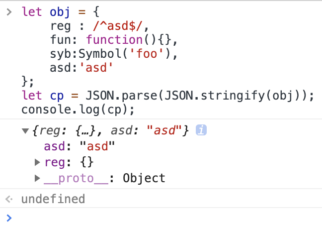

# 实现深浅拷贝

<!-- toc -->

- [概念](#概念)
- [原生支持](#原生支持)
- [实现](#实现)
- [参考](#参考)

<!-- tocstop -->

## 概念

浅拷贝:

将内存中的某个对象复制一份，在内存中开辟一块新的空间，如果复制的这个对象的属性为基本数据类型，则拷贝的便为这个值本身，如果为复杂数据类型，则拷贝复制的为地址。因此，修改新对象会对原对象产生影响。

深拷贝:

开辟一块新的空间，完整的复制一份，包括复杂数据类型，拷贝的这个对象和原对象无任何关系，修改什么的都互不影响。

## 原生支持

浅拷贝:

`Object.assign()` 和 `{...obj}`

Object.assign 拷贝的属性是有限制的，只拷贝源对象的自身属性（不拷贝继承属性），也不拷贝不可枚举的属性（enumerable: false）。

深拷贝:

`JSON.sringify()` 和 `JSON.parse()`

这是 JS 实现深拷贝最简单的方法了，原理就是先将对象转换为字符串，再通过 JSON.parse 重新建立一个对象。但是这种方法的局限也很多：

+ 不能复制 function、正则、Symbol
+ 循环引用报错
+ 相同的引用会被重复复制
+ 不可枚举的属性会被忽略
+ 非数组对象的属性不能保证以特定的顺序出现在序列化后的字符串中

测试代码：

```js
let obj = {
    reg : /^asd$/,
    fun: function(){},
    syb:Symbol('foo'),
    asd:'asd'
};
let cp = JSON.parse(JSON.stringify(obj));
console.log(cp);
```

效果：



## 实现

浅拷贝：

```js
/**
 * 浅拷贝
 * @param {*} obj
 */
function shallowClone(source) {
    const target = {};
    for(let i in source) {
        if (source.hasOwnProperty(i)) {
            target[i] = source[i];
        }
    }
    return target;
}
```

深拷贝：

```js
/**
 * 深拷贝
 * @param {*} obj
 */
function deepClone(obj) {
    //如果不是复杂数据类型,就直接返回一个一样的对象
    if (obj === null) { //null
        return null;
    }

    if (obj instanceof RegExp) { //正则表达式
        return new RegExp(obj);
    }

    if (obj instanceof Date) { //日期对象的情况
        return new Date(obj);
    }

    if (typeof obj == 'function') { // 函数的情况
        // TODO 这里的处理会有些问题
        // 如果 obj 是箭头函数，可以用，如果 obj 是 function 匿名函数，则会报错：
        // Uncaught SyntaxError: Function statements require a function name
        return eval(obj.toString());
    }

    if (typeof obj != "object") {
        // 非复杂类型,直接返回 也是结束递归的条件
        return obj
    }
    // [].__proto__.constructor = Array()
    // {}.__proto__.constructor = Object()
    // 因此处理数组的情况时,可以取巧用这个办法来 new 新对象
    const newObj = new obj.__proto__.constructor;
    for (let key in obj) {
        newObj[key] = deepClone(obj[key])
    }
    return newObj;
}
```
其实递归方法最大的问题在于爆栈，当数据的层次很深是就会栈溢出。另一个问题是循环引用，需要进行检查，所以要实现一个靠谱有用的深拷贝还是很难的，也要根据业务情况做合适的取舍。本文只是浅浅地做一个初级探索，后面有机会再做深入调研。

## 参考

+ [深拷贝的终极探索](https://yanhaijing.com/javascript/2018/10/10/clone-deep/)
+ [细说JavaScript中对象的属性和方法](https://yanhaijing.com/javascript/2015/05/08/member-of-object/)
+ [吐血整理 js 深浅拷贝问题 - 知乎](https://zhuanlan.zhihu.com/p/102409050)
