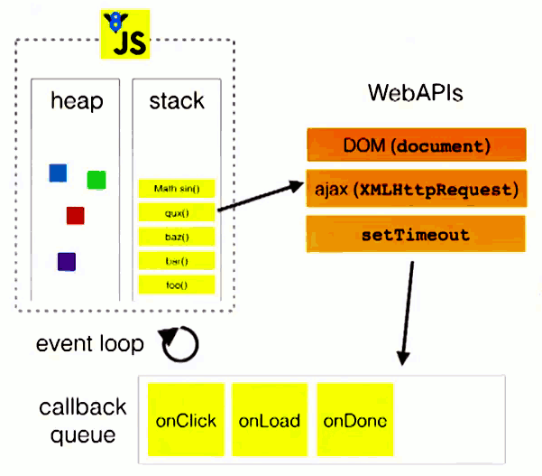
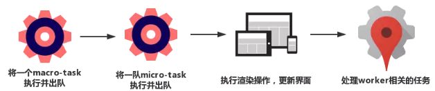
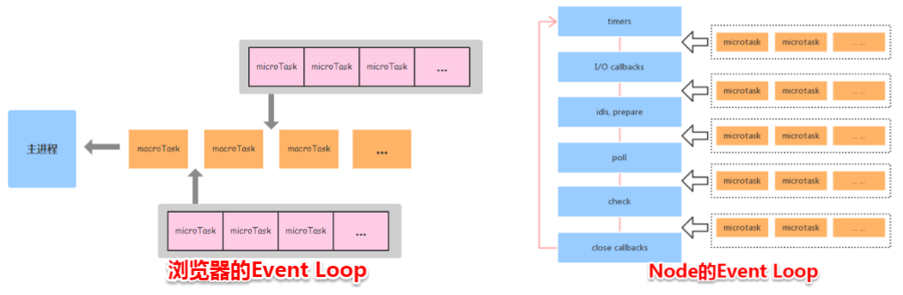
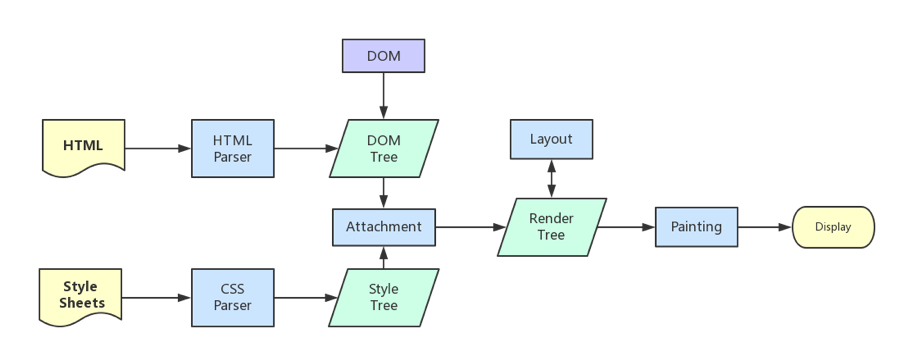

> 本文主要整理浏览器中的 JavaScript 运行机制。
>
> 另外注意一点，由于历史原因，**本文中提到的作对比的 Node，指的是 v11 以下的版本！** v11 以上的版本中，事件循环表现已经和浏览器一致了！具体见另一篇整理的《Node 事件循环机制》

## 目录

<!-- toc -->

- [区分进程和线程的概念](#区分进程和线程的概念)
- [浏览器中进程和线程](#浏览器中进程和线程)
- [浏览器内核（渲染进程）中各个线程之间的关系](#浏览器内核（渲染进程）中各个线程之间的关系)
- [事件循环机制](#事件循环机制)
- [区分宏任务和微任务](#区分宏任务和微任务)
- [浏览器渲染流程](#浏览器渲染流程)
- [事件循环和浏览器渲染之间的联系](#事件循环和浏览器渲染之间的联系)
- [一些代码理解](#一些代码理解)
- [参考](#参考)

<!-- tocstop -->

## 区分进程和线程的概念

首先我们得先理解一下计算机中常见的进程和线程概念。做一个形象的比喻：

> 进程是一个工厂，工厂有独立的资源  ->  系统分配的内存（独立的一块内存）
>
> 各个工厂相互独立 -> 进程之间相互独立
>
> 线程是工厂中的工人，多个工人协作完成任务 -> 多个线程在进程中协作完成任务
>
> 工厂内有一个或多个工人 -> 一个进程由一个或多个线程组成
>
> 工人之间共享空间 -> 同一进程下的各个线程之间共享程序的内存空间（包括代码段、数据集、堆等）

用正式术语总结一下：

+ 进程是 CPU 资源分配的最小单位（是能拥有资源和独立运行的最小单位）
+ 线程是 CPU 调度的最小单位（线程是建立在进程的基础上的一次程序运行单位，一个进程中可以有多个线程）

## 浏览器中进程和线程

到这里让，我们回到浏览器中，对浏览器运行作出一个正确的理解：

1. 浏览器是多进程的，有 Browser 进程（主进程）、插件进程、GPU 进程（最多一个，用于绘制）、浏览器渲染进程
2. 每一个新开 tab 页面相当于新的一个渲染进程，所以各个页面之间崩溃了也不会影响，缺点是占用内存，比如 Chrome 就很占内存（以前是有单进程的浏览器的）
3. 浏览器渲染进程内部是多线程的，页面的渲染，JavaScript 的执行，事件的循环，都在这个进程内进行。这是本文重点讲解的进程。
4. JavaScript 的执行是单线程的，这个是众所周知的知识点。

总结一下，我们常说 JavaScript 是一门的单线程语言，这话没错，但放在浏览器的世界中，还需要其他进程/线程的配合，才能让一个页面完美运行。

## 浏览器内核（渲染进程）中各个线程之间的关系

对前端来说，最重要的是理清渲染进程的运行机制，渲染进程是多线程的，页面的渲染，JavaScript 的执行，事件的循环这些线程都在这个进程下打配合。

下面分析一下渲染进程中主要的线程：

+ GUI 渲染线程
  +  负责渲染浏览器界面，解析HTML，CSS，构建 DOM 树和 RenderObject 树，布局和绘制等
  +  当界面需要重绘（Repaint）或由于某种操作引发回流(Reflow)时，该线程就会执行
+ JS 引擎线程
  + 也称为JS内核，负责解析 Javascript 脚本，运行代码（如 Chrome 中的 V8）
  + JS 引擎一直等待着**任务队列**中的任务（事件循环机制塞进来的回调函数）到来，然后加以处理
  + 有且只有一个 JS 线程在运行
+ 事件触发线程
  + 属于浏览器而不是 JS 引擎，用来控制事件循环
  + 当 JS 引擎执行如鼠标点击、AJAX 异步请求、定时等异步任务时，在到达定时时间或者是 AJAX 请求成功后，把被触发的事件（也就是回调函数）放到**任务队列**当中，等 JS 引擎空闲了再处理
+ 定时触发器线程
  + `setInterval` 与 `setTimeout` 所在线程
  + 浏览器定时计数器并不是由 JS 引擎计数的,（因为 JS 引擎是单线程的, 如果处于阻塞线程状态就会影响记计时的准确）
  + 计时完毕后，添加定时事件到**任务队列**中，等待 JS 引擎空闲后执行
  + W3C 在 HTML 标准中规定，规定要求 setTimeout 中低于4ms的时间间隔算为4ms
+ 异步 AJAX 请求线程
  + 在 XMLHttpRequest 在连接后是通过浏览器新开一个线程请求
  + 检测到状态变更时，如果设置有回调函数，异步线程就产生状态变更事件，将这个状态变更事件（代码中的回调函数）再放入**任务队列**中，再由 JS 引擎执行
  + 当请求结束后，该线程可能就会被销毁


这里再多说几句解释：

1. GUI 渲染线程与 JS 引擎线程是互斥的，当 JS 引擎执行时 GUI 线程会被挂起（相当于被冻结了），GUI 更新会被保存在一个队列中等到JS引擎空闲时立即被执行
2. 事件触发线程干的活可以理解为只是调度各种异步事件（如定时器，AJAX 请求），将已经完事的异步任务产生的事件（回调）塞到任务队列里，所以要注意，定时任务、http 请求处理过程都是由各自的线程处理的，而不是事件触发线程亲自上阵干这些脏活
3. **任务队列**专门加粗，这是一个重要概念，后面事件循环中会讲到

## 事件循环机制

事件循环（Event Loop）是前端领域中非常重要的一个概念，因为 JavaScript 是单线程工作的，而 JavaScript 执行的任务有同步和异步之分。事件循环机制是用于协调同步和异步之间的流程。

+ 同步任务：主线程上排队执行的任务，生成一个**执行栈**，按顺序执行
+ 异步任务：不在主线程而进入"任务队列"（task queues）的任务，如 DOM 事件、AJAX 请求、定时器等。先交由各自的异步线程处理，完成后扔进任务队列中，等待主线程空闲后捞起
+ 任务队列（也可以叫消息队列）：类似队列的数据结构，遵循先入先出(FIFO)的规则。由事件触发线程管理，将可以运行的异步任务添加到可主线程执行栈中

以下面的代码进行举例理解：

```js
function bar() {
  console.log('bar')
}

function baz() {
 console.log('baz')
}

function foo() {
  console.log('foo')
  setTimeout(baz, 0)
  bar()
}

foo()

// foo
// bar
// baz
```

这段代码中，`foo()`、`bar()` 是同步任务，所以会先执行，`setTimeout` 是异步任务，所以在 "0ms" 后，事件触发线程将 `baz()` 放入任务队列中，等待主线程空闲后，再取出`baz()` 这个回调函数，放入执行栈，进行消化。

下面的流程图完整的展示了这个过程：



这里 stack 是主线程的执行栈，heap 是代码中用到的数据（各种对象数组），callback queue 就是任务队列，所有经由 Web API 这些异步线程处理完后的回调事件将统统放在这个队列里，等待主线程空闲时捞起。


## 区分宏任务和微任务

对于任务队列，我们需要进一步进行细分，目前有两类任务

+ 宏任务（Marcotasks 大部分事件）：setTimeout setInterval、setImmediate、I/O等各种事件（比如鼠标单击事件）的回调函数
+ 微任务（Microtasks，少数事件）：then（promise）、messageChannel、mutationObersve（不兼容）

区别在于，微任务在本轮Event Loop的所有任务结束后执行，即栈清空后，先执行微任务，再检查任务队列，继续压入栈中执行。



所以同样的异步场景，微任务要比宏任务先执行：

```js
Promise.resolve().then(()=>{
  console.log('Promise1')
  setTimeout(()=>{
    console.log('setTimeout2')
  },0)
})
setTimeout(()=>{
  console.log('setTimeout1')
  Promise.resolve().then(()=>{
    console.log('Promise2')
  })
},0)

// Promise1
// setTimeout1
// Promise2
// setTimeout2
```

+ 一开始执行栈的同步任务执行完毕，会去查看是否有微任务队列，上题中存在(有且只有一个)，然后执行微任务队列中的所有任务输出 Promise1，同时会生成一个宏任务 setTimeout2
+ 然后去查看宏任务队列，宏任务 setTimeout1 在 setTimeout2 之前，先执行宏任务 setTimeout1，输出 setTimeout1
+ 在执行宏任务 setTimeout1 时会生成微任务 Promise2 ，放入微任务队列中，接着先去清空微任务队列中的所有任务，输出 Promise2
+ 清空完微任务队列中的所有任务后，就又会去宏任务队列取一个，这回执行的是 setTimeout2

不过这里有一点要注意的，浏览器和 Node 中对于微任务的处理方式有所不同。因为 Node 中的事件循环是跟浏览器完全不是一个东西，是由 libuv 进行实现的。



+ 浏览器环境下，微任务（Microtask） 的任务队列是每个宏任务（ Macrotask） 执行完之后执行。
+ 在 Node 中，微任务会在事件循环的各个阶段之间执行，也就是一个阶段执行完毕，就会去执行微任务队列的任务。

这些知识点在后面整理 Node 的事件循环机制中再作深入整理。

## 浏览器渲染流程

这一节简单讲讲浏览器拿到数据后的渲染过程，详细内容可以另开一篇讲解。

浏览器内核拿到内容后，渲染大概可以划分成以下几个步骤：

1. 解析 HTML 建立 DOM 树
2. 解析 CSS 构建 Render 树（将 CSS 代码解析成树形的数据结构，然后结合 DOM 合并成 Render 树）
3. 布局 Render 树（Layout/Reflow），负责各元素尺寸、位置的计算
4. 绘制 Render 树（Paint），绘制页面像素信息
5. 浏览器会将各层的信息发送给 GPU，GPU 会将各层合成（composite），显示在屏幕上

所有详细步骤都已经略去，渲染完毕后就是`load`事件了，之后就是自己的 JS 逻辑处理了。



这里值得一提的是，在头部引入 CSS 资源的细节：

1. CSS 加载过程不会阻塞 DOM 树解析（异步加载时DOM照常构建）
2. CSS 解析过程会阻塞 Render 树构建（渲染时需等css加载完毕，因为render树需要css信息）

另外还有图层合成（composite）的知识点，后面再整理。

## 事件循环和浏览器渲染之间的联系

另外值得注意的是并不是每一轮的事件循环都会触发渲染，浏览器是很聪明的，它有可能会合并一些操作，将多次变更一次性渲染上去。

这里从这篇文章[从 event loop 规范探究 javaScript 异步及浏览器更新渲染时机 - 前端](https://juejin.im/entry/6844903476527366151) 中得知一些结论，先放出来供参考，后续有需要作深入研究一下**事件循环和渲染之间的关系**：

+ 在一轮事件中多次修改同一 DOM，只有最后一次会进行绘制。
+ 渲染更新（Update the rendering）会在事件循环中的 tasks 完成后进行，但并不是每轮事件循环都会更新渲染，这取决于是否修改了 DOM 和浏览器觉得是否有必要在此时立即将新状态呈现给用户。如果在一帧的时间内（时间并不确定，因为浏览器每秒的帧数总在波动，16.7ms只是估算并不准确）修改了多处DOM，浏览器可能将变动积攒起来，只进行一次绘制，这是合理的。
+ 如果希望在每轮事件循环都即时呈现变动，可以使用 requestAnimationFrame。

## 一些代码理解

这里贴一些奇奇怪怪的关于事件循环的代码，对比浏览器和 Node，以作理解：

（注意⚠️：以下代码运行在 v11 以下的版本，v11 以上版本已经跟浏览器行为一致）

```js
// 案例1
console.log(1);
setTimeout(function(){
    console.log(2);
    Promise.resolve(1).then(function(){
        console.log('promise')
    })
})
setTimeout(function(){
    console.log(3);
})

// Node: 1 2 3 promise
// 浏览器: 1 2 promise 3

// 案例2
setTimeout(() => {
  console.log(1)
  Promise.resolve(1).then(function(){
    console.log('promise')
  })
}, 0)

setTimeout(function(){
  console.log(3);
},0)

Promise.resolve(1).then(function(){
  console.log(4)
  setTimeout(() => {
    console.log(5)
  }, 0)
})

console.log(2)

// Node: 2 4 1 3 promise 5
// 浏览器：2 4 1 promise 3 5
```


## 参考

+ [从浏览器多进程到JS单线程，JS运行机制最全面的一次梳理 - 掘金](https://juejin.im/post/5a6547d0f265da3e283a1df7)
+ [总结：JavaScript异步、事件循环与消息队列、微任务与宏任务 - 掘金](https://juejin.im/post/5be5a0b96fb9a049d518febc)
+ [Tasks, microtasks, queues and schedules - JakeArchibald.com](https://jakearchibald.com/2015/tasks-microtasks-queues-and-schedules/)
+ [浏览器与Node的事件循环(Event Loop)有何区别?_Java_Fundebug博客-CSDN博客](https://blog.csdn.net/Fundebug/article/details/86487117)
+ [深入理解js事件循环机制（浏览器篇） - lynnelv's blog](http://lynnelv.github.io/js-event-loop-browser)
