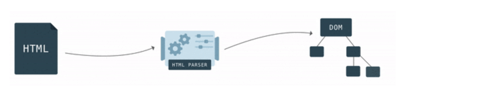

## 目录
<!-- toc -->

- [前言](#前言)
- [页面加载过程](#页面加载过程)
- [渲染流程](#渲染流程)
  * [解析 DOM Tree](#解析-DOM-Tree)
  * [解析额 CCS Tree](#解析额-CCS-Tree)
  * [构造 Rendering Tree](#构造-Rendering-Tree)
  * [布局与绘制](#布局与绘制)
  * [解析 script 标签](#解析-script-标签)
- [重绘（repaint）和回流（reflow）](#重绘（repaint）和回流（reflow）)
  * [常见引起回流属性和方法](#常见引起回流属性和方法)
  * [常见引起重绘属性和方法](#常见引起重绘属性和方法)
  * [性能影响](#性能影响)
  * [如何减少回流、重绘](#如何减少回流、重绘)
- [关键渲染路径](#关键渲染路径)
- [白屏和 FOUC 问题](#白屏和-FOUC-问题)
- [如何进行优化](#如何进行优化)
- [参考](#参考)

<!-- tocstop -->

## 前言

之前整理过一篇[浏览器中 JavaScript 单线程运行机制](:note:bc20a4d8-9576-4747-bc77-8f977f268556)，里面主要介绍了浏览器中的各类进程和线程以及 JavaScript 的事件循环机制。本文将从整个**渲染流程**角度继续深入理解浏览器的运行机制。

## 页面加载过程

浏览器的内核是指支持浏览器运行的最核心的程序，分为两个部分，一是渲染引擎，另一个是 JS 引擎。渲染引擎在不同的浏览器中也不是都相同的。目前市面上常见的浏览器内核可以分为这四种：

+ Trident（IE）
+ Gecko（火狐）
+ Blink（Chrome、Opera）
+ Webkit（Safari）

Webkit 是由苹果主导推出的一个项目，早期的 Chrome 也是使用这款内核，后来谷歌从 Webkit 拉了分支开发自己的内核 Blink，两者开始分道扬镳。

一个个 Web 页面就是通过渲染引擎去呈现给用户的。

在介绍渲染流程前，我们需要简明扼要介绍下页面的加载过程，有助于更好理解后续渲染过程：

+ 浏览器根据 DNS 服务器得到域名的 IP 地址
+ 向这个 IP 的机器发送 HTTP 请求
+ 服务器收到、处理并返回 HTTP 请求
+ 浏览器得到返回内容

这个加载过程涉及到的知识点可以学习 TCP、HTTP 等网络层面的知识，当浏览器拿到请求到的页面后，就正式开始浏览器的渲染过程。

我们一开始从服务端拿到的是一堆 HMTL 格式的字符串，因为只有 HTML 格式浏览器才能正确解析，这是 W3C 标准的要求。


## 渲染流程

浏览器渲染过程大体分为如下三部分：

1. 解析 HTML 文件

+ HTML/SVG/XHTML。HTML 字符串描述了一个页面的结构，浏览器会把 HTML 结构字符串解析转换 DOM Tree



+ CSS。解析 CSS 会产生 CSS Rule Tree，也叫 CSSOM，它和 DOM 结构比较像


+ Javascript 脚本。等到Javascript 脚本文件加载后，通过 [DOM API](https://developer.mozilla.org/zh-CN/docs/Web/API/Document_Object_Model) 和 [CSSOM API](https://developer.mozilla.org/zh-CN/docs/Web/API/CSS_Object_Model) 来操作 DOM Tree 和 CSS Rule Tree


2. 构造渲染树 Rendering Tree

+ Rendering Tree 渲染树并不等同于 DOM 树，渲染树只会包括需要显示的节点和这些节点的样式信息
+ CSS 的 Rule Tree 主要是为了完成匹配并把 CSS Rule 附加上 Rendering Tree 上的每个 Element（也就是每个 Frame）
+ 然后，计算每个Frame 的位置，这又叫 layout 和 reflow 过程

3. 通过调用操作系统 Native GUI 的 API 绘制

这一步会将数据绘制到浏览器上，用户才能真正看到一张完整的页面。

下面将详细介绍具体细节。

### 解析 DOM Tree

浏览器会遵循一套规则将 HTML 解析为 DOM 树：


浏览器从磁盘或网络读取 HTML 的原始字节，并根据文件的指定编码（例如 UTF-8）将它们转换成字符串。

当数据转换为字符串以后，浏览器会先将这些字符串通过词法分析转换为标记（Token），Token 中会标识出当前 Token 是“开始标签”或是“结束标签”亦或是“文本”等信息。这一过程在词法分析中叫做标记化（tokenization）


当结束标记化后，这些标记会紧接着转换为 Node，最后这些 Node 会根据不同 Node 之前的联系构建为一棵 DOM Tree。


事实上，解析 DOM 的过程中，不是等所有 token 都转换完成后再去生成节点对象，而是一边生成 Token 一边消耗 Token 来生成节点对象。换句话说，每个Token被生成后，会立刻消耗这个Token创建出节点对象。注意：带有结束标签标识的 Token 不会创建节点对象。

### 解析额 CCS Tree

DOM 会捕获页面的内容，但浏览器还需要知道页面如何展示，所以需要 CSSOM。

解析 CSSOM 的过程与解析 DOM 的过程非常相似，当浏览器接收到一段 CSS，浏览器首先要做的是识别出Token，然后解析节点并生成 CSSOM。


在这一过程中，浏览器会确定下每一个节点的样式到底是什么，并且这一过程其实是很消耗资源的。因为样式你可以自行设置给某个节点，也可以通过继承获得。在这一过程中，浏览器得递归 CSSOM 树，然后确定具体的元素到底是什么样式。

CSS 匹配 HTML 元素是一个相当复杂和有性能问题的事情，所以我们应该尽可能的避免写**过渡层叠**的 CSS 选择器，尽量用 id和 class，减少递归次数。对于 HTML 来说也尽量少的添加无意义标签，保证层级扁平。

```html
<div>
  <a> <span></span> </a>
</div>
<style>
  /* 只需要一级匹配 */
  span {
    color: red;
  }
  /* 多级匹配，影响性能 */
  div > a > span {
    color: red;
  }
</style>
```

### 构造 Rendering Tree

当我们生成 DOM Tree 和 CSS Tree 后，就需要将这两棵树组合为渲染树（Rendering Tree）。


在这一过程中，不是简单的将两者合并就行了。**渲染树只会包括需要显示的节点和这些节点的样式信息**，如果某个节点是 `display: none` 的，那么就不会在渲染树中显示。


### 布局与绘制

当浏览器生成渲染树以后，就会根据渲染树来进行布局（也可以叫做回流）。这一阶段浏览器要做的事情是要弄清楚各个节点在页面中的确切位置和大小。通常这一行为也被称为“自动重排”。

布局流程的输出是一个“盒模型”，它会精确地捕获每个元素在视口内的确切位置和尺寸，所有相对测量值都将转换为屏幕上的绝对像素。

布局完成后，浏览器会立即发出“Paint Setup”和“Paint”事件，将渲染树转换成屏幕上的像素。

### 解析 script 标签

我们或许有个疑惑：浏览器如果渲染过程中遇到 JS 文件怎么处理？

渲染过程中，如果遇到 `<script>` 就停止渲染，执行 JavaScript 代码。因为浏览器有 GUI 渲染线程与 JS 引擎线程，为了防止渲染出现不可预期的结果，这两个线程是互斥的关系。**JavaScript 的加载、解析与执行会阻塞 DOM 的解析**，也就是说，在解析 DOM 时，HTML 解析器若遇到了 JavaScript，那么它会暂停解析 DOM，将控制权移交给 JS 引擎，等 JS 引擎运行完毕，浏览器再从中断的地方恢复 DOM 解析。

如果 JavaScript 代码是通过外部文件资源引入的，还可以通过设置 *async、defer* 属性来控制它执行的时机，具体见文章[关于 Script 标签的加载过程](https://betamee.github.io/content/WebFrontEnd-%E5%85%B3%E4%BA%8E%20Script%20%E6%A0%87%E7%AD%BE%E7%9A%84%E5%8A%A0%E8%BD%BD%E8%BF%87%E7%A8%8B/)。

简单可以总结为：

+ 默认情况下，JS 资源的加载和执行都会打断 DOM 解析
+ async 模式下，JS 资源的加载不影响 DOM 解析，加载完成后立即执行
+ defer 模式下，JS 资源的加载不影响 DOM 解析，执行时机则在 DOM 解析完成后，DOMContentLoaded 事件之前

另外一个重要的知识点，**JavaScript 不只是阻塞 DOM 的解析，它会导致 CSSOM 也阻塞 DOM 的解析**。

原本 DOM 和 CSSOM 的解析是互不影响，是两条并行的路径，但是一旦引入了 JavaScript，CSSOM 也开始阻塞 DOM 的解析，只有 CSSOM 解析完毕后，再恢复 DOM 解析过程。

这是因为 JavaScript 代码不仅可以访问 DOM API，也可以访问 CSSOM API，改变样式。不完整的 CSSOM 无法使用，所以必须等 CSSOM 解析完成后才能执行，而 JavaScript 本身是能打断 DOM 解析的。所以就导致了一个现象，如果浏览器尚未完成 CSSOM 的加载和解析，而我们却想在此时运行脚本，那么浏览器将延迟脚本执行和 DOM 解析，直至其完成 CSSOM 的解析完成。


## 重绘（repaint）和回流（reflow）

在整个渲染过程中，有两个概念是逃不开的，那就是重绘（repaint）和回流（reflow）。

+ 重绘（repaint）：当我们对 DOM 的修改导致了样式的变化、却并未影响其几何属性（比如修改了颜色或背景色）时，浏览器不需重新计算元素的几何属性、直接为该元素绘制新的样式（跳过了上图所示的回流环节）。
+ 回流（reflow）：当我们对 DOM 的修改引发了 DOM 几何尺寸的变化（比如修改元素的宽、高或隐藏元素等）时，浏览器需要重新计算元素的几何属性（其他元素的几何属性和位置也会因此受到影响），然后再将计算的结果绘制出来。这个过程就是回流（也叫重排）

我们知道，当网页生成的时候，至少会渲染一次。在用户访问的过程中，还会不断重新渲染。重新渲染会重复回流 + 重绘或者只有重绘。

**回流必定会发生重绘，重绘不一定会引发回流**。重绘和回流会在我们设置节点样式时频繁出现，同时也会很大程度上影响性能。回流所需的成本比重绘高的多，改变父节点里的子节点很可能会导致父节点的一系列回流。

### 常见引起回流属性和方法

任何会改变元素几何信息(元素的位置和尺寸大小)的操作，都会触发回流

+ 页面首次渲染
+ 浏览器窗口大小发生改变
+ 元素尺寸或位置发生改变
+ 元素内容变化（文字数量或图片大小等等）
+ 元素字体大小变化
+ 添加或者删除可见的 DOM 元素
+ 激活 CSS 伪类（例如：`:hover`）
+ 查询某些属性或调用某些方法

一些常用且会导致回流的属性和方法：

+ clientWidth、clientHeight、clientTop、clientLeft
+ offsetWidth、offsetHeight、offsetTop、offsetLeft
+ scrollWidth、scrollHeight、scrollTop、scrollLeft
+ scrollIntoView()、scrollIntoViewIfNeeded()
+ getComputedStyle()
+ getBoundingClientRect()
+ scrollTo()

### 常见引起重绘属性和方法

当页面中元素样式的改变并不影响它在文档流中的位置时（例如：color、background-color、visibility等），浏览器会将新样式赋予给元素并重新绘制它，这个过程称为重绘。

### 性能影响

有时即使仅仅回流一个单一的元素，它的父元素以及任何跟随它的元素也会产生回流。

现代浏览器会对频繁的回流或重绘操作进行优化，浏览器会维护一个队列，把所有引起回流和重绘的操作放入队列中，如果队列中的任务数量或者时间间隔达到一个阈值的，浏览器就会将队列清空，进行一次批处理，这样可以把多次回流和重绘变成一次。

当你访问以下属性或方法时，浏览器会立刻清空队列：

+ clientWidth、clientHeight、clientTop、clientLeft
+ offsetWidth、offsetHeight、offsetTop、offsetLeft
+ scrollWidth、scrollHeight、scrollTop、scrollLeft
+ scrollIntoView()、scrollIntoViewIfNeeded()
+ getComputedStyle()
+ getBoundingClientRect()
+ scrollTo()

因为队列中可能会有影响到这些属性或方法返回值的操作，即使希望获取的信息与队列中操作引发的改变无关，浏览器也会强行清空队列，确保拿到的值是最精确的。

### 如何减少回流、重绘

+ CSS 优化
  + 避免使用 table 布局
  + 使用 transform 替代 top
  + 使用 visibility 替换 display: none ，因为前者只会引起重绘，后者会引发回流（改变了布局）
  + 尽可能在 DOM tree 的最末端改变 class
  + 避免设置多层内联样式
  + 将动画效果应用到 position 属性为 absolute 或 fixed 的元素上
  + 避免使用CSS表达式（例如：calc()）

+ JavaScript 优化
  + 避免频繁读取会引发回流/重绘的属性，如果确实需要多次使用，就用一个变量缓存起来。
  + 避免频繁操作样式，最好一次性重写style属性，或者将样式列表定义为 class 并一次性更改 class 属性
  + 避免频繁操作 DOM，创建一个 documentFragment，在它上面应用所有 DOM 操作，最后再把它添加到文档中
  + 也可以先为元素设置 display: none，操作结束后再把它显示出来。因为在 display 属性为 none 的元素上进行的 DOM 操作不会引发回流和重绘
  + 对具有复杂动画的元素使用绝对定位，使它脱离文档流，否则会引起父元素及后续元素频繁回流
  + 将频繁重绘或者回流的节点设置为图层，图层能够阻止该节点的渲染行为影响别的节点。比如对于 video 标签来说，浏览器会自动将该节点变为图层

## 关键渲染路径

关键渲染路径（Critical Rendering Path）是指浏览器将 HTML，CSS，JavaScript 转换为屏幕上所呈现的实际像素这期间所经历的一系列步骤。

关键渲染路径共分五个步骤。构建 DOM -> 构建 CSSOM -> 构建渲染树 -> 布局 -> 绘制。

CSSOM 会阻塞渲染，只有当 CSSOM 构建完毕后才会进入下一个阶段构建渲染树。

通常情况下 DOM 和 CSSOM 是并行构建的，但是当浏览器遇到一个 script 标签时，DOM 构建将暂停，直至脚本完成执行。但由于 JavaScript 可以修改 CSSOM，所以需要等 CSSOM 构建完毕后再执行 JavaScript。

## 白屏和 FOUC 问题

通过上面的讨论，我们基本清楚了整个页面渲染流程，这里再讲一下 CSS 阻塞问题：

+ CSSOM 解析过程不会阻塞 DOM 的解析
+ CSSOM 解析过程会阻塞 DOM 的渲染
+ CSSOM 解析过程会阻塞后面 JavaScript 语句的执行

由上面对于关键渲染路径（CRP）的讨论，可知页面会等 DOM 解析和 CSSOM 解析一块完成完成才会绘制，如果两者处理时机不对的话，会导致一闪而过的样式变化和白屏情况。

FOUC（Flash of Unstyled Content，无样式内容闪烁）问题来源于**浏览器先显示已加载的 HTML 内容，等到 CSS 加载完成后重新对内容添加样式导**，一般是由：

+ 将样式表放在页面底部
+ 使用 @import 导入样式表（通过 @import 引入的 CSS 文件会被最后加载）
+ 有几个样式表，放在页面不同位置，互相影响

而白屏的产生的机制也跟浏览器渲染机制有关，页面的渲染过程出现了阻塞：

+ 将样式表放在页面底部
+ 使用 @import 导入样式表
+ 将 JS 文件放在头部，未使用 defer 或 async 延迟或异步加载JS文件，导致 JS 阻塞 HTML 和 CSS 的加载

所以归根到底，还是要记得这个规矩：将 CSS link 置于头部，script 文件置于底部，合理使用 async 和 defer 控制 JavaScript 的执行机制，避免阻塞。

## 如何进行优化

这里基于页面的**渲染机制**简单罗列一些优化点，都是些理论知识，以作参考：

+ 提高 html 性能
  + 避免无意义的层级嵌套
  + script 标签使用 defer 和 async 属性，不打断 DOM 构建
  + 合理拆分代码，避免首屏加载太多资源

+ 提高 css 性能
  + 避免查询层级过深，尽量使用 id 或者 class 一次查到位
  + 将 css link 链接放头部
  + 基于 http 的特性，将多个 css 文件进行合并
  + 初次只加载首屏用到的 css 资源
  + 使用 webopack 工具进行文件压缩
  + 使用 PurgeCSS 工具删除用不到的 css 资源
  + 使用 preload 进行预加载

+ 提高 JavaScript 性能
  + 使用 defer 或 async，不轻易阻塞 DOM 解析
  + 首屏加载提高代码性能，避免出现长耗时代码
  + 减少不必要的 DOM 操作

## 参考

+ [css加载会造成阻塞吗？](https://juejin.im/post/6844903667733118983)
+ [原来 CSS 与 JS 是这样阻塞 DOM 解析和渲染的](https://juejin.im/post/6844903497599549453)
+ [什么是无样式内容闪烁?如何避免? \| Ice's Blog](http://xbhong.top/2018/04/14/FOUC/)
+ [深入浅出浏览器渲染原理 · Issue #51 · ljianshu/Blog · GitHub](https://github.com/ljianshu/Blog/issues/51)
+ [关键路径渲染](https://mp.weixin.qq.com/s?__biz=MzA5NzkwNDk3MQ==&mid=2650588806&idx=1&sn=408a54e7c8102fd6944c9a40b119015a&chksm=8891d6a2bfe65fb42f493fe9a4dab672dd7e440f31e753196cee0cfbc6696e4f8dd3a669e040&mpshare=1&scene=1&srcid=1228ZrXsmbZKcgCSu7zTVDwy#)
+ [掘金小册-前端面试之道](https://juejin.im/book/6844733763675488269/section/6844733763771957256)
+ [图解浏览器的基本工作原理 - 知乎](https://zhuanlan.zhihu.com/p/47407398)
+ [从 8 道面试题看浏览器渲染过程与性能优化 - 掘金](https://juejin.im/post/5e143104e51d45414a4715f7)
+ [Inside look at modern web browser (part 1)  \|  Web  |  Google Developers](https://developers.google.com/web/updates/2018/09/inside-browser-part1)
