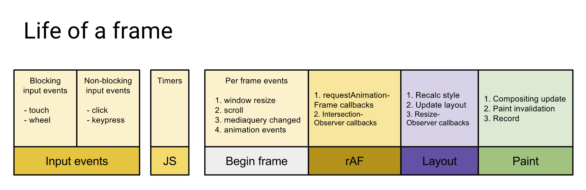
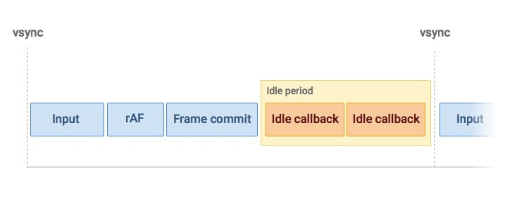
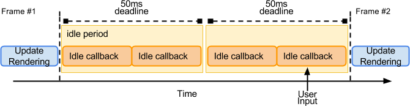
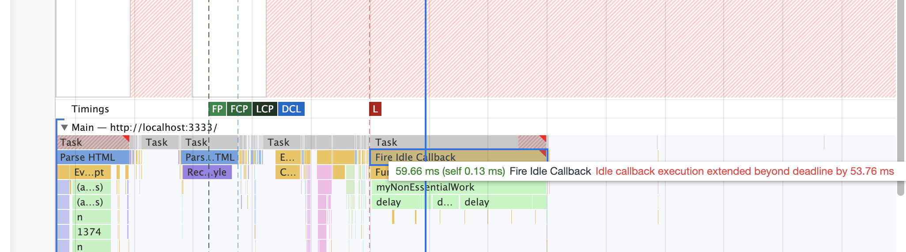

## 目录

<!-- toc -->

- [起源](#起源)
- [概念](#概念)
- [理解每一帧](#理解每一帧)
- [requestIdleCallback 回调可以做些什么工作](#requestIdleCallback-回调可以做些什么工作)
- [requestIdleCallback 不能操作的事](#requestIdleCallback-不能操作的事)
- [总结](#总结)
- [参考](#参考)

<!-- tocstop -->

## 起源

第一次知道 requestIdleCallback 这个 API, 是在学习 React Fiber 调度概念中得知的。我们知道 React 16 实现了新的调度策略 Fiber，可以异步和任务中断，其原理就是基于 requestIdleCallback 和 requestAnimationFrame 这两个概念 API。虽然 React 团队是自己实现了一套 requestIdleCallback 机制，不过还是有必要了解一下 requestIdleCallback 这个 API 的来龙去脉。

## 概念

什么是 requestIdleCallback？为什么要推出这个 API？MDN 上对于其定义：

>  window.requestIdleCallback() 方法将在浏览器的空闲时段内调用的函数排队。这使开发者能够在主事件循环上执行后台和低优先级工作，而不会影响延迟关键事件，如动画和输入响应。函数一般会按先进先调用的顺序执行，然而，如果回调函数指定了执行超时时间 timeout，则有可能为了在超时前执行函数而打乱执行顺序。

看得云里雾里。说人话就是，requestIdleCallback 中的任务是比较低优先级的，只有在浏览器空闲的时候才会运行。相比于 requestAnimationFrame（可简称 rAF），rAF 的回调会在每一帧确定执行，属于高优先级任务，requestIdleCallback 的回调是低优先级，不一定会在一帧之内执行。

```js
requestIdelCallback(myNonEssentialWork);

function myNonEssentialWork (deadline) {
  // deadline.timeRemaining()可以获取到当前帧剩余时间
  while (deadline.timeRemaining() > 0 && tasks.length > 0) {
      doWorkIfNeeded();
  }
  if (tasks.length > 0){
      requestIdleCallback(myNonEssentialWork);
    }
}
```

## 理解每一帧

让我们来看一下每一帧浏览器会做什么：



图中一帧包含用户的交互、js的执行、以及requestAnimationFrame的调用，布局计算以及页面的重绘等工作。假如某一帧里面要执行的任务不多，在不到16ms（按 60FPS 算，1000/60)的时间内就完成了上述任务的话，那么这一帧就会有一定的空闲时间，这段时间就恰好可以用来执行 requestIdleCallback 的回调，如下图所示：



当程序栈为空页面无需更新的时候，浏览器其实处于空闲状态，这时候留给 requestIdleCallback 执行的时间就可以适当拉长，最长可达到 50ms，以防出现不可预测的任务（用户输入）来临时无法及时响应可能会引起用户感知到的延迟。



由于 requestIdleCallback 利用的是帧的空闲时间，所以就有可能出现浏览器一直处于繁忙状态，导致回调一直无法执行，这其实也并不是我们期望的结果（如上报丢失），那么这种情况我们就需要在调用requestIdleCallback 的时候传入第二个配置参数 timeout 了:

```js
requestIdleCallback(myNonEssentialWork, { timeout: 2000 });

function myNonEssentialWork (deadline) {
  // 当回调函数是由于超时才得以执行的话，deadline.didTimeout为true
  while ((deadline.timeRemaining() > 0 || deadline.didTimeout) &&
         tasks.length > 0) {
       doWorkIfNeeded();
    }
  if (tasks.length > 0) {
    requestIdleCallback(myNonEssentialWork);
  }
}
```

如果是因为 timeout 回调才得以执行的话，其实用户就有可能会感觉到卡顿了，因为一帧的执行时间必然已经超过 16ms 了。

## requestIdleCallback 回调可以做些什么工作

上面讲了这么多概念，那么实际应用中，我们可以用 requestIdleCallback 做些什么呢？

本文参考有两篇文章，可以看到别人对于 requestIdleCallback 的应用，我们可以在 idle callback 中做一些：

+ 小段的非交互相关的代码，比如点击的时候发送埋点数据，可以在空闲时间才让浏览器发送，避免影响体验
+ 类似于 prefetch，利用浏览器空闲时间，可以提前请求下一页的资源

## requestIdleCallback 不能操作的事

1. requestIdleCallback 不能写阻塞代码

requestIdleCallback 中的任务应该是可以预测的小块任务，如果出现同步阻塞的代码，那么它也会直接卡死浏览器。



2. requestIdleCallback 不能进行 DOM 操作

从上面一帧的构成里面可以看到，requestIdleCallback 回调的执行说明前面的工作（包括样式变更以及布局计算）都已完成。如果我们在 callback 里面做 DOM 修改的话，之前所做的布局计算都会失效，而且如果下一帧里有获取布局（如 getBoundingClientRect、clientWidth）等操作的话，浏览器就不得不执行强制重排工作,这会极大的影响性能，另外由于修改 DOM 操作的时间是不可预测的，因此很容易超出当前帧空闲时间的阈值，故而不推荐这么做。推荐的做法是在 requestAnimationFrame 里面做 DOM 的修改，可以在 requestIdleCallback 里面构建 Document Fragment，然后在下一帧的 requestAnimationFrame 里面应用 Fragment。

推荐放在 requestIdleCallback 里面的应该是小块的并且可预测时间的任务。

## 总结

对 requestIdleCallback 进行一个总结：

+ 在浏览器一帧的空闲时间运行 idle 回调，是低优先级任务
+ 空闲时间最多 50ms 执行回调，防止意外的用户事件没有响应
+ 加一个 timeout，防止 idle 回调一直得不到响应
+ 不能在 idle 回调同步阻塞代码
+ 不能在 idle 回调中修改 DOM

## 参考

+ [Using requestIdleCallback  |  Web  |  Google Developers](https://developers.google.com/web/updates/2015/08/using-requestidlecallback)
+ [你应该知道的 requestIdleCallback](https://juejin.im/post/6844903592831238157)
+ [requestIdleCallback - Web API 接口参考 - MDN](https://developer.mozilla.org/zh-CN/docs/Web/API/Window/requestIdleCallback)
+ [Prefetch assets using requestIdleCallback \| by Nuno Andrade | Medium](https://medium.com/@nuno.andrade/prefetch-assets-using-requestidlecallback-a578ea8f0e3c)
+ [requestIdleCallback, Let the browser work for you! · Justin on WEB](https://jgw96.github.io/MyBlog/2017/01/11/RequestIdleCallback/)
